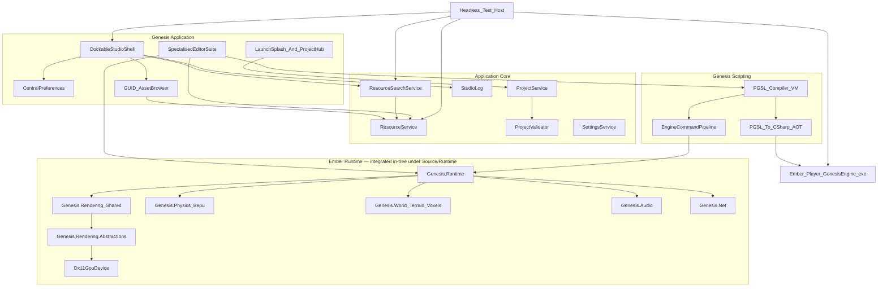
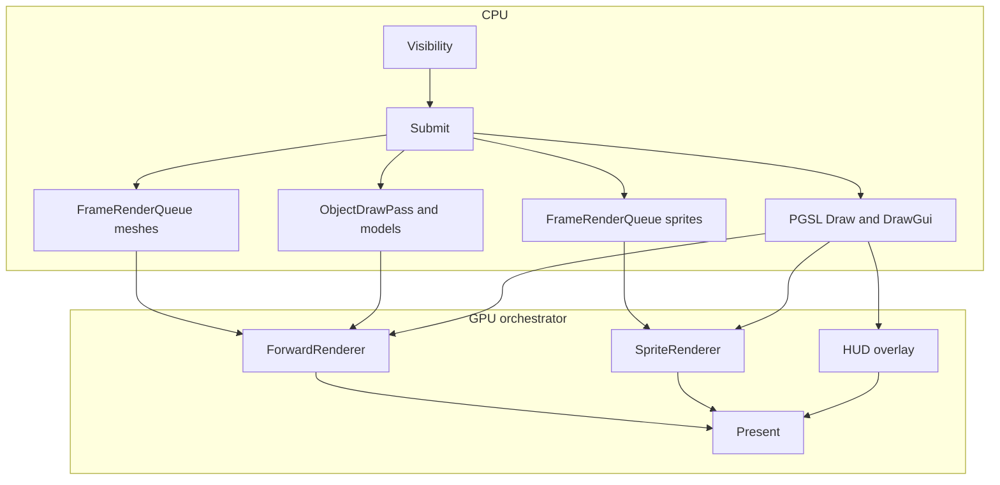

# Genesis Studio Master — Hotfix 22

## H22 delivery ledger — H21 Room Editor compile correction

**Current delivery: H22. Required baseline: H21.** Apply this changed-files-only correction directly over the Particle Workbench patch. No earlier hotfix needs reapplying. The embedded source revision becomes **H22**; the build-run ID continues to come from Build.bat.

### Reported native result and cause

The user's H21 build `20260924-111929-6e728488` compiled the runtime, Application Core and Image Editor projects shown in their log, then stopped in Editors.Suite with **CS0109** at `RoomEditorControl.cs(766,21)`. Studio publication and the regression run did not complete. This is not a native acceptance pass for H21's Particle Editor functionality.

H21 extended the shared `EditorSurfaceControl.PushEdit` method with an optional fourth argument, `maximumEntries`, to bound Particle Editor history. The existing Room Editor exposes a public **three-argument** forwarding method for its child panels. That forwarding declaration retained `new`, although it no longer has the same signature as the inherited four-argument method. With warnings treated as errors, the redundant modifier blocks compilation.

### Completed correction

| ID | Result | Validation status |
|---|---|---|
| H22-BUILD-01 | Remove only the redundant `new` modifier from the Room Editor's three-argument `PushEdit` forwarding method. Its accessibility, parameters, delegate order and body are unchanged. | Exact one-token source delta verified; native compilation pending. |
| H22-QA-01 | Audit production `PushEdit` declarations and the Particle Editor caller. The shared four-argument method remains unchanged, with `int.MaxValue` as its default; the Particle Editor still explicitly requests 100 entries. Room Editor's separate `MarkDirty` member legitimately hides the unchanged base member and retains `new`. | Source audit completed; not a C# compilation or an executed undo/redo test. |
| H22-DOC-01 | Advance embedded Studio identity to H22 and record this failure/correction without removing or rewriting earlier roadmap history. | Project XML and byte-preservation checks completed. |

### Scope and preservation

This overlay contains exactly **three changed existing files**: the Room Editor source, Studio project identity, and this master document. It adds no new files to the repository. No warning suppression is added and warnings-as-errors remain enabled. The shared journal, Particle Workbench, runtime, game templates, authored resources, protected folders and resource-name-only APIs are unchanged. This is a compile correction, not another roadmap feature delivery.

The **complete H21 master is preserved byte-for-byte below this ledger**, including its prior completion claims and pending gates. The current failure report supersedes any assumption that H21 had passed native acceptance; no unexecuted test is marked passed.

### Validation and next local gate

Executed checks: exact single-token Room Editor delta; unchanged shared journal and Particle Editor history call; production declaration audit; project XML parsing; three-file difference against reconstructed H21; ZIP integrity and safe relative paths; exact entry bytes and full overlay reconstruction; template/runtime preservation; standalone master equality and historical-master preservation.

The delivery environment has no .NET SDK or Windows runtime. An attempt to reach the official SDK download metadata failed with DNS resolution; **no C# compilation, native regression, WinForms input, GPU rendering or performance test was executed here**. Source and archive checks do not substitute for those gates.

After overlaying H22, run from the source root:

```powershell
.\Build.bat
```

The first build lines must show `Studio source: H22 / Build ...`. After a successful build, the existing focused Particle Editor suite remains:

```powershell
.\Build.bat --test particle-workbench
```

That suite is unchanged; its previously authored cases remain pending execution. First interactive check remains the H21 authoring round trip: create a temporary Particle resource, choose Fire, add Smoke, edit both during preview, undo a curve edit, then save and reopen. Room Editor undo/redo should also be checked after a numeric edit and one drag. No new roadmap work is started until this build correction is delivered.

---

## Preserved H21 master

# Genesis Studio Master — Hotfix 21

## H21 delivery ledger — Particle Editor authoring workbench

**Current delivery: H21. Required baseline: H20, following the existing H10 → H11 resource-name migration and subsequent hotfix chain.** This batch deliberately focuses on one unfinished editor, as requested, rather than extending the shell/browser again. Apply the changed-files overlay over H20. The Studio assembly's source revision is **H21**.

The completed slice is a **Particle resource authoring round trip**: create/open → choose a preset → add and edit emitters → inspect the real runtime simulation → undo/redo → validate → save/reopen. It reuses the shared document host, command bar, pickers, viewport and runtime schema. No new isolated editor application, alternate particle runtime, asset template or replacement gameplay is introduced.

The previous H20 delivery has not been reported as a full native/interactive acceptance pass; the user's request to continue is not treated as such evidence. H19's explicitly confirmed background fixes and the earlier successful build remain recorded in their historical ledgers. **The complete H20 master, including every earlier roadmap and ledger, is preserved byte-for-byte below this section.**

### Completion accounting

**C21** means the bounded implementation is complete in source, with its interactions connected and regression definitions supplied. Native compilation, physical input, GPU rendering, sound, performance and DPI acceptance are separately pending. C21 is not an assertion that the entire Particle Editor programme, common editor framework or AAA graphics roadmap is complete.

| Delivery ID | Parent programme | Completed bounded implementation | State and validation entry points |
|---|---|---|---|
| H21-PAR-01 | Shared authoring UX / Particle Editor | A single composable workspace: Emitters/Presets/Preview library, existing central 2D/3D viewport, selected-emitter properties, lower curve/gradient editor and timeline. Shared File/Edit/Save/dirty-state/Dimension/View/Camera commands are retained. Advanced text is hidden initially. Panels can be hidden/restored for preview space. Non-functional particle transform-gizmo controls are no longer advertised. | **C21; Windows layout/input/DPI gates pending.** `ParticleEditorControl.Workbench` and reference-workspace integration. Session visibility only; persistent docking remains backlog. |
| H21-PAR-02 | Particle Editor / ST-SELECT-01 | Real native emitter rows support selection, enable/disable, validated local rename, Add, Duplicate, Remove and reorder. The selected emitter is identified above the Inspector. Rows are reused for ordinary property edits. Mouse commands and F2/Ctrl+D/Delete/Alt+Up/Alt+Down are connected, without hijacking native label-entry keys. | **C21; native interaction pending.** `ParticleEffectEditing` and emitter-stack controls. Up to 64 emitters; at least one retained; local emitter names distinct from public resource identity. |
| H21-PAR-03 | Particle data round trip / asset trust | Structural operations return detached authored data and preserve effect-level light, preview settings, range, notes and script field when the primary emitter changes. Duplicates receive fresh IDs and unused local names. Existing runtime schema, emitter IDs and public resource-name contract remain compatible. | **C21; serializer/runtime regression execution pending.** Production Core emitter operations; no schema version bump. |
| H21-PAR-04 | ST-UNDO-01 / ST-DOC-01 | Particle mutations use the existing document journal with a 100-operation cap. Numeric edits, emitter changes, presets, asset assignment/clear, preview dimension, accepted text and curve/gradient edits are reversible. Each continuous curve/key drag is one operation; Escape restores its beginning without an edit. Dirty state tracks the saved authored content. | **C21; native command/input gates pending.** `ParticleEditorControl.Authoring`. Other editors retain their previous journal capacity; this is not universal project undo. |
| H21-PAR-05 | Particle preview / editor responsiveness | Scalar changes update live simulations without clearing in-flight particles or rebuilding all preview textures. Texture/mesh/blend/flipbook changes invalidate only the necessary preview resource definitions; structural changes still restart. Clearing/replacing mesh-surface sources clears old samples even when replacement loading fails. | **C21; GPU output/timing pending.** Real `ParticleSimulation.UpdateConfig` path and cached preview keys. Lower capacity can discard excess particles legitimately. |
| H21-PAR-06 | Particle preview / deterministic diagnostics | Play/Pause, Stop, Restart, exact single-frame Step, preview-only Burst, 0.25×/0.5×/1×/2× speeds and configurable preview seed are integrated. Fixed 60 Hz integration is separate from display frequency. Stable emitter IDs salt the seed. A runtime `Reset(int randomSeed)` overload enables deterministic replay without changing the existing default-reset behaviour. | **C21; native simulator tests authored, not run.** `ParticlePreviewClock`, public runtime reset overload. No generated performance number is displayed. |
| H21-PAR-07 | Editor responsiveness / bounded work | Timeline scrub requests publish immediately and replay through a UI timer, at most eight fixed steps per pump and a four-millisecond budget checked between steps. New seeks replace old ones; Stop/Play/Step or authoring changes cancel obsolete replay. Replay is capped at 60 seconds. Simulation never runs on an unsynchronised background thread. | **C21; actual responsiveness pending.** Twenty exact-production clock cases plus integrated controls. One expensive step can exceed four milliseconds; this is not a frame-time guarantee. |
| H21-PAR-08 | Particle Editor / curves/materials | Actual controls are grouped into Emission, Forces, Material, Curves, Collision, Renderer and Effect Light. Shape-, collision-, flipbook-, mesh- and light-specific fields are conditional. Gradient add/edit/delete, alpha wheel and curve toggles are wired. Dragged keys retain identity while crossing neighbours. Gradient canvas sampling avoids per-pixel sorting/colour allocations and shows alpha over a checkerboard. | **C21; native visual/input gate pending.** Existing simulation properties, not a new material/shader language. |
| H21-PAR-09 | ST-DOC-01 / validation and asset trust | Optional Advanced emitter drafts provide Apply/Revert and inline diagnostics. Unknown/duplicate keys, malformed structure, unsafe counts, non-finite numbers, invalid enums/colours/curves and path/extension references are rejected. Invalid drafts block conflicting authoring and Save rather than being discarded or silently saved as old values. Numeric/string/colour serialization retains round-trip precision. Corrupt source fails before editor construction instead of silently substituting a Fire resource. | **C21; failure-path tests authored.** Actual `ParticleCodeCodec`, draft boundary and source loader. No new PGSL semantic path; existing text configuration is not particle-event scripting. |
| H21-PAR-10 | Resource reference consistency | Texture, mesh particle, mesh emitter and preview target fields use existing typed name-only pickers. Explicit clear controls are undoable. Save copy creates a separately named resource in the protected Particles root, preserving the original editor's identity and dirty state. | **C21; native picker/save-copy acceptance pending.** H11 names, H19 usage constraints and H20 classification are not relaxed. |
| H21-QA-01 | Reproducible authoring tests | New focused `particle-workbench` / `editor-h21` target: 20 clock cases, 18 emitter/codec/simulator cases and 19 control cases. The existing broad Particle gate now asserts the seven real sections instead of obsolete three-section metadata. The portable production-code runner links the exact clock and its cases, reaching 114 cases in total. | **C21 definitions; all C# execution pending.** 57 focused cases. No new test dependency, new project or substitute simulation. |
| H21-BUILD-01 | Release identity / roadmap | Embedded H21 identity, this master, and `Documentation/Hotfix21_Particle_Workbench.md` covering workflow, controls, limits and acceptance. Changed-files-only distribution, no compiled outputs or template modifications. | **C21; native publish pending.** Source/archive verification is reported separately from native results. |

### Human authoring flow and important distinctions

Open or create a **Particle** resource. The left library separates **Add an emitter from a preset** from **replace the entire effect with a preset**; the latter is labelled and is one undoable edit. Select a row to inspect that emitter, untick it to disable, and use F2 to name its purpose. Build an effect such as Flame plus Smoke without editing source data manually. The preset library uses the existing built-in configurations; no artwork is generated or patched.

Emission, force, material and curve values affect the shared runtime simulation. Ordinary numeric changes keep the same controls, emitter rows and live particles. Effect-level light is explicitly separate from the selected emitter. **Preview range** names the actual meaning of the legacy Duration field in this editor; it does not pretend to stop gameplay emission at that time. Collision previews are height-plane/selected-terrain responses, not arbitrary model-triangle physics. Effect Light belongs to the existing 3D preview path; H21 does not invent a 2D lighting editor.

Pause/Play and Emit continuously have different semantics: the first is preview transport; the second is an authored emitter property. Seed, speed and floor are session preview state. The saved 2D flag and preview target remain authored fields. Restart repeats the same random stream under the same authored data and external conditions; it is not a cross-backend pixel-equality guarantee.

Saved files stay in the existing runtime schema. The named Particle resource is still the unit consumed by objects/scripts/runtime. Emitter names are local to that effect; they do not compete with globally unique project resource names. The only runtime source edit is a public seeded reset overload on the existing simulator. No new PGSL command is required for the editor-only transport, and ordinary runtime randomness retains its prior default path.

### Bounds, safety and intentionally unfinished parent programmes

The slice is bounded at **64 emitters, 64 characters/local emitter name, 100 document undo operations, 128 gradient keys, 60 seconds of scrub replay, eight simulation steps per timer pump and 512 KiB of declarative draft text**. UI particle capacities are bounded at 100,000 per emitter; that is an authoring safety limit, not a promise that 64 such emitters run interactively. Four-millisecond seek scheduling is measured between steps; a single expensive step or asset load can still cost more. No native latency/FPS claim is made.

Structural edits and Undo/Redo restart the preview to align simulation with restored authored data. Scalar edits keep live particles; spawned fields affect future births and evolving fields take effect on subsequent simulation steps. Changing the resource's real renderer dependencies may rebuild those dependencies. The general Task Centre, asynchronous GPU resource lifetime system, persistent editor-panel layouts and crash-recovery snapshots are not implemented by this batch.

The Particle programme remains open for GPU simulation/compute, trails/ribbons, particle event graphs, arbitrary geometry collision, richer spatial emitter gizmos, broad backend/3D-light parity, real workload benchmarks and all native acceptance gates. No placeholder feature for those items is introduced. Shader, Physics, Terrain, Model and Script editor overhauls are not started in H21. Wider common document/undo/viewport work, asset database/dependencies, character/equipment, world partition, production PGSL, release hardening and the medieval vertical slice all remain in the preserved master backlog.

### Validation status

Executed validation is **source/structure and exact archive reconstruction only**: changed C# lexical delimiters, project XML, named member/control wiring, test registration/counts, unchanged baseline content, master preservation, patch membership and byte hashes. These checks do not execute C# and are not compiler, real simulator, WinForms input, rendered image, DPI or performance evidence. The delivery response reports the resulting counts after final packaging.

**No .NET SDK, C# compiler or Windows graphics/UI runtime is available in the delivery environment.** The native build, 57 focused C# cases and 114 standalone C# cases are therefore **not executed** here. In particular, the seeded simulator and UI fixture tests are definitions, not claimed successful runs. No tests have been removed to manufacture a green result.

Build and run the focused suite from the patched source root:

```powershell
.\Build.bat
.\Build.bat --test particle-workbench
```

The shared standalone core runner compiles the exact production services and preview clock without WinForms/graphics dependencies:

```powershell
dotnet run --project Tests\Genesis.Foundation.Checks --configuration Release
```

Human gate: create a temporary Particle resource; choose Fire; add Smoke; rename/disable/duplicate/reorder/remove an emitter; edit rates and forces while playing; verify live particles are not cleared on each scalar edit; drag a Bezier handle/gradient key and Undo/Redo once; test Escape cancellation; set named texture/model resources and clear them; pause/step/change speed/seed, scrub and cancel; save/reopen the stack; test invalid Advanced input and verify Save refuses without changing the file; revert it, save normally and close. Check common commands at 100/125/150/200% DPI and with narrow panels. Use a disposable resource for corrupt-file tests.

### Next decision point

H21 delivers the complete bounded **layered-particle authoring** change requested here. Its native acceptance gate should be cleared before moving to the next unfinished editor or deeper particle rendering. The documentation does not mark the full Particle Editor or the AAA-readiness programme complete on the basis of source checks alone.

---

## Preserved H20 master

# Genesis Studio Master — Hotfix 20

## H20 delivery ledger — Library tags, consistent search and safe metadata editing

**Current delivery: H20. Baseline: the user's confirmed working H19 tree.** H20 continues the editor roadmap only. No template, gameplay, runtime rendering, physics, PGSL semantics, resource-name contract or protected-folder policy is changed. Apply this changed-files overlay directly over H19; the embedded Studio source revision becomes **H20**.

**User acceptance update:** the user reported “All fixed” after H19's Background-usage filtering and background visibility/live-edit corrections. Those reported interaction failures are therefore marked **user-confirmed resolved**. This is not evidence that every authored regression case, graphics backend or DPI configuration was run. The earlier H18 native build had also been reported working. Historical pending labels below are retained as part of the original ledgers; this front section supersedes them only for those explicitly reported gates.

The entire H19 master and earlier programme are preserved **byte-for-byte below this ledger**. No roadmap requirement is removed or marked complete merely because this bounded slice is delivered.

### Status and completed implementation scope

**C20** means the bounded implementation and its UI/runtime-independent integration are finished, with regression definitions supplied. It does not mean native compilation, Windows interaction or performance measurements executed in the delivery environment. Those gates are separately recorded below.

| Delivery ID | Parent roadmap item | Finished result | Status and validation entry points |
|---|---|---|---|
| H20-LIB-01 | AS-BROWSE-01 | Resource library tags can be edited from the Assets context menu and shared command palette. Draft validation, existing project suggestions, Apply, Cancel and clearing a tag set are connected to the actual resource. This is classification, explicitly separate from animation clips and gameplay tags. | **C20; native UI gate pending.** `ResourceLibraryTagsDialog`, `ResourceBrowserDock.Tags`, three registered shared commands. |
| H20-LIB-02 | AS-BROWSE-01 / ST-SELECT-01 | A common name/tag query is used by Assets, Finder and typed pickers. Exact `tag:` and negative `-tag:` predicates, quoted phrases and ordinary text terms intersect. Malformed searches show validation/no matches, not all resources. Finder content search is gated by tags before any source reads. | **C20; native gate pending.** `ResourceLibraryQuery`, `ResourceBrowserProjection`, `ResourceSearchService`, `AssetPickerModal`. |
| H20-LIB-03 | AS-BROWSE-01 | Assets has All tags / exact tag / Untagged filtering and per-tag project counts, combined with type, Favourites, Recent and Finder. Reset clears all constraints. Picker previews and result/browser tooltips show library tags. | **C20; native and scale gates pending.** In-memory snapshot projection; no additional resource descriptor parsing per search keystroke. |
| H20-DATA-01 | AS-DB-01 / asset trust | Optional library classification is stored beside existing stable resource identity. Tag writes preserve unrelated metadata, validate identity and full revision, use bounded reads and same-folder atomic replacement, and refuse stale edits/newer formats/linked write paths. Malformed optional tags do not regenerate valid resource GUIDs. | **C20; Windows filesystem gate pending.** Production `ResourceLibraryTags` and resource service integration. This does not claim completion of the asset database or multi-process locking. |
| H20-DATA-02 | AS-BROWSE-01 / AS-DB-01 | Rename/move retains tags and identity. Duplicate/import of complete resources preserves valid tags but gives new resources independent GUIDs and unique public names. No gameplay descriptors or pixels are changed by classification. | **C20; integration gate pending.** Resource lifecycle regression cases plus existing identity-sidecar handling. |
| H20-UNDO-01 | ST-UNDO-01 / ST-CMD-01 | A bounded, 50-operation browser-session tag journal supports UI Undo/Redo and shared edit commands. It follows resource GUID across rename/move, preserves unrelated newer metadata, rejects tag conflicts/deleted identities, and does not undo an unrelated editor when browser history is empty. Native textbox undo remains separate. | **C20; native input gate pending.** `ResourceLibraryTagHistory`, browser commands, focused shell routing tests. Not universal resource/document undo. |
| H20-QA-01 | QA / human workflow | 32 new core cases and 16 new Windows integration cases cover storage, queries, lifecycle, picker usage constraints, dialog drafts, snapshots, undo and command ownership. Focused `resource-tags` target and exact-production standalone runner are wired. | **C20 definitions; execution pending.** 48 focused cases; 94 total standalone core cases including earlier suites. |
| H20-BUILD-01 | Release identity / ST-DOC-01 | Embedded source revision H20, updated master, and a user-facing authoring/acceptance guide. No new unimplemented editor shell is introduced. | **C20; native publish pending.** `Documentation/Hotfix20_Resource_Tags.md`. |

### User workflow

In Assets, right-click a resource and select **Edit Library Tags…**. Add `forest` and `night sky`, apply, then search `tag:forest`, `tag:"night sky"`, or `tag:forest -tag:ui`. The dialog can suggest existing project tags. Tags belong to the resource/project, whereas Favourites and Recent retain their existing personal-preference semantics.

The All tags dropdown can isolate Untagged resources or an exact tag. All/Favourites/Recent, type, Finder and library constraints intersect; Reset clears them together. Picker restrictions still win: a sprite lacking the Background usage flag cannot be selected as a room background even if it has a matching library tag.

With Assets focused, Ctrl+Z undoes the latest saved library-tag edit; Ctrl+Y/Ctrl+Shift+Z redo it. Text input and other editor histories are unchanged. Tag history is session-only; tags themselves survive reopening. Renaming or moving a resource keeps identity-based history valid unless the tags were changed elsewhere or the resource was deleted/replaced.

The public reference remains a name such as **Morning Sky**, never a path or private suffix. No new PGSL functions are needed: library classification is not a gameplay system. Animation tags retain their own timeline semantics and are not repurposed as search metadata.

### Safety, responsiveness and intentional limits

Tag writes change only the optional library-tag list and metadata modification time. A full metadata fingerprint is checked before applying a draft. Replacements use a flushed, short-named temporary file in the same folder, with cleanup on failure. No-op/cancelled changes do not write. Valid unknown metadata properties are preserved. This is per-file atomic/optimistic editing, not an inter-process lock or cross-project transaction.

Limits are explicit: 32 tags/resource, 48 characters/tag, 4,096 draft characters, 512 search characters, 32 search terms, 256 KiB metadata reads, 4,096 cached tag entries and 50 history entries. The editor shows up to 256 filtered suggestions; the dropdown lists 100 alphabetical project tags with a search route for the rest. Classification is loaded into resource snapshots. Browser filtering stays in memory; picker search no longer opens large image descriptors just to inspect unrelated animation-tag fields.

No measured latency or FPS improvement is claimed. File enumeration and the underlying asset database are unchanged. There is no bulk tag editor, saved search collection, automated tagging, new gameplay/animation tag API, universal undo, Task Centre, crash recovery or concurrent multi-user project lock in H20. The broader **AS-BROWSE-01**, **AS-DB-01**, **ST-UNDO-01**, **ST-CMD-01** and shared selection programmes remain open.

### Validation status and acceptance gates

Executed delivery checks are source/structure, metadata/data and exact changed-file archive validation; see the delivery response for the resulting counts. The delivery environment does not have a .NET SDK or Windows graphics/UI runtime. **The native build, 48 focused C# cases and 94 standalone C# cases have not been executed here.** Source/ZIP checks are not represented as compiler, filesystem concurrency, DPI or interactive performance evidence.

Build from the patched Studio root:

```powershell
.\Build.bat
.\Build.bat --test resource-tags
```

Standalone exact-production core checks:

```powershell
dotnet run --project Tests\Genesis.Foundation.Checks --configuration Release
```

Human acceptance: tag a Background-enabled image and an ordinary sprite; verify shared searches and unchanged picker usage constraints; exercise valid/invalid/cancel/clear drafts; test Undo/Redo with the browser and with a textbox focused; rename/move/duplicate the tagged resource; reopen the project to confirm persistence; verify that animation tags, gameplay tags, pixels and name-only references did not change. Use a disposable project for stale-dialog/deleted-resource/metadata-corruption tests. Exact commands, semantics, limits and test steps are documented in `Documentation/Hotfix20_Resource_Tags.md`.

### Roadmap accounting

This batch finishes the **library-classification authoring round trip**: discover the action → edit validated metadata → apply/cancel → search/filter across standard surfaces → undo/redo → save/reopen → rename/move/duplicate without losing identity. It adds no feature stub and starts no second programme that is left unfinished.

The subsequent roadmap still includes dependencies/reference inspection, derived-data/background processing, wider command/undo/document convergence, modelling/characters/equipment, world partition/scalability, production PGSL tooling and the AAA vertical-slice acceptance gates. H20 does not claim any of those complete.

---

## Preserved H19 master

# Genesis Studio Master — Hotfix 19

## H19 delivery ledger — Background authoring correctness

**Current delivery: H19, 23 September 2026. Baseline: the user's confirmed working H18 tree.** H19 is a bounded Room Editor/background-authoring correction. It does not modify game templates, gameplay content, public resource-name rules, PGSL semantics, or the renderer/runtime architecture.

### Completed H19 implementations

| Delivery ID | Parent roadmap item | Finished, bounded result | Status |
|---|---|---|---|
| H19-BG-01 | ST-SELECT-01 / AS-BROWSE-01 | Background image selection is usage-aware. The shared picker can require an Image usage flag; Room Background selection requires `ImageUsage.Background`, so ordinary sprites no longer appear. Favourites, Recent and search remain constrained to the eligible set. | **C19; native UI gate pending.** |
| H19-BG-02 | ST-ROOM-01 | The Room Editor's Background palette now uses the same Background-flag rule as the picker, matching the existing Tileset-only filtering principle. Usage reads are timestamp-cached so repeated palette/picker refreshes do not repeatedly parse unchanged image documents. | **C19; native scale gate pending.** |
| H19-BG-03 | ST-ROOM-01 / human authoring | Switching a colour-only background back to Image, or assigning the first image to an empty background slot, now selects `Stretch to View` rather than leaving a native-size `Single` image at room origin where it can be completely outside the current camera. Layout labels are explicit: Normal (Room Position), Stretch to Room, Tiled, Stretch to View. Authors can deliberately choose Normal afterwards. | **C19; native visual gate pending.** |
| H19-BG-04 | ST-RESP-01 | Background scalar/image edits invalidate the render host and owning viewport immediately, including authored game-camera preview state, rather than depending on the coalesced Inspector/tree refresh. Undo/redo continues through the existing background edit journal. | **C19; native visual gate pending.** |
| H19-QA-01 | QA / editor regression | Studio polish regression coverage now includes Background-flag filtering and the first-image visible-layout rule. Test fixture background resources explicitly carry the Background usage flag. | **C19; execution gate pending.** |
| H19-BUILD-01 | Release identity | Embedded Studio revision advances to H19 so the native build proves the correct overlay is being compiled. | **C19; publish pending.** |

### Acceptance gate

After overlaying H19, `Build.bat` must report `Studio source: H19 / Build ...`. In Room Editor → Backgrounds, **Select Image…** must list only Images whose Background flag is enabled. Starting from a Colour/empty slot and choosing an eligible image must visibly fill the current view immediately using **Stretch to View**; changing Depth/layout/speed must repaint without save/reopen. Choosing **Normal (Room Position)** remains an explicit positioned-background mode and can therefore be off-camera by design.

No broader Asset Database, Task Centre, world-partition, Model/character, PGSL compiler, or AAA-runtime programme is marked complete by this correction.

---

## Preserved H18 master

# Genesis Studio Master — Hotfix 18

## H18 delivery ledger — H17 shortcut-router compatibility correction

**Current delivery: H18, 23 September 2026. Baseline: the user's currently applied H17 tree.** H18 is a compile-only correction. It starts no new editor or runtime feature work and changes no game template, project content, public resource-name rules, renderer, scripting semantics, or authoring workflow.

The user's H17 build correctly identified itself as H17 and reached `Genesis.Application.Studio`, where four `CS1061` errors showed that `StudioShellForm` was calling the H16/H17 field-based shortcut-router setter while three window classes in the local tree still came from the earlier H15 property-based implementation. This can happen when H17 is applied to an H15 tree without the H16 compatibility overlay because H17 itself did not need to modify those three classes. H18 is deliberately self-sufficient over that H17 state.

### Completed H18 corrections

| Delivery ID | Parent roadmap item | Finished, bounded result | Status |
|---|---|---|---|
| H18-COMP-01 | ST-CMD-02 / build correctness | `GenesisDockContent`, `ImageEditorWindow`, and `ModelComposerWindow` now all contain the runtime-only `_projectShortcutRouter` field plus `SetProjectShortcutRouter(...)` method expected by the H17 shell. The callback is not a WinForms designer-visible property, so the earlier `WFO1000` class of failure remains eliminated. | **C18; native rebuild pending.** |
| H18-COMP-02 | QA / patch-chain robustness | The correction is packaged with all three target types, making it self-contained over the user's H17 tree even when those files originated from H15. No H16 re-application is required. | **C18.** |
| H18-BUILD-01 | Release identity | Studio source revision advances to H18 so the next build can prove the corrective overlay is the tree being compiled. | **C18; publish pending.** |
| H18-DOC-01 | ST-DOC-01 | Master ledger records the actual patch-chain mismatch and correction without marking any broader H17 roadmap programme complete. | **C18.** |

### Acceptance gate

After overlaying H18, `Build.bat` must report `Studio source: H18 / Build ...`. The build must then compile past `Genesis.Application.Studio`; only that native run closes the H18 build gate. If the source line still reports H17, the overlay did not reach the tree being built.

No new roadmap feature is started in H18. The H17 Resource Library implementation and all earlier roadmap statuses remain exactly as documented below.

---

## Preserved H17 master

# Genesis Studio Master — Hotfix 17

## H17 delivery ledger — Resource Library and browser responsiveness

**Current delivery: H17, 23 September 2026. Baseline: the user's applied H16 tree.** The user confirmed that H15 had previously been extracted over an older Genesis copy and that the current correction chain is now applied. H17 continues editor work on that original branch; it does not change game templates or the Engine runtime.

**Installation:** overlay H17 directly on H16 and rebuild using `Build.bat`. The source and published Studio must identify themselves as **H17**. H10/H11 resource-name rules and protected typed resource roots remain mandatory. Public references are globally unique resource names, not filenames or folders. No project migration is introduced here.

The complete H16 master, including the original AAA-readiness plan and every historical delivery ledger, is preserved **byte-for-byte beneath this section**. This front section is authoritative for H17 status; earlier revision labels below are historical, not the current source identity.

### Status vocabulary

**C17** means the bounded implementation is finished in this patch, connected to its actual editor interaction, and accompanied by regression definitions. It does **not** mean a native build, human interaction session or performance benchmark ran in the delivery environment. Those acceptance gates remain explicitly pending. No unfinished new editor/resource stub has been added to claim progress on the larger programme.

### Completed H17 implementations

| Delivery ID | Parent roadmap item | Finished, bounded result | Implementation and validation entry points |
|---|---|---|---|
| H17-LIB-01 | AS-BROWSE-01 / ST-CMD-01 | Main Assets browser has All assets, Favourites and chronological Recent views; star button and context action; six shared palette commands. Picker and browser share preferences rather than competing histories. Views reveal/focus the dock; mutations recheck original browser context. | **C17; native gate pending.** `ResourceBrowserDock.Library`, `StudioShellForm.Commands`, `ResourcePickerPreferences`; core and browser integration cases. |
| H17-LIB-02 | AS-BROWSE-01 / ST-SELECT-01 | Type filtering works without search text and intersects name/Finder/scope filters. Reset clears browser and shell Finder filters together. Results report matching/total resource counts; empty results do not imply a broken project. Filter projection uses the existing in-memory snapshot only. | **C17; native and scale gates pending.** `ResourceBrowserProjection`, library toolbar, focused filter/empty-result cases including a 20,000-resource core fixture. |
| H17-LIB-03 | AS-BROWSE-01 / AS-DB-01 | Successful editor opening/activation records recents, including detached Image/Model authoring windows. Merely highlighting does not. GUID-backed bookmarks survive public renames/moves; deleted entries do not resurrect resources; corrupt/future preference files are not overwritten. Existing 512-favourite/24-recent limits remain. | **C17; execution gate pending.** Shell open routes and shared preference reload/revision tracking; rename/recreate/delete/clear-history tests. This extends the existing private preference store, not the project asset database. |
| H17-RESP-01 | ST-SELECT-01 / AS-BROWSE-01 | Tree refresh reconciles native nodes rather than clearing the whole tree. Unchanged selections retain native identity and do not republish Inspector selections. Scroll/disclosure state survives ordinary refresh; temporary filtered expansion is separated from normal folder state. Synchronous resource mutation events coalesce within one browser operation. | **C17; native interaction gate pending.** Browser tree reconciliation, watcher and mutation boundaries; retained node-handle/disclosure/selection tests. A changed hierarchy can legitimately create/reparent nodes. |
| H17-RESP-02 | ST-JOBS-01 / AS-BROWSE-01 | Whole-project synchronous thumbnail warming is removed from the interactive browser. Visible rows request work from one background decoder per browser. Cache and negative results are bounded, image ownership is transferred on the UI thread, stale generations are rejected and close cancels scheduling/delivery. Shared first-frame aliases and Object image bindings use existing name resolution with legacy associated-pixel fallback. | **C17; codec/GDI/latency gates pending.** `ResourceBrowserDock.Previews`, `ResourceThumbnailCache`; bounds, worker isolation, source-file release, shared frame/Object and close tests. This is not the general Task Centre or DDC. |
| H17-INSPECT-01 | ST-INSPECT-01 / ST-SELECT-01 | Hiding/removing the selected browser resource clears Inspector controls and its live setter binding. Resource identity callbacks are detached before focus loss; disposed property controls are enumerated from a snapshot. Hidden selections cannot continue editing an unseen resource. | **C17; native gate pending.** `InspectorDock`, `ResourceIdentityHeader`, `ResourceInspectorPropertySurface`; hidden-selection no-write case. Existing active-tab/layer protections remain untouched. |
| H17-QA-01 | ST-CMD-02 / QA correctness | Two inherited H12 assertions are adapted to H16's actual private-field/setter shortcut router, removing stale references to the deleted WinForms property. No designer-visible property is restored. A focused 42-case library suite is registered, and the portable exact-production-code runner grows to 62 cases. | **C17; execution gate pending.** `StudioFoundationSuite`, `ResourceLibrarySuite`, `ResourceLibraryCoreCases`, `HeadlessTestRunner`, `Genesis.Foundation.Checks`. |
| H17-BUILD-01 | Release identity / ST-DOC-01 | Embedded source revision advances to H17. This ledger and a focused resource-library guide document installation, limits, inherited safeguards, completed subtask status and unexecuted acceptance gates. | **C17.** Studio assembly metadata; this master; `Documentation/Hotfix17_Resource_Library.md`. Full previous master preserved unchanged. |

### Human workflow delivered

Open an existing project, select an asset by its public name, star it, switch to Favourites, open it through its normal editor, switch to Recent, filter by type/name, then return using Reset. The same favourite appears when selecting a resource through an existing picker. Renaming that resource does not require rebuilding bookmarks or typing its private location.

**Ctrl+D remains Duplicate in the Assets browser.** Favourite is a button/context/palette action there; the picker retains its existing context-specific shortcut. Folders and protected roots cannot be favourited or bypassed as mutable resource targets. Clearing Recent deletes only history.

Source-level responsiveness changes remove avoidable work rather than making an unverified FPS claim. Metadata filtering still traverses the in-memory snapshot. ResourceService still rebuilds its disk snapshot on mutations/explicit refresh/watch notifications. The tree is not a fully virtual tree or a new incremental asset database. Main-browser thumbnails use one worker, a 512-result LRU, a maximum 256-row demand scan and a 60 ms polling timer for viewport demand; that timer does not throttle the viewport renderer. Files over 32 MiB encoded or reporting more than 32 million pixels are rejected by the thumbnail path. Codec header allocation is not covered by a hard process-memory guarantee. A decode already in progress may finish after close, but its result is discarded instead of touching disposed controls.

### Programme status after H17

**AS-BROWSE-01 remains Existing / extend.** Main-browser favourites, recent ordering, filter composition, result counts and demand-driven preview loading now have finished implementations. Tags, richer dependency/reference views, project-wide thumbnail/DDC persistence, fully incremental disk indexing and the full large-project UX gate remain open. The H13 note saying there is no main-browser favourites panel is historical and is superseded by H17-LIB-01.

**ST-SELECT-01 and ST-INSPECT-01 remain Existing / extend.** Stable browser selection and hidden-resource detachment are finished bounded slices. This is not a universal multi-selection/multi-edit conversion of all specialised editors. H10's Room tab/exact-layer restrictions are preserved.

**ST-JOBS-01 remains Existing / extend.** Demand-driven browser preview work is implemented. Import/bake/build task-centre unification, progress UI, persistent derived-data jobs and general cancellation/dependency scheduling are not started by this patch.

**ST-CMD-01/02 retain their broader scope.** New browser actions use the shared shell catalogue and H16 runtime shortcut-routing model. Remaining specialised editor command migration, rebinding and accessibility gates stay open.

The Model/Image production pipeline, Character/Equipment, world partitioning, AI/quests/dialogue, PGSL production architecture, GPU-driven rendering, job-system and release-hardening programmes retain their complete earlier definitions and statuses. No code in those programmes is altered merely to count another task. No game template or Engine runtime change is included.

### Validation and acceptance record

Performed in the delivery environment:

- **85 static/structural checks:** lexical delimiter checks on 18 changed/new C# files; XML parsing of all 18 project files; direct Compile-link existence; focused binding, selection, cache, worker, naming and suite-registration invariants. These are not semantic compilation.
- Exact preservation of the enum values and all resource-definition defaults when separating the enum from the existing definition factory for portable test compilation.
- Byte equality for **all 1,622 files under the baseline template paths and all 528 runtime files**.
- Changed-file membership, no missing baseline files, ZIP integrity, per-entry byte comparison, full overlay reconstruction and standalone/master equality.

**Not executed:** native compilation, WinForms tests, the portable C# runner, image-codec/GDI validation, actual command input, DPI/accessibility and measured project-opening/scrolling timings. There is no .NET SDK or Windows runtime in the delivery environment; attempts to obtain a toolchain failed because network/DNS access was unavailable. No executed-test pass is inferred from a test being added to source.

The delivered ZIP contains **22 changed/new files: 15 modifications and seven additions**, preserving the H16 structure. It includes no unchanged template/runtime files, generated binaries, root-level apply scripts or replacement projects.

### Local gates

```powershell
.\Build.bat
.\Build.bat --test resource-library
dotnet run --project Tests\Genesis.Foundation.Checks --configuration Release
```

The focused suite contains 24 new core cases and 18 Windows integration cases. The portable runner includes the prior 24 foundation and 14 picker/preference cases, plus the 24 library cases: 62 total.

Human acceptance should exercise shared picker/browser favourites, recent ordering after actual opens, GUID rename, mixed type/name/Finder filters, reset from zero results, disclosure/scroll stability during refresh, hidden Inspector detachment, protected roots, source-image replacement, and close while preview work is active. Test at the actual project size and DPI, record timings and preserve failures in the next delivery ledger rather than marking broad UX or AAA gates complete from source inspection.

---

## Preserved H16 master and complete historical roadmap

# Genesis Studio Master — Hotfix 16

## H16 delivery ledger — Studio-shell compile correction

**Baseline:** Hotfix 14 or Hotfix 15. H16 is intentionally self-sufficient over H14 because the H15 overlay may not have reached the source tree in the reported build.

### Completed in H16

- **Removed WinForms-designer exposure of the shared shortcut router.** `GenesisDockContent`, `ImageEditorWindow`, and `ModelComposerWindow` no longer expose `ProjectShortcutRouter` as a property. The callback is held in a private field and wired through an internal setter method, so the WinForms source generator/analyser has no property content to serialize and `WFO1000` cannot apply to this routing member.
- **Updated all shell wiring to the setter API.** `StudioShellForm` now wires shared shortcut routing through `SetProjectShortcutRouter(...)` for docked contents, image-editor windows and model-composer windows. Behaviour is unchanged: the command palette and shared shortcuts still route through the owning project shell.
- **Build identity advanced to H16.** A correctly overlaid source tree must print `Studio source: H16 / Build ...` before compilation and the published Studio carries the same revision metadata.
- **No new roadmap feature started.** This hotfix is compile-only so partially implemented roadmap work is not introduced while the H13/H14/H15 native build chain is being cleared.

### Validation status

- Static source checks: completed.
- Patch membership/integrity: completed.
- Native Windows/.NET build: **pending user execution**.
- Interactive Studio regression: **pending successful native build**.

---

# Genesis Studio Master Roadmap and Delivery Ledger

**Current ledger: Hotfix 15 · 23 September 2026.** Apply **Hotfix 10 → Hotfix 11 → Hotfix 12 → Hotfix 13 → Hotfix 14 → Hotfix 15** on the established original branch. H15 is a compile-correction overlay for H14. It starts no new roadmap work and changes no game templates, runtime behaviour, authored project data, resource naming rules, or editor workflow.

## H15 status and acceptance rule

The second native H13/H14 build attempt successfully compiled the Runtime, Core, Image Editor and Editor Suite assemblies, then exposed three WinForms analyser failures in the Studio assembly. These are source-level designer-serialization declarations for the shared shortcut router. H15 fixes those declarations and advances the observable Studio source revision to H15. Native build acceptance remains pending until rerun on Windows.

## Completed H15 work

| ID | Programme | Completed implementation | Status / evidence |
|---|---|---|---|
| H15-COMP-01 | ST-CMD-02 / QA build correctness | Marked the runtime-only `ProjectShortcutRouter` delegate property on `GenesisDockContent` as non-browsable and `DesignerSerializationVisibility.Hidden`, matching the existing pattern used for non-designer Studio service properties. Resolves the reported WFO1000 failure without changing shortcut routing. | **C15; native build gate pending.** `GenesisDockContent.cs`. |
| H15-COMP-02 | ST-CMD-02 / QA build correctness | Applied the same non-serialized designer contract to the separate `ImageEditorWindow` shortcut router. | **C15; native build gate pending.** `ImageEditorWindow.cs`. |
| H15-COMP-03 | ST-CMD-02 / QA build correctness | Applied the same non-serialized designer contract to the separate `ModelComposerWindow` shortcut router. | **C15; native build gate pending.** `ModelComposerWindow.cs`. |
| H15-BUILD-01 | Release engineering / QA evidence | Advanced the embedded Studio source revision from H14 to H15 so the next build can prove that this exact correction overlay is present. | **C15; publish gate pending.** `Genesis.Application.Studio.csproj`. |
| H15-DOC-01 | ST-DOC-01 | Recorded the WFO1000 failures and fixes without marking any broader roadmap programme complete. | **C15.** This section; the full H14 master is retained unchanged below. |

No new roadmap feature has been partially started in H15.

---

## Preserved H14 master

The following content is the complete H14 master as delivered previously. Its H14 heading remains historical; the H15 ledger above is current.

# Genesis Studio — Master Roadmap and Delivery Ledger · Hotfix 14

**Current ledger: Hotfix 14 · 23 September 2026.** Apply **Hotfix 10 → Hotfix 11 → Hotfix 12 → Hotfix 13 → Hotfix 14** on the established original branch. H14 is a compile-correction overlay for H13. It starts no new roadmap work and changes no game template, runtime behaviour, resource naming rule, authored project data, or editor workflow.

## H14 status and acceptance rule

H14 responds to the first native H13 build attempt. That build reached `Genesis.Application.Editors.Suite` and exposed two C# compilation defects before the Studio executable could be produced. The fixes below are complete source corrections, but the native build remains **gate pending** until rerun on Windows.

## Completed H14 work

| Delivery ID | Parent roadmap item | Bounded result | Status and evidence entry points |
|---|---|---|---|
| H14-COMP-01 | QA / build correctness | Renamed the private `BackgroundState` record helper from the record-reserved member name `Clone` to `CopyData`; capture/restore semantics are unchanged. Resolves reported `CS8859`. | **C14; native build gate pending.** `RoomBackgroundsPanel.cs`. |
| H14-COMP-02 | ST-ROOM-01 / build correctness | Added the explicit Suite Assets namespace import required by the Room responsiveness partial for `TileSetInfo`. Resolves the three reported `CS0246` failures without duplicating the tileset type. | **C14; native build gate pending.** `RoomEditorControl.Responsiveness.cs`; canonical type remains `Assets/ImageTileSetLoader.cs`. |
| H14-BUILD-01 | Release engineering / QA evidence | Source revision advanced to H14 so the next successful build visibly identifies this exact correction overlay. Existing H13 identity infrastructure remains unchanged. | **C14; publish gate pending.** `Genesis.Application.Studio.csproj`. |
| QA-H14-01 | Human workflow / regression programme | H13 build-identity assertions now compare against the loaded source revision instead of hard-coding H13, preventing the regression suite itself from rejecting later correction revisions. | **C14; execution gate pending.** `StudioPolishSuite.cs`. |
| H14-DOC-01 | ST-DOC-01 | Master ledger records the compiler failures and corrections without marking any broader H13 roadmap item complete. | **C14.** This section; the complete H13 master follows unchanged below. |

No roadmap feature has been partially started in H14. The next feature patch should proceed only after this source compiles and the H13 native interaction checks can actually run.

---

## Preserved Hotfix 13 master

# Genesis Studio — Master Roadmap and Delivery Ledger · Hotfix 13

**Current ledger: Hotfix 13 · 23 September 2026.** Apply **Hotfix 10 → Hotfix 11 → Hotfix 12 → Hotfix 13**, on the established original branch. H13 is a changed-files-only patch for H12. No game template is modified. All public resource references remain globally unique resource names; internal GUIDs, directories and storage extensions are not author-facing reference alternatives.

This H13 ledger supersedes the H12 front section where a corrected behaviour or newer implementation is listed. **The complete H12 master, including its full AAA-readiness roadmap and prior historical document, is retained verbatim below.** Nothing has been deleted to make the roadmap appear complete.

## H13 status and acceptance rule

**C13** means a bounded implementation is finished in this source patch and has executable regression coverage. Native compilation, WinForms operation, .NET regression execution, build smoke, GPU/audio behaviour and human-performance/DPI acceptance remain **gate pending** until they are actually run. Source/structural checks and archive comparisons are not native execution.

H12's command-palette source implementation did not establish reliable delivered Ctrl+Shift+P behaviour in the user's run. H13 corrects the input route and adds evidence for identifying the loaded executable. Do not infer that a prior C12 label certified the user's keyboard or that the supplied screenshots prove a particular install mistake.

## Completed H13 work

| Delivery ID | Parent roadmap item | Bounded result | Status and evidence entry points |
|---|---|---|---|
| H13-PICK-01 | ST-INSPECT-01 / AS-BROWSE-01 | Shared typed picker uses virtual LargeIcon/Details modes; safe filter-index transitions, current-name selection and valid-only acceptance. Removes the reported Tile/VirtualMode exception for background image selection and other shared pickers. | **C13; native gate pending.** `AssetPickerModal`; picker regression cases. |
| H13-PICK-02 | ST-JOBS-01 / AS-BROWSE-01 | Demand-driven thumbnails and selected previews on bounded background workers, generation/cancellation disposal, offscreen request dropping and bounded LRU cache. No first-300 synchronous decode wall. | **C13; performance gate pending.** `AssetPickerModal.PreviewLoading`; close/filter cases and bounded-work source checks. This is not the full Task Centre/DDC. |
| H13-ROOM-01 | ST-ROOM-01 / ST-SELECT-01 | Stable native hierarchy rows, incremental child reconciliation, selection-only synchronization, single-click disclosure before native selection, double-click suppression for adornments and preserved disclosure/scroll/selection state. | **C13; native gate pending.** `RoomInstanceTreeView`; `RoomObjectsPanel`; native-message/tree-handle tests. Active tab/layer restrictions remain. |
| H13-CMD-01 | ST-CMD-02 / ST-CMD-03 | Reserved Ctrl+Shift+P intercept before child consumption, project ownership, original edit context, coalescing and repeat/modal/closed-host guards. Palette and PGSL reference have distinct menu labels. | **C13; actual-keyboard gate pending.** `StudioShortcutFilter`; `StudioShellForm.Commands`; filter and real palette opening cases. Not universal rebinding. |
| H13-BUILD-01 | Release engineering / QA evidence | Assembly-embedded source revision/configuration/run ID; startup, Hub, splash, shell, status and About display; Copy Build Information; build/report/smoke identity agreement. | **C13; publish gate pending.** `StudioBuildInfo`; Studio project metadata; `BuildTools/Build.ps1`; identity/menu cases. Old binaries cannot borrow a sidecar's label. |
| H13-ASSET-01 | AS-BROWSE-01 / AS-DB-01 | Project-local picker favourites and accepted-selection recents, stable GUID keys from the existing catalog, name fallback, atomic bounded persistence, merge-before-write and recoverable errors. Human UI: Favourite/Ctrl+D, Favourites and Recent scopes. | **C13; native gate pending.** `ResourcePickerPreferences`; existing catalog/index GUID bridge; 14 core preference cases plus picker integration. No new resource database or main-browser favourites panel. |
| H13-UNDO-01 | ST-UNDO-01 / ST-ROOM-01 | Background image/colour/settings now undoable through the room journal; new-slot create+assign is one edit, no-op suppression, exact context recheck after modal selection, locked-layer protection, save/reopen and detached preview bitmap lifetime. | **C13; native gate pending.** `RoomBackgroundsPanel`; image/numeric/create/lock/undo/redo/save cases. Other editors' transaction audits remain open. |
| H13-DOC-01 | ST-DOC-01 | Current master, installation baseline, corrected previous-acceptance assumptions, all implemented subtask statuses and human/native checklists. | **C13.** This ledger and `Documentation/Hotfix13_Editor_Polish.md`; previous master retained byte-for-byte. |
| QA-H13-01 | Human workflow / regression programme | Focused `studio-polish` target with 40 new cases (14 shared core + 26 Windows); existing portable runner expanded to 38 exact-production-code cases (24 H12 + 14 H13). | **Implementation C13; execution gate pending.** Neither native nor portable C# suite was executed here. |

## Scope of the roadmap progress

The additional finished roadmap slices are **picker favourites/recent persistence**, **bounded preview jobs**, **background undo**, and **reproducible loaded-build identification**. They have discoverable human entry points and regression definitions; no unfinished resource/editor stub has been added to claim breadth.

The umbrella items ST-UNDO-01, ST-SELECT-01, ST-ROOM-01, ST-JOBS-01, AS-BROWSE-01 and AS-DB-01 remain **Existing / extend**. H13 does not complete a universal editor framework, every editor's undo, an importer/DDC, all dependency views, the production release system or full accessibility validation. ST-CMD-04/05 remain planned beyond the explicit reserved palette route. The World/Model/Equipment/NPC/Quest/PGSL/rendering programmes retain their full H12 definitions and statuses below.

## Installation, identity and focused verification

Close Studio and the Player, overlay H13 on H12 without changing paths, then run:

```powershell
.\Build.bat
.\Build.bat --test studio-polish
```

The **actual loaded** Studio must display `H13` and the Build.bat run identifier. The log begins with `Build identity: H13 / <run-id>`. Use **Help → Copy Build Information** to capture the executable/assembly/module evidence rather than relying on a shortcut's label. A direct IDE/dotnet build without a run property is explicitly `local`, not an invented official run number.

For the framework-independent command/save/preference cases:

```powershell
dotnet run --project Tests\Genesis.Foundation.Checks --configuration Release
```

**Acceptance checklist:** choose and replace a background image; undo/redo it; adjust and undo numeric background settings; create/undo an empty background slot; check layer locks; use Grid/List/search/favourites/recent; rapidly change selection and close the picker; single-click hierarchy triangles without Inspector churn; invoke Ctrl+Shift+P from text/numeric/view/floating/separate-editor contexts; confirm Help distinguishes palette from PGSL reference; verify build identity and layouts at target DPI. A native build alone does not establish every one of these interaction gates.

**Delivery verification:** 105 source/structure assertions passed, covering lexical delimiter checks on all 21 changed/new C# files, parsing all 18 project files, control/command/build wiring, baseline scope, test registration and historical-master preservation. These are source checks, not compilation. The final patch contains 26 changed/new files (17 modified, nine added); all 1,622 baseline template files remain byte-identical. Exact ZIP membership, entry bytes, integrity and overlay verification are checked during packaging and reported with the delivery.

The delivery environment has no .NET SDK or Windows runtime; build, C# tests, actual keyboard delivery, GPU or measured UI responsiveness are not claimed executed.

Full technical behaviour, limits, regression scope and user-log interpretation: **`Documentation/Hotfix13_Editor_Polish.md`**.

---

# Preserved Hotfix 12 master and historical roadmap

The following bytes are the complete supplied H12 master. Its older headings and status totals are historical; the H13 ledger above is current.

# Genesis Studio — Master Roadmap and Delivery Ledger

**Current ledger: Hotfix 12 · 23 September 2026.** This is the authoritative front section of the existing Genesis master document. The complete pre-H12 document is preserved, without removal or rewriting, after the historical-document boundary below. Current ledger entries take precedence over older unqualified “complete”, “green” or release-readiness statements.

> **INSTALL BASELINE: DOWNLOAD AND APPLY HOTFIX 10 FIRST, THEN HOTFIX 11, THEN HOTFIX 12.** H12 is a changed-files-only overlay for H11, not a full distribution and not a replacement for either prerequisite. Do not substitute the alternate Luigi template branch. No game template is changed by H12.

## 0. Product rules and evidence rules

Genesis Engine runs games. Genesis Studio makes games and runs them, using the shared Engine/runtime built with Studio. New reusable gameplay capabilities must live in that common runtime and be exposed through appropriate PGSL/Object authoring APIs; a one-off sample-game implementation is not an Engine feature. This release changes Studio foundations, not gameplay or rendering.

**Every public resource reference is its globally unique, case-insensitive resource name.** An artist selects `Hero`, a script uses `SpriteSet("Hero")`, and a runtime binding resolves `Hero` through the common catalog. File formats, extensions, directories, derived artifacts and GUIDs are private storage/identity concerns, not alternative author-facing reference syntax. Future resource types must join the same namespace and typed protected-root policy. There is no new Voxels resource root.

The production target is an integrated game-making application: GameMaker-like immediacy, a small and consistent set of composition concepts, production-scale inspection/profiling, and first-party creation of game-ready content. Do not rewrite Genesis wholesale or build another isolated giant editor control for every roadmap item. A feature's definition of done includes a discoverable human workflow, meaningful validation, undo where destructive, save/reopen, references and runtime/export use where applicable.

The supplied deep-research review is accepted here as **roadmap input and a historical static audit of the 22 September source snapshot**, not as a fresh hardware benchmark. Its approximate source inventory, earlier Nature Walk measurements, fixed array/capacity observations and subsystem characterisations must be rechecked against the current branch before making implementation or performance claims. The review's engine comparisons are strategic design inputs, not newly researched competitor assessments in H12. No Palworld-scale, AAA, frame-rate or shipping-readiness certification is implied.

### Status key

| Code | Meaning |
|---|---|
| **C12** | This bounded implementation is complete in H12 and included in the patch, with regression cases. Native Windows compilation, interaction and test acceptance are **pending**, not claimed passed. |
| **B10/B11** | Implemented in the supplied H10/H11 baseline and retained. This pass does not independently certify its native acceptance or completeness outside that patch's documented scope. |
| **Existing / extend** | Relevant source exists, but the full production definition below has not been established. The additional work is backlog, not an unfinished H12 implementation. |
| **Planned** | Not started in H12; no placeholder editor/resource/API is added for it. |
| **Gate pending** | Acceptance activity requiring execution/evidence. A completed source change does not automatically satisfy it. |

**Umbrella programmes do not inherit completion from one subtask.** In particular, the Studio foundation, resource foundation, complete language/debugging pipeline, open-world architecture, character/equipment workflow and release programme all remain open. “Complete” below always identifies the bounded deliverable, not its whole parent programme.

## 1. H12 completed implementation ledger

| ID | Bounded deliverable | Status | What is delivered / evidence entry points |
|---|---|---|---|
| ST-CMD-01 | Common catalog for existing project-shell actions | **C12** | 35 stable command identities, shared metadata, availability, shortcut lookup, guarded execution and deterministic search. Every actionable main-menu leaf and main project command-bar button uses the catalog. Finder filter controls remain resource-search state. `StudioCommandCatalog`; `StudioShellForm.Commands`; command regression cases. |
| ST-CMD-02 | Searchable, keyboard-accessible shell command palette | **C12** | Ctrl+Shift+P, View → Command Palette, toolbar Commands, Help → Keyboard Shortcuts. Title/category/description/shortcut search; disabled reasons; keyboard selection; Enter/Escape; bounded recent history. `CommandPaletteForm`; palette regression cases. |
| ST-CMD-03 | Context-safe common command invocation | **C12** | Original text/editor/browser context survives menus and palette focus. Live capability is rechecked before execution. A synchronous, nested, thread-local focus scope lets editors evaluate the original target without treating the palette search box as gameplay/editor selection. Ordinary typing retains native key handling. Floating and detached editor hosts route shared shortcuts. |
| ST-SAVE-01 | Save Project and configured autosave cover all open project writers | **C12** | Docked, floating, hidden-open documents plus separate Image Editor and Model Composer windows. Shared Image viewer/editor session is saved once; independent dirty writers for one resource are rejected before writing. `DocumentSaveCoordinator`; `StudioShellForm.Saving`. |
| ST-SAVE-02 | Failed-save boundary before Run, Debug and Export | **C12** | A failed/no-op save or conflicting writer stops later saves and prevents continuing into compilation, launch or export. Earlier successful writes are reported, not rolled back. Remaining changes stay in their editors. Models are cooked once at the shared preflight boundary, not redundantly by Run. |
| ST-DOC-01 | Current master roadmap, completion ledger and shipped-document discovery | **C12** | This front section records the complete proposed programme and all work statuses. F1/Help locates the packaged master first and source/debug ancestors second, then selects it in Explorer without requiring a Markdown association. Historical master text is retained verbatim. |
| QA-H12-01 | Focused executable regression entry points | **C12 implementation; gate pending** | 24 framework-independent production-code cases plus 15 Windows integration cases. Native target `studio-foundation`; portable `Genesis.Foundation.Checks` directly links the actual catalog/coordinator, not a simulator or reimplementation. Neither suite was executed in the delivery environment. |

**Delivery-side checks:** 60 static/source checks passed, including lexical delimiter checks for all 16 changed/new C# files, parsing all 18 project files, baseline/template preservation and command/save wiring checks. The patch contains 18 files: 8 modifications and 10 additions. These checks do not execute C# or validate WinForms/GPU behaviour.

No additional unfinished subsystem was started in this pass. In particular, there are no new game templates, character/equipment placeholders, world-partition stubs, resource-format migrations or renderer changes. All 1,622 baseline files under the existing project-template paths are required to remain byte-identical in the patch audit.

### 1.1 Use the command palette

Open a project and press **Ctrl+Shift+P**, or use **View → Command Palette** / the **Commands…** toolbar button. Type words such as `save project`, `rename`, `profiler`, or a displayed shortcut such as `Ctrl+Shift+S`. Search matches all tokens, ignores case, and does not traverse or index project assets. Resource search remains the separate Finder.

Use Up/Down or Page Up/Page Down to choose a result; Enter invokes it and Escape cancels. Tab uses the native control order. An unavailable command stays visible with its reason. Clicking an empty result area cannot accidentally run the previously selected row. Empty search orders recently invoked commands first; history is bounded to twelve catalog entries for the current shell session and is not persisted.

The palette captures the focused editing context before it opens. Its search field is **not** the target of a selected Delete/Cut/Paste/Undo action. A resource mutation requires the Resource Browser's original focus and compatible selection; it cannot delete the browser's selected asset while the person is editing a room or text. A disposed target or changed capability prevents execution. Protected-root rules remain enforced by the Resource Browser/resource service.

**Scope:** this release registers shell commands and routes common document/edit actions to existing editor contracts. It does not claim that every brush, topology operation, terrain wizard, timeline tool or local viewport gesture has been converted to commands. Local editor tools retain first refusal for their own shortcuts. For example, a local sandbox/debugger command may own F5 before it reaches the shell. Full domain-command migration, collision policy/rebinding and universal command discovery are ST-CMD-04/ST-CMD-05 below, not completed work.

### 1.2 Save and launch semantics

**Ctrl+S** targets the current document, including a separate Image Editor or Model Composer. **Ctrl+Shift+S / File → Save Project** saves dirty resources in every registered open project editor and then validates/cooks required model outputs. Existing clean-document behaviour is retained; clean/closed save targets are skipped by Save Project.

The existing autosave preference and interval remain in force. When enabled, autosave uses the same complete writer list, without cooking models or launching a game. It does not create a new recovery format or change project formats. Autosave is deferred while this project's command palette or another coordinated save is active.

A viewer and editor sharing the same Image document session represent one writer. A Model viewer and Model Composer can instead hold independent mutable documents: if both have unsaved changes for the same resource, automatic Save Project/autosave/Run/Debug/Export refuses to choose which version to overwrite. Choose and explicitly save the version to keep, then discard/reload the other editor before saving the project again. A clean independent viewer does not block its authoring window.

Preflight enumerates and checks conflicts **before any save writes**. After that, saves are sequential, not a cross-file transaction. If the third save fails, the first two remain saved, the third and later drafts stay dirty, and the Console/status reports the resource and earlier saved count. A callback that leaves a document dirty or dirties another snapshot document also stops the boundary. It does not falsely continue with stale in-memory edits.

Floating documents are found in the full dock-content collection, not just the docked-document-state collection. Reopening the same floating resource activates its existing document instead of accidentally constructing another writer. Dirty reference-rename checks and open-document change notifications use the same inclusive collection.

**Not changed:** individual format serializers' atomicity, external-disk-change conflict policy, detached session merging, autosave recovery/restore UI, close/discard prompts and source-control conflict resolution. Those have separate completion gates below. Autosave is not a substitute for crash recovery. In-memory context scopes are synchronous and must not be retained across an async boundary or modal message loop.

### 1.3 Install and verify

Close Studio and its Player. Extract the changed-files ZIP over the H11 source tree, preserving its `Source`, `Tests` and `Documentation` paths. Build using the existing staged build workflow:

```powershell
.\Build.bat
.\Build.bat --test studio-foundation
```

The focused native target runs the 24 shared core cases and 15 Windows integration cases (39 total); the normal full harness also includes the suite. To run just the framework-independent code on a machine with the .NET 10 SDK, without Studio, Windows graphics or a NuGet test package:

```powershell
dotnet run --project Tests\Genesis.Foundation.Checks --configuration Release
```

That runner directly compiles the production catalog/save coordinator alongside their cases. It does not validate WinForms, docking, image serialization, GPU rendering, the existing engine, or native keyboard focus. No SDK was available in the patch-production environment; no native/portable C# build or executed case pass is claimed here. Source syntax/structure checks and archive comparisons are separate evidence, not equivalent to a compiler or GUI run.

| H12 acceptance exercise | Passing observation | Current status |
|---|---|---|
| Build with the installed .NET 10 Windows toolchain | Studio, Player and focused harness compile without errors/warnings-as-errors | **Gate pending** |
| Palette from docked and floating documents, detached Image/Model windows | Same commands, useful disabled reasons, original target restored | **Gate pending** |
| Text versus Room/resource editing | Keyboard editing stays in text; explicit palette/menu edit uses original field/selection; inactive layer rules remain intact | **Gate pending** |
| Save shared and independent windows | Shared image saved once; conflicting independent dirty documents block automatic overwrite | **Gate pending** |
| Simulated save failure before Run/Debug/Export | No stale-game launch/export and no loss of later dirty drafts | **Gate pending** |
| Autosave with detached/floating editors | Dirty resources persist at configured interval; no new cook/build on the timer | **Gate pending** |
| 100/125/150/200% DPI and moving between monitors | Search/results/availability/buttons readable, reachable and keyboard-usable | **Gate pending** |
| Existing editor and resource-name suites | H10 tab/layer rules, H11 naming/rename and existing authoring controls remain valid | **Gate pending** |
| Master preservation and patch overlay | Old master suffix identical; only changed/new files; template bytes unchanged | Delivery archive/source check, not native acceptance |

## 2. Programme index and dependency order

The sections below normalise **all proposed improvements from Cal's supplied “Genesis Studio Deep Research and AAA-Readiness Plan”** into bounded work and acceptance definitions. Similar proposals in different parts of that review are consolidated rather than counted twice. They remain specifications, not assertions that source APIs or serializers already satisfy the workflows.

| Order / gate | Programme | Dependency and completion rule |
|---|---|---|
| Immediate | Studio interaction foundation (§3) | Shared contracts before bespoke editor expansion. H12 completes only the listed shell/save slices. |
| Immediate | Instrumentation and controlled baselines (§12) | Establish evidence before optimisation claims; source audits are not GPU benchmarks. |
| Immediate runtime strand | Incremental broadphase and resident-world extraction (§7) | Recheck actual hot paths; maintain correctness and reproducible measurements. |
| Next | Resource/dependency/DDC/jobs foundation (§4) | Stable identity and safe processing underpin all later content workflows. |
| Next | Canonical PGSL semantics/tooling (§9) | Resolve editor/shipping execution deliberately, then extend language/debugger coherently. |
| Next | Image/Model/Character/Equipment production (§5) | Finish visual game-ready authoring round trips, not an unlimited DCC feature list. |
| Next | Partitioned World/Terrain/Foliage/Nav/HLOD (§6) | Shared cell identity before increased population and density. |
| Then | Reusable gameplay production resources (§8) | Core NPC/quest/inventory systems supplied by the Engine; PGSL customises them. |
| Then | Sequence/animation/audio/localisation/UI (§5, §8) | Integrated authoring, runtime preview and reference pickers. |
| Then | Job/GPU-driven/temporal/residency scale (§7, §10) | Profile representative content, optimise the active/visible subset. |
| Then | Export/migration/recovery/release engineering (§11) | Trustworthy projects and clean distributable players. |
| Gate | Human-authored medieval slice (§12) | No generated-file editing or one-off sample-only engine hacks. |
| Gate | Performance/soak/upgrade/hardware matrix (§12) | Repeatable percentile/memory/correctness evidence, not one attractive screenshot. |
| Release | Public Genesis Studio 1.0 | All applicable human, runtime, migration and support gates accepted, not checklist percentage alone. |

No fixed delivery date, GPU target result or autonomous scheduled overnight job is created by this roadmap. The deferred model, particle, shader, physics, script and terrain editor work remains separate work until explicitly scoped and completed. No computer-use automation is added.

## 3. Studio foundation — make every editor feel like one application

A common editor is composed from **Document Host + Toolbar + Hierarchy/Layers + Viewport/Canvas + Inspector + Context Panel + Status/Diagnostics**. Editors may hide inapplicable panels; they must not invent incompatible save, focus, selection, clipboard or shortcut semantics.

| ID | Deliverable and definition of done | Status |
|---|---|---|
| ST-CMD-01–03 | Existing shell actions, palette and context-safe common editing; exact delivered boundary in §1 | **C12** |
| ST-CMD-04 | Register each specialist editor operation with the shared command model; local menu, toolbar, shortcut and palette invoke the same action and applicability rules. Include Delete/Duplicate/Rename/Focus/Snap/Gizmo space/viewport modes/Play/Pause/Step where applicable. No hidden duplicate handlers. | **Planned** |
| ST-CMD-05 | Shortcut bindings/conflict reporting and configurable viewport conventions; local/global priority visible to a human, complete shortcut/tooltips/help generated from the registry, persistent rebinding without silent collisions. | **Planned** |
| ST-UNDO-01 | Shared undo journal contract for every destructive editor operation, named transactions, continuous gesture coalescing, cancellation rollback, redo invalidation, memory budget and clean-save-point semantics. Audit all editors, not merely base-class inheritance. | **Existing / extend** |
| ST-DOC-02 | One document-state contract across every editor: unique writer identity, visible dirty state, Save/Save All semantics, load warnings, autosave ownership, reload/conflict handling and close/discard behaviour. H12 save coordination is a completed subset, not universal document migration. | **Existing / extend** |
| ST-SAVE-01–02 | Complete registered open-writer save boundary and failed-save launch/export barrier as in §1 | **C12** |
| ST-SELECT-01 | Shared selection model and notifications: tree, canvas/viewport and Inspector agree; single/multi-selection and exact tab/layer ownership; obsolete callbacks cannot mutate another context. Keep H10 restrictions. | **B10 scoped behaviour; universal model planned** |
| ST-INSPECT-01 | Shared Inspector semantics: in-place scalar updates, preserved focus/scroll/expansion, validation/units/default/reset, resource-name pickers, multi-edit/mixed values, delayed expensive work and clear errors. H10 covers responsive scalar refresh, not all remaining capabilities. | **B10 subset; extend** |
| ST-VIEW-01 | Common 2D/3D viewport package: camera navigation, focus selection, transforms/local-world gizmos, axis constraints, snapping, marquee, cancellation and consistent status hints. Reuse across Room/Model/Terrain/Particle/Physics. | **Existing / extend** |
| ST-CLIP-01 | Common cut/copy/paste/duplicate contract and ownership; independent IDs, internal copied-reference remap, typed paste validation, shared undo, no destructive fallback to the resource browser. H11 resource copy semantics remain a baseline. | **Existing / extend** |
| ST-JOBS-01 | Task centre for import, bake, thumbnails, builds and validation with meaningful work/bytes/progress, cancellation, retry/error details and bounded concurrency. Heavy work off UI thread; document mutation returns through explicit transactions. | **Planned** |
| ST-DOCK-01 | Flexible dockable editor panels and shell tools, save/reset named workspace layouts, stable persistence, multiple monitors and reopen/migration; replace rigid split layouts without making panel loss possible. Existing persistence is not full preset acceptance. | **Existing / extend** |
| ST-ACCESS-01 | Keyboard-only common workflows, visible focus, accessible labels, contrast and full 100/125/150/200% DPI and cross-monitor testing. Record failed paths; do not infer acceptance from declaring PerMonitorV2. | **Gate pending / improvements planned** |
| ST-VALIDATE-01 | Common validation/error panel: severity, meaningful property/resource/symbol locations, source jump, actionable fixes and project/runtime/build visibility. No cryptic serialized-file-only error as the normal workflow. | **Existing / extend** |
| ST-RECOVER-01 | Autosave/recovery snapshots and recovery UI for dirty documents after abnormal exit, with versioning, conflict-aware restore/discard and interrupted-write/failure tests. H12 configured autosave is not this feature. | **Existing / extend** |
| ST-ROOM-01 | Complete Room hierarchy filtering, framing, alignment, drag/drop feedback, consistent layer/instance selection and scalable editing. Retain tile transform/undo work and H10 responsiveness; measure large-room interaction. | **B10 subset; extend** |
| ST-DOC-01 | Current master and package/source discovery | **C12** |

**Common human contract:** discover a command; create with Ctrl+N/context/visible create UI; open with double-click/Enter; rename/move/duplicate; see dirty state; undo/redo; save/save-all; inspect; drag into a Room/World; replace/relink; open/show source; frame with F or a clearly configured equivalent; delete predictably; navigate consistently; recover; debug and return to source. A shortcut is not “complete” if it works only when a hidden panel happens to own focus.

The target authoring loop is **Create resource → edit visually → save/autosave → drag into Room/World → adjust instance properties → attach visual/PGSL behaviour → Play → inspect live object → jump to source → repair → ship**. The loop must work for props, characters, particles, equipment, audio and other applicable resources without editing generated project files.

## 4. Asset and project foundation — identities, references and derived data

| ID | Deliverable and definition of done | Status |
|---|---|---|
| AS-NAME-01 | One case-insensitive namespace, stable name-to-identity binding, public names only in editors/Finder/pickers/PGSL/C#/object references and live runtime loaders; deterministic collisions, safe rename/move/copy/migration. | **B11; retain and regression-test** |
| AS-ROOT-01 | Protected typed project root folders; create/import/move/paste enforce type; required roots cannot be renamed/deleted/moved; every new production resource type registers its root. No Voxels root. | **Existing baseline; retain, extend with new types** |
| AS-DB-01 | Central stable-GUID asset database as authoritative source/identity graph; rename/location are separate from identity; consistency validation, deleted/missing/duplicate handling and incremental invalidation. Evaluate H11 catalog/graph rather than add a competing database. | **Existing / extend** |
| AS-GRAPH-01 | Complete dependencies and reverse references, Inspector/Finder “used by/depends on”, locate/open source, safe replace/relink with undo/backup and failures explained. Include nested/imported/derived/runtime references, not just simple strings. | **Existing / extend** |
| AS-BROWSE-01 | Resource Browser: search, type/folder filters, tags, favourites, recent, thumbnails, reference/dependency view, create/import/open/rename/move/duplicate with keyboard and drag/drop. Fast on a large asset set. | **Existing / extend** |
| AS-DROP-01 | Universal sensible resource drag/drop into applicable Room/World layers and reference fields; generate a reusable Object when appropriate, offer a choice where ambiguous, reject incompatible targets clearly. | **Existing / extend** |
| AS-DDC-01 | Versioned deterministic derived-data cache keyed by source content/identity, importer/processor version and relevant settings; thumbnails, compressed textures, mesh buffers, bakes, navigation, HLOD and shader variants. Source project data stays clean. | **Planned** |
| AS-IMPORT-01 | Background import/reimport, automatic external-file change detection, debounced graph invalidation, stale-cache detection and incremental rebuild; deterministic outputs, progress/cancel and safe interrupted work. | **Existing / extend** |
| AS-EXPORT-01 | First-class Build/Export Settings resource/profile: target/runtime/backend tier, debug/release, executable metadata/icon, content packaging, resolution/window/input defaults; validated human UI and reproducible build. Existing export dialog is not full profile completion. | **Existing / extend** |
| AS-INPUT-01 | Input Map resource/editor with named actions, bindings/deadzones, device switching, rebinding UI, conflict validation, gameplay API and persistence. Do not make normal projects hard-code physical keys. | **Planned** |
| AS-FONT-01 | Font resource/editor/import path, glyph ranges/fallbacks, size/rendering budgets, preview and runtime/UI use; validated missing glyph handling. | **Planned** |
| AS-LOC-01 | Localisation tables and keys, locale/fallback/plural/font integration, dialogue/UI preview, missing translation validation and build inclusion. | **Planned** |
| AS-VARIANT-01 | Reusable composed Object/prefab variants with inheritance/overrides, local-instance edits, source navigation, change propagation, dependency tracking and round-trip persistence. | **Existing / extend** |
| AS-TRUST-01 | Project-format migration, source-control-friendly stable textual output, binary/large-data policy, backup and corrupt/missing-file diagnostics; do not rely on manual file repair. | **Existing / extend** |

The logical processing chain is **source resource → versioned processor → derived cache → validated runtime representation**. Authors see the resource name and editable source; they should not manage transient importer outputs. Files are storage, not the user-facing identity namespace.

## 5. Image, Model, animation, characters and wearable equipment

This programme provides a focused **game-ready DCC workflow**, not every modelling feature imaginable. The goal is to create, texture, rig, animate, equip, place and ship a character entirely through Genesis's normal controls.

### 5.1 Shared image/material/model authoring

| ID | Deliverable and definition of done | Status |
|---|---|---|
| ART-IMG-01 | Shared Image pixel-rig deformation/joint-gap infill and layer blending in Engine with C#/PGSL/Object use and cached runtime texture ownership. An authored rig is required; pre-generated directional poses alone are not the feature. | **B10, name bindings B11; retain** |
| ART-IMG-02 | Image → Model workflow with source identity/provenance, projected painting onto mesh, seam-aware strokes, Generate Maps, PBR channel packing and UV-linked side-by-side editing; undo and live material preview. | **Existing / extend** |
| ART-MESH-01 | Vertex/edge/face modelling: extrude, inset, bevel, bridge, loop cut, knife, merge/weld, normals, mirror and arrays; selection modes, transformations and topology validation are visual and undoable. | **Existing / extend** |
| ART-SCULPT-01 | Clay/grab/smooth/inflate/crease brushes, masks and symmetry, appropriate resolution/performance controls, bake/retopo round trip rather than isolated sculpt output. | **Planned production extension** |
| ART-RETOPO-01 | Surface-snapped quad construction and retopology/cleanup over high-poly source, preserving source relation and game-ready output. | **Planned** |
| ART-UV-01 | Manual seams, unwrap, island selection/transform/packing, texel density and overlap diagnostics; linked model/UV selection and material preview. | **Existing / extend** |
| ART-BAKE-01 | High-to-low normal/AO/curvature/position/ID bake, cages/settings, progress/cancel, preview, deterministic cache and visible failure diagnostics. | **Planned** |
| ART-PBR-01 | PBR layers, masks, fills, brush/image painting, channel packing and material validation using the shared Image infrastructure rather than a duplicate painting application. | **Existing / extend** |
| ART-LOD-01 | Automatic mesh reduction and editable manual LODs, material/collision budget feedback and runtime switching that can be previewed in the editor. | **Existing / extend** |
| ART-COLL-01 | Generate/edit primitive and authored collision from game-ready geometry, clear simulation semantics and runtime/preview parity. | **Existing / extend** |
| ART-CHECK-01 | Validate degenerates, non-manifold surfaces, normals, UV overlap/texel density, skin-weight normalisation and geometry/material/texture budgets; locate the offending element. | **Planned production validation** |

### 5.2 Skeleton, animation and equipment pipeline

| ID | Deliverable and definition of done | Status |
|---|---|---|
| CHAR-RIG-01 | Skeleton creation/editing/parenting and constraints; clear local/bind pose conventions, save/reopen and runtime skinning parity. | **Existing / extend** |
| CHAR-WEIGHT-01 | Automatic weights, manual weight paint, normalisation and transfer from body/similar mesh; visual repair and validation while previewing animation. | **Existing / extend** |
| ANIM-CLIP-01 | Dedicated clips/timeline/dope sheet/curves, onion/reference poses, clip events, root motion and source mapping; multiple authored clips saved as reusable resources. | **Existing / extend** |
| ANIM-GRAPH-01 | Shared Animator graph and blend trees, animation layers/masks, state/transition preview and debug; migrate existing Object animation graph onto the shared architecture. | **Existing / extend** |
| ANIM-RETARGET-01 | Humanoid/general skeleton mapping, avatar/rig profiles and clip retarget with mapping validation and visual repair. | **Planned** |
| ANIM-IK-01 | Two-bone IK, hand/foot targets, post-physics ordering and runtime API/preview; author-visible constraints and limits. | **Existing / extend** |
| CHAR-DEF-01 | Character Definition resource: skeleton, body mesh/morph variants, slots/sockets, clipping/body regions, rig profile, collision, optional cloth zones and LOD policy. Pickers/drag/drop use public names. | **Planned** |
| EQUIP-DEF-01 | Equipment resource: item metadata, slots, skinned meshes, compatible skeleton, materials, weights, fit/morph corrections, body-hide mask, cloth/physics/collision, inventory icon, pickup model, LOD and gameplay properties. | **Planned** |
| EQUIP-AUTH-01 | “Create Equipment From Character”: select/extract/offset body faces or model around it, transfer weights, repair, UV/paint, set hide regions, preview locomotion/combat, save and equip through an ordinary loadout UI. No manual bone-name wiring. | **Planned** |
| EQUIP-CLOTH-01 | Cloth or constrained secondary-motion authoring/runtime for cape, tabard, skirt, robe and coat, with pinning/collision/LOD/budgets and failure controls. Rigid bodies alone do not satisfy it. | **Planned** |
| EQUIP-BENCH-01 | Equipment Workbench tests helmet/chest/gloves/boots/weapon/shield/cape/multipart sets across character variants and multiple animations; clipping, sockets and runtime swap are visible. | **Planned** |
| CHAR-ROUNDTRIP-01 | Create body → materials → skeleton/weights → clips → armour → loadout → world pickup/inventory → equip in Play → source jump and repair → export, all in Genesis. | **Gate pending** |

The early equipment path should prioritise reliable transferred/corrected skin weights and body-hide regions for rigid armour/boots/gloves/helmets, without falsely treating torso/robe equipment as merely a mesh attached to one bone. Cloth is a separate bounded deliverable and must not be silently omitted from the cape/robe acceptance gate.

## 6. World creation, partitioning and authored streaming

A large outdoor world is not a single enormous Room containing always-active normal entities. Room remains appropriate for interiors and contained levels; World owns continuous outdoor authoring and partitioned data.

| ID | Deliverable and definition of done | Status |
|---|---|---|
| WORLD-DATA-01 | World resource with macro metadata, streaming-grid/cell identities, persistent/global entities and world-state database. Cells contain terrain chunks, static clusters, foliage pages, nav tile, spawn descriptors and environment metadata. | **Planned integration over existing world/streaming code** |
| WORLD-STREAM-01 | Independent cell load/unload/derived-data lifetime, asynchronous scheduling/cancellation/error handling, common IDs across terrain/navigation/foliage/HLOD/environment, persistence before eviction. | **Existing / extend** |
| WORLD-RINGS-01 | Distinct simulation, detailed-render, HLOD and distant-terrain rings; relevance/priority and memory budgets visible. Loaded/saved existence does not imply full simulation. | **Planned** |
| WORLD-EDIT-01 | Continuous World Editor over cells with selection/undo/jobs/source contracts; streaming-cell boundaries/state, navigation overlays, HLOD generation and diagnostics. No separate incompatible mega-editor framework. | **Planned** |
| TERRAIN-01 | Production sculpting, terrain layers/masks, holes/caves/portals where supported, collision/material/runtime preview parity and undo/save/reopen. Finish the deferred terrain-specific overhaul after common foundation. | **Existing / extend** |
| BIOME-01 | Visual biomes and scatter rules with deterministic seeds, density/material/foliage policies, exclusions and live preview; brush rules rather than entity-per-tree manual placement. | **Existing / extend** |
| FOLIAGE-01 | Persistent per-cell foliage pages, placement/edit tools, distance/animation/shadow LOD and GPU-visible submission rather than full ECS participation per blade/tree. | **Existing / extend** |
| CURVE-01 | General Path/Curve resource for roads, rivers, patrols, cameras, fences, procedural placement and movement; common visual handles, tangent/length/sampling/runtime APIs. Separate from pretending nav/pathing alone covers general curves. | **Planned** |
| WORLD-ROADS-01 | Roads/splines, river/water authoring, terrain conforming and masks, bridges/settlements/prefab layout as reusable source resources. | **Existing / extend** |
| WORLD-NAV-01 | Navigation tiles derived/cached/streamed on common cell IDs, updates for changed geometry, local avoidance and author-visible blocked/invalid paths. | **Existing / extend** |
| WORLD-HLOD-01 | Build hierarchical static clusters/proxies and impostor/billboard options; dependency invalidation, preview, memory budget and transition verification. | **Planned** |
| WORLD-VARIANT-01 | House/thatched/stone/burnt-style reusable variants without full data duplication; share AS-VARIANT-01 implementation and round-trip world instances. | **Planned acceptance of shared variants** |
| WORLD-ORIGIN-01 | Decide coordinate extent/precision from the representative game; implement floating/world-origin rebasing if needed across rendering/physics/nav/audio/particles/save, with seam tests. | **Planned; requirement to be measured** |
| WORLD-ACCEPT-01 | Edit, stream, save, unload/reload and traverse a continuous region plus interior without UI freeze, missing entities or unsaved state loss. | **Gate pending** |

## 7. Runtime scalability — work follows the active/visible world

Re-audit the current H11 runtime before applying changes based on the older source review. The observations about full 2D grid rebuilding, global 3D extraction, synchronous physics fencing, eight-step catch-up and fixed instance capacities identify **investigation targets**, not current measured costs.

| ID | Deliverable and definition of done | Status |
|---|---|---|
| RT-SPATIAL-01 | Incremental 2D spatial index: insert on spawn, remove on destroy, update only when bounds/solidity/membership changes, static data never rebuilt each frame. Correct negative coordinates, boundary crossings, scaling/masks and lifecycle changes. | **Planned immediate runtime task** |
| RT-SOLID-01 | Collision/solidity explicitly authored in data/components, not inferred from strings such as asset names containing “solid/platform/tile”. Migrate defaults safely and expose controls/validation. | **Planned immediate runtime task** |
| RT-EXTRACT-01 | Resident-cell/visibility-cluster renderable lists replace whole-world entity scans. Track dirty membership/transforms and produce render extraction proportional to active resident content. | **Planned** |
| RT-JOBS-01 | Dependency job scheduler with declared read/write access and explicit fences; safe cancellation/lifetime and deterministic test mode. Do not parallelise arbitrary PGSL/ECS callbacks without ownership rules. | **Planned** |
| RT-PHYS-01 | Overlap independent animation/AI/gameplay prework with physics; preserve pre/post ordering, synchronize at a dependency fence, then IK/transform/visibility/extraction. Measure actual overlap, not merely a worker thread. | **Planned** |
| RT-PHYS-02 | Incremental dynamic-body binding cache and activation/sleep policy; avoid global refresh each step; correctness under spawn/destroy/wake/teleport. | **Planned** |
| RT-ACTIVE-01 | Separate persistent record, loaded representation, simulation-active and render-visible states. Off-ring characters stop full script/perception/path/animation work while retaining persistent state. | **Planned** |
| RT-INST-01 | Persistent per-cell instance data and hierarchical visibility; compact visible GPU pages, culling and indirect submission on capable backends. A larger fixed buffer alone is not completion. | **Planned** |
| RT-LOD-01 | Static HLOD/impostor policies, animation LOD/update cadence, AI relevance tiers (full/coarse/persistent), physics activation and shadow budget integration. | **Planned** |
| RT-DIRTY-01 | Dirty-generation counters for static transforms/materials/environment/weather maps/nav/streaming/editor previews; no recopy/reupload/reserialize/rerasterise when inputs unchanged. | **Existing patterns; systematic extension planned** |
| RT-FIXED-01 | Fixed-step count and cost diagnostics, bounded catch-up, explicit dropped-time/slow-frame policy and determinism tests; no avoidable overloaded-frame spiral. | **Existing / extend** |
| RT-ALLOC-01 | Allocation/GC budgets and reusable buffers in hot loops, bounded job/instance/script/particle queues and correctness under capacity exhaustion. Profile before pooling everything. | **Existing / extend** |
| RT-STRESS-01 | Permanent layered open-world/crowd/foliage/streaming stress fixtures with reproducible seed/content/settings and percentile reports. | **Planned; linked QA programme** |

Target scheduling shape: input → independent pre-physics gameplay/animation/AI work → physics fence → post-physics animation/IK → transform propagation → visibility → render extraction. Concurrency is justified by independence, not by putting every subsystem on a thread and immediately waiting for it.

Target world-cost shape: **potential persistent content → resident cells → relevant simulation → visible clusters → compact draw workload**. Do not treat every saved NPC, grass blade or distant tree as an always-running ordinary entity.

## 8. Gameplay-production resources and editors

These are Engine facilities with visual resource authoring and runtime/debug/export round trips, not new game-template behaviours. Shared input, selection, Inspector, undo, jobs and references must be used instead of another stand-alone editor framework.

| ID | Deliverable and definition of done | Status |
|---|---|---|
| GAME-ITEM-01 | Item Definition and Inventory: data, stack/use/pickup/icon/model, capacities and persistent state; visual configuration and resource picks. | **Planned production stack** |
| GAME-EQUIP-01 | Runtime loadout/equipment integration uses Character/Equipment resources, changes visuals and gameplay atomically, validates compatibility and persists it. | **Planned; depends §5** |
| GAME-FACTION-01 | Faction resources and relationships/disposition, clear ally/enemy/neutral queries and debug view. | **Planned** |
| AI-LOCO-01 | Character controller, grounding, nav agent/path following and avoidance, animation-state integration and controllable movement/rotation behaviour. | **Existing / extend** |
| AI-SENSE-01 | Sight/hearing/stimuli/threat perception with budgets, spatial queries, faction filters and debug overlays. | **Planned** |
| AI-BEHAV-01 | Blackboard plus authored behaviour tree/state machine, optional utility scoring, validation, breakpoints/live state and safe PGSL hooks. Do not force every game to build the framework in scripts. | **Planned** |
| AI-SCHED-01 | Reusable work/home/sleep/patrol schedules, interruption priorities, interaction/talk/use/trade/quest integration and relevance LOD. | **Planned** |
| AI-COMBAT-01 | Combat controller: targeting, telegraph/attack/block/cooldown/cost, navigation/animation events, damage/aggro and deterministic saved state. | **Planned** |
| AI-ARCH-01 | NPC Archetype composes Character, AI, faction, dialogue, inventory/loadout and animation; drag into Room/World, override sensible instance fields and debug live. | **Planned** |
| AI-PERSIST-01 | Relevant NPC/AI/schedule/quest state persists when streamed out; coarse simulation does not keep full update/animation loops alive. | **Planned** |
| AI-HOOK-01 | PGSL events/customisation such as target seen, damaged, dialogue start, attack condition and quest state change; documented typed/source-mapped invocation and profiler attribution. | **Planned** |
| QUEST-01 | Visual quest graph: Start, Objective, Branch, Dialogue, Reward, Complete/Fail; kill/collect/interact/discover/reach/escort/defend/talk/custom objectives with conditions/actions and resource picks. | **Planned** |
| QUEST-02 | Live quest debugger: active node, conditions/counters/variables, last transition reason and related NPC/source navigation; save/load and branch validation. | **Planned** |
| DIALOGUE-01 | Branching dialogue resource/editor: speaker, text/localisation key, conditions, choices, actions and quest transitions; nonblocking/blocking policy explicit, game preview and persistence. | **Planned** |
| SEQUENCE-01 | General Timeline/Sequence for cutscenes and scripted events, tracks/resource bindings, scrubbing, audio/animation/camera actions, event debugging and runtime playback. | **Planned** |
| POPULATION-01 | Spawn Tables by biome/location, deterministic weighted choices, budgets/conditions/persistence and live debug counts; connect to world cells and NPC archetypes. | **Planned** |
| LOOT-01 | Loot Tables with weighted drops/conditions, validation and test sampling; source pickers, not hoped-for resource-name strings. | **Planned** |
| ABILITY-01 | Ability/combat definitions for attacks/spells/costs/cooldowns/effects, animations and game-specific PGSL extensions. | **Planned** |
| SAVE-SCHEMA-01 | Save Schema resource/version policy and persistent world/game state; references by stable identity, migration and round-trip corruption/failure tests. | **Planned** |
| AUDIO-MIX-01 | Audio Mixer resource/editor: buses/routing/volume/effects/snapshots/ducking and runtime controls; reuse Audio resource editing, support sequence/localisation needs. | **Planned** |
| UI-PROD-01 | Production UI authoring/data binding/input/focus/layout/fonts/localisation, game preview and export; reuse existing interface resources rather than project-specific HUD scripts. | **Existing / extend** |
| GAME-INPUT-01 | Use the Input Map system AS-INPUT-01 throughout interaction/combat/UI/device switching and live rebinding. | **Planned integration** |
| GAME-LOC-01 | Use AS-LOC-01 throughout quests/dialogue/UI/items and validation/build, with missing/fallback locale visibility. | **Planned integration** |

All cross-resource fields use typed name-valued pickers and drag/drop. A designer should not type an arbitrary quest identifier into a plain string field and hope it resolves. PGSL is the extensibility layer, not a requirement to recreate inventory, quest graphs, AI scheduling or equipment plumbing in every project.

## 9. PGSL as a production language

One documented semantic language must govern both development and shipping. The old audit observed coexisting VM/compiler/transpiler/Roslyn routes and conflicting comments; freeze the supported execution contract only after tracing the current source, tests and build path. C# remains an implementation/backend detail for normal PGSL authors.

| ID | Deliverable and definition of done | Status |
|---|---|---|
| LANG-CONTRACT-01 | Document exactly what executes in Studio/Player/export, what is AOT/dynamic, what hot-reloads and what the debugger observes; remove stale contradictory comments/docs and lock with tests. | **Planned immediate language task** |
| LANG-IR-01 | Canonical lexer/parser/AST, semantic/type analysis and typed IR; preserve one set of language semantics across editor incremental and shipping AOT backends. | **Existing / extend** |
| LANG-MODULE-01 | Modules/namespaces, deliberate type model, justified generics/collections, functions/events and module boundaries with readable diagnostics and resource-name semantics. | **Planned production extension** |
| LANG-TASK-01 | Coroutines/gameplay tasks/async semantics, cancellation/lifetimes, deterministic suspend/resume and debug/profiler visibility. | **Planned** |
| LANG-BUILD-01 | Incremental editor compilation/hot reload and whole-project shipping AOT to managed/native runtime artifact as chosen; ordinary gameplay does not parse/interpret source every frame. Cache invalidation and clean Player dependencies verified. | **Existing routes; canonical pipeline planned** |
| LANG-DIAG-01 | Errors/warnings identify original PGSL resource, line/column and invalid symbol/type/action; source maps hide generated C# from the author and support source jump. | **Existing / extend** |
| LANG-EDIT-01 | Completion, symbols, hover/type information, navigation/references, rename/refactor, formatting/format-on-save and inline diagnostics using shared language services. | **Existing / extend** |
| LANG-DEBUG-01 | Breakpoints, continue/step into/over/out, watches, locals, call stack, threads/tasks and runtime object/quest navigation with hot-reload constraints made visible. | **Existing / extend** |
| LANG-API-01 | Searchable built-in API reference, signatures/examples/resource pickers and Object action integration derived from the actual supported command catalog. | **Existing / extend** |
| LANG-PROF-01 | Script → event/function → Engine API cost hierarchy, allocations/call counts and entity counts; source and runtime selection links. | **Planned** |
| LANG-ACCEPT-01 | Language conformance corpus across editor and shipping paths, meaningful failures/hot reload/source maps and repeatable PGSL stress/GC tests. | **Gate pending** |

Proposed architecture: **PGSL source → parser/AST → semantic analysis → typed IR → editor incremental backend / shipping whole-project AOT backend**. Roslyn may implement a backend but is not an alternate language the user must understand. The exact IR/backend decision is still planned; H12 does not introduce a competing compiler or change gameplay execution.

## 10. Production rendering and visual scalability

Quality order: coherent material authoring → excellent shadows → terrain → foliage → atmosphere → water → skin/hair/cloth → scalable lighting → post-processing. Existing rendering technology is a base to evolve, not proof of end-to-end scalability.

| ID | Deliverable and definition of done | Status |
|---|---|---|
| RENDER-GRAPH-01 | Decompose scene extraction/render world/visibility from pass execution; production RenderGraph owns resources/dependencies/lifetimes and pass timing, not endless growth of ForwardRenderer. | **Existing graph area; integration planned** |
| RENDER-PASS-01 | Explicit depth/HZB, shadows, opaque, skinning, terrain, foliage, water, transparency, volumetrics, post and UI passes with dependencies/debug views and failure handling. | **Existing passes; orchestration planned** |
| RENDER-GPU-01 | Compute/hierarchical visibility and compact indirect submission, cell-instance pages, HLOD and mesh/foliage streaming; distinguish potential world instances from visible GPU work. | **Planned** |
| RENDER-TEMP-01 | Temporal anti-aliasing/upscaling, motion/history/reset policy, disocclusion and quality/performance settings; golden capture tests for artifacts. | **Planned production extension** |
| RENDER-RES-01 | Virtual/streamed textures, residency budgets, GPU/process memory visibility, mesh streaming and terrain virtualisation; graceful pressure/low-memory handling. | **Planned** |
| RENDER-ANIM-01 | Compute skinning where measured useful, GPU skinning parity, animation LOD and correct shared character/equipment/cloth integration. | **Existing / extend** |
| RENDER-FX-01 | Scalable GPU particles, volumetrics/weather/cloud dirty updates, bounded lighting/shadow/transparency costs and coherent material pipeline. Complete deferred Particle/Shader/Physics editors through common authoring architecture. | **Existing / extend** |
| RENDER-TIER-01 | Explicit backend capabilities/quality tiers: proposed DX12 high-end reference, Vulkan modern follow-on, DX11 compatibility, OpenGL lower-priority compatibility/test, Software deterministic/reference rather than full visual parity. No default backend is changed by H12. | **Planned decision and validation** |
| RENDER-BUDGET-01 | Project/render-settings UI for draw/instance/light/shadow/texture/streaming/quality budgets; not environment-variable-only configuration; runtime telemetry matches real effective settings. | **Existing / extend** |
| RENDER-DEBUG-01 | Artist-visible draw calls, triangles, visible/culled instances, batches/variants, casters, residency, GPU memory, pass times, overdraw/light complexity; select an expensive contributor and locate its source/world instance. | **Existing / extend** |
| RENDER-ACCEPT-01 | Golden/reference scenes and backend hardware captures at realistic resolutions/settings; verify features/correctness/performance separately. | **Gate pending** |

Do not enlarge a 32,768-instance buffer and declare world-scale rendering finished. Do not force Software/OpenGL parity to block modern DX12/Vulkan techniques; define explicit capabilities and fallback expectations. Do not change the working backend defaults until representative tests justify and validate the transition.

## 11. Release engineering and project trust

| ID | Deliverable and definition of done | Status |
|---|---|---|
| REL-FORMAT-01 | Version all project/resource formats; test upgrades from supported public versions; transactional/reference-safe migration, backups, diagnostics and rollback where defined. | **Existing / extend** |
| REL-RECOVER-01 | Crash/dirty-document recovery, automatic backup retention and user-visible restore/discard, low-space/interrupted-write tests. Shared with ST-RECOVER-01, not a duplicate subsystem. | **Existing / extend** |
| REL-EXPORT-01 | Complete AS-EXPORT-01 profiles, validation, metadata/icons/window/content/runtime configuration, reproducible debug/release packaging and actionable errors/cancel. | **Existing / extend** |
| REL-PLAYER-01 | Clean Player dependency audit: no Studio-only compilers, test scenes, development diagnostics or editor assemblies unless explicitly required by a selected development mode. | **Existing / extend** |
| REL-INSTALL-01 | Signed installer/updater, explicit product/version identity, upgrade/rollback, deterministic payload inventory and clean uninstall behaviour. | **Planned** |
| REL-LICENSE-01 | Accurate third-party notices and license audit for Silk.NET, Bepu, DockPanelSuite, image/compression libraries, Roslyn and all other shipped dependencies/assets; notices follow actual export contents. | **Existing / extend** |
| REL-SCM-01 | Stable textual source formatting/identity, ignore rules for generated caches, binary/large-file policy, merge-friendly resource diffs and explicit source-control conflicts. | **Existing / extend** |
| REL-FAIL-01 | Missing/corrupt asset, permissions/low disk, device loss, interrupted build/import, process crash and cancellation tests with recovery paths that preserve authored work. | **Gate pending** |
| REL-SOAK-01 | Hours-long repeat load/unload/play/edit/reload tests, memory/resource-handle/fragmentation/streaming stability and failure diagnostics. | **Gate pending** |
| REL-HW-01 | Representative Intel/AMD/NVIDIA hardware matrix, supported drivers/capabilities/DPI/monitor layouts, repeatable reports and known-issue tiers. | **Gate pending** |
| REL-1-0 | Release only after human slice, correctness/migration/export/recovery and representative performance/support gates; feature existence or a percentage alone is insufficient. | **Gate pending** |

## 12. Acceptance programme: human workflows and controlled performance

### 12.1 Instrumentation first

| ID | Instrumentation deliverable | Status |
|---|---|---|
| PROF-CPU-01 | Per-frame fixed-step count and timings for physics, AI, PGSL, animation, streaming, scene subsystems and render extraction; distinguish wait time from useful overlap. | **Planned extension of existing diagnostics** |
| PROF-GPU-01 | Per-pass GPU timing, draw/instance/material/light/shadow/residency counters with backend capability reporting and CPU/GPU timelines. | **Planned extension** |
| PROF-UX-01 | Editor interaction traces: input-to-visible-update latency, Inspector work/rebuild count, UI-thread work, jobs/thumbnails/import/cook cost and selection/drag stalls. H10 source optimisation is not a measured latency guarantee. | **Planned** |
| PROF-REPORT-01 | Reproducible scene/seed/build/hardware/driver/resolution/settings metadata, warmup procedure and machine-readable reports with comparable percentiles and correctness checks. | **Planned** |
| PROF-SOURCE-01 | Profiler contributor → runtime object/system/script/resource → world/source navigation so an artist can answer “why is this expensive?” | **Planned** |

### 12.2 Human-authored medieval vertical slice (QA-SLICE-01, gate pending)

Create, through normal Studio keyboard/mouse interactions, an outdoor streamed region with village and interior; terrain, road, forest, river, day/night/weather; a player character, sword, shield, helmet, chest armour, boots and cape; friendly/hostile NPCs, navigation and combat; dialogue and a quest chain; inventory/equipment, save/load, cutscene, audio, particles, UI and PGSL gameplay. The finished slice must export and run as a clean game.

**Acceptance prohibition:** no direct editing of generated project/JSON files, no separate helper game that bypasses Studio, and no one-off hard-coded Engine mechanism merely to satisfy the demo. If the journey exposes a missing generic facility, complete that facility and then author the content through it. Programmatic test fixtures remain valid tests but are not proof of this human authoring gate.

### 12.3 Workflow benchmarks (QA-UX-01, all gates pending)

| Journey | Required completed round trip |
|---|---|
| Create a sword | New Model → model → UV → material → save, without another content application |
| Put it in the world | Drag resource → sensible reusable object/instance → adjust properties → Play |
| Make wearable chestplate | Model/extract → weight transfer/repair → slot/hide-mask → animation preview → equip |
| Create enemy | NPC archetype → character/animation/AI/faction → drag into world → inspect live |
| Create quest | Quest graph → NPC dialogue/interaction → reward → test transitions/counters/save |
| Create forest | Biome/scatter rules/brush → cell/LOD preview; no manual normal-entity-per-tree workflow |
| Repair texture | Select world object → source image/material → edit/save → correct live refresh |
| Repair script | Runtime error → original PGSL stack/source → fix → hot reload with meaningful state policy |
| Find expensive contributor | Profiler → resource/entity/system contribution → locate source/world → repair and compare |
| Recover a draft | Simulated abnormal exit → recovery UI → restore/discard safely → save/reopen |

Record clicks, modal dialogues, typed input, editor/application switches, completion time, task failures and input-response latency. Optimise **time from intention to authored result**, not merely the number of implemented API methods. Set per-journey thresholds from a recorded baseline rather than inventing a pass score after observing results.

### 12.4 Permanent performance scenes (QA-PERF-01–10, all planned/gates pending)

| ID | Scene | Isolated workload |
|---|---|---|
| QA-PERF-01 | Static City | Static geometry, HLOD, material diversity, shadow casters |
| QA-PERF-02 | Dense Forest | Foliage pages, alpha/overdraw, LOD and instance visibility |
| QA-PERF-03 | NPC Crowd | Animation/skinning, perception/AI, pathfinding and avoidance |
| QA-PERF-04 | Physics Arena | Dynamic bodies, contacts, binding-cache changes and scheduling |
| QA-PERF-05 | Spell Battle | Particles, transparency, lights, shadows and combat scripts |
| QA-PERF-06 | Open World Traverse | Streaming/cell boundaries, residency and frame-time stalls |
| QA-PERF-07 | PGSL Torture | Script/event/API attribution, calls, allocation and GC |
| QA-PERF-08 | Editor Mega World | Selection, Inspector, navigation, drag and background-job responsiveness |
| QA-PERF-09 | Asset Stress | Import/reimport, dependency invalidation, DDC and incremental rebuild |
| QA-PERF-10 | Long Soak | Repeated streaming/play/edit lifetime, leaks, fragmentation and recovery |

Each report records CPU and GPU frame-time **p50/p95/p99**, one-percent-low FPS (with its calculation defined), allocated bytes/frame, GC events, process/GPU memory, draw calls, submitted/visible/culled instance counts, triangles, active scripts, physics bodies, NPCs and streaming stalls. Include resolution/settings/build/hardware/driver, warmup, sample duration, seeds, correctness outcomes and capacity-overflow/drop counts. Averages alone can hide traversal hitches.

Run realistic 1080p/1440p/4K profiles. Do not extrapolate the historical 774×766, 246-node Nature Walk measurement to production open-world capacity, or quote the old numbers as independently measured current performance.

| Engineering objective | Passing evidence required; not a current claim |
|---|---|
| 60-FPS-class normal gameplay profile | CPU/GPU distributions compatible with ~16.7 ms cadence on a named tested configuration; stalls/outliers disclosed |
| High-end visual mode | Scalable quality tiers and budgets, not one mandatory fixed rendering cost |
| Traversal | No visible multi-frame cell-load stalls in the specified route/profile; percentile and stall traces supplied |
| Hot-loop allocation | Near-zero ordinary transient managed allocation with measured exceptions/budgets |
| World population | Cost follows relevant active/resident content rather than total saved population |
| Foliage/static props | Visibility/LOD-driven GPU work rather than a global ordinary-entity scan per instance |
| NPCs | Measured AI/animation/simulation relevance tiers with persistent correctness |
| Editor | Large-world manipulation remains interactive; input-to-visible-update latency reported |

## 13. Delivery discipline and next bounded work

Each future patch must name its baseline and chosen task IDs, finish those bounded implementations end-to-end, add tests, and update **this** ledger. Keep a separate column or explicit statement for native acceptance. Record actual executed tests/hardware/captures; preserve “not run” where appropriate. Do not inflate completion counts with wrappers, command declarations, serializers or sample-only scripts.

Select the next bounded task after local H12 compilation/interaction feedback. A suitable sequence is domain-command migration in one fully scoped editor, then shared undo/document-state consolidation with recovery, while instrumentation proceeds as its own complete slice. Incremental broadphase and resident-world extraction are separate runtime patches with correctness and measured stress fixtures, not opportunistic edits mixed into a UI change.

Never count the following as satisfactory substitutes: rewriting the whole engine; multiplying isolated editor shells; requiring authors to understand generated C#; globally ticking every tree/NPC; merely increasing fixed submission arrays; forcing reference backends to gate modern features; implementing every DCC feature instead of game-ready journeys; or declaring AAA readiness from a screenshot/small-scene frame rate.

### H12 source/evidence map

- Core command model and deterministic search: `Source/Genesis.Application.Core/Commands/StudioCommandCatalog.cs`.
- Writer identity/preflight/save boundary: `Source/Genesis.Application.Core/Editing/DocumentSaveCoordinator.cs`.
- Shell metadata/focus/routing: `Source/Genesis.Application.Studio/Forms/StudioShellForm.Commands.cs` and the existing shell integration.
- Palette UI: `Source/Genesis.Application.Studio/Forms/CommandPaletteForm.cs`.
- All-window targets and launch/cook barrier: `Source/Genesis.Application.Studio/Forms/StudioShellForm.Saving.cs` and `StudioShellForm.cs`.
- Context evaluation: `Source/Genesis.Application.Editors.Image/EditorInputGuard.cs`; explicit text actions: Studio's `Editing/TextCommandSupport.cs`.
- Separate/floating hosts: `ImageEditorWindow`, `ModelComposerWindow`, `GenesisDockContent`; root restrictions: `ResourceBrowserDock`.
- Shared production-code cases: `Tests/Genesis.Application.Headless/Suites/StudioFoundationCoreCases.cs`.
- Windows integration cases: `Tests/Genesis.Application.Headless/Suites/StudioFoundationSuite.cs` and the existing Headless runner target.
- Package-free standalone core runner: `Tests/Genesis.Foundation.Checks`.

These are repository/source paths for maintainers, **not public resource-reference syntax**. The user-facing asset namespace remains name-only.

---

# Historical master document — retained verbatim below

The following is the complete H11-baseline `Documentation/README.md`. Dates/statuses/source observations inside it are historical unless explicitly reaffirmed by the current ledger above. Existing anchors and prior acceptance records are retained for continuity. No previous content is removed to make a new status look better.

---

# Genesis Studio — Documentation

**Pathing & AI Navigation Editor — 11 September:** `.pathing` is a first-class resource routed to
a dedicated editor. The reference-aligned surface binds a real Room and Object, renders Room
terrain/models and the baked NavMesh through the shared GPU viewport, and provides Waypoint Patrol,
NavMesh Search, Wander Radius and Follow Leader modes. Visual route edits round-trip through
declarative code; multi-agent simulation feeds the roster, crowd graph and speed timeline.
`PathFollow`, `PathWander`, `PathSeek` and `PathStop` are live PGSL commands and typed Object Editor
actions. The F6 debugger's AI & Navigation panel provides route, label, velocity, steering,
personal-space and top-down NavMesh telemetry in the Player. F3 inside the Pathing Editor launches
its selected Room and Object context into that panel. Entity roles, animations and gameplay rules remain project data. A focused
warnings-as-errors Studio build passed; full regression and the five-renderer suite were held for
user verification.

**Terrain visual redesign — 10 September:** reference-aligned stacked tool tiles, central viewport
with pinned overview, resizable Terrain Wizard/Contextual Inspector, spacious object wizards, reusable definitions and placed
copies, resource assignments and Free camera/Orbit controls are implemented in source. The
standalone Terrain window has been opened for visual review. Only review compilation followed
the completed shell; no Terrain regression, Full Build or publication is claimed.
The follow-up fixes scrolling/rounded tool cards, adds working Erase/In Fill, component ordering,
PGSL references and shader overrides, and previews Image-layer PBR materials live. Focused brush
undo and wizard save/reopen observations passed. Region/Lasso and runtime contact hooks remain
pending; no broader runtime or renderer acceptance is implied.
See [current scope, captures and remaining work](EditorReview/2026-09-09/overhaul/terrain-implementation.md).

Genesis Studio ("Genesis Application") is a from-scratch C#/.NET 10 WinForms all-in-one
game-development IDE — GameMaker's object/event workflow meets Unity's dockable, component-driven
workspace — with its own scripting language (PGSL) and an integrated in-tree runtime called Ember
(`Source/Runtime/`, exe `GenesisEngine.exe`). It is greenfield: no code is reused from the old
`GameManager/` IDE. Gameplay authors work only in PGSL; C# is internal engine and export technology.

This file is the single source of truth for all Genesis Studio documentation. It used to be
nineteen separate files; they are consolidated here so there is one place to look, not because the
material shrank. If you're new, read **Part I (Rules)** and skim **Part III §1 (Current Status)** —
that pair tells you what you must not break and where things actually stand today.

**Current update — 2026-09-09:** the editor redesign is in progress. The supported backend set is
OpenGL, Software, Vulkan, DX11 and DX12. WebGPU/wGPU and SDL3 GPU code and packages have been
removed; historical reports from the retired wider backend set below describe earlier builds. Quick Build now performs
incremental staged publication plus package/startup checks. Full Build restores/cleans, runs the
complete regression and all five renderer smokes, then promotes only on success. Neither profile
force-closes the user's Studio or Player. See [build profiles](BuildProfiles.md).

**Current suite state:** Image, Room, Terrain, Object, Particle, Physics, Shader, Model, Note, Audio,
Pathing and Export Game have dedicated source implementations. Each still requires the acceptance
listed in its current status row. Gameplay-specific tavern, quest, dialogue and combat examples are
optional project templates rather than engine completion criteria. See the
[live acceptance ledger](EditorReview/2026-09-09/overhaul/acceptance.md).

**Room navigation update — 10 September:** Camera → Control method selects Free camera
(default) or Orbit without resetting the view. RMB looks/orbits, MMB pans, and wheel travels
or zooms. On selected 3D objects/terrain, Ctrl-wheel moves closer/further, Shift-wheel changes
height, Ctrl-drag locks X/Y/Z and Shift-drag retains the exact initial direction. Completed
drags are undoable; Escape cancels. Focused validation passed 45 checks / 62 captures; the
navigation Full gate was stopped when work moved to Terrain; no final result is claimed. See [controls and evidence](EditorReview/2026-09-09/overhaul/room-implementation.md).
Terrain is next, beginning with [shoreline fitting and the reference layout](EditorReview/2026-09-09/overhaul/terrain-plan.md).
The water overhang fix is planned Terrain work, not completed Physics work.

**Latest Room feedback — 10 September:** Instances has its own tab; Settings edits room values
in the left panel while preserving the selected instance. Camera refresh retains the current
view; large-room framing expands the editor far plane. View includes Fog and distance/density
settings, off by default and separate from game weather. Placement draws the actual translucent
model/sprite, and Soundscape uses the project Audio resource picker. Terrain entities are owned
parts of Terrain rather than standalone New-menu resources, with legacy compatibility retained.
Per-frame asset/texture caching reduced the visible 246-node Nature Walk profile from 66.37 to
16.83 ms on DX11 at 774×766. **Feedback Full Build `20260910-102744-31f1b021` passed 508 checks / 250 captures, all five renderer smokes, package/startup validation and publication in 405.21 seconds. No backend coverage was skipped.**

**Earlier Room completion checkpoint — 10 September:** proportional scaling now preserves axis
ratios and mirrors; hierarchy dragging supports sibling order and world-preserving layer drops.
Soundscape has master/per-role levels and runs independently of Dynamic Sky. Views has Single,
Split 2 and Split 4 presets; the Player now uses live 3D instance follow and complete per-camera
render passes. Focused Room validation passed **38 checks / 54 captures**; the final seven-check
follow-up passed the corrected Scene Camera selector and split output on all five backends.
**Full Build `20260910-092735-899124a6` passed 504 regression checks, 244 captures, all five renderer
smokes and package/startup validation in 610.1 seconds.** Studio and its matching Player were
published. Both exact clipboard checks passed; no coverage was waived. The source checkpoint is
backed up with `Backup.ps1 -KeepLast 0`. The broader Terrain overhaul has not started. See the
[Room completion report](EditorReview/2026-09-09/overhaul/room-implementation.md)
and [inspected captures](EditorReview/2026-09-09/overhaul/room-captures/index.html).

**Latest Image checkpoint validation:** Full Build `20260908-165529-588472f0` passed
392 regression checks, 120 recorded test images, all five renderer smokes and published
startup/shader-compiler/package checks in 310.99 seconds. Studio and its matching Player were
promoted to `Genesis Application/`. See the [verification report](Verification/2026-09-08-ImageLayersFrames.md).
This records the accepted Image checkpoint; the newer Model builds are recorded below.

**Model reset validation:** Full Build `20260908-222754-35fc56d5` passed **409 checks, 121 recorded
images and all five renderer smokes** in 336.98 seconds. Final axis/material polish then passed
**21 focused Model-system checks**. Quick Build `20260908-223634-d1a4fe09` repeated those checks
with 19 recorded images, passed package/startup checks and published Studio with its matching
Player in 106.83 seconds. It did not repeat the five renderer smokes covered by Full above.
The current Viewer/Editor reset supersedes later historical
Model layout/completion claims in this document. See the [reset report](Verification/2026-09-08-ModelViewerReset.md)
for publication status, screenshots, source-format requirements and remaining Model work.

**Latest published Model validation:** Full Build `20260909-170858-c43ad307` passed **455 checks,
164 captures and all five renderer smokes**, with no skipped backend, in 483.74 seconds. Package,
startup and shader-compiler checks passed; Studio and its matching Player were promoted to
`Genesis Application/`.

**Model tools and workflow update — 2026-09-09:** Import / Replace fills the current resource
instead of creating a second model. Sculpt strokes keep shared positions connected across UV
seams and mesh chunks. The left panel now groups Current Tool, Sculpting (Brush/Line and placed
solids/faces), Push/Pull/Colouring Tool and Wand/Lasso/Region selections. Viewer/Editor panels and
rig page buttons reuse Image Editor controls. The earlier fixed templates were removed from the workspace:
draw joints and bones, click Bind To Mesh, save poses and generate frames. Direct bone handles replace
transform rings. See the [workflow and verification](Verification/2026-09-09-ModelToolsAndDrawnRig.md)
and [new capture gallery](EditorReview/2026-09-09/model-tools/index.html). This supersedes conflicting
import, template and toolbar descriptions in earlier checkpoints. Model remains active.

**Model rig mesh placement — 2026-09-09:** drawing joints and both ends of a bone now
raycasts the rest mesh and places them midway through the clicked connected part, following
Old Genesis's interior-depth approach. Coincident triangle hits and mesh chunks are handled;
empty-space placement is rejected with in-app feedback. The circle radius stays at the picked
depth. The focused Model-system run passed **30 checks and 28 captures**, including the fox
from several camera angles and rig binding/save/reopen. The Full Build recorded above repeated
these checks and published the correction to `Genesis Application/`.
See the [placement report](Verification/2026-09-09-ModelRigMeshPlacement.md).

**3D View controls and Model corrections — 2026-09-09:** View now includes Normals,
Wireframe, Shadows, Lighting and camera Depth in Model Viewer/Editor, Room, Terrain,
Shader, Particle and Physics, enabled in 3D. Multiple bones can share a joint without
replacing existing branches; saved poses and generated frames retain their world
transforms when chains are joined. The Model Viewer sidebar measures its text,
resizes its hierarchy, scrolls and has a draggable width divider. The focused run
passed **9 checks / 17 captures**, followed by all five renderer smokes with new
diagnostic pixel probes. The Full Build recorded above repeated the checks and published the corrections.
See the [controls and verification report](Verification/2026-09-09-3DViewsAndModelBranches.md).

## Compact handoff and completion order — 9 September 2026

**Guided rigging wizard:** Rig Management now includes **Templates…**, with Choose body,
Orient, Detect and review, Bind and Animate pages. Semantic profiles support humanoids
with 1–8 arm pairs, quadrupeds, insects, arachnids and optional segmented tails. The wizard
offers mirrored pinned corrections, accessory exclusion, existing-rig/weight reuse,
surface-connected binding and ordinary in-place clips with editable recipes. Cancelling
discards its working copy; applying to the model is undoable and File → Save persists it.
Focused verification passed **14 checks / 10 captures**, including all seven movements
on Archer and Vulipet, contact/length tolerances, save/reopen and cancellation. The Full
build above passed and published the final wizard, including tail-bend, zero-intensity
and default rig-reuse assertions. The initial wizard publication was Full Build
`20260909-155000-c399f687` (458 checks / 173 captures); that run also enabled five
optional Vulipet cases. Additional whole-stance measurements across 63
model/motion combinations stayed below **0.093% foot drift** and **0.00019% segment
length error**, against the requested 1% and 0.1% limits.
See [workflow, implementation and acceptance](Verification/2026-09-09-GuidedRigWizard.md).

**Template interaction correction:** joint corrections now move independently, with
mirroring off by default. Rig layout edits keep unselected joints fixed; a bone move
translates its two endpoints. **Use Rig** returns the fitted layout to normal Rigging
without confirmation gates or mandatory wizard binding. Use the ordinary **Bind To Mesh**,
**Unbind** and **Apply to model** controls. Amber placement hints remain advisory.
Focused verification passed **16 wizard checks / 12 captures** and **6 rig-editing
checks / 3 captures**, including pointer edits, replacement, undo and save/reopen.
The latest Full Build above published this correction. Its regression count excludes
five optional Vulipet cases, which require `GENESIS_MODEL_REVIEW_SOURCE`. A subsequent
Model-system run against the same build enabled that source and passed **62 checks /
54 captures**, including all five optional cases (`TestResults/rig-wizard-editing-model-system`).

**Model bone control and skinning correction:** midpoint handles move bones, endpoint
rotation keeps the upstream skin orientation intact, and View is the default drag plane.
Drawn rigs now bind with four local influences propagated over welded mesh edges.
Existing hand-bound rigs need Bind To Mesh again to replace old weights; imported weights
are retained until explicitly rebound. The focused checkpoint passed 8 checks / 7 captures;
the Full build above repeated these checks and published the correction, including Save Rig.
See [controls and skinning verification](Verification/2026-09-09-ModelSkinControls.md).

**Latest rigging correction:** the Rigging page is reduced to Rig Management
(New/Load/Save Rig/Delete/Templates…), Drawing (Draw Bone/Draw Joint/Select) and Binding (Bind To Mesh/Unbind).
The restored Save Rig button passed 4 focused checks and an inspected layout capture
in `20260909-133935-ef36194c`. That Quick build and retry `20260909-134603-86cd82b0`
timed out during startup validation. Full build `20260909-140428-670876a6` subsequently
passed startup, regression and all renderer smokes and published the button with the skinning correction.
Delete removes the selected bone connection or joint while preserving neighbouring
joints; text-field Delete still edits text. Unbound rigs can be applied and reopened.
The active rig name persists across reopening, avoiding duplicate library entries.
Binding no longer classifies a drawn rig by joint count or repeatedly scans the whole
mesh per vertex. Working copies and Apply use direct geometry/frame-array copies.
The focused Model-system run passed **35 checks and 32 captures**. Rig correction Full Build
`20260909-112821-1bf300fa` passed **433 checks and 153 captures**; the fox's 22-joint Apply button
and transfer measured **22 ms** locally in Release. The corrections are published.
See [rig editing and Apply verification](Verification/2026-09-09-ModelRigEditingAndApply.md).

**Model Viewer motion import:** More Options beside Import / Replace now offers
Import Rig From Model and Import Model as animation. Imports update the current model;
clips appear in the animation dropdown and keep existing clips under unique names.
Compatible name mapping, background import, rig binding, undo/redo, save/reopen and
failed-save rollback passed **41 Model-system checks / 35 captures**, including
animation-only glTF and FBX. Full Build `20260909-115903-526e5b3c` repeated those checks and
published the import commands with **439 checks / 156 captures** and all five renderers passing.
See [motion import and compatibility](Verification/2026-09-09-ModelMotionImport.md).

**Archer animation correction and timeline previews:** the supplied T-pose and
Standing To Crouched DAE files reproduced a motion-import error: source defaults were
mistaken for the skin rest pose. Import now preserves the authored local joint transforms.
Model Viewer and Editor have a scrollable front-view frame filmstrip, with background
preview generation, bounded caching and click/keyboard scrubbing. Existing incorrectly
baked clips need the original animation reimported. The focused Model-system run passed
**43 checks / 39 captures**. Full Build `20260909-124922-ec34a58f` passed **441 checks / 160 captures**,
all five renderer smokes and package/startup checks, and published Studio with its matching Player.
See [Archer correction and verification](Verification/2026-09-09-ArcherMotionAndPreviews.md).

This section is the current execution handoff. It supersedes conflicting historical checkpoints,
Image HOLD decisions and ordering in older review documents. Retain those records as evidence,
not as instructions to repeat completed work.

### Accepted work and current position

- **Image Editor and Viewer: fully finished.** The Image Editor is our first fully finished editor
  in Genesis Studio. All authoring, canvas, layer, frame target, onion skinning, palette, and 2D
  skeletal rigging capabilities are completely implemented and verified. Delivered features include
  20-tool drawing grid with live RGBA preview, selection modifiers (Ctrl add, Shift subtract, Esc clear,
  hover-drag Move), 8 blend modes, layer visibility/opacity/names/depth, same-layer and specified-layer
  onion skinning, shared frame-target selector (This Frame, Range, All Frames, Prev, Next), 9-slice guide
  editor and procedural resizing, arbitrary angle rotation dialog with canvas expansion, automated blank
  space trimming across all frames and layers, persistent RGBA palette management and frequency-based
  extraction, and the complete 2D skeletal pixel rigging and pose studio with joint infill, pinned anchors,
  and multi-frame animation generation. Verified in published Full Build `20260908-165529-588472f0`
  (392 checks, all 5 renderer smokes). Inter-editor features (e.g. Make Model From Image, Live Shader
  inside Image, 3D Paint-on-Model) and AI/LLM features are explicitly deferred as the very last phase
  of development, planned for a post-v1.0 / v1.#+ edition or paid release.
- **Active system: Model Viewer and Editor — shell reset.** The old non-animation Editor UI was
  removed at the user's request. A dedicated Viewer now uses a left hierarchy/material panel,
  central/right viewport, top import/shading/camera/lighting/ground controls and bottom playback.
  Its floor/grid follows the minimum model bound instead of cutting through the model.
  The replacement Editor has left selection/sculpt/Colouring controls and right preview,
  onion skinning, mesh groups and materials. Import supports GLB, glTF, FBX, OBJ, DAE and `.blend`
  (Blender installation required). Rig → Pose → Animate code is retained in its own workspace;
  users draw joints and bones, then bind the mesh; template controls have been removed. Old topology/UV/generator controls are
  intentionally absent while key authoring capabilities are rebuilt. Model remains active.
  See the [reset scope, comparison and validation](Verification/2026-09-08-ModelViewerReset.md)
  and [capture gallery](EditorReview/2026-09-08/model-reset/index.html).
- The deleted testing project needs no restoration. Use disposable fixtures for reproduction.
  `AGENTS.md` now provides repository contribution/build/testing guidance.

### Standalone editor sequence

Finish and inspect one complete system before starting the next. Existing implementations are
starting points; neither prior redesign work nor a green build alone proves product completion.

| Order | System | Completion focus |
|---|---|---|
| 1 | Model Viewer and Composer | Import/reimport, hierarchy, geometry, materials, UVs, rigging, animation, intuitive transforms and persistence; follow the supplied Model reference. |
| 2 | Room | Finish the existing redesign: placement/selection, layers, tiles, cameras, 2D/3D navigation and meaningful playback controls. |
| 3 | Terrain, including Terrain Entity wizard | Creation, sculpting/painting, brushes, terrain layers, undo and responsive previews. |
| 4 | Physics | Complete the standalone physics authoring/sandbox workflow, shapes, constraints, material settings and readable simulation feedback. |
| 5 | Shader | Authoring, parameters, compile diagnostics, presets and dependable standalone preview. |
| 6 | Particle | Emitters, curves, timing, parameters and predictable simulation/playback. |
| 7 | Audio | Import, waveform editing, audition, loops, fades, markers and applicable bus controls. |
| 8 | PGSL Script | Editing, navigation, completion, diagnostics, debugging and reliable execution. |
| 9 | Object | Clear events/components, inheritance, resource assignment and Builder/Code workflow using the settled resource editors. |
| 10 | Note | Editing, formatting, search, navigation, links and supported export. |
| 11 | Pathing | Room/NavMesh route authoring, declarative code, multi-agent simulation, PGSL actions and runtime telemetry. |

Model and Room come first because they have explicit visual references and substantial prior work.
Terrain follows the shared 3D workflow. Specialist asset editors precede final Object authoring;
PGSL precedes Object's event/code inspection. This is the work order, not a claim that every item
requires rebuilding from scratch. Viewers, dialogs and wizards belong to their parent system.

For each system: audit current and Old Genesis workflows, capture representative populated states,
fix usability and functionality together, verify undo/save/reopen and relevant runtime behavior,
then compare functionality and aesthetics with the nearest third-party editor. Record evidence,
remaining differences and a clear inspection decision before advancing. Choose the comparator
during that audit; do not claim untested feature parity.

### Deferred integration and product completion

After the standalone editors, finish Welcome/New/Open/Templates and verify Quick/Full Build and
Runner lifecycle. These surfaces already exist; preserve completed repairs and close proven gaps.
Then complete Crypts of Genesis gameplay, game export and end-to-end product acceptance.

**Cross-editor authoring compatibility (Inter-Editor features) and AI features are the very last phases.**
Inter-editor capabilities—such as Make Model From Image (PIX-1/2), live Shader execution inside the Image
and Particle Editors, 3D Paint-on-Model (TEX-1/2), embedded sub-editors, and physics authoring inside Model—are
intentionally reserved for the post-v1.0 milestone (e.g. as a v1.#+ update or paid release tier). Standalone
editors are designed and completed to reference-level quality first before cross-editor wiring begins.

AI/LLM and BYOK integration follows these phases; see the final footnote.[^ai-integration]

### Model visual checkpoint — Viewer and Editor reset

The current implementation is the reset described above. Open a model in the Viewer, then choose
**Edit Model** for authoring. Both show **Import Model…** in the main toolbar. File/Edit/Create/View/
Animation organize Editor commands; the Viewer exposes only inspection commands. View settings
include a second camera, orientation axes, configurable grid and lighting. Sculpt/vertex paint
update while dragging; mesh transforms and material/group changes support undo and save/reopen.

This supersedes the earlier mode-rail/production-inspector redesign and its completion claims.
The retained animation workflow remains below. Advanced geometry/UV restoration, weight painting,
hierarchy reparenting and reimport remain Model work before Room. Embedded editors and AI/BYOK
remain deferred. See the reset verification report for focused/full results and retired test coverage.

### Model animation — Rig, Pose, Animate

**Model winding and import update:** New model resources start empty. Both Viewer and Editor now
show **Import Model…** on the primary toolbar (also **File → Import Model…**). Select GLB, glTF, FBX, OBJ, DAE or `.blend`; Genesis creates an owned project asset and opens it in the same type of workspace. Existing
unsaved work is preserved. Blender is required for `.blend`; use File → Locate Blender if needed. The shared counter-clockwise default
  now shows model exteriors consistently, with raster state adapted for runtime/editor camera projections.
  Software orthographic depth/culling, mirrored transforms and editor floor/terrain winding were repaired too.
  See [diagnosis, import steps and verification](Verification/2026-09-08-ModelWindingImport.md).

  **Previous published Model build (before the shell reset):** Full Build `20260908-205640-7f232e09` passed **405 regression
  checks, 131 recorded images**, all five backend smokes (24 face-winding probes each), and
  startup/shader-compiler/package checks in **327.95 seconds**. Studio and its matching Player are
  published in `Genesis Application/`; no backends were skipped. This is historical verification before the reset; consult the reset report for the current build. Model remains the active system.

**Animation → Rigging / Posing / Animation** opens one working-copy workspace. Draw connected bones
on XY/XZ/YZ planes or add joints, edit their local transforms, and Bind mesh with one, two or four
influences. Existing imported weights stay intact until explicitly rebound. Save and reuse rigs
within the model. In Pose, use Move/Rotate/Scale, choose whether children follow, then save/load/update/
rename/delete named poses. In Animate, assign poses to frames (for example 1, 30, 60), choose Linear,
Smooth or Hold, and Generate frames. Apply to model selects the real clip in the main timeline;
File → Save persists both editable assignments and runtime frames for the Viewer and Runner.

Cancel work discards the draft. Pose edits and applying the workspace support undo/redo. Pose IDs
survive renaming, invalid generation preserves the previous clip, and pose markers show on the
timeline. The preview now samples skeletons at the clip's actual FPS and frames the posed mesh.
The old preset-only wizard has been removed.

Original Genesis's pose-sequence builder, rig tools, binding and import features were compared with
the current workflow and Blockbench's official interface guide. Remaining Model gaps include manual
weight painting, hierarchy reparenting/constraints, pose thumbnails, channel curves, animation-only
import/retargeting, and reimport. OBJ/FBX/DAE/Blender intake is now covered by the reset. Read the [earlier animation audit](Verification/2026-09-08-ModelAnimationWorkflow.md)
before treating Model as complete. Focused regressions run with `--test model-animation` and are
included in Full Regression.

**Full verification:** Build `20260908-195847-0313fd0e` passed **398 checks**, package/startup
validation, and all five renderer smokes (DX11, DX12, Vulkan, OpenGL, Software) in **337.48 seconds**.
No renderer was skipped. This supersedes the earlier visual checkpoint's partial Full result;
Model's broader acceptance work remains open.

**Final published package:** `20260908-200947-44335401` passed Quick Build with all **six focused
animation checks**, five inspected GPU-inclusive captures, all five renderer smokes and package/startup
validation in **90.46 seconds**. It includes the subsequent Viewer overlay/input separation and
shortened workflow hints. The updated application is in `Genesis Application/`. Full regression was
not repeated after those narrow final changes; no renderer was skipped in the final publication.

Fresh current and isolated legacy captures, repair evidence, feature gaps and remaining acceptance
are tracked in [the 8 September redesign review](EditorReview/2026-09-08/review-status.md).
The four references copied into its `references/` folder supersede older visual targets. Current
repairs include Room inspector sizing and command/undo wiring, direct GLB/glTF model import,
selection-aware image colour effects, recent-project search/Locate, and responsive creation fields.
The full-regression review also found a persistent-mesh update defect: discard mapping rejected
registered buffers on DX11/DX12. The upload path is corrected, bounds are refreshed, and every
retained renderer smoke now requires a visible mesh update across subsequent capture frames.
Specialist editor depth, full legacy parity and post-overhaul acceptance remain open. Export Game
now has a real release packager. Game-specific campaign work belongs in optional project templates,
not the engine backlog.

## Image system — complete and verified (8 September 2026)

8 September 2026. **Image Editor & Viewer: fully finished.** First completed editor in Genesis Studio.
All standalone authoring, canvas, layer, animation, and rigging features delivered. Inter-editor compatibility
and AI features are deferred to v1.#+ / paid release. Active system: Model.

The following is retained implementation and comparison history. Later verification and the
compact handoff above supersede its earlier scope and gate decisions. Historical feature gaps
remain useful backlog evidence; they do not block the user's instruction to move on.

### Reported Image defects and workflow repairs

The follow-up adds **Loop** beside playback in both timelines. With a selected animation tag, the
button edits that tag's saved loop setting and participates in undo/redo. Both surfaces share updates.
The editor's All Frames preview keeps its own loop toggle; the viewer disables Loop for None. A
read-only viewer changes preview playback without modifying the document. Single-frame playback is
safe in forward, reverse and ping-pong modes.

Selection gestures now use the requested modifiers: click outside to replace, **Ctrl** to add and
**Shift** to subtract. Hover inside a selected region temporarily activates Move; dragging moves its
pixels and commits on release. Hover outside restores the original selection tool. Transparent areas
remain part of the selection. **Escape** clears the selection and marching ants, cancels an unfinished
selection gesture, or restores the source pixels when pressed during a move.

**Tools / Canvas** follows the read-only Old Genesis menu reference: Crop To Selection, Remove Blank
Space, Scale Artwork, Resize Image and Canvas, Canvas Size, Mirror, Rotate and 9-slice. **Trim**, **Rotate**
and **9-slice** also have toolbar shortcuts. The comparison used the official
[GameMaker Image Editor](https://manual.gamemaker.io/monthly/en/The_Asset_Editors/Image_Editor.htm)
and [Nine Slices documentation](https://manual.gamemaker.io/monthly/en/The_Asset_Editors/Sprite_Properties/Nine_Slices.htm),
plus the legacy source's Canvas menu and rotate/nine-slice windows. No legacy implementation was copied.

- **Remove Blank Space** trims to the union of nontransparent pixels across all frames and layers,
  including hidden layers, preserving animation alignment. An empty image is unchanged.
- **Rotate** previews an arbitrary clockwise angle with 90° CW, 90° CCW and 180° presets. Expand canvas
  avoids clipping; turning it off retains the canvas dimensions. Every frame and layer is rotated.
  Pixel sampling uses nearest neighbour. Quarter turns preserve and rotate 9-slice margins; other
  angles reset the axis-aligned guides, as explained in the dialog.
- **9-slice** has draggable guides, numeric margins, an output size and a checkerboard resize preview.
  Corners remain intact. Top/bottom edges, left/right edges and the centre each support Stretch,
  Repeat, Mirror and Transparent. Guides cannot cross; dragging one pushes its opposite guide.
  Save guides stores the configuration without changing pixels; Apply resized pixels resizes every
  frame and layer in one undoable operation. Large previews render at a bounded resolution; applying
  uses the full requested output. Editor/View and Viewer display saved guides. This delivers image
  authoring and baked output; runtime nine-slice drawing and independent per-edge modes are not claimed.

Canvas edits retain origins, frame origins, collision bounds and matching saved pixel-rig bind images,
bones and poses through undo/reopen. Quarter turns remain lossless. Existing weighted rig/track conversion
and the wider transform integration matrix remain on the Image backlog. Clean-session external reload
now also transfers pixel rigs, palettes and nine-slice settings instead of silently omitting them.

The user's latest screenshots supersede the earlier layout. Source & Frames now uses explicit table
layout and populated thumbnail rows. The Viewer timeline displays the selected animation's frames;
without an animation it defaults to **None**, with explanatory text. The Editor timeline also filters
by tag. Shift-click selects a frame range for **Tag range**, and dragging reorders frames.
Viewer refreshes preserve the selected tag by identity through renames and reordering, including an
explicit None selection. Desktop and narrow timelines reserve space for thumbnails and timing labels.

Rectangle, oval, lasso and wand selections retain marching-ants boundaries after release. Move clears
the source pixels, commits as one undo operation and restores the source on cancellation. Cut/Delete
also erase pixels correctly: painting transparent colour over a pixel was not actually clearing it.
Drawing, erasing, lines, rectangles, ellipses and gradients now preview the exact RGBA buffer committed
on release. Erasing previews erased pixels with an outlined cursor, rather than a white paint overlay.
Gradient endpoints follow the drag. Polygon closes by clicking its first vertex or pressing Enter;
Shift or Filled shape fills it. Bezier takes four clicks: start, end and two control handles.

Current Tool is first and shows relevant size, hardness, opacity, threshold, shape and colour settings.
Brushes, Shapes, Tools and Selections follow. Labels are painted separately from symbols. Preview
precedes Layers on the right. Rig & materials and the right Animation/Rigging sections are removed.
Tools / Canvas / Scale Artwork opens a live-preview dialog with uniform or independent X/Y scaling, nine
anchors, active/all unlocked layers and current/all frames. The canvas stays fixed and clips outside
pixels. Effects / Stamp Tile opens a previewed operation with tile index and destination coordinates.
Scale and Stamp are no longer offered as drawing tools.

The remaining Image backlog has resumed with persistent, editable RGBA palettes, undo/redo, and a
colour picker accepting RGBA components and #RRGGBB/#RRGGBBAA. Import supports RGBA hex, GIMP GPL and
JASC PAL. Export supports RGBA hex and GPL; GPL rejects alpha-bearing colours instead of discarding
transparency. Applying the Studio theme no longer changes the active paint colour.
**Edit Palette / Extract frame** extracts the current composite's most frequent 256 RGBA colours.
Extraction is cancellable, keeps alpha, combines fully transparent entries and only changes the saved
palette when Save palette is pressed. It supports up to one million distinct source colours.

### Saved rigs, poses and pose animations

Open **Animation / Rigging**. Select a saved rig or New rig. **Draw joints** starts a centre-and-radius
gesture: click the centre, drag outward while the circular `+` preview grows, and release to create the
joint. The selected joint is highlighted. **Draw bones** creates each bone; starting at an existing tip
parents it, and nearby joint centres snap naturally. Existing bones can be attached after placement by
Shift-dragging either tip or the middle onto a joint. Escape stops joint or bone creation. Adjust placement,
then **Rig pixels** to bind the active layer and save a Default pose. Edit skeleton allows changing
the bind skeleton and rebinding. Binding runs off the UI thread and is cancellable.

If pixels were erased from the rig's original frame and layer after binding, opening Rigging, Posing
or Animation now clears those same pixels from the saved bind image before rendering a pose. This
fixes deleted opaque backgrounds reappearing in Pose Management. Only newly transparent pixels are
copied: retained rig artwork is not replaced, and a rig belonging to another frame or layer is not
changed. The repaired bind image is saved through the ordinary undoable rig command when the shared
window closes.

After binding, drag **either endpoint** to rotate around the opposite endpoint. An unattached middle
translates the bone; a middle attached to a joint rotates the limb around that joint so it cannot be
pulled away. Descendants and their attached joint centres follow. Both endpoints have square handles and the middle has an
outlined move handle. The endpoint hit areas are capped so short bones still have a movable middle. In **Poses**,
name and Save pose, or load/edit/delete saved poses. Saving the same name updates it. Poses referenced
by animation assignments must be removed from those assignments before deletion. Apply pose writes
pixels through the editor's selection and undo path.
**Cancel work** now cancels active binding, pose rendering or frame generation, then closes without
saving the in-window draft; while idle it immediately discards the draft and closes. Pose rendering and
application are cancellable; locked layers produce an actionable message. Switching
rigs clears the previous animation form, and editing a skeleton reconciles the saved poses' bone IDs.

In **Animation / Animation**, assign named poses to frame numbers, for example Default
at 1, Raised at 30, Default at 60. Set FPS and Loop, save/preview, then **Generate frames**. Rotation
uses the shortest angle and parent-relative interpolation keeps joints attached. The rasterizer binds
pixels to the nearest bone and samples transformed pixels inversely, within each bone's pixel bounds.
This is rigid pixel binding; it does not claim weighted mesh deformation or IK.

Generation commits frames, tags and saved assignments together. Undo restores the previous state.
Regeneration replaces that animation's previous frames; it rejects replacement if another tag uses
them. Cancellation leaves the document unchanged. Generation supports up to 600 frames and 256 MB
of uncompressed cels; binding supports 1–128 bones, 1–128 joints and four million source pixels. Rest RGBA is kept
in saved rig authoring metadata so repeated posing does not resample previously deformed pixels.
Old armature/mesh/track data remains in the schema; automatic conversion to the new pixel-rig library
is still an integration task.
Regeneration also protects tags spanning generated frames in the middle of their range, and persists
the latest animation name, assignments and FPS. Saved poses cannot reference missing bones.

Escape during a bone drag cancels that drag and keeps the window open. Escape while creating bones
switches to selection. Escape while idle closes. Saved rigs, poses and assignments survive save/reopen.

### Complete top-menu inventory

The previous menu source is retained in
[menu-before.json](../TestResults/ImageSystem-20260908-fixes/menu-before.json). All previous entries:

| Previous menu path | Entries |
|---|---|
| File | Save; Export Current Frame; Import Frame |
| Edit | Undo; Redo; Cut; Copy; Paste; Select All; Invert Selection; Clear Selection; Delete |
| View | Grid → Show Grid, Grid Settings; Pixel Grid; Checkerboard; Snap To Grid; Integer Zoom; Pixel Perfect Filtering; Origin; Collision; Symmetry X; Symmetry Y; Fit; Actual Pixels |
| Layer | New Layer; Duplicate Layer; Merge Down; Rename Layer; Delete Layer; Toggle Visibility; Toggle Lock |
| Sprite | Resize Sprite; Canvas Size; Mirror Active Layer Horizontally; Mirror Active Layer Vertically; Rotate Canvas 90° Clockwise; Crop To Selection |
| Animation | New Frame; Duplicate Frame; Delete Frame; New Animation Tag; Edit Selected Tag; Delete Selected Tag; Export PNG Sequence; Export Sprite Sheet |
| Tools / Canvas | Crop To Selection; Delete Selection Pixels |
| Tools / Selection | Copy; Cut; Paste |
| Effects / Colour | Brightness; Contrast; Hue / Saturation; Greyscale; Invert; Opacity; Posterise; Colour Swap; Hue +15°; Desaturate; Auto Levels |
| Effects / Reshades | Game Boy; Warm Ramp; Wind Waker; N64 Filter; CRT Scanlines; Bloom; Vibrance; Emboss; Outline |
| Effects / Generations | Seeded Noise; PBR Material Set; Outline; Dither; Normal from Height |
| Effects / Legacy effects | Colourise; Fade; Palette Cycler / Auto Colour Swap; Generate LOD; Pixel Depth Mapper; Edge Enhance; Sharpen; Selective Blur; RGSSAA / Rotated-grid smoothing |
| Rigging | Add Root Bone; Generate Mesh From Layer; Auto Weight Mesh; Keyframe Bone Pose; Validate Rig; Add IK Constraint |
| Help | Image Editor Guide |

The revised menus give each operation one menu location. Toolbar/panel shortcuts share those
operations. Clipboard/canvas duplicates are removed. Select has its own menu and File owns exports.
Outline appears once; Greyscale covers Desaturate, Hue / Saturation covers Hue +15° and the old
hue-cycling alias, and Opacity covers Fade. Rigging's low-level commands are replaced by the saved
rig/pose workspace. All current entries:

| Current menu path | Entries |
|---|---|
| File | Save; Import Frame; Export Current Frame; Export PNG Sequence; Export Sprite Sheet |
| Edit | Undo; Redo; Cut; Copy; Paste; Delete Pixels; Palette |
| View | Grid → Show Grid, Grid Settings; Pixel Grid; Checkerboard; Snap To Grid; Integer Zoom; Pixel Perfect Filtering; Origin; Collision; 9-slice Guides; Symmetry X; Symmetry Y; Fit; Actual Pixels |
| Select | Select All; Invert Selection; Clear Selection |
| Layer | New Layer; Duplicate Layer; Merge Down; Rename Layer; Delete Layer; Toggle Visibility; Toggle Lock |
| Tools / Canvas | Crop To Selection; Remove Blank Space; Scale Artwork; Resize Image and Canvas; Canvas Size; Mirror Active Layer Horizontally; Mirror Active Layer Vertically; Rotate; 9-slice |
| Animation | New Frame; Duplicate Frame; Delete Frame; New Animation Tag; Edit Selected Tag; Delete Selected Tag; Rigging; Posing; Animation |
| Effects / Colour | Brightness; Contrast; Hue / Saturation; Greyscale; Invert; Opacity; Posterise; Colour Swap; Auto Levels; Colourise |
| Effects / Stylise | Game Boy; Warm Ramp; Wind Waker; N64 Filter; CRT Scanlines; Bloom; Vibrance; Emboss; Outline |
| Effects / Generate | Seeded Noise; PBR Material Set; Dither; Normal from Height; Generate LOD; Pixel Depth Mapper |
| Effects / Blur and Sharpen | Edge Enhance; Sharpen; Selective Blur; RGSSAA / Rotated-grid smoothing |
| Effects | Stamp Tile |
| Help | Image Editor Guide |

### Earlier implementation checkpoint

The following records the earlier checkpoint; its tool/panel arrangement is superseded above.

- A labelled, drawn tool grid replaces the tall Source/Draw/Animate mode rail and tool accordions.
  Twenty common tools are visible together. Rig and material tools remain available in their section.
- The left panel groups brush size, hardness and opacity with foreground/background colours,
  24 colour swatches, swap and tool shortcuts. Menus sit above the command toolbar.
- Layer rows show the frontmost layer first, with pixel thumbnails, names and visibility indicators. Rename, visibility, locking,
  duplication, reordering, blend, opacity and channel changes apply across animation frames.
  Merge Down preserves normal-blended layers in the same channel and rejects unsupported pairs.
- The timeline shows frame thumbnails and durations, supports drag reordering, and wraps its
  commands at narrow widths. New/edit/delete tag dialogs expose frame ranges, playback direction
  and looping. PNG sheet export now writes a grid and JSON with frame rectangles, durations and tags.
- Sprite/canvas resize, mirroring and clockwise pixel-canvas rotation have undo/redo paths.
  Nearest-neighbour sprite scaling preserves pixel edges. Fit handles images larger than the viewport;
  middle dragging follows the pointer and wheel zoom retains the pixel under the pointer.
- Imported frames now have real undo/redo. Frame creation preserves cel objects and identities on
  redo, so older pixel history still targets the correct layer. Duration history captures its original
  frame instead of looking up the currently selected frame when undo runs.
- The saved schema now represents Darken and Lighten, completing all eight authoring blend modes.
  Compositing accounts for transparent backdrop pixels instead of incorrectly darkening them.
- Save retains the previous pixel directory until the document commit succeeds and restores it on
  failure. A locked-document regression checks exact previous pixels and successful retry.
- The GMS Style Colourise, Fade, Palette Cycler/Auto Colour Swap, LOD, Pixel Depth Mapper,
  Edge Enhance, Sharpen, Selective Blur and RGSSAA features have native RGBA counterparts.
  They use the current live-preview, selection masking and undo pipeline. No old IDE code is copied
  into the current engine. Auto Colour Swap was a hue-cycling alias in that source; the new filters
  reproduce the intended feature, not a promise of identical output to every legacy implementation.
- Preview interpolation, status information, timer cleanup and session subscription cleanup are improved.

The existing drawing, selection, effects, animation and rigging tests remain part of the focused suite.
The new authoring regressions additionally exercise structural/pixel history interleaving, save/reopen,
all eight blend modes, imports, metadata export, merging, transforms and viewport navigation.

### Visual evidence

The deterministic fixture is a 64 × 64 sword with Blade, Hilt and Glint layers and four frames with
different timings. It exercises transparency and thumbnails instead of using the earlier green square.
The fixture is test data; it does not change the Crypts of Genesis template.


Requested client sizes are 1360 × 840 and 760 × 620. The capture runner hosts actual controls and
applies the Studio theme before capturing the live window/GPU surface. It also captures released
selections, in-progress erasing/lines and the Rigging, Poses and Animations pages. These are not mockups
or evidence for every Windows DPI setting.
The companion viewer captures are retained to assess the complete Image workflow; they do not imply
that its redesign is complete. The follow-up also captures Rotate and 9-slice at standard and narrow
sizes. See [capture manifest](EditorReview/2026-09-08/image-followup/capture-manifest.json).


### Nearest application: Aseprite

Baseline: official documentation and its published workspace diagram, inspected on 8 September 2026.
This is a source-and-image comparison, not a claim that an installed Aseprite copy was exercised locally.

| Workflow | Aseprite baseline | Genesis evidence and decision |
|---|---|---|
| Drawing and selection | [Drawing and transformations](https://www.aseprite.org/docs/) | Existing tools plus visible grid and shortcuts. Core operation tests pass; advanced transform/metadata interactions still need inspection. |
| Layers | [Timeline layers and cels](https://www.aseprite.org/docs/timeline/) | Thumbnails, naming, locks, visibility, eight saved blends and normal Merge Down. Grouped layers and independent cel selection are gaps. |
| Animation | [Frames, tags, playback and onion skin](https://www.aseprite.org/) | Frame thumbnails, duration, reorder, tag editing, loop/direction, onion skin and preview are present. Linked cels and range-based cel editing remain gaps. |
| Colour workflow | [Palette, alpha and colour controls](https://www.aseprite.org/) | Persistent editable RGBA palettes, component/hex picker, cancellable frequency-based extraction, palette interchange and undo/reopen checks. Broader colour-management polish remains. |
| Game export | [Sprite-sheet import and export](https://www.aseprite.org/docs/sprite-sheet/) | PNG frame, PNG sequence, grid sheet and JSON timing/tag export. Sheet slicing/import UI, tag-scoped export choices and animated GIF export remain gaps. |
| Undo and persistence | [Save and recovery](https://www.aseprite.org/docs/) | Pixel/structure history and failed-save rollback exercised. Crash recovery/autosave UI is not implemented by the Image session. |
| Engine integration | Genesis-specific requirement | Material channels, origin/collision metadata and sprite rigging exist. Their interaction with every transform and multi-frame generation needs a dedicated gate. |

#### Aesthetics and usability

Aseprite's [workspace diagram](https://www.aseprite.org/docs/workspace/) uses compact tool and colour
bars around the canvas, with a timeline for animation. Genesis now provides a clearer canvas, tools,
layers and frames hierarchy in the supplied reference's dark, three-panel arrangement. Persistent text
labels trade some canvas space for discovery. Layer and frame thumbnails communicate content directly.

Desktop inspection confirms that the short tool labels fit, layer rows remain readable, colours remain
distinct and the timeline has visible timing labels. Narrow inspection confirms that frame commands
wrap and the panels are reachable through the toolbar. It still needs checks with the panels expanded
at narrow widths, more complex documents, actual 125%/150% DPI, light theme and keyboard-only navigation.
Some symbols share shapes; the colour picker, brush and selection families need further differentiation.
The palette is now editable and persistent. Remaining standard controls, complex documents and the
new rig windows still need the wider visual/accessibility matrix before a whole-system pass.

**Historical assessment:** this comparison originally held the Image system open. Subsequent
repairs and explicit user acceptance supersede that decision. Proceed to Model; do not interpret
acceptance as proof that every advanced Aseprite capability listed here has been implemented.

### Deferred Image enhancements and verification

1. Finish the wider colour-management/visual review; persistent palettes, alpha controls, palette
   interchange and extraction are now implemented and exercised.
2. Complete cel-oriented animation editing and frame/selection clipboard workflows; exercise tag-boundary
   deletion/reordering, locked cels and multi-frame materials together with save/reopen and history.
3. Complete sprite-sheet import, export layout/range choices and animated interchange. Document supported
   file formats honestly; do not label unrelated JSON as Aseprite compatibility.
4. Add recoverable autosave and recovery UX; test interruption between pixel publication and document
   commit, disk failure, cancellation and retry. The current rollback handles caught save errors.
5. Verify and finish engine metadata transforms and the Image Viewer/editor handoff; the saved pixel-rig
   workflow is implemented, while conversion of previous weighted armature/track data remains open.
6. Finish the wider visual/accessibility matrix and refresh the comparison when returning to these
   enhancements. They are deferred follow-ups, not a gate preventing work on Model.

### Verification checkpoint

Focused Image feature suite: **109 checks passed** in `TestResults/ImageSystem-20260908-joints/features/`.
The latest checks click the real Cancel Work button and require it to discard and close, then exercise
joint radius creation, Shift attachment, constrained rotation, save and reopen. The background check
reproduces a stale opaque bind background, verifies that Pose Management removes the deleted pixels
while preserving retained artwork, saves the repair on close, and rejects applying the current
transparency to a rig from another frame. Menu inspection also requires one Animation
top menu containing Rigging, Posing and Animation, with no separate Rigging top menu.
Quick Build `20260908-135621-c4e19a7d` then passed the staged-package audit, the same 109 focused
checks, published Studio startup/shader-compiler smoke, manifest generation and final promotion to
`Genesis Application/` with zero warnings or errors.
The 21 follow-up checks exercise all four selection tools' replace/add/subtract/automatic Move/Escape
behaviour, transparent selection areas, Loop history/persistence/read-only preview, trim across frames,
quarter-turn pixel mapping, arbitrary rotation preview, nine-slice corner/mode/history/reopen behavior,
guide clamping, bounded previews, both bone endpoints and the middle, and external metadata reload.
New checks cover real pointer sequences, exact preview/commit buffers, selection boundaries, Move
undo/cancellation, curves, Viewer rows, tag filtering, menu uniqueness, theme/paint separation, rig
wizard controls/Escape, joint interpolation, generation/regeneration/cancellation and RGBA palettes.
Follow-up checks cover Viewer tag identity and timeline geometry, extraction/cancellation, rig-library
switching, invalid frame input, selection/locked-layer pose application and generated-frame tag overlap.
Image integration gate: **passed** in `TestResults/ImageSystem-20260908-fixes/image-gate/`.
Clipboard/workflow regression: **38 checks passed** in `TestResults/ImageSystem-20260908-fixes/qol/`.
The full run also exposed a timing race in the 2D reload fixture. Its launch helper now preserves old
logs separately and requires the current process's readiness markers; the test observes rejection
before restoring the valid file. The focused `2D` gate passed and logged rejection followed by a
successful reload. This changes test synchronization, not runtime reload behavior.
The follow-up Full run `20260908-115434-04ba86fd` passed 366/367 checks and retained the previous
published build: its cold Player startup exceeded the fixture's fixed eight-second readiness deadline.
The Player log still recorded room load and shader warmup. The fixture now allows up to half the
existing process timeout (capped at 30 seconds) for startup and includes the observed log on failure.
It still requires current-process readiness, rejected partial save, valid reload, window icons and a
rendered frame. The focused rerun passed with rejection and recovery in
`TestResults/ImageSystem-20260908-followup/runtime-readiness/`.
Strict Release compilation: zero warnings/errors. Full Build `20260908-120144-be0d7382` passed all
367 regression checks, 120 recorded images, all five renderer smokes, startup and package checks
in 328.33 seconds and promoted Studio plus the matching Player to `Genesis Application/`.
[Full build report](../TestResults/Builds/20260908-120144-be0d7382/BuildSummary.json). All 68 recorded source
files remained unchanged during validation; the published Core, Image and Suite assemblies match the
tested copies. Fourteen actual Image window captures are retained in the follow-up manifest.
[Published verification](../TestResults/ImageSystem-20260908-followup/published-verification.json).
This checkpoint's HOLD is historical; later Image repairs and user acceptance permit moving to Model.


### Architecture and fixed issues

Manual checks for the reported workflows:

1. Open an image without tags in the Viewer: Source & Frames should be populated and the animation
   picker should show None. Add/select a tag and check that only its frames appear below; rename it
   and refresh without losing the chosen animation.
2. At 800% zoom, release rectangle, oval, wand and lasso selections; the outlines should remain.
   Click outside to replace, Ctrl-click/drag to add, Shift-click/drag to subtract. Hover inside and drag
   to move; release applies it, then Undo/Redo. Escape must clear ants and cancel an in-progress move.
3. Draw and erase while holding the mouse, then release: the pixels should not jump. Drag a gradient
   from its intended start to end. Close a polygon at its first vertex or with Enter; Bezier uses
   start, end, first control handle, second control handle.
4. Use Tools / Canvas / Scale Artwork with independent axes and different anchors, then cancel/apply/undo.
   Use Effects / Stamp Tile and check the destination before applying.
5. In Animation / Rigging, draw bones, stop drawing with Escape, bind with Rig pixels, then drag
   each endpoint to rotate and the middle to translate, then save named poses. Assign Default at frame 1, Hand Up 1 at 30 and Hand Up 2 at 60;
   generate and inspect/play the tagged frames in both Image timelines. Save/reopen the image and
   reload the rig, poses and assignments. Escape during a drag must cancel that drag before closing.
   Erase an opaque background from the original bound frame, open Animation / Posing, and verify the
   background remains transparent while the character and saved bones remain intact.
6. Edit/extract a palette, use a translucent RGBA colour, save/reopen, and test palette import/export.
7. Turn Loop off/on for a selected tag in both timelines; playback must stop/wrap, and the setting must
   survive save/reopen. No-animation Viewer playback shows None with Loop disabled.
8. Trim an animated sprite with differently positioned frames; Rotate by 90° and a custom angle,
   checking expand/clipping, cancel and Undo. Open 9-slice on panel/button artwork; drag guides,
   change edge/centre modes and output dimensions, then test Save guides, Apply resized pixels,
   Undo/Redo and save/reopen. Repeat in a narrow window.

Image-layer properties describe the animation's layer structure; frame buffers retain independent
pixel cels. Structural history retains those cel objects, so earlier tile-delta commands remain valid.
The v2 image schema adds Darken and Lighten after the six existing blend values. No renderer enum
values or platform dependencies change in this Image checkpoint. Effects operate on cloned RGBA
buffers, then use one selection-mask and history path. Pending clipboard pixels are a preview until
placement; Save commits placement, and cancelling a pending paste does not alter saved pixels.

| Issue | Severity | Fix and regression |
|---|---|---|
| Imported frames could not be undone | P1 | Reversible frame collection operation; `ImportUndoRedoAndReopen` |
| Duration undo changed whichever frame was selected later | P1 | Capture original frame; `FrameDurationTargetsOriginalFrame` |
| Frame redo broke earlier pixel-history targets | P1 | Preserve frame/cel objects; `FrameRedoRetainsIdentityAndPixels` |
| Layer properties edited on a later frame were lost on reopen | P1 | Shared structural changes; `LayerStructureAcrossFramesAndReopen` |
| Darken/Lighten silently saved as Normal | P1 | Saved enum/mappings; eight `BlendRoundtrip` cases |
| Blend modes darkened pixels over an empty backdrop | P1 | Include backdrop alpha in blend composition; eight `BlendRoundtrip` cases |
| Failed document commit left newly written pixels paired with the previous document | P1 | Retain/restore pixel backup until commit; `FailedSavePreservesPreviousPixels` |
| Floating paste polluted the document composite and could be omitted by Save | P1 | Separate preview, dirty state and placement; `ExternalClipboardImageLands`, `PasteSaveAndCancel` |
| Pan moved opposite the pointer; Fit could not shrink large images | P2 | Client/render coordinate conversion and sub-100% zoom; `CanvasNavigation` |
| Layer and frame rows did not expose their image content | P2 | Pixel thumbnails; desktop/narrow visual captures |

**Previous status reconciliation:** 2026-09-07. This implementation pass added the
runtime animation-controller, persistent 3D transforms, detailed raycasts, third-person camera,
NavMesh, water-reflection and explicit water-physics slices described below, plus shared themed
dialogs and Room **End → Snap to floor** authoring. The strict Release build and focused engine
systems suite passed. The same-day `Build.bat --check` also passed all 13 editor/runtime workflows,
DX11 and DX12 smokes, self-contained Studio and Ember Player publication, bundled DXC/VC++ runtime
staging, and the published-application smoke with zero build errors or warnings. The focused render
suite passed 58/58 checks, and authored-shader parity passed across all five active backends. Older
command/size counts retain their stated measurement dates.

**Reading status:** a checked implementation task means the described source slice exists, not
that every backend or full product acceptance has freshly passed. An unchecked item labelled
**Partial** has existing implementation but unfinished requirements. Historical dated reports,
including Appendix C visual findings and Part V migration plans, describe their stated date;
the 5 September source reconciliation and Appendix D supersede them for current status.

**Verification remains open:** R7.0 visual parity across the five retained backends and complete flagship-template
acceptance remain broader gates. Focused math/wiring/GPU tests establish the systems named above,
not every game workflow or every backend.

**Last consolidated:** 2026-08-26. The pre-consolidation files are preserved at
`..\Backups\Genesis Studio Documentation_2026-08-15_pre-doc-consolidation\` if you need to see the
original per-topic documents.

**Editor redesign baseline:** 2026-08-29. The current UI captures live in
`TestResults/EditorReview-Aug29-v2/`; the target mockups live in
`Documentation/EditorReview/targets/`. Treat the targets as authoritative for layout, spacing,
button placement, panel hierarchy, responsive behaviour and missing editor functionality while
treating their sample asset names/text as illustrative.

Shared 3D editor chrome is complete and tracked in
`Documentation/EditorReview/shared-3d-editor-flow-todo.md` (all items checked). Remaining camera
work is the Room camera list and physics debug overlay in Appendix D **CAM-3–CAM-4**, not more chrome.
**CAM-1** (indexed Engine cameras) and **CAM-2** (Room frustum overlay) are live.

Implemented so far: shared View-menu floor styles (checkerboard / plain / grid only / none) on
Model, Room, Terrain (default none), Shader and Particle; `EditorViewport3D` owns a top-right
second-camera inset (`Pin` / `Move` / `Look at` / `Clear`, plus 2D orbit/follow). Camera menus
are on Model, Room, Terrain, Particle and Shader. Room can show the game camera in the inset
without replacing the editor view. Shared `EditorTransformGizmo` drives Room 3D axes (world/local),
Model Compose part transforms, Model Animate bone-local move/rotate/scale editing, and Terrain
water/path/landmark moves. That chrome slice is complete (see the shared-3D checklist). Remaining
camera work is the **Room camera list** and physics debug overlay (Appendix D **CAM-3–CAM-4**);
indexed `Engine.Camera2D*` / `Engine.Camera3D*` (CAM-1) and Room frustum overlay (CAM-2) are live.
Shared File/Edit menus (`EditorDocumentMenuChrome`) sit on Model, Room, Terrain, Shader and Particle;
Model folds generation into Tools and rigging into Animation; Terrain folds New/Export into File and
process actions into Tools. Pinned Save stays on the command bar; History is omitted when Edit
already has Undo/Redo. Terrain components and the Shader Editor picker share
`TerrainShaderTargetCatalog` ids (`layer:`, `water:`, `path:`, `point:`, `entity:`,
`nature:vegetation`); the Terrain Inspector assigns a shader on the selected component.
Opening a model docks the Model Viewer (properties, preview, animation transport). Edit Model
opens a dedicated Model Composer window for kitbash, generation and gizmos. Shared 3D chrome
uses one spacing scale (`EditorChrome` command bar 44px / 8,6 padding, side-panel inset 12px,
section headers 27px, status bar 22px) on Model, Room, Terrain, Shader and Particle. The shared
3D capture portfolio under `Documentation/EditorReview/shared-3d/` now covers Model, Room and
Terrain normal, fullscreen, narrow, second-camera inset, floor-on and floor-off variants.

### Current editor redesign status — 2026-08-31

This workspace is not currently a Git checkout, so editor-redesign phases must use the repository's
backup workflow before large changes rather than relying on `git reset`/branch rollback.

| System | Current state | Required target |
|---|---|---|
| Shared editor chrome/layout | Shared 3D editors now use one `EditorChrome` spacing scale (44px command bar, 12px panel inset, 27px section headers, 22px status). Splitters, rails and overflow still vary by editor. | One shared shell vocabulary for command bars, rails, side panels, centre workspaces, timelines, drawers and fullscreen behaviour. |
| Resource tree | **Completed.** The tree, Finder and validator use the shared implementation-file filter, so designer-authored resources remain visible while `.meta`, legacy `.terrain`, `.terrain.json.nature`, baked mesh, foliage/cache and generated associates stay hidden. | Preserve this shared filter whenever a new resource associate is introduced. |
| Global Inspector | **Full system pass complete.** Every routed resource kind has a typed or bounded fallback surface; all open editors publish live values, with searchable collapsible groups, remembered foldout state, logical event/script/component sections and editor-owned undo/save boundaries. Room, Terrain and Image now expose their complete contextual authoring stacks without raw document-array leakage. | Remaining Inspector work is visual/accessibility validation only: real 125%/150% DPI, complete keyboard/focus review and any editor-specific specialist controls added by later feature work. |
| Shader Editor | The [9 September workspace pass](EditorReview/2026-09-09/shader-redesign/implementation.md) provides a large Visual preview, grouped GUI controls, collapsible presets, Edit code with preview, resource/component pickers, automatic 2D/3D Object previews, grounded models and paused Play/Pause–Stop transport. Preview compilation targets the active renderer and reports installation errors in-app. | Broader proposal: separate Viewer routing, A/B comparison, richer colour/texture controls, complete variant/sampler management and asynchronous compilation. See the implementation report for current verification. |
| Object Editor | **Completed and fully gated 10 September.** Event-first Blueprint Graph / PGSL Code / Split View shares one PGSL source; typed execution/data connectors, inline values, arbitrary-depth structured If/Else, comments, live ECS/PGSL sandbox, editable variables and model/sprite animation-state commands are integrated. Visual selection is explicit and new events are inert; sample-game names do not create hidden models, motion, scoring or collision rules. Full Build `20260910-191917-4613538d` passed 513 checks / 253 captures, all five renderer smokes and startup. | Optional shared-engine extensions include a standalone cross-Object animation-controller resource and additional loop/switch packages. They do not block the completed per-Object editor workflow. |
| Terrain Editor | Mode rail, responsive panels, terrain authoring and component systems exist. | Component-first resource presentation, target mockup spacing, contextual inspector groups and shader-selectable terrain components. |
| Image Editor | Target-shell layout and global Inspector integration are complete: two-tier chrome, Source/Draw/Animate/Rig/Material rail, central canvas, Composite Frame Preview, mirrored animation controls, bottom dope sheet, responsive collapse, and shared-session live editing of usage/import/rendering/material/pivot/frame/layer values. | Remaining work is deeper mode-specific progressive disclosure, first-class generated-map controls, packed-channel export, before/after material preview, custom dark scrollbars/focus polish and real 125%/150% DPI validation. Do **not** add a 3D voxel viewport to Image Editor — texture-on-model painting belongs in Model Editor (Appendix D **TEX-1–TEX-2**). |
| Image Viewer | Target-shell layout and global Inspector integration are complete: source/action panel, central preview, grouped metadata/usage properties, live Composite Frame Preview, edit handoff and responsive Source/Inspector/Timeline collapse. Texture Group combo / + / bin (Default protected) + project backfill landed as R7.3; Player atlas stitch as R7.4. | Remaining polish / DPI. |
| Room and Model Editors | Room keeps authored/game camera inset. Opening a model docks the Model Viewer; Edit Model opens the Model Composer. Shared viewport chrome, File/Edit menus and mockup spacing tokens are in place; Model Compose and Animate now both use the shared gizmo path. Model/Room/Terrain normal, fullscreen, narrow, inset and floor-toggle captures are regenerated. Model production includes projected UV texture brush/spray and face extrusion. `MeshGeometry.BuildExtrudedSprite` voxelises a sprite tile into a chunky mesh but has **no** New→From Image button yet (Appendix D **PIX-1**). | Remaining work is broader editor polish: hierarchy filtering/alignment, richer Model topology/animation tools, Image→Model extrusion UI, shared Image-document painting integration, and final target-mockup parity — not the shared 3D flow foundation. |
| Audio, Particle and Physics Editors | Particle has runtime simulation, 2D/3D preview and Properties/Code; collision/advanced rendering remain incomplete. Physics now has PhysicsSceneConfig, Bepu 2D/3D scene preview, presets and target selection. Audio has a 2D waveform, buses and mixer audition. | Particle: sub-emitters, collision/forces/trails, live budgets. Physics: combine modes, usage search and Room debug (CAM-4). Audio: import/trim/fades/loop markers/meters. |
| PGSL and Note Editors | PGSL has syntax highlighting, a left script outline, AutoComplete/signature help via `PgslCodeIntelligenceProvider`, a command browser, and live Inspector variables/diagnostics. Note is a Source/Split/Preview library. | PGSL still needs hover docs, go-to-definition, breakpoints/stepping, and an embedded game preview. Note needs formatting/search/outline/export. |
| Pathing Editor | Room/NavMesh/Object GPU preview, four generic route modes, draggable visual routes, declarative code sync, multi-agent preview, roster/crowd telemetry, speed timeline, PGSL/Object actions and the F6 AI & Navigation debugger panel. | User visual/DPI acceptance, richer Room-side blocker/bake editing and expanded simulation fixtures. |

#### Product & Usability Evaluation Pass — 2026-09-03 (AIO Readiness, Aesthetics, 3D Workflow, UX, Auto-Everything Motorways)

Comprehensive architectural evaluation covering AIO game authoring capabilities, visual aesthetic consistency, 3D PGSL/Universal Builder coding ergonomics, beginner onboarding friction, and the five-backend engine motorway vision.

- **Usability as an All-in-One (AIO) Game Development App:**
  - **2D Authoring & Gameplay (*The Binding of Isaac* archetype):** **Strong fit (8.5/10).** Integrated Image Editor (layers, frames, palette, tileset extraction) and Audio Editor allow full in-engine asset creation. PGSL 2D math, top-down collision, alarms, and room instance management are mature. *Gaps:* Procedural dungeon generation must be scripted manually; Room Editor lacks automated Wang/bitmask auto-tiling rules.
  - **3D Voxel Engine (*Minecraft* archetype):** **Moderate friction (5/10).** Underlying `VoxelBlock`/`VoxelBlocks` structures exist in `Genesis.World`, but dynamic runtime chunk meshing and vertex buffer streaming from high-level PGSL lack raw buffer/pointer manipulation APIs.
  - **3D Action/Open-World (*Palworld* archetype):** **Moderate friction (6.5/10).** Terrain deformation, model kitbashing, skeletal animation blend graphs/root motion, third-person collision cameras, runtime NavMesh agents, visual route authoring, directional lighting, particles and streamed foliage are present. The main gaps are visual animation-state authoring, richer project-authored gameplay examples and production-scale world partitioning.
- **Aesthetics & Theme Consistency (Score: 6.5/10):**
  - Dark theme palette (`#1e2227` panels, `#282c34` canvas, `#61afef` blue accent) is modern and cohesive across redesigned Project Hub, command bars, and Inspector dividers.
  - *Deficiencies:* Native WinForms controls leak through in un-themed scrollbars, standard ComboBox drop-down lists, native titlebars, and modal popups. Layout lacks a fluid, dockable windowing system (editors rely on rigid SplitContainers rather than floating/dockable viewports). Minor localized information density and label truncation quirks remain on non-standard DPIs.
- **Coding & 3D Gameplay Authoring (Score: 8.0/10):**
  - *PGSL & Visual Blocs (Universal Builder):* High developer ergonomics with zero boilerplate. Visual action blocks parse directly to/from PGSL tokens with 100% bidirectional non-destructive synchronization.
  - *3D Solar System Simulation Proof:* Verified feasible and straightforward via `DrawModelTransform3D`, `DrawSphere3D`, `DrawPointLight3D`, and `LightEmitter` APIs.
  - *3D APIs:* Persistent ECS rotation/scale setters and detailed physics-ray hit results are live. Directional sunlight cascades, spot angles, and shadow bias controls are not yet exposed to PGSL scripts.
- **Beginner User Experience (UX) (Score: 3.5/10):**
  - Three functional starter templates exist on the Project Hub (2D Platformer, 3D Nature Walk, 3D World). However, complete beginners face high friction due to the "blank canvas" paradox, confusion between raw assets (images/models) vs interactive objects (entities with logic), and the lack of interactive guided tutorials or smart drag-and-drop asset instantiation.
- **Performance & Subsystem "Motorways" vs. Script "Roads":**
  - Subsystems (Audio, 2D/3D Rendering, Physics, Particles) must act as high-speed motorways decoupled from high-level script execution.
  - Realizing the "Auto-Everything" vision (zero user micro-management of culling, instancing, batching, and shadows) requires:
    1. *Automatic Draw Call Instancing Queue (R7.9):* The renderer buckets identical
       `(MeshId, material fingerprint, ShaderId, flags)` calls into `BatchKey` instance buffers before
       flushing, converting many `DrawMesh` submissions into one `DrawIndexedInstanced`.
    2. *Automatic Frustum & Distance Culling (R7.10):* ECS `VisibilitySystem` tests bounding
       spheres against the camera frustum (parallel via `VisibilityJobs` for large sets), then
       distance and sub-pixel diameter, writing `LastResult` before LOD / mesh collect.
    3. *Automatic Shadow Cascades & Bias (R7.11):* Practical frustum splits drive the two cascade
       extents; receiver depth bias scales with cascade texel size so acne stays controlled without
       per-light retuning. A third cascade is AF1.1 (landed).
    4. *Decoupled Fixed-Timestep Physics (R7.12):* Deterministic 60Hz Bepu steps on the
       `Genesis-PhysicsMotorway` worker; render uses `FixedTimestep.InterpolationAlpha` between the
       last two poses.

#### Documentation review — 2026-09-03 (source-checked)

This pass did not change engine or Studio code. It aligned this file with `Source/` and recorded
the camera / Image→Model / paint-on-model decisions in Appendix D.

**Live counts (attribute grep, 2026-09-03):**

| Surface | Count | Notes |
|---|---|---|
| `[PgslCommand]` attributes | **575** | Source count on 2026-09-07. Ordinary callable PGSL. Help → PGSL Commands is authoritative. Appendix A tables list older signatures and lag; use the live dialog, not those tables, as the quota. |
| `[EngineCommand]` declarations | **129** | **92 live**, **37 roadmap** (`implemented: false`). Older “75 + 54” figures are stale after CAM-1. Indexed `Engine.Camera2D*` / `Engine.Camera3D*` are live (viewport-slot ids 0–7). |
| Creatable resource kinds | **13** | Image, Audio, Shader, PGSL Script, Object, Room, Model, Particle, Physics Material, Terrain, Pathing, UI, Note. Terrain owns entity authoring. |
| Routed document editors in source | **13** | Image, Room, Object, Script, Terrain, Model, Audio, Shader, Particle, Physics, Pathing, UI, Note. Terrain Entity is a wizard. The historical fast gate still records 11 editor workflows until its capture manifest is expanded. |
| `Source/` C# (excl. `bin`/`obj`) | **~632 files** | Parked `SoftwareForge` lives under `Ignore/Rendering Backends/` (NEXT-129 closed 2026-09-04). |

**Already true (do not re-add as if missing):**

- Particle Editor 2D/3D preview toggle; Shader Editor 3D viewport when the pipeline is Mesh.
- Image Editor Source/Draw/Animate/Rig/Material rail; PGSL left outline + AutoComplete.
- Shared second-camera inset and gizmos on Room, Terrain, Model, Shader, Particle.
- Software rasteriser: homogeneous frustum clip (Sutherland–Hodgman, seven planes) and
  perspective-correct attribute interpolation. NEXT-130 and NEXT-131 are **fixed and gated**
  (`Render.Software.ObliqueQuadUvsMatchPerspectiveCorrect`,
  `Render.Software.NearPlaneClipRejectsDegenerateFill`). Gameplay/visual captures live under
  `TestResults/BackendParity/software/` (2026-09-03: gameplay ~2938 unique colours, lum ~104,
  MAE vs DX11 ~23). That is a recognisable scene, not DX11-band golden (0.16/255).
  `Build.bat --full-smoke` now covers the five retained backends, including Software.
- `MeshGeometry.BuildExtrudedSprite` already voxelises a sprite into a chunky 3D mesh.

**Product decisions recorded in Appendix D (CAM / PIX / TEX):** implement the runtime camera
registry and frustum debug; add Model Editor **New → From Image**; add Model Editor **Paint on
Model** (shared Image brushes/documents; mesh-hit UV projection already exists). Do **not** turn
Image Editor into a 3D DCC. Room physics debug remains CAM-4; the Physics Editor has since gained
its own Bepu 2D/3D sandbox.

#### Implementation pass — 2026-08-31 Quality of Life and Tooling

Completed in this focused full-system slice:

- Modernized the Project Hub layout to fix label truncation and improve visual presentation.
- Updated Audio and Shader editors to display user-friendly `AssetMetadata.DisplayName` in picker combo boxes instead of raw filesystem paths.
- Added a realtime `TextBox` filter to the Room Editor's object palette for quick asset searching.
- Replaced standard text buttons in the Particle Editor with custom inline `ColorWell` panels that visibly render their gradients.
- Implemented a clear empty state ("Select an object or component to view its properties.") for the Global Inspector.
- Verified PGSL Editor's AutoComplete and parameter tracking natively via the PGSL compiler, and ensured the Run button gracefully defaults to showing the room if viewports are disabled.
- Upgraded the PGSL Commands Reference window (`Help -> PGSL Commands`) with a new `Cross-Check Registries` tool that tests `EngineCommandRegistry` against `PgslCommandRegistry` and outputs a diagnostic markdown report of missing wrappers.
- At that historical checkpoint, `PreferencesTestBackendsForm.cs` verified the then-registered backend set. The current picker exposes DX11, DX12, Vulkan, OpenGL and Software.

#### Implementation pass — 2026-08-29

Completed in the first full-system pass:

- Documentation targets were stabilised under `Documentation/EditorReview/targets/`.
- Shared editor sizing tokens were added to `EditorChrome`; Image editor chrome was aligned to the
  same 44px command bar, 280px left rail, 300px inspector, 132px timeline and 1100px breakpoint.
- The Assets tree/Finder/validator now hide raw implementation sidecars, including legacy terrain
  payloads and `.terrain.json.nature`-style files.
- Inspector groups now render as explicit logical dividers, with code/event groups formatted like
  `-- Create Event --` and script groups formatted like `-- ScriptName --`.
- Shader Editor's Preset/Code choice moved to a left rail in this earlier pass. The
  [9 September workspace](EditorReview/2026-09-09/shader-redesign/implementation.md) supersedes
  that rail with Visual/Edit code, a large preview, grouped controls and paused playback.
- Object Editor now labels the visual action surface as Universal Builder and exposes drag-in
  preset codeblocks directly in the event authoring bar.
- Note Editor was rebuilt into a target-style note workspace with library/outline, formatting
  controls, split/source/preview modes, metadata, link/stat panels and live Inspector values.
- PGSL Editor now has a left script outline and publishes standalone script variables/diagnostics
  through the live Inspector.
- Image Editor gained the target Source/Draw/Animate/Rig/Material navigation rail over existing
  functionality.
- Image Viewer and Image Editor now share a live Composite Frame Preview control, matching the old
  PyGenesis right-panel preview/frames idea while preserving the C# theme.
- Model animation controls now show `Animation: [None]` and a visible `[None]` clip choice when no
  animation is loaded, rather than presenting an empty selector.
- Audio Editor gained a source/regions/audition rail and wider right inspector.
- Particle Editor gained Lifetime/Collision/Renderer inspector pages and a less cramped timeline.
- Physics Editor gained scene presets, play/pause/step/reset/speed controls, a wider inspector and
  a clearer sandbox debug vector.

Build/check status: not run in this pass, because the active instruction is to avoid builds until
explicitly allowed.

Safety snapshot: `F:\Development\System Development\C#\Genesis\Backups\Genesis Studio_2026-08-29_200958_editor-redesign-aug29-pass.zip`
was created with `Backup.ps1 -KeepLast 0`, so no older backups were pruned.

#### Implementation pass — 2026-08-31 Object visual scripting and animation states

- Wildlife authoring was removed from Object Editor and the global Object component choices. The
  runtime `WildlifeComponent`/spawner remains for legacy projects and future ecosystem tooling.
- PGSL gained model binding/playback/seek/speed/loop commands, unified 2D/3D animation-state
  playback, typed controller parameters/triggers, and typed dynamic-variable commands.
- Model transitions now blend outgoing/current local bone transforms; sprite transitions render a
  timed outgoing/current Image-frame cross-fade.
- Universal Builder gained curated common Image/Model/Audio/variable/shape actions and structured
  If/Else packages. Then/Else are visible brace-like drop zones and persist as ordinary PGSL
  `if { } else { }` source, preserving the one-language runtime contract. A condition can be
  nested inside either branch; the graph renders that child inside its parent package and resolves
  drag/drop to the smallest (innermost) branch target.
- Verification: warnings-as-errors build passed for the complete headless dependency graph;
  Object/QoL passed **37/37**; consolidated `Editor.Object` passed; animation-state runtime and the
  **480-command** auto-test passed. The broader Runtime suite still has four unrelated pre-existing
  failures: playable-3D jump input, diagnostic overlay, event-profiler overlay and ping-pong sprite
  playback.

#### Implementation pass — 2026-08-31 visual animation graph and transform preservation

- Universal Builder gained an optional **Visual Animation Graph** action intended for Step events.
  Double-clicking the action opens a node-and-arrow designer for animation states, default entry,
  optional typed Model binding, clip/tag, speed, loop, conditional transitions, “on animation end”
  transitions and blend time. Leaving Model blank drives the Object's existing model or 2D Image.
- The graph is embedded as managed authoring metadata and compiles to ordinary PGSL in the event;
  manual Draw Model, animation-state blocks and handwritten `if` logic remain available alongside it.
- `AnimationStateSetSpeed` and `AnimationStateHasFinished` provide one 2D/3D command path for the
  generated graph and handwritten scripts.
- The Model component and animation graph expose **Keep previous position, rotation and proportional
  scale**. PGSL exposes the same setting as
  `Engine.Rendering.Models.KeepPreviousTransform = true;`; model/animation rebinding retains the
  entity transform and existing XYZ model-scale ratio. The skin evaluator also pins skeleton roots
  to their authored bind transform under this policy, preventing root animation tracks from replacing
  position, rotation or scale while child-bone animation and blending continue.
- The production VM now explicitly routes declared property assignments before treating a
  `STORE_VAR` as an ordinary user variable. This fixes namespaced PGSL property writes without
  reintroducing exception-driven lookup on the assignment hot path.
- Help → PGSL Commands lists the qualified transform property under **Engine · Models**, and its
  Auto-Test uses the same **480-command** sweep as the headless runtime gate.
- Verification ran hidden at idle priority: warnings-as-errors build passed; QoL **37/37**,
  `Editor.Object` **1/1**, and Editor Suite **29/29** passed. The Runtime animation-state and command
  auto-test cases passed; the same four unrelated Runtime cases listed above remain failing.

#### Implementation pass — 2026-08-30 Image system layout

Completed in this focused full-system slice:

- Reworked Image Viewer and Image Editor split orientation so both use the intended left rail /
  centre preview-or-canvas / right inspector plus bottom timeline arrangement.
- Fixed shared image collapsible sections so section headers reserve space instead of overlaying
  their contents; tool buttons and numeric fields no longer appear sliced at the top.
- Added a visible Image Editor right-rail Composite Frame Preview in the Frames group and mirrored
  Animation controls there without stealing the bottom dope-sheet controls.
- Default-collapsed advanced Image Editor groups (Shapes, Selections, Transform, Rigging, Layers,
  Onion Skin and Properties) so the first view is useful rather than overloaded, while retaining
  one-click access to the full toolset.
- Added explicit narrow-mode timeline sizing and wrapped transport controls so 760px-wide captures
  keep the canvas central and the bottom frame controls usable.
- Added a focused `--image-layout-captures` route that regenerates Image Editor/Image Viewer
  standard and narrow PNGs under `Documentation/EditorReview/image-layout/`.

Focused verification run, intentionally not a full release gate:

- `dotnet build Tests/Genesis.Application.Headless/Genesis.Application.Headless.csproj -c Release --no-restore /p:TreatWarningsAsErrors=true`
- `Genesis.Application.Headless.exe --test image`
- `Genesis.Application.Headless.exe --test image-features`
- `Genesis.Application.Headless.exe --image-layout-captures --output Documentation/EditorReview/image-layout --width 1360 --height 840`

#### Implementation pass — 2026-08-30 Global Inspector system

Completed in this focused full-system slice:

- Added a property filter to the global Inspector and preserved each resource/group foldout state.
  Filtering searches group names, labels, property paths and descriptions, temporarily expanding
  matches without destroying the user's normal expansion choices.
- Standardised progressive disclosure: the first logical section opens by default, while long
  stacks keep advanced sections collapsed. Object events, script variables, shader parameters,
  resource components and selected runtime instances retain distinct `-- Group --` headings.
- Completed the live Room bridge with Room settings, grid/snapping, lighting/atmosphere, climate,
  environment audio, all authored viewport values, selected instance identity/hierarchy,
  2D/3D transforms, kind-specific values and per-instance component overrides.
- Completed the live Image bridge over the shared Viewer/Editor session: usage roles, import,
  texture group, sprite rendering, conditional tile/background/material sections, origin, active
  frame/layer, canvas and summary. Changes participate in Image history and remain unsaved until
  the Image document saves.
- Completed Terrain resource/generation coverage and kept all open-editor Inspector edits inside
  each editor's undo/dirty/save ownership. When a live editor owns a resource, the generic JSON
  fallback no longer writes around that editor or exposes implementation arrays.
- Retained bounded typed fallback inspection for closed resources and all existing live adapters
  for Object, PGSL, Audio, Shader, Model, Particle, Physics, Terrain and Note.

Focused verification, intentionally not a full release gate and run hidden at idle priority:

- Studio warning-as-error build: **passed, 0 warnings / 0 errors**.
- Headless warning-as-error build: **passed, 0 warnings / 0 errors**.
- Focused `--test qol`: **passed 35/35**, including
  `Editor.QoL.Inspector.RoomAndImageStayLive` for grouping, filtering, raw-array suppression,
  live editor routing, unsaved disk isolation and save/reload persistence.

#### Editor target mockups

| Editor | Current capture | Target mockup |
|---|---|---|
| Image | `TestResults/EditorReview-Aug29-v2/01-image-editor.png` | `Documentation/EditorReview/targets/01-image-editor-target.png` |
| Room | `TestResults/EditorReview-Aug29-v2/02-room-editor.png` | `Documentation/EditorReview/targets/02-room-editor-target.png` |
| Terrain | `TestResults/EditorReview-Aug29-v2/03-terrain-editor.png` | `Documentation/EditorReview/targets/03-terrain-editor-target.png` |
| Object | `TestResults/EditorReview-Aug29-v2/04-object-editor.png` | `Documentation/EditorReview/targets/04-object-editor-target.png` |
| PGSL | `TestResults/EditorReview-Aug29-v2/05-pgsl-editor.png` | `Documentation/EditorReview/targets/05-pgsl-editor-target.png` |
| Audio | `TestResults/EditorReview-Aug29-v2/06-audio-editor.png` | `Documentation/EditorReview/targets/06-audio-editor-target.png` |
| Shader | `TestResults/EditorReview-Aug29-v2/07-shader-editor.png` | `Documentation/EditorReview/targets/07-shader-editor-target.png` |
| Model | `TestResults/EditorReview-Aug29-v2/08-model-editor.png` | `Documentation/EditorReview/targets/08-model-editor-target.png` |
| Particle | `TestResults/EditorReview-Aug29-v2/09-particle-editor.png` | `Documentation/EditorReview/targets/09-particle-editor-target.png` |
| Physics | `TestResults/EditorReview-Aug29-v2/10-physics-editor.png` | `Documentation/EditorReview/targets/10-physics-editor-target.png` |
| Note | `TestResults/EditorReview-Aug29-v2/11-note-editor.png` | `Documentation/EditorReview/targets/11-note-editor-target.png` |

#### Redesign acceptance contract

- No primary toolbar text or command controls may clip at 1360px width.
- Fullscreen must expand useful work areas rather than stretching blank panels or squashing labels.
- Narrow layouts must collapse/scroll side panels before they crush the centre viewport/editor.
- Inspector groups must use clear logical separators such as object events, script names, shader
  parameters, terrain components, audio mixing/spatial groups and note metadata.
- Inspector edits must update matching open editors live where the resource supports live editing.
- Designer resource lists must show the resources/components made in-app, not raw backing files.

The reports which were formerly companion documents are now appendices in this file:

- [Aetherforge → Genesis capability audit](#appendix-b--aetherforge--genesis-capability-audit) — what
  actually landed (nature-world algorithms, five active backends) versus what the eleven Aetherforge
  **Components** labs still do that Genesis does not (showcase lighting, SkyForge clouds, cinematic
  weather, indoor fluids, clipmap/caves, GPU particles). Not a visual-parity claim.
- [Editor visual review](#appendix-c--editor-visual-review) — refreshed standard/narrow populated captures of
  all routed editors, the implemented P0 UX tranche, and the remaining aesthetic, usability,
  placement, modernisation, and feature recommendations.
- [Actionable TODO](#appendix-d--actionable-todo) — prioritised editor work and the remaining
  detailed-regression debt.

---

## Table of contents

- [Part I — Rules](#part-i--rules)
- [Part II — Architecture](#part-ii--architecture)
  - [Lighting](#lighting)
  - [Rendering backend boundary](#rendering-backend-boundary)
  - [Render and PGSL motorways](#render-and-pgsl-motorways-aaa-follow-on-gated)
- [Part III — Plan](#part-iii--plan)
  - [§1. Current status](#1-current-status)
    - [§1.1 Product-readiness audit](#11-product-readiness-audit)
    - [Shipping outputs](#shipping-outputs-developer-folder-vs-user-installer)
    - [§1.2 Terrain, water, and swimming physics](#12-terrain-water-and-swimming-physics)
    - [§1.3 Settlement reference-game compatibility](#13-settlement-reference-game-compatibility)
  - [§2. Where we are — editor by editor](#2-where-we-are--editor-by-editor)
  - [§3. Roadmap and backlog](#3-roadmap-and-backlog)
    - [AAA render / PGSL motorways (gated on backend parity)](#aaa-render--pgsl-motorways-gated-on-backend-parity)
    - [Aetherforge remaining port (gated)](#aetherforge-remaining-port-gated-on-r70-and-backend-parity)
  - [§4. Aesthetics and design-system backlog](#4-aesthetics-and-design-system-backlog)
  - [§5. Missing editors and missing functionality](#5-missing-editors-and-missing-functionality)
  - [§6. What the `Ignore/Old Genesises` folder contains](#6-what-the-ignoreold-genesises-folder-contains)
  - [§7. Foundation plan (legacy phase numbering, Phase 0–8)](#7-foundation-plan-legacy-phase-numbering-phase-08)
  - [§8. Renderer replacement — Phase 6 detail (DX12 / Vulkan / OpenGL)](#8-renderer-replacement--phase-6-detail-dx12--vulkan--opengl)
  - [§9. Historical phase reports (condensed)](#9-historical-phase-reports-condensed)
- [Part IV — Issues](#part-iv--issues)
- [Part V — AetherForge → Genesis Studio migration plan](#part-v--aetherforge--genesis-studio-migration-plan)
  - [Current Aetherforge port status](#current-aetherforge-port-status-2-september-2026)
- [Appendix A — PGSL command reference](#appendix-a--pgsl-command-reference)
- [Appendix B — Aetherforge → Genesis capability audit](#appendix-b--aetherforge--genesis-capability-audit)
  - [Eleven Components vs Genesis](#eleven-components-vs-genesis-2-september-2026)
- [Appendix C — Editor visual review](#appendix-c--editor-visual-review)
- [Appendix D — Actionable TODO](#appendix-d--actionable-todo)
  - [Gated on backend parity — AAA render](#gated-on-backend-parity--aaa-render-and-pgsl-motorways)
  - [Gated — Aetherforge remaining port](#gated-on-backend-parity--aetherforge-remaining-port-af1af10)
  - [Editor cameras, Image→Model, paint-on-model](#editor-cameras-imagemodel-and-paint-on-model-not-gated-on-r70)

---

## Part I — Rules

These rules apply to every change under this greenfield tree
(`Source/`, `Tests/`, `Documentation/`). Cursor loads the same constraints from
`.cursor/rules/*.mdc` (see index below).

### Cursor rules index

| File | Scope |
|------|-------|
| `.cursor/rules/genesis-architecture.mdc` | Always — layer boundaries, greenfield, PGSL-only designers |
| `.cursor/rules/genesis-2d-workflow.mdc` | Always — Room/Object/Sprite/Audio → Run/Build priority |
| `.cursor/rules/genesis-quality.mdc` | Always — build, headless, Issues/Plan/Architecture |
| `.cursor/rules/genesis-application-core.mdc` | `Source/Genesis.Application.Core/**/*.cs` |
| `.cursor/rules/genesis-studio-ui.mdc` | `Source/Genesis.Application.Studio/**/*.cs` |
| `.cursor/rules/genesis-editors.mdc` | `Source/Genesis.Application.Editors*/**/*.cs` |
| `.cursor/rules/genesis-runtime.mdc` | `Source/Runtime/**/*.cs` |
| `.cursor/rules/genesis-pgsl-backend.mdc` | `**/Scripting/**/*.cs`, `**/*.pgsl` |

### Architecture rules

1. The application is greenfield. Do not link, copy, embed, or host code from
   the existing `GameManager/` IDE (`Ignore/Software/**` included).
2. The Ember (Genesis) runtime is an integrated in-tree dependency under
   `Source/Runtime/`, not editor source. Runtime-specific code must sit behind
   Studio interfaces.
3. `Genesis.Application.Core` must not reference WinForms or DockPanelSuite.
4. Editors communicate through project, asset, command, selection, and
   diagnostics services. They do not reach into each other's controls.
5. Designer gameplay uses PGSL only. Generated C# is an internal AOT artifact.

### Files and settings

6. Application source belongs under `Source/`; the integrated Ember runtime
   source belongs under `Source/Runtime/`; generated binaries belong under
   `Genesis Application/`; tests and captures belong under `TestResults/`.
7. User preferences are read and written only through `SettingsService`.
8. Project assets are rooted under `Assets/`. File operations must reject path
   traversal outside that root.
9. Every non-folder asset has a stable GUID `.meta` sidecar.
10. Resource deletion moves content to `.genesis/Trash`; it is not an immediate
    permanent delete.

### User interface

11. All application colours come from `ThemePalette`.
12. Project assets are selected through the Asset Browser, never an operating
    system file picker. OS pickers are allowed only for opening a project or
    importing external source files.
13. Menu commands and keyboard shortcuts route through one command path.
14. Tool windows must remain dockable, floatable, closable, and restorable.
15. Long-running editor work must be cancellable and must not block the UI
    thread.

### Quality

16. No empty `catch` blocks. Errors are logged and surfaced with actionable
    context.
17. Nullable analysis remains enabled.
18. All projects build with `TreatWarningsAsErrors=true`.
19. Every UI or resource-workflow change adds or updates a headless assertion.
20. During normal iteration, `Build.bat --check` must pass the headless build gate with zero errors
    and zero warnings. Before a phase handoff, run `Build.bat --full-tests`; the expected result is
    the complete headless regression suite passing and a self-contained output folder.
20a. The build gate is exactly 13 reported workflows: one consolidated workflow for each of the 11
    editors, one 2D PGSL runtime workflow and one 3D PGSL runtime workflow (`Suites/GateSuite.cs`).
    A new editor gets one gate case; a new feature inside an existing editor gets a named step in
    that editor's case, not a case of its own. Detailed shell, feature and per-defect regressions
    live in the focused/full suites.
20b. Runtime tests exercise PGSL. Shaders are the only content a test may author in another
    language; a project under test that contains authored C# fails the gate.
20c. Nothing in an automated run may wait for a person. Any prompt reachable from a headless path
    checks `UnattendedSession.IsActive` and takes the conservative answer itself.

### Documentation

21. This document's **Architecture** part is updated when dependencies or data flow change.
22. This document's **Plan** part is updated when phases or acceptance criteria change.
23. This document's **Issues** part records reproducible defects, severity, prevention, and test.
24. A completed issue is not removed; mark it fixed and cite its regression
    test.
25. `Documentation/README.md` is the sole product-documentation Markdown file. Add or update all
    architecture, capability, planning, issue, review and acceptance material here; keep only
    non-document supporting assets (for example review screenshots) beside it. The top-level
    `README.md` is only the short repository build/layout bootstrap and links here for every product
    status or completeness claim.

> `Genesis Application/Documentation/` is a build-artifact copy of `Documentation/` (xcopy'd by
> `Build.bat`). Always edit the root `Documentation/` folder — this file — never the copy.

---

## Part II — Architecture

### Image authoring update — 8 September 2026

Core stores RGBA palette entries and independent pixel rigs, named poses and pose/frame assignments
in `ImageDocument`; it remains UI-independent. The Image editor owns the cancellable nearest-bone
binding, inverse rasterization and palette-extraction services. Generation publishes ordinary frame
cels and animation tags together through structural history. Live raster gestures composite a pending
active-layer buffer; release commits that exact buffer as one pixel command. See the [Image workflow
and limitations](#image-system--implementation-and-aseprite-comparison-8-september-2026).

### Separation of concerns



### Projects

A project is an independent folder:

```text
My Game/
├── My Game.genesisproj
├── Assets/
├── Build/
├── Packages/
├── ProjectSettings/
└── .genesis/
    ├── Backups/
    ├── Cache/
    ├── Logs/
    └── Trash/
```

The project manifest owns identity, schema version, package toggles, namespace,
and start room. The `Assets/` folder supports arbitrary user subfolders.

### Assets

`ResourceService` owns every mutation:

```text
validate path
  → perform create/copy/move/rename/trash
  → preserve or regenerate GUID metadata as appropriate
  → raise ResourceChanged
  → refresh Asset Browser and Inspector
```

- Rename and move preserve the GUID.
- Copy and duplicate generate a new GUID.
- Cut/paste is a move and preserves the GUID.
- Resource paths cannot escape `Assets/`.
- Folder operations recurse without converting resources to another type.

Example metadata:

```json
{
  "schemaVersion": 1,
  "guid": "74e98d7c74794dc9a4132e3a6b5d2341",
  "kind": "GameObject",
  "displayName": "Player",
  "createdUtc": "2026-07-14T16:00:00Z",
  "modifiedUtc": "2026-07-14T16:00:00Z"
}
```

#### Resource Finder

The command-bar Finder is distinct from the small name-only filter inside the
Assets dock. The dock filter narrows whatever result tree is already visible;
the Finder issues a `ResourceSearchQuery` against the latest `ResourceItem`
tree snapshot, which the query treats as immutable. A blank kind set means all visible resource
kinds (including folders and otherwise-unregistered files). By default the query performs case-insensitive
partial matching against resource names and `Assets`-relative paths, includes
subfolders, and does not open resource content. Its checklist can restrict
kinds, exclude subfolders, or opt into authored-content search.

`ResourceSearchService` lives in `Genesis.Application.Core`, so traversal,
matching and read limits remain UI-free and reusable without importing
WinForms. Every requested scope is normalised and required to stay within the
project's `Assets` root. Content search considers registered text resources and
known text formats, plus an Object's authored hidden event directory; a match in
`Player/Step.pgsl` is therefore reported as the `Player`
Object with its associated file, first matching line and bounded preview rather
than exposing implementation folders as independent resources. Reads are capped
at 2 MiB per file, 8,192 content files and 64 MiB per query; unavailable reads
and exhausted budgets are skipped and counted instead of blocking discovery or
breaking the shell. Reparse-point paths beneath `Assets` are rejected before
directory recursion. Responses default to 500
results (the service clamps an explicit limit to 1–5,000) and rank name matches
before path and content matches.

Studio debounces typing for 220 ms, cancels the previous query and runs
`SearchAsync` away from the UI thread. A generation check prevents a late query
from replacing newer text. Resource/watcher invalidation re-runs a non-empty
query. `ResourceBrowserDock` projects the response back into the ordinary Assets
tree while retaining ancestor folders, selects the first result, and shows
content file/line context in its label and tooltip. `Down` transfers focus to
the result tree, `Enter` opens the selected resource, `Escape` clears the Finder,
and `Ctrl+F` focuses it through the shell command route.

This is a bounded functional scan of the current snapshot, not the future
high-scale asset index. The separate Phase 1 target for 100,000-resource indexed
search under 100 ms remains open.

### Specialised editors

`Source/Genesis.Application.Editors.Suite/` hosts every specialised editor
(Room, Terrain, Object, PGSL Script, Audio, Shader, Model, Particle, Physics
Material, Note). Image Viewer/Editor lives in `Genesis.Application.Editors.Image`.
Terrain Entity uses a wizard. There is **no** separate Tile Set, Material, UI or
Voxel Palette editor — those kinds were folded into Image or dropped
(`ResourceKind`). The suite depends only on
`Genesis.Application.Core` and the Ember runtime's public contracts
(`Genesis.Shared`, `Genesis.Runtime`, `Genesis.Rendering`,
`Genesis.Rendering.WinForms`, `Genesis.World`, `Genesis.Audio`), never on the
Studio shell assembly — `Source/Genesis.Application.Studio/Docking/
SuiteDocuments.cs` wraps each surface (`IEditorSurface`) in a `SuiteEditorDocument`
dock document and registers it against `ResourceKind` in
`StudioShellForm.RegisterSuiteEditors`.

Editors that configure runtime behaviour must share the runtime's own reader for
the document they write, not re-describe the schema on their side. `.audio.json`
is the worked example: `Genesis.Shared/Audio/AudioAssetSettings.cs` is the single
parser, used both by `AudioEditorControl` (which also auditions through the real
`XAudioSystem`, so the preview is the shipping mix) and by `XAudioSystem` itself.
Before that, the two sides spelled the same fields differently and every authored
setting was silently dropped at play time (NEXT-041).

Shared infrastructure in the suite project:

- `EditorSurfaceControl` — base class giving every editor dirty tracking and a
  transactional undo/redo journal (`PushEdit`/`Undo`/`Redo`), replacing the
  placeholder undo/redo menu wiring (NEXT-007).
- `EditorChrome` — theme bridge; `SuiteChromeBridge.Push()` copies the live
  `ThemePalette` into it on every Studio theme change so editors restyle
  live instead of only the shell/Assets/Inspector/Console panes.
- `EditorViewport3D` — shared GPU viewport: orbit camera, 2D pan/zoom mode,
  world↔screen picking helpers, a checker ground plate, a top-right second-camera
  inset, shared transform gizmos, and an optional exact view/projection/eye/forward
  override used by Room Game Camera preview. Input navigation can be disabled while
  that authored camera owns the view (see the lighting section below for why the
  floor doesn't use the renderer's builtin floor). Room 3D draws viewport and game-camera
  frustum wires (near/far), optional source AABB, and clickable markers that open the
  second-camera inset (Appendix D **CAM-2**).
- `EditorSceneLighting` — the shared non-Lambertian lighting rig (see below).
- `ProjectAssetIndex` / `ViewportTextureCache` — project resource enumeration
  and per-renderer texture caching shared by pickers (Room's object palette,
  Object Editor's sprite picker, Image tileset source lists, etc.).

The Room Editor and Object Editor read/write the runtime's own formats
directly (`Genesis.Runtime.Scene.RoomAsset`, the `PrefabSpawner` component
JSON) — a room or object saved by Studio plays with F5 without a migration
step. The Object Editor stores one PGSL file per event in the Object's associated event folder and
maintains one matching `ScriptComponent`, which is what `RoomSceneBuilder`/`ScriptHostSystem`
actually attach at play time.

Object composition is canonical in the ordered `components[]` array. `ObjectCompositionModel`
normalises stable ids/enabled state and mirrors legacy root Image/Model/Material/Shader/Physics
bindings for older readers. `ObjectCompositionPreviewControl` clones that same document, calls
`PrefabSpawner`, then runs `ObjectDrawPass` and `ObjectCompositionSubsystem`; F5 registers those
same services. Attached Particle assets simulate at the entity, Audio can autoplay/spatialise,
point lights submit to the renderer, and material/custom Shader bindings reach model/object draws.

**Object Editor left panel** carries only what designers decide before opening events: object name,
Image binding (with sprite preview), Depth, Parent, and the in-use event list with **Add Event**.
Model, Shader, Physics, 3D dimension and the full ordered component stack live under
**Components…** (`ObjectCompositionDialog`) and the production Inspector — not duplicated on the
left column. Wildlife remains a runtime/legacy ecosystem component, but it is deliberately not an
Object Editor authoring option.

**PGSL visual scripting (Object events only).** Each event still persists as a `.pgsl` file in the
object's event folder. The Object Editor exposes **Blueprint Graph**, **PGSL Code** and synchronized
**Split View** over the same source. Ordinary actions follow Start → action → End source order.
Conditions are brace-wrapped **If / Else packages** with themed Then/Else drop zones; conditions may
nest recursively in either branch, with actions dropped into the appropriate Then/Else targets. They
emit ordinary PGSL `if (…) { … } else { … }` rather than a second graph runtime or copied
up/down-arrow convention. Its searchable,
category-grouped Universal Builder palette contains every implemented PGSL/Engine command plus
built-in and project presets. Curated common blocks cover Image/Model assignment, audio, 2D/3D
drawing and unified animation-state playback. Actions support drag reorder, selection, delete, cut/copy/paste,
undo/redo, zoom/fit and a live read-only PGSL preview. Selecting a node exposes typed parameters in
the global Inspector, including asset pickers and boolean choices, and Inspector edits update both
the graph and preview immediately. Managed action regions use marker comments that round-trip
without rewriting hand-written PGSL outside those regions:

```text
// <action:draw_self id="act_…" name="Draw this object" command="DrawSelf" category="Drawing 2D" description="…">
DrawSelf();
// </action>
```

`VisualActionSyntax` parses, inserts, reorders and replaces only explicit `<action>` … `</action>`
blocks (and optionally surfaces legacy standalone one-line catalog commands as implicit nodes until
edited). Reusable action presets are stored per project at
`.genesis/Editor/ActionPresets.json` (user presets only; curated built-ins ship in memory). The
standalone PGSL Script Editor remains text-only — visual actions are integrated at the Object-event
surface (`VisualActionBuilderControl`, `VisualActionWizardDialog`, `VisualActionPresetStore` under
`Source/Genesis.Application.Editors.Suite/Objects/VisualActions/`). The in-use event list and Add
Event chooser are searchable; new events start inert with an event-specific comment until the user
authors behavior. Regressions: `Editor.QoL.Object.VisualActionsRoundTrip`,
`Editor.QoL.Object.VisualActionsWizardAndEdits` (including nested branch packages), and
`Editor.QoL.Object.VisualGraphInspectorAndHistory`.

**PGSL animation-state surface.** `ModelSet`, `ModelAnimationPlay/Stop/SetSpeed/SetTime/SetLoop`,
`AnimationStatePlay/Stop/SetSpeed/HasFinished`, typed float/bool/text parameters and one-shot triggers are live callable
commands, not catalogue-only placeholders. `PgslBehavior` synchronises them to model/sprite ECS
components. Model transitions retain the outgoing clip/time and blend local bone transforms before
skin-palette evaluation; sprite transitions retain the outgoing Image/frame and cross-fade both
draw calls for the requested duration. Universal Builder's optional Visual Animation Graph compiles
default state, conditional/exit transitions, speed, loop and blend settings into these same commands,
so it remains interoperable with manual blocks and code. The Model component's boolean transform
policy is also callable in PGSL:

```pgsl
Engine.Rendering.Models.KeepPreviousTransform = true;
```

It retains entity position/rotation and the existing proportional XYZ model scale across model or
animation changes. A future standalone resource could share one controller across several Objects;
the requested per-event graph is already reusable as a Universal Builder preset.
`RuntimeModelAssetRegistry` resolves Studio `.model.json` through `StudioModelResourceLoader`.
Imported `.gltf`/`.glb` source and external dependencies live in the resource-owned
`<stem>.modeldata/` directory; `ExternalModelImporter` converts hierarchy, primitive materials,
textures, metadata, skins/inverse binds and rigid/skinned clips into the sibling canonical
`<stem>.gmodel`. Model save/reopen, Model/Object/Room previews and F5 all consume that canonical
asset through `RuntimeModelRenderSystem`; legacy kitbash/procedural `.mesh` sidecars remain a
supported input and animated-UV Room fallback. Resource rename/duplicate moves/remaps the source,
dependencies, extracted textures and canonical file as one associate set.

Room editing uses one explicit depth contract. `RoomLayer.Order` is an additive
offset over the node-kind depth (`RoomNode.Order` for instances,
`RoomTileLayerData.Depth` for tiles, and `RoomBackgroundData.Depth` for
backgrounds). The Room outliner, front-to-back hit list, editor render path,
`RoomSceneBuilder` entity components, and `RoomRenderSubsystem` all consume
that effective value. `RoomLayer.Visible` gates authoring and rendering;
`RoomLayer.Locked` persists as editor metadata and gates selection, Inspector,
paint, and delete, but deliberately has no Player behavior.

Camera parity follows the same shared-reader rule. Public
`RoomSceneBuilder.ResolveCameraState` composes the active node's parent-chain
transform and per-instance component overrides, then resolves 2D zoom or 3D
yaw/pitch/FOV/near/far. `ApplyActiveGameCamera`, 2D room rendering, and the Room
Editor's exact preview all consume this state; the editor does not maintain a
second approximation of the Player camera.

`Terrain/TerrainMeshBuilder.cs` extracts the heightmap→lit-mesh math (central-
difference normals, 4-channel splat-weighted colour, procedural
micro-variation, slope shading) out of the Terrain Editor into a shared
static helper, so the Room Editor's read-only preview of a placed
`RoomNodeKind.Terrain` node renders the identical, correctly-wound surface
instead of a second, independently-maintained copy of that math. A placed
Terrain node stores a plain project-relative asset reference
(`RoomTerrainData.Asset`); both the Room Editor and the runtime's
`RoomTerrainSubsystem` resolve it through the same
`RoomTerrainSubsystem.ResolveTerrainFile` and load it with `TerrainAsset.Load`,
and both apply the node's transform as a `Scale * Rotate * Translate` matrix
on top of the mesh's own baked origin offset — so a terrain positioned/
rotated/scaled in the Room Editor plays back identically. Terrain placement
is 3D-only (a heightmap has no 2D projection): placed nodes are created with
`EnabledIn2D = false`, and the Room Editor deselects a Terrain-kind node when
the view switches to 2D.

Terrain foliage has one authoring/runtime scale contract. `FoliageScatter` creates a deterministic
resident field (up to 250,000 authored instances); `FoliageStreamingPlanner` indexes it into stable
XZ cells, rejects whole cells by distance and frustum, sorts the survivors nearest-first, selects
near/far geometry, and enforces visible-instance, triangle, resident-memory, GPU-upload-memory and
measured-GPU-time budgets. It emits at most fourteen species/LOD batches. Terrain Editor and
`RoomTerrainSubsystem` both consume that plan through `IRenderController.DrawMeshInstances`, so
foliage bypasses the fixed scene draw-call array and each batch becomes one
`DrawIndexedInstanced` command on every backend. `RenderStats`, the Terrain inspector, Player perf
snapshots and the debug overlay expose real foliage instances, batches and upload bytes rather than
placeholder values. This is GPU instancing with CPU cell planning; compute-generated indirect draw
arguments remain an optional future optimisation, not a prerequisite for the current scale
contract. `FoliageBrush` is the corresponding regional mutation contract: a global deterministic
lattice makes overlapping Paint dabs stable, Place finds the nearest legal individual, and Erase
clears the exact radius. All three preserve untouched instances and enforce the field's capacity,
minimum spacing, terrain bounds/height/slope and authored-path exclusion. Terrain Editor journals a
complete drag as one undo step, writes the changed instances to the same digest-checked `.gfoliage`
cache, previews that cache through `FoliageStreamingPlanner`, and `RoomTerrainSubsystem` loads it
unchanged for F5; there is no editor-only foliage representation.

Terrain-owned entities use a single document schema — `{ name, type, icon, components[] }` — covering all five
entity types (Terrain, Foliage, Object, Fluid, Environment) with one
creation/edit flow rather than five parallel ones. Each component is
`{ type, enabled, props }` (string-keyed, matching the Object Editor's own
component convention so a future runtime spawner can read either the same
way). New definitions live in the owning terrain's hidden `.terrain.json.parts/` directory;
copy/rename/move carries those parts and rebinds their references. The legacy
`ResourceKind.TerrainEntity` decoder remains for existing projects, but is excluded from the
public resource catalog and New menus. `TerrainEntityWizardDialog`'s in-wizard asset generation embeds the
real Suite editor controls (`ShaderEditorControl`, `ParticleEditorControl`,
`ModelEditorControl`, `AudioEditorControl`) and the separate-assembly
`ImageEditorControl` directly inside the wizard's content area via a uniform
`Func<string, (Control Editor, Action OnSave)>` adapter, so creating a new
Shader/Texture/Model/Audio clip never leaves the wizard.

### Lighting

Editor 3D previews use a shared non-Lambertian rig (`EditorSceneLighting.Create`)
instead of a flat "LightingEnabled and nothing else" look: a warm directional
sun with shadows, `SkyModel`-derived hemisphere ambient (so shadowed/underside
faces read as dim, not pure black), and the stylized pipeline's wrapped
diffuse + GGX-ish specular + Fresnel rim (`ForwardShaders.cs`). The always-on
ACES filmic tonemap (`FogPostShaders.cs`) applies regardless of fog state.

Preferences → Rendering owns three installation-wide master values: **Lighting**, **Shadows**, and
**Shadow strength**. Lighting is the parent switch, so turning it off removes the sun, hemisphere
ambient, object Light Emitters and shadows instead of leaving local lights active through a separate
path. Shadows can be disabled independently, and strength scales their visible darkness from 0 to 1.
The same values are applied to editor previews and passed to an F5 Player process.

An Object creates a persistent local light by adding the designer-facing **Light Emitter** component
(the serialized name remains `PointLightComponent` so existing projects keep loading). The component
stores enabled state, local XYZ offset, up to three colours, radius, intensity, falloff, phase and a
Steady/Flicker/Pulse/Glow/Colour Cycle action with speed and amount. It is editable in the universal
Inspector and saved with the Object. Code can change it through
`Engine.Rendering.Lights.LightEmitter*` commands; Universal Builder exposes those same commands in
the Lighting category. `DrawPointLight3D` and `DrawPointLightFalloff3D` remain the transient options
for a light submitted only by the current draw event.

**Eight local lights is a shader/buffer cap, not missing authoring.** Persistent emitters and
transient `DrawPointLight3D` already submit through `IRenderController.AddPointLight`.
R7.5 now supplies a configurable **Scene Local Light Cap** of 8–1000 and bounded CPU-built
16×16 tiled lists (up to 32 lights per tile). Over-cap selection uses camera-weighted strength.
Omni shadows have a separate budget; the current GPU path renders slot 0. R7.0 five-backend
visual acceptance remains open; see
[Render and PGSL motorways](#render-and-pgsl-motorways-aaa-follow-on-gated).
Emissive materials glow; they do not illuminate neighbours unless an emitter is also enabled.
`Engine.AddLight2D` is a separate sprite-light list.

Renderable Object/Model components and placed Terrain Objects retain independent **Cast Shadows**
and **Receive Shadows** values. Both default on, inherit the global switches, persist in their owning
resource/terrain sidecar, and are consumed by the shadow-caster and main shading passes.

`MeshGeometry.BuildCube`'s ±Y (top/bottom) faces and `BuildFloor` had their
winding backwards for this renderer's actual front-face convention — any
camera looking down at a floor or a cube's top face rendered it pure black
instead of lit (NEXT-024). Both are corrected at the source, so every caller
(gameplay meshes, not just editors) benefits.

`Mesh3DState.ShowFloor = true` makes `ForwardRenderer` draw its own builtin
500-unit floor automatically at end-of-frame, independent of anything
submitted through `DrawMesh` — a second, hidden ground plane editor code has
no size/tile control over. `EditorViewport3D` records the editor's requested
`ShowFloor` value, forces it to `false` before calling `SetMesh3DState` (so
the renderer's own copy never draws), and submits its own coarse-tile checker
plate instead (NEXT-025).

### Studio shell

DockPanelSuite provides document and tool-window docking. The default workspace
is:

- Assets left;
- Inspector right;
- Console bottom;
- current editor or Start page in the centre;
- menu and command bar above;
- project/runtime state below.

Layout persistence is user-level and is not written into project content.

#### Image-backed appearance and responsive shell surfaces

Appearance has two explicit modes. **Colour** selects one of the built-in
`ThemePalette` entries; **Image** selects a `ThemeImage`, whose picture supplies
the backdrop and whose derived palette supplies every UI colour. The persisted
`Appearance.ThemeMode` was added in settings schema v2. A preferences file from
schema v1 has no such property, so `SettingsService` migrates it to the temporary
`Automatic` mode and resolves the existing `Appearance.Theme` string exactly as
the pre-v2 build did. This preserves installed preferences such as `"Cosmic
Nebula"`; the next Preferences apply writes an explicit `Colour` or `Image`
mode.

`ThemeImageGallery` presents image choices as artwork rather than a mixed name
list. `ThemeThumbnailCache` owns one cover-fit bitmap per image/size, so repaint
never decodes or rescales the source. `ThemeCatalog.RefreshImages()` is the
invalidation boundary after an import: it disposes the thumbnail cache and
rescans installed plus user theme folders.

The shell backdrop is one window-relative image. Tool strips, dock surfaces and
the empty document region draw their slice through `ThemeBackdrop`. In
`DocumentStyle.DockingMdi`, the visible centre is DockPanelSuite's `DockPanel`,
not the underlying `MdiClient`; DockPanelSuite paints `DockBackColor` after the
normal `Paint` event when that colour differs from `BackColor`. `BackdropSurface`
keeps those two colours aligned so the library does not cover the image after
Studio draws it.

`InspectorDock` is a responsive resource summary rather than a fixed metadata
card. Its actions reflow at narrow dock widths, path/GUID values are selectable,
the complete GUID has a copy command, and spacing/row heights follow Compact,
Comfortable, or Spacious density. The detail block parses each registered
resource kind for useful facts (for example room size/grid/layers/nodes, image
dimensions/roles/frames/layers, audio mode, object components/events, or terrain
resolution/height range) while corrupt or unavailable content degrades to an
actionable summary instead of breaking selection. Property lookup matches the
editors' case-insensitive JSON contract, shader summaries report entry/profile and
size rather than echoing embedded HLSL, and selection-time text, JSON, and thumbnail
reads have explicit size/pixel limits. Object previews use the shared
`ObjectResourceReader` resolver, which normalises the authored binding and rejects
any result outside the project's `Assets` root before locating associated pixels.

The Inspector's narrow identity grid measures caption width from the active
font/DPI instead of reserving one fixed 72-pixel column. Path and GUID use
full-width stacked fields, Modified and Size use compact metadata rows where
space permits, and the first `IDENTITY` heading begins at the content origin;
only later headings receive the density-derived inter-section gap. This keeps
values readable without creating a horizontal scrollbar or large blank bands in
the 223-pixel dock case.

The Project Hub's navigation brand is likewise one owned
`NavigationBrandControl`, not an emblem and two labels placed at unrelated
coordinates. It aligns both text lines, centres their combined block beside the
emblem, and scales the emblem/text and title/subtitle gaps by DPI and Compact,
Comfortable, or Spacious density. The Console gives the same ownership to its
viewport: its dense toolbar docks above a borderless, word-wrapped output with a
vertical scrollbar only, so one historical long line cannot retain a horizontal
gutter that consumes the short dock's message height.

Form-level visual regressions render the tested HWND through Win32 `PrintWindow`
instead of sampling the interactive desktop with `CopyFromScreen`. This remains
reliable when an unattended session has no GDI desktop backing surface, while the
dedicated hardware viewport tests continue to validate GPU pixels through renderer
readback rather than treating window chrome as rendering evidence.

#### Editing shortcuts are routed by focus

`Ctrl+C/X/V/Z/Y`, `Delete`, `Ctrl+A` and `F2` belong to whatever currently has
the keyboard focus, not to the Edit menu. The menu items advertise their
shortcut (`ShortcutKeyDisplayString`) without registering it, because a
registered accelerator is consumed before the focused control is ever offered
the key. `StudioShellForm.RouteEditCommand` decides, in order:

1. **text entry** — the key is handed straight back to Windows;
2. the nearest `IEditCommandTarget` walking outwards from the focused control;
3. the active document, for Undo/Redo only;
4. the Assets tree, and only while the Assets tree has the focus.

`IEditCommandTarget` lives in `Genesis.Application.Core.Editing` so both editor
assemblies can implement it without referencing the shell. Windows that are not
the shell — the Image Editor is its own form — route their own keys through
`EditCommandRouter`, which is the same decision procedure.

### Settings

`SettingsService` is the only persistence gateway for application preferences.
It writes atomically to:

```text
%LOCALAPPDATA%/Genesis/Genesis Application/preferences.json
```

The Preferences window edits General, Appearance, Editing, Runtime, Rendering,
Project (when a project is open), and Shortcut settings. Appearance persists an
explicit colour/image mode as described above; project-owned runtime and fog
settings continue to travel in the project manifest rather than this machine
profile.

Rendering preferences also own the installation-wide face-culling and front-face-winding
defaults. Object, Model, Terrain and Terrain Entity resources expose `Default`-inheriting
overrides in the Inspector; a placed Terrain Object can override its Terrain Entity independently.
Both visible and shadow passes consume the resolved setting, and Player launches receive the same
defaults through their environment.

The same page owns global Lighting, Shadows and Shadow strength. Lighting is the master switch;
objects may opt out of casting or receiving shadows but cannot override a disabled global feature.

### Rendering backend boundary

`Genesis.Rendering.Abstractions` is a native-package-free `net10.0` contract. `IGpuDevice` exposes
opaque typed handles for buffers, textures, samplers, shader programs, vertex layouts, render
targets and queries; renderers never unwrap them. Calls are immediate-mode with an explicit render
pass envelope. D3D11 applies state at once; future Vulkan records the same calls into the frame's
command buffer and resolves `GpuPipelineKey` at draw time.

Shader compilation stays above the device. `GpuShaderProgramDesc` supplies backend-compatible stage
payloads, and `CreateVertexLayout(desc, program)` gives D3D11 the vertex bytecode it must validate
while retaining a shape Vulkan/OpenGL can implement. HLSL remains the source of truth. Phase 5's
deterministic toolchain retains DXBC for Direct3D 11 and emits cached DXIL for Direct3D 12 and
SPIR-V for Vulkan, with compiler identity in the cache key. `SpirvCrossToolchain` translates that
canonical SPIR-V to GLSL for OpenGL — unshifting DXC's register-class binding shifts back to the
original HLSL registers and fusing separate texture/sampler pairs into GLSL's combined
`sampler2D` — without changing renderer resource ownership.

R2 and R3 establish the enforced shared-renderer boundary: both `SpriteRenderer` and
`ForwardRenderer` contain only `IGpuDevice` handles and calls. `Dx11GpuDevice` owns the native
programs/layouts, buffers and structured SRVs, textures/samplers, render targets, state caches,
bindings, draws and queries. The forward path's less-obvious requirements are part of the contract,
not DX11 side effects: independent blend state for MRT attachment 1, an explicit depth-attachment
override for the HDR/fog-mask target, and a true texture-slot clear distinct from the safe fallback.

Four source checks guard this boundary. `Render.Rhi.SpriteRendererIsBackendNeutral` and
`Render.Rhi.ForwardRendererIsBackendNeutral` reject Silk.NET/D3D11/COM leakage in each shared
renderer. `Render.Rhi.NoScaffoldLeft` rejects the native texture/SRV, constructor and preview
bridges that existed between R2 and R3. `Render.Rhi.OverlayAndReadbackAreBackendNeutral` (R4) walks
every file under `Source/` and rejects any downcast to the concrete controller outside
`RenderControllerFactory`, along with any return of Direct2D/DirectWrite. Pixel gates are
independent: `Render.Parity.Sprite2D`, `Render.Parity.GoldenScene.Dx11`, `Render.Overlay.ComposeOnDx11`
and the `Build.bat` DX11 backend-smoke step require actual readback, because successful submission
counters do not prove a primitive survived projection, clipping, binding or rasterisation.

#### Overlay and readback (R4)

Overlay composition, frame readback and GPU timing are contract members of `IRenderController`
(`ComposeOverlay`, `TryReadFramePixels`, `LastGpuMilliseconds`), not capabilities a caller reaches
for by downcasting. Overlay drawing goes through `IOverlayCanvas`, which names no graphics API:
commands are recorded into an `OverlayCommandList`, rasterised by `SkiaOverlayRasterizer` into CPU
pixels, uploaded to one texture and composited as a single sprite through the shared
`SpriteRenderer`. Direct2D and DirectWrite are gone from the tree, so HUD text, the boot splash and
the F6 debug overlay render identically on any backend rather than existing only on Direct3D.

**No CPU rasterisation happens per frame.** Text goes through `GlyphAtlas`, which rasterises each
distinct glyph exactly once — keyed by family, size, weight and glyph id — into a single 2048²
GPU atlas, then draws one textured quad per glyph. Shapes never touch the CPU at all: `DrawRect` and
`DrawLine` submit the sprite renderer's existing GPU primitives. Glyph texels are stored white with
coverage in alpha so the existing `tex * tint` sprite shader colours text by tint alone — no new
shader, no new pipeline state, and text batches with every other overlay primitive.

This is the standard engine arrangement (Unity, Unreal, Godot and Dear ImGui all rasterise glyphs on
CPU once and cache them on the GPU); Skia occupies the role FreeType does elsewhere. The measured
difference against rasterising per frame is 2.515 ms → 0.011 ms per frame and 198.5 MB/s → zero
upload traffic for a HUD with a live score. `Render.Overlay.GlyphAtlasRasterisesOnce` enforces it:
300 frames of a changing score may add at most ten glyph rasterisations.

`SilkNetDx11RenderController` remains concrete for swap-chain/render-target view restoration and
fullscreen shader-preview plumbing. `GpuRenderController` is the one backend-neutral frame
orchestrator every backend shares; only the injected `IGpuDevice` differs, which is what keeps a new
backend to a device implementation rather than a second copy of frame orchestration. Direct3D 12,
Vulkan and OpenGL devices now exist alongside Direct3D 11's (`RenderControllerFactory.CreateDevice`),
and `Build.bat --full-smoke` runs a named smoke for all five retained backends (`--quick-smoke`, the default
under `--check`, covers only DX11/DX12, the two considered shipped). Selectable does not yet mean
proven at parity: DX12/Vulkan/OpenGL still lack a cross-backend golden-scene baseline. Vulkan's
Release smoke now attaches Khronos validation and fails on ErrorBitExt (P6.2 / NEXT-122, 2026-09-04).
See [Part III §8](#8-renderer-replacement--phase-6-detail-dx12--vulkan--opengl) for per-backend status
and open defects.

**Historical addition, superseded by the 2026-09-08 removal of WebGPU and SDL3 GPU:**
Three more devices were added 2026-08-15, outside the original four-backend plan: `WgpuGpuDevice`,
`Sdl3GpuDevice` and `SoftwareGpuDevice`, all reachable through `RenderControllerFactory.CreateDevice`
and all `IsImplemented: true`. **2026-09-04:** SDL3 and WebGPU draw through their namesake GPU APIs
(`SDL.CreateGPUDevice` / `DrawGPUPrimitives`; wgpu `DrawIndexed` plus `SurfacePresent`). Software
remains the CPU path (`SoftwareRasterizerCore`, clip + perspective-correct UVs gated as NEXT-130/131).
`--full-smoke` includes all three. See [Part III §8](#8-renderer-replacement--phase-6-detail-dx12--vulkan--opengl)
→ *P6.5* and Part IV NEXT-126, NEXT-129, R7.0 before treating them as golden.

#### In-game debugger (F6)

`DebugOverlay` (`Source/Runtime/Genesis.Runtime/Debug/`) is an interactive HUD drawn through the
same `IHudCanvas`/overlay path as ordinary game HUD content, so it is backend-neutral for free and
needs no rendering code of its own. It constructs unconditionally in `GenesisRuntimeHost.OnLoad` and
is forced visible when the Player launches in debug mode; F6 toggles visibility. Beyond the
script-error banner and per-event profiler timings this document already covered, it now includes a
mouse raycast entity picker (`DebugRaycastPicker`), a live global/instance variable editor
(`DebugVariableEditor`), a console with named commands (`DebugConsoleCommandRegistry`), a
frame-time graph (`DebugFrameGraph`), a render-pass viewer, and playback-speed controls.

The Engine tab's draw-call / batch / triangle / WorldMeshes / lights / sprite-and-mesh instance
caps / foliage numbers are live (`GpuRenderController.GetStats()` + `AdapterName`). **R7.1
(2026-09-04)** replaced the hardcoded “Intel Iris Xe” device string and the fake Textures-tab
atlas (“Player, Coin, Tiles”, 4.8%). The Textures tab now reports live atlas sheet/occupancy counts
after Player stitch (R7.4) and texture-switch counts when stitch is idle.

The detached debugger UI files previously listed here are absent from current Source (5 September
inspection). Their cleanup task is retired; the implemented in-game F6 overlay is the current path.

### Render and PGSL motorways (AAA follow-on, gated)

Recorded 2026-09-02; sequencing reconciled 2026-09-05. The original prerequisite was five-backend
parity (Part III §3 P6.2–P6.5 and §1.1). R7 and AF1 implementation slices have since landed while
R7.0 remains open. This specification does not establish their full visual acceptance.

Gameplay never talks to Direct3D, Vulkan, or OpenGL. It submits `SpriteDrawCall` / `MeshDrawCall`
through `IRenderController`. One `GpuRenderController` owns the frame; the five active backends only
implement `IGpuDevice`. Draw submission is legal only in `ComponentPipelineGateway` phase Submit
(`RenderAutoState.AllowDrawSubmit`). 2D rooms skip the 3D pass (`Set3DFrameActive(false)`).



| Thing | Joins |
|---|---|
| `DrawSprite` / `DrawRect` / `DrawLine` / approximated circles | **2D GPU** — `SpriteRenderer`. Already instanced; one `DrawIndexedInstanced` per texture/shader run. Cap **32,768 sprites per flush** (`MaxSprites`). |
| `DrawText` | **HUD overlay** / glyph atlas. Not the sprite instance buffer. |
| `DrawCube3D` / `DrawSphere3D` | **3D GPU** — builtin mesh → `DrawMesh` → opaque instanced batch. |
| `DrawModel3D` / `DrawModelTransform3D` | **3D GPU** — `RuntimeModelRenderSystem` → same `DrawMesh` motorway. |
| Particles | **3D TransBatch** via `MeshInstanceData` + TransBatch flags (Transparent + NoShadow + NoDepthWrite, optional Additive). No per-particle `MeshDrawCall` boxing (R7.6). |
| `LightEmitter*` | ECS `PointLightComponent`. Persistent. Not a draw call. |
| `DrawPointLight3D` / `DrawPointLightFalloff3D` | Same `AddPointLight` sink as emitters, this frame only. |
| `Engine.Fog` / `SetAmbientLight` / lighting toggles | Per-frame `Mesh3DState` (sun, ambient, fog). |
| `Engine.AddLight2D` | Separate 2D light list. |
| `DsList*` / `VariableGet`/`Set` / physics getters | CPU only. Lists live as `__ds_{family}_{id}` in `PgslContext.Variables`. |

**3D batching (R7.9 Auto-Instancing Draw Queue).** Opaque, foliage, floor, and particle batches
instance by mesh + textures/material fingerprint + shader + flags (`ForwardRenderer.BatchKey` /
`TransBatchKey`). Same key → one `DrawIndexedInstanced`. `DrawMesh` and `DrawMeshInstances` both
feed that queue; authors do not manually pack instance buffers for ordinary opaques. GPU-skinned
meshes use a separate palette pass.

**WorldMeshes leak (“parking”).** Opaque `IsFloor` draws instance with other opaque batches
(R7.7, 2026-09-03): same mesh + textures + flags → one `DrawIndexedInstanced`. Leftover
`NoDepthWrite` and non-particle transparent still append to `_worldMeshes` (one GPU call each).
The environment floor and sun billboard remain named single draws. Particles must stay on
TransBatch. `RenderStats.WorldMeshes` reports the parked count for F6/R7.1.

**Draw Calls preference (not yet in UI).** Auto = current instancing (one GPU draw per unique batch
key). Manual 1–1000 = a **world-batch budget** for variable 3D/2D draws, not a promise that the whole
frame is one GPU call. Shadow, HDR main, post (tonemap/fog), view-models, 2D, and HUD remain extra
passes. Manual 1 after atlas/bindless still prints those fixed extras. Do not implement Manual 1 by
skipping `EndFrame` or drawing only the first batch. 1000 is a ceiling, not a target.

**Caps — name the buffer, not “objects”.** Neither 32,768 is an ECS entity count or an on-disk
texture count. One GPU draw can contain thousands of instances.

| Preference name | What it is | Today |
|---|---|---|
| 2D Sprite Instance Cap | Unit quads `SpriteRenderer` uploads in one flush | 32,768 |
| 3D Mesh Instance Cap | World matrices `ForwardRenderer` uploads per instanced pass | 32,768 |
| Scene Local Light Cap | Emitters + `DrawPointLight3D` this frame | **8, silent drop** |
| World draw budget | Auto or Manual 1–1000 GPU draws for variable world batches | Unlimited keys |

**Texture groups and atlases.** `RuntimeSettings.TextureGroups` already seeds `Default Texture Group`
(cannot be conceptually deleted). `ImageDocument.TextureGroup` defaults to that name. The Image
**Viewer** (not the pixel Editor) still has no combo / + / bin. Deleting a custom group must reassign
every member image to Default. `TextureAtlasPacker` can shelf-pack a group into 2048² or 4096² and
remap UVs so one group is one 2D material run — **nothing at run currently calls it**. Overflow must
create a second sheet or fail the build with a list of images; silent unique-texture fallback would
make the atlas promise a lie. Few groups (UI / world / characters) beat one group per image: many
tiny groups cost like many tiny draw calls and waste VRAM (sixteen 2048 RGBA8 sheets = 256 MB).

**Particles.** CPU simulation already builds camera-facing billboards. The expensive middle step is
boxing each as a `MeshDrawCall` for `ForwardRenderer` to re-batch. Write instances straight into the
GPU instance buffer (expected large win; do not wait on GPU compute sim).

**Bindless.** DX12 / Vulkan / wGPU descriptor indexing is allowed only if the picture matches DX11.
DX11 and OpenGL stay multi-batch; atlas stitching still collapses 2D on every backend.

**Clustered lights (Aetherforge algorithm, Genesis plumbing).** ForestLight under
`Aetherforge Engine/Components/Lighting Engine` already runs 1,024–3,584 dynamic local lights with
16×16 screen tiles, strongest 64 per tile, and a shadow budget. **Port the tile/cluster idea and the
shadow budget; do not port the deferred G-buffer / GTAO / 24-step atmosphere showcase as default.**
That path was beautiful and expensive (`TiledLightGrid.Update` showed up as tens of seconds in a
profiler). Build the grid on GPU (DX12 / Vulkan / wGPU compute) or a worker that never touches the
device. DX11 may keep a CPU tile list with a lower default cap. Over the scene cap: keep the
strongest by camera weight; do not silently drop from slot 0.

GTAO, a third shadow cascade, cubemap omni shadows, contact shadows, local-light volumetrics, smoke
extinction and bloom/grading are **not** implied by R7.5. They are AF1 in
[Aetherforge remaining port](#aetherforge-remaining-port-gated-on-r70-and-backend-parity). The same
rule applies to SkyForge, Tempest, ParticleForge, indoor fluids and clipmaps: algorithm into
`IGpuDevice` / PGSL after R7.0, never a second renderer shell.

**Project → System requirements.** A canned outdoor showcase evaluated with the project's
backend, light cap, clustered vs forward, shadows, texture groups, atlas size, instance caps, and
draw budget. Outputs: CPU load, RAM, built-game disk estimate, expected FPS labelled as a mid-range
GPU model (`GeForce RTX 4060-class`) — not a benchmark of the author's PC. Preferences → Project;
gate `Render.Preferences.SystemRequirementsEstimate` (R7.8, 2026-09-04).

### Headless quality system

The headless executable runs on an STA thread and has three profiles.

**`--fast-tests` — the build gate** (`Suites/GateSuite.cs`, what `Build.bat --check` runs).
Exactly 13 consolidated workflows in two groups:

| Group | Cases |
|---|---|
| **Editor** | one per editor: Image, Room, Object, Script, Terrain, Model, Audio, Shader, Particle, Physics, Note |
| **Runtime** | `Runtime.PGSL.TwoD`, `Runtime.PGSL.ThreeD` |

Detailed shell/full-suite cases such as
`Shell.Resources.FinderSearchesNamesTypesSubfoldersAndContent`,
`Shell.UI.ProjectHub.BrandLockupKeepsDpiScaledWhitespace`, and
`Editor.QoL.Inspector.NarrowActionsReflow` preserve service bounds, DPI metrics and narrow Inspector
rows without inflating the everyday product gate.

Every editor case is a workflow with named steps following one spine — **author → assert in the
editor → save → reload from disk → assert it survived**, plus, for anything the game consumes, a
step proving the *runtime* reads it. The case is the unit of reporting; the step is the unit of
blame, so a failure still reads `[save, reload…] <what was wrong>`.

`Runtime.PGSL.TwoD` folds the PGSL language, rendering contracts, and playable 2D template into one
reported journey. Its final step is not a simulation of F5 but F5 itself —
`ProjectRunLauncher` compiling and launching the shipped `GenesisEngine.exe` against the 2D template,
given a fixed lifetime by `GENESIS_AUTOSHOT`, then asserted on its exit code, its project log
(no `[SCRIPT ERROR]`), and the screenshot it left behind. `Runtime.PGSL.ThreeD` does the same for the
stock 3D project. It validates the saved terrain/nature/foliage, Model, Material, Shader, Particle,
Audio, Object, Player and Room graph; proves terrain collision, swimmable water and character
transitions against that graph; launches the real windowed player; and requires a non-blank game
capture plus live telemetry showing foliage streaming, particles, audio, lighting and animation.

Gameplay in both templates is PGSL and nothing else. `GateSuite.AssertGameplayIsPgslOnly` refuses a
project containing authored C#, and proves it rather than trusting it: `CompileScripts` emits
`GameScripts.dll` if and only if there is C# to compile, so an empty result is the evidence. Shaders
are the one permitted exception — HLSL is what a GPU takes — and their contracts are checked inside
the 2D runtime workflow rather than exempted.

**No profile may block.** The gate drives real windows, so `UnattendedSession.Enable()` is called at
startup and every "Save changes?" prompt answers itself by saving. A modal dialog in an automated
run is not a prompt, it is a hang.

**`--test -TARGET` — focused verification.** Editor targets run one editor's multi-stage acceptance
workflow; `-2D`/`-3D` run one PGSL runtime journey; named feature targets run the corresponding
detailed suite. `Build.bat --backend NAME` (or `-Backend NAME`) runs one isolated renderer smoke.

**Default headless executable (no flag) — full regression.** The gate first, then every detailed per-feature case:
the ones this document's Issues part cites entry by entry, the render parity/golden-scene gates,
the 2D pipeline acceptance suite, and the visual captures for Splash, Project Hub, New Project and
Preferences. Run it with `Build.bat --full-tests` before a phase handoff.

Artifacts:

```text
TestResults/
├── Baselines/            ← survives a run; only rewritten with --update-baselines
│   └── golden-dx11.json
└── latest/               ← contents cleared at the start of every run
    ├── BackendSmoke/
    ├── Images/
    ├── Logs/
    ├── Workspace/
    ├── results.json
    └── summary.txt
```

Visual fixtures must capture the application surface, not the desktop. Phase 4's
dense outliner uses WinForms `DrawToBitmap`; its game-camera proof uses renderer
readback. This replaced a screen-based attempt that could satisfy colour metrics
while recording the Windows lock screen (NEXT-089). Captures are still visually
inspected when introduced; numeric non-blank/digest checks are necessary but not
sufficient proof of provenance.

#### Render parity gate

Visual assertions were originally "the capture is not blank"
(`ImageMetrics.UniqueSampledColors >= 4`). That cannot detect the failures that
actually matter in a renderer — shadows silently stopping, fog applied twice,
water going flat grey, a material map not binding — because all of them keep the
colour count high and can leave mean luminance nearly unchanged.

`ImageMetrics` therefore also carries a **tile digest**: a 16×9 grid of mean RGB
plus a 32-bucket luminance histogram, accumulated in the same sampling pass.
`MaxTileDelta` compares two digests per channel in 0..255 units and
`WorstTileIndex` names the region that moved, so a failure reports *where*.

`RenderParityHarness` (`Source/Genesis.Application.Runtime/`) renders one
deterministic golden scene touching every forward-renderer path — instanced
opaque batching, GPU skinning with a matrix palette, transparent and additive
passes, water, near and far shadow cascades, all eight point lights, box and
sphere fog volumes, screen-space and volumetric fog, sun billboard, environment
floor, terrain-ground shading, alpha-cutout foliage with two-sided rasterisation,
the view-model layer, and the full normal/ORM/height/emission material set.
Determinism comes from a fixed viewport size, a fixed camera, procedurally
generated textures, and a scene clock wound once to a fixed simulation time
(never per capture — readback renders several frames to let the swap chain
settle, so advancing time inside the render callback would make the result depend
on how many).

Normal scene submission is collected before drawing. Opaque static, skinned, foliage,
transparent/additive particle and shadow paths each use instanced draws, producing one GPU draw call
per compatible mesh/material/shader/raster-state batch. Compatibility includes all material values,
authored texture bindings, raster overrides and the receive-shadow choice: visually different draws
are never merged, while genuinely identical draws remain one large batch. Heterogeneous meshes or
materials necessarily form separate batches rather than being described misleadingly as one draw.

`Render.Parity.GoldenScene.Dx11` captures twice, requires the two to be
bit-identical at digest resolution, then compares against
`TestResults/Baselines/golden-dx11.json` at ≤2/255 — near-exact, absorbing driver
float jitter and nothing else. Baselines bootstrap when absent but are **never**
silently rewritten; `--update-baselines` is required, because a gate that
re-records whatever the code now produces adopts regressions instead of catching
them. Confirmed to fail (9.61/255) when shadows are disabled.

`Render.Parity.Sprite2D` is deliberately smaller and sprite-only: two filled rectangles and one
line at a fixed 640×360 size. It requires submitted instances and non-blank readback pixels. The
same probe runs again as the explicit Direct3D 11 backend step in `Build.bat`, producing a named
artifact outside the main image set. This redundancy is intentional: the full suite protects
render parity, while the build step makes the list of completed backends visible and non-skippable.

Cross-backend comparison will need a looser bound: texture-filtering LOD
rounding, rasterisation fill rules and driver shader optimisation differ
legitimately between D3D, Vulkan and OpenGL, so exact identity is not achievable
there and chasing it would be wasted effort.

#### Shader layout audit

The managed constant-buffer structs and the HLSL `cbuffer` declarations they are
blitted into are two hand-maintained descriptions of one memory layout, and
`DrawConstants` alone is spelled out three times (ForwardShaders, TerrainShader,
WaterShader). Nothing enforced agreement, and they had silently diverged by 12
bytes (NEXT-066). `HlslConstantBufferLayout` parses every `cbuffer` out of the
shader sources and applies the D3D packing rules; `ShaderLayoutAudit` compares
all six managed structs against all 13 declarations, allowing a shader to declare
a valid *prefix* of the struct. `Render.Shader.ConstantBufferLayoutMatchesHlsl`
runs it on CPU with no device.

Editors expose a small, purpose-built public test-driving surface for the
headless suite instead of it reaching into private control internals or
simulating keystrokes (`RoomEditorControl.BeginPlacement`/`SetGizmo`,
`TerrainEditorControl.FogEnabled`, `TerrainEntityWizardDialog.SetName`/
`AddComponent`/`GoToPage`, etc.). One shell action — `StudioShellForm
.RunProject`, needed to test the F5 room-count guard — couldn't take that
route (F5 has no public command path), so `Genesis.Application.Studio`
grants `Genesis.Application.Headless` friend access via
`[assembly: InternalsVisibleTo]` (`Source/Genesis.Application.Studio/
AssemblyInfo.cs`) and the method is `internal` rather than `private`. This
is the only cross-assembly `InternalsVisibleTo` in the tree; prefer a public
test hook over widening it further.

#### What the VM absorbs, and who is allowed to know

The PGSL VM substitutes defaults rather than failing: an unset name reads as 0,
and a command whose world/input/audio is absent returns a neutral value. That is
correct for a shipped game and wrong for a tool, which would otherwise report a
clean run for a script it had quietly neutralised. `PgslRuntimeDiagnostics` is
the opt-in witness — thread-local, and a null check when nobody is collecting,
so the player pays nothing. `ObjectSandbox` collects for the duration of a run
and reports the result as `ObjectSandboxResult.Warnings` alongside its errors.

Commands are classified by the category on their `PgslCommandAttribute`:
Collision, Instances, Input, Audio, Networking, Particles and Physics need a
live game. Anything driven by `PgslContext` alone — drawing, alarms, room size,
sprite state, maths, strings — genuinely works in the sandbox and is never
reported.

### Runtime boundary

No current IDE source is reused. The Ember (Genesis) runtime is integrated
in-tree under `Source/Runtime/` and consumed through public contracts only.

> This refers to the Studio/editor layer specifically. The underlying Ember runtime *libraries* it
> wraps were deliberately retained rather than rewritten from nothing — Bepu physics worlds, the
> XAudio2 engine/decoding path, and LiteNetLib transport all predate Genesis Studio and were kept as
> foundations, with new contracts (`IGpuDevice`, the PGSL host, the pipeline scheduler) built around
> them. "Greenfield" describes the application built on top, not every line inside the engine it hosts.

`ForwardRenderer`, Bepu integration, terrain, and voxel meshing remain runtime
systems; Studio supplies authoring data and tools. The runtime never depends on
Studio; editors depend on Ember public contracts, never the reverse.

Player branding follows that boundary. `Genesis.Player` stages the Studio-owned
Genesis emblem/logo/icon as replaceable content under its own `Assets/` output;
`Genesis.Runtime` contains only a path resolver and rendering/window logic, with
no Studio or WinForms reference. `GenesisBranding.ResolveSplashPath` accepts an
explicit resolved override first, then the staged Genesis mark, then legacy
`logo.png` locations. That makes Genesis branding the current shipped-game
default while leaving the runtime API ready for a future per-project override.
`StudioExport` copies the resolved Player's `Assets` after the Studio payload, so
replaceable game-host identity wins even if editor and Player assets later diverge;
the gate compares the exported emblem, logo, and ICO with the Player payload.

The GLFW/Silk.NET game window does not inherit the executable resource as its
native window icon. `SilkGameWindow` therefore decodes the staged emblem without
GDI/WinForms, generates native-size RGBA images, and gives them to GLFW through
`SetWindowIcon`. The real-player gate reads `WM_GETICON` from the launched HWND
and requires distinct non-zero small and large handles; file-icon inspection is
not evidence for the taskbar button.

---

## Part III — Plan

This part is the "plain-English companion" to Parts I, II and IV: what changed, where things stand,
and what's left, with the full detailed history for completed phases kept in §7–§9 below rather than
in separate files.

### §1. Current status

**8 September 2026 current handoff:** Image Editor/Viewer are user accepted. The latest published
Full Build passed 392 regression checks and all five renderer smokes. Follow the
[compact handoff and completion order](#compact-handoff-and-completion-order--8-september-2026):
Model is next, one complete editor at a time, cross-editor authoring integration last and AI/BYOK
after that. Older source tables below describe their dated checkpoints, not fresh verification.

**2026-09-05 source reconciliation — current status, superseding the dated checkpoints below.**

| Area | Source-supported status | Remaining scope / limit |
|---|---|---|
| Shell, assets, Object composition, dependency/live reload | Implemented core workflows | Broader production acceptance and current full gate remain separate |
| Shared viewport / CAM-1 / CAM-2 | Implemented camera inset, menus, gizmos, indexed cameras and Room frusta | CAM-3 camera list; CAM-4 Room collider/contact/raycast overlay |
| Image / PIX / TEX | PBR map generation and sprite extrusion geometry exist; Model mesh hits already project into UVs and paint model-owned PNGs | PIX dialog/preview; TEX shared Image document/tools and side-by-side editing; packed export/before-after preview |
| Physics Editor | `PhysicsSceneConfig`, Bepu scene sandbox, shared 2D/3D viewport, presets, preview targets, Inspector and Properties/Code | Combine modes, usage search and Room debug overlay; old material-only/2D descriptions are superseded |
| Notes / Audio | Notes formatting/outline/statistics; Audio buses, existing-source picker, 2D waveform and audition | Notes search/links/export; Audio external import, destructive editing, markers/meters and mixer depth |
| R7.1–R7.6 / R7.9–R7.11 | HUD, caps, groups/atlas stitching, tiled lighting, particle instancing, batching/culling/cascades implemented | R7.0 acceptance remains open |
| R7.7 | Opaque floor batching implemented | Some NoDepthWrite/non-particle transparent draws remain |
| R7.8 | Formula-based canned-scene requirements estimator | Not actual-project profiling or measured hardware requirements |
| R7.12 | Worker-thread physics and render-pose interpolation implemented | Main thread waits for each step; no asynchronous simulation/render overlap |
| AF1.1–AF1.7 | Lighting/post-effect source paths and focused regression definitions exist | Software exclusions; omni GPU path covers slot 0; full visual acceptance remains open |
| AF1.8 | PGSL quality properties, Preferences and renderer/F6 wiring now implemented; `Render.EngineRendering.PgslAndPrefsWiring` added | Full visual acceptance remains separate; this audit did not run the new test |
| AF2–AF10 | Existing algorithm foundations, substantial port work outstanding | Clouds/weather, indoor fluids, clipmaps/caves, advanced foliage, GPU particles, navmesh and CAD workflows |
| Networking / export | LiteNetLib transport, replication scaffold and payload-copy infrastructure exist | Full multiplayer, AOT/export, migration and ECHO acceptance remain incomplete |
| Visual redesign | Shared kit, themes, shell/preferences/editor chrome and F6 styling implemented | Full visual parity, keyboard/focus paths and real 125%/150% DPI validation |

**Sequencing reconciliation:** the original plan required R7.0 before R7/AF implementation.
R7.1–R7.12 and AF1 slices have nevertheless landed while R7.0 remains unchecked. Record these as
implemented slices with outstanding acceptance; do not infer that the prerequisite passed or
describe existing code as unstarted. Retain R7.0 as the planned gate for remaining port work.

**Current source counts (5 September):** 498 `[PgslCommand(` attributes, including nine AF1.8
rendering-quality properties; 129 `[EngineCommand(` declarations, 37 explicitly unimplemented
(92 live by metadata). These are source counts, not a freshly executed command sweep. Older
489-command figures below are 3 September snapshots; the runtime browser remains authoritative.

**Work beyond the earlier backlog:** Physics expanded from a material sandbox into scene authoring;
Notes gained statistics/library presentation; the coordinated visual redesign has its own surface
map; R7.9–R7.12 extend the earlier R7.0–R7.8 scope. These are now tracked here and in Appendix D.
The previously listed detached debugger UI files are absent from current `Source/`; their cleanup
task is retired without claiming when or why they were removed.

**2026-09-03 documentation review — read with the 2026-09-02 Aetherforge correction and the
2026-08-26 checkpoint.** Command counts, Physics Editor status, Software clip/interpolation,
and the camera/Image→Model todos in Appendix D were checked against source on 3 September 2026.
The August checkpoint's "13/13 fast gate" is **historical**. The 2 September note still stands:
a later fast-gate attempt passed Image/Room/Object/Terrain/Model/Audio then failed a
Script/Project-Hub `RecentProjectDate` assertion and hung the hidden Shader workflow. Do not
treat 13/13 as the current gate until it is re-run. Software is no longer an uncaptured stub:
`TestResults/BackendParity/software/` holds visual + 10s gameplay PNGs; frustum clip and
perspective-correct interpolation are in `SoftwareRasterizerCore`. five-backend **golden**
parity (R7.0) remains open.

**2026-09-02 Aetherforge-port correction — read with the 2026-08-26 checkpoint below.** The August
consolidation **did** land the nature-world **algorithms** (trees, geology, paths, foliage placement,
`EnvironmentFrame`, shallow-water lakes, GOAP/wildlife, PBR map generation) in Genesis namespaces
with no nested-worktree link. It did **not** land showcase-grade rendering from
`Aetherforge Engine/Components`. ForestLight’s tiled thousands of lights, SkyForge raymarched
clouds, Tempest world-space weather, ParticleForge GPU sim, indoor reservoirs/jets, terrain clipmaps
and cave mouths are still missing. Appendix B’s 29 August “engine-level gaps have now been
consolidated” sentence is **not** a visual-parity claim. Remaining work is AF1–AF10 in
[§3 Aetherforge remaining port](#aetherforge-remaining-port-gated-on-r70-and-backend-parity), gated
on five-backend parity (R7.0) the same way as R7.1–R7.8. Do not start it by copying Silk.NET
Vulkan/OpenGL showcase windows.

**2026-08-26 historical checkpoint — retained as implementation history and superseded by the
2026-09-08 backend removal.** The then-current wider renderer set passed its recorded smoke sweep.
The active set is now DX11, DX12, Vulkan, OpenGL and Software. The Aetherforge **algorithm**
consolidation is complete at the engine-contract level: procedural trees/rocks, geological terrain, paths,
ecological foliage, environment/weather **state**, shallow water, world queries/discovery, agent foundations,
environment audio, PBR map generation, deterministic regional foliage authoring, and budgeted
cell-streamed GPU-instanced foliage all live in
Genesis namespaces and persistence/runtime paths. Showcase lighting, volumetric clouds, cinematic
weather geometry, GPU particles, indoor conserved fluids, and kilometre clipmaps were **not** part
of that pass. The first editor-UX tranche also landed: shared suite Save/History/Saved-state chrome,
responsive 1024 × 640 behaviour, a completely redesigned responsive Project Hub/New Project/
Create-from-Template/in-project Welcome flow, Terrain modes/context, Particle sections/curves/gradient/timeline,
Model generator provenance plus animation timeline/pose/gizmo/onion authoring, Room modes, Note
Source/Split/Preview, the runtime-backed Object component/preview system, and project-wide safe
dependency/live reload. Current evidence is a
Release build with 0 warnings/0 errors, a 13/13 fast gate with sixteen current images, two 11-editor
populated capture portfolios, and a
full regression with only the same five historical failures listed in
[Appendix D](#appendix-d--actionable-todo). See
[Appendix B](#appendix-b--aetherforge--genesis-capability-audit),
[Appendix C](#appendix-c--editor-visual-review), and
[Appendix D](#appendix-d--actionable-todo) for the concise authoritative status.

#### §1.1 Product-readiness audit

**Authoritative product conclusion — 26 August 2026.** Genesis is a functional 2D engine/editor and
a substantial 3D foundation, but it does **not** yet deliver the complete target of “Unity
usefulness with GameMaker resource flow.” The core Object composition layer now works: independent
assets can be combined, ordered, previewed through the runtime path, saved, reopened and spawned by
F5. Project-wide transitive dependency tracking and safe editor/F5 live reload are now complete at
core-system level. Canonical stock 2D and 3D games now prove the integrated author-to-windowed-F5
flows. The Model production core now reaches Object/Room/F5 with editable topology, polygon
materials, texture maps, LOD and collision. The remaining product gap is production depth, scale and
visual quality — advanced Model animation/morph/generation, Audio/Particle specialist tooling,
terrain mask/biome-rule depth, continuous renderer parity, and the Aetherforge Components remainder
(AF1–AF10: clustered-light *quality*, SkyForge clouds, cinematic weather, indoor fluids, clipmaps). Individual editor or renderer smokes still do not prove those workflows.
The current conservative all-in-one 2D/3D product-viability score is **93/100**: this is a readiness
judgement against the complete product target, not a percentage of source files written.

**Project-entry system — complete redesign and verified.** The public template gallery now contains
exactly three real, non-duplicative starting points: **2D Platformer**, **3D Nature Walk**, and
**3D World**. The former **3D Sandbox** card called the same generator as 3D World and has therefore
been removed from the gallery; `ProjectService` still accepts the legacy `3DSandbox` identifier so
old automation and projects remain compatible. Unavailable roadmap concepts no longer consume
creation UI. At fullscreen width the three illustrated cards share one row; at smaller supported
windows the responsive gallery wraps and scrolls vertically without horizontal clipping. Projects
now opens with three clear action cards (blank project, template, existing project), a compact
recent-project list, and honest missing-file state. The creation dialog shows the selected starter,
its contents and a live destination folder before creating anything. The in-project Welcome page
uses the same visual system for Run, start room, validation, recent resources and project counts.
The existing `Editor.Script` workflow—no extra top-level gate case—asserts the catalog, real
navigation wiring, 1440×850 and 860×600 layouts, all blank/template dialog bindings, and retains four
visual records. A live Windows pass additionally navigated the normal 1026×655 hub, opened/cancelled
the Nature Walk dialog, and maximised the gallery to 1536×816. The final build was clean and the
complete acceptance gate passed **13/13** with **16 images**.

**3D Nature Walk — Verdant Hollow production template.** The public Nature Walk starter is no
longer the earlier sparse proof scene. It is now a Genesis-authored port of the authorised
`Ignore/Examples/Nature1` composition: a 513×513, two-metre-cell (approximately one-kilometre)
painted and collidable heightfield; four editable, terrain-conforming trails; four sculpted,
simulated and swimmable lakes; a digest-checked 72,000-instance resident foliage field streamed as
budgeted near/far GPU-instanced species batches; editable procedural pine/oak/birch/willow and rock
Models; kitbashed watchtower, arch, logs, lantern and campfire Models; wind and campfire Shaders;
pollen, sparks, fireflies and falling-leaf Particles; ambient and spatial Audio; ground/stone/wood
Physics resources; dynamic morning sky/weather/fog; authored lights and layered Room placements;
and a slope-aware first-person PGSL explorer with camera FOV/near/far, collision, jumping,
buoyancy/swimming, audio listener and HUD. The campfire is one composed Object containing Model,
Shader, Particle, Audio, Point Light and Physics components.

Large authored terrain rendering now chunks heightfields below the 16-bit mesh-index limit and
passes their four splat channels to the terrain shader. Sparse path controls remain compact and
editable in the asset, while runtime ribbons subdivide, snap both shoulders to the authoritative
heightfield and shade a five-lane soil/edge profile; this fixes the former long-span bridge that
could cross the first-person camera. Generic streamed foliage now uses tapered blades, pointed fern
fronds, leaf clusters and stemmed flowers rather than opaque rectangular cards. The existing
`Runtime.PGSL.ThreeD` workflow includes Verdant Hollow as a second detailed scene inside the same
top-level case: it validates the complete resource graph, shader compilation, path conformance,
foliage scale/budgets, live terrain collider, four water volumes, effects/audio/lights, physics
character, clean windowed F5 diagnostics, visual complexity and a regression against a world mesh
covering the upper camera view. The gate therefore remains exactly eleven editor workflows plus two
PGSL runtime workflows.

Status terms below mean **Yes** only when current source and an appropriate acceptance test support
the complete path; **Partial** means useful parts work but the requested authoring-to-gameplay path
is incomplete; **No** means the user-facing workflow is absent even if lower-level classes exist.

| Question | Answer | Authoritative finding / outstanding work |
|---|---|---|
| Do the backend renderers work? | **Yes, with verification limits.** | The active backends are DX11, DX12, Vulkan, OpenGL and Software. Previous WebGPU/wGPU and SDL3 GPU implementations were removed. The ordinary quick gate exercises DX11/DX12; a fresh common five-backend golden-scene parity run remains required after the current editor work. |
| Do the editors have full functionality? | **No.** | All principal resource kinds have real authoring surfaces, Object composition is complete at core-system level, and Model topology/material/UV/texture/LOD/collider production plus glTF/GLB model/animation intake now persist through gameplay. Production-depth gaps remain in Shader variants/resource reflection, PGSL IDE tooling, advanced Model topology/morph/state blending/generation, Audio editing, Particle collision/trails/budgets, Physics, Room alignment/filtering, and Image UX. |
| Do all editors have preview functionality? | **No.** | Image, Room, Terrain, Model, Particle, Audio, Shader, Physics, Note, Object and Pathing provide visual or behavioural feedback; Object has both its PGSL sandbox and combined 2D/3D runtime-path preview. PGSL has diagnostics but no representative game preview. Terrain Entity has a wizard/icon preview rather than a routed document editor. |
| Do editors support live changes to dependencies and compound assets? | **Yes at core-system level.** | A project-wide graph follows explicit and implicit sidecar references transitively. Debounced changes rebind affected open Image, Object, Room, Shader, Model, Particle, Audio, Terrain and Pathing previews; clean documents reload, dirty documents retain edits and show an external-conflict marker, and Studio-origin saves retain focus/undo/selection. F5 invalidates runtime caches and safely rebuilds the current Room in the same player process; malformed JSON is rejected before teardown. The predictable current limitation is that an applied F5 Room rebuild resets volatile gameplay state. |
| Can an asset be created, edited, placed and used in gameplay? | **Yes for tested core paths; not universally production-complete.** | Resource creation/GUIDs, editing, room placement, PGSL compilation, F5 launch, sprites, tiles/backgrounds, Objects, Audio, imported/static/animated Models, Terrain and Particles work. One Object can combine Image/Model + Material/Shader + Particle + Audio + Light + Physics + PGSL, persist its order/settings, preview via runtime and spawn via F5. The canonical 2D and 3D stock-project flows are both proven through their existing consolidated PGSL runtime workflows; specialist production guarantees remain. |

##### Editor and preview matrix

| Editor/resource | Preview today | Functional status | Required next work |
|---|---|---|---|
| Image | Canvas, animation, origin/collision, tile/background, rig/effect previews | Strong but incomplete | Accessibility work; packed PBR export and before/after material preview; Generate Maps surfacing. Source/Draw/Animate/Rig/Material rail already exists. |
| Room | 2D/3D scene, exact game-camera preview, grid snapping and undoable **End → Snap to floor** against terrain/objects | Strong | Broader alignment, hierarchy filtering, environment discoverability and play-in-editor/live link |
| Terrain | Live sculpt/paint plus paths, deterministic regional species/density place/paint/erase, cell-streamed GPU-instanced foliage with live budgets, water/environment, authored water physics, live collider rebuild, collider/volume overlays and drop-in-water preview | Substantial | Holes/resize/brush depth, textured terrain materials, and optional reusable mask/biome-rule layers |
| Object | Sprite preview, searchable/template event workflow, PGSL visual graph + code, real-PGSL sandbox, and combined 2D/3D runtime-path component preview | Substantial | Inheritance diff, AI/wildlife debugging, animation state graphs/blending/root motion |
| PGSL | Syntax highlighting, diagnostics, left outline, AutoComplete/signature help, **575** live `[PgslCommand]` attributes plus **129** `Engine.*` entries (**92** live / **37** roadmap) | Partial | Hover/docs, definition navigation, event debugging/stepping and representative gameplay preview |
| Audio | Runtime-mixer audition | Basic functional | Waveform editing, trim/fades/loop markers, meters/spectrum and draggable source/listener |
| Shader | Responsive Preset/Code workspace; selected Image/Model/Particle/Terrain/fullscreen GPU preview; HLSL diagnostics; undo/redo; searchable project presets; typed live Inspector for target/compiler/b5 parameters plus named variants and Texture2D/SamplerState bindings; saved Object/Room runtime binding | Substantial | Include/dependency UI, shader statistics and fresh five-backend parity verification |
| Model | Live 3D kitbash/sculpt/paint/mesh/rig/animation/procedural/import preview; vertex/edge/face selection, edge split, face extrude/delete/group and ribbon strokes; polygon materials, projected UVs and texture brush/spray; normal/tangent repair; LOD/collider/pivot; clip/frame timeline, gizmos, onion poses and motion trails | Substantial | Remaining: inset/bevel/bridge/loop and manual seam unwrap, morph targets, animation state graphs/blending/root motion, compressed-extension intake, richer PBR channel authoring and cost readout |
| Particle | Runtime simulation, 2D/3D preview and timeline | Good basic workflow | Sub-emitters, collision, forces, trails, LOD/bounds, environment bindings and budget readout |
| Physics | Bepu 2D/3D scene sandbox, presets, preview targets, material properties and JSON editing | Implemented, incomplete | Combine modes/units, Room contact debug, usage search and full scene acceptance |
| Note | Source/Split/Preview | Functional | Markdown completeness, outline/search, asset-link completion and export |
| Pathing | Room-bound GPU viewport, real Room terrain/models, NavMesh overlay, draggable routes, declarative code sync, multi-agent preview, roster/crowd telemetry and timeline | Functional core | User visual acceptance, richer blocker/bake editing and authored simulation scenarios |
| Terrain Entity | Creation/edit wizard and icon preview | Partial | Dedicated editing/preview, dependable placement/manipulation and runtime composition proof |

##### Required 2D flow

| Requested workflow | Status | Finding |
|---|---|---|
| Animated sprite with origin and collision mask | **Yes** | The stock 2D project authors editable two-frame Idle and four-frame Run Image resources with tags, pixel-foot origins and rectangle collision masks; `Runtime.PGSL.TwoD` loads the saved Image Editor format through the shipping sprite loader. |
| Starting sprite, PGSL sprite changes and expression-driven `image_speed` | **Yes** | The Player starts on Idle, held input changes the actual live draw binding to Run, selects its tag, evaluates `image_speed = 0.6 + Abs(moveDir * moveSpeed) * 0.12`, and restores Idle on release. The consolidated 2D workflow asserts the ECS and draw-registry result rather than only VM variables. |
| Alarms such as `alarm7 = 60` | **Yes — all twelve slots.** | `Alarm7` is only the visible stock-project example: it pulses the HUD and triggers a repeating camera shake. Alarm0 is armed independently in the same Player, and the workflow separately arms, counts down, fires and disarms every slot from Alarm0 through Alarm11. |
| View source/port, follow target, border, speed, zoom/FOV/yaw/pitch from PGSL | **Yes at the current runtime surface** | PGSL reads and changes live view enable/active state, source position/bounds, port, follow target, border, speed, zoom, shake, FOV, yaw and pitch. The stock Player authors a 1280×720 port, 640×360 source, follow/borders/speeds/2× zoom and a decaying `ViewShake`; the 2D workflow proves shake starts and expires. |
| Audio triggered from input | **Yes** | Runtime audio assets/PGSL calls work, and the Object stack authors autoplay/spatial/loop/volume/pitch settings alongside its event code. |
| 2D custom shader attached to an image/object | **Yes** | Shader assets reflect numeric parameters and Texture2D/SamplerState resources, named variants, preview on a selected Image, bind per draw through Object/Room, hot-recompile at runtime and compile for the active shader targets. Fresh visual parity verification is required across the five active backends. |
| 2D particles attached to an object | **Yes for core attachment and live control** | The stock Player binds a Dust Particle asset and PGSL changes its live attached emitting/rate state while moving; the runtime workflow proves both transitions. Particle collision/environment behaviour remains specialist Particle work. |
| Fully author and run a room | **Mostly yes** | Placement, transforms, tiles, backgrounds, layers, settings, cameras and F5 work. Alignment/filter/polish remain. |

##### Required 3D flow

| Requested workflow | Status | Finding |
|---|---|---|
| Create/model/texture a model by hand | **Yes for the production core; not a Blender replacement** | Kitbash/sculpt/vertex paint plus Mesh mode vertex/edge/face editing, edge split, face extrude/delete/group, ribbon strokes, per-face materials, projected UVs, project-owned texture brush/spray, normal/tangent rebuild, LOD, pivot and collider work. `Editor.Model` saves/reopens the result, partitions polygon materials into GPU batches, places it through Object/Room and proves the model collider becomes an F5 rigid body. Advanced topology, seam unwrap, morphs and animation state blending remain. |
| Generate a model through code | **Partial** | Procedural Tree/Rock and runtime primitives exist; general PGSL procedural mesh authoring is not a complete product workflow. |
| Assign a Model to an Object | **Yes for static and imported animated geometry** | Object binding, clip selection and runtime model loading/rendering consume the same canonical `.gmodel` saved by Model Editor. The consolidated Model gate proves a skinned multi-material GLB through Object, Room and F5 and validates the real eight-clip Settlement villager. Rich animator state graphs/blending remain production tooling. |
| Blend locomotion clips, transition states/layers and apply root motion | **Yes at runtime; visual controller authoring remains** | Per-entity `AnimationController` supports 1D/direct blend trees, stable any-state transitions, non-loop completion, override/additive layers, exact-bone masks and extracted translation/rotation root motion. PGSL creates and drives the graph; renderer skin palettes are isolated per controller. A standalone visual Animator resource is still future editor work. |
| Orbit a third-person follow camera with collision | **Yes** | `ThirdPersonCameraComponent` follows an ECS transform, supports shoulder/height/distance/yaw/pitch, optional mouse look, near-plane collision probes, immediate retraction and eased recovery. PGSL and Object component properties configure it. |
| Bake and follow a 3D navigation route | **Yes.** | `NavMeshBake`/`NavMeshBakeGrid` sample terrain, carve expanded static colliders, enforce slope/step constraints and persist a room sidecar. The Pathing Editor renders that Room and NavMesh, authors visual/declarative routes and simulates multiple agents. A* plus conservative line-of-sight smoothing drives runtime navigation; richer blocker painting remains Room/Terrain follow-on work. |
| Reflect scene geometry in authored water | **Yes, opt-in** | The half-resolution planar pass reflects opaque, instanced and skinned scene submissions, clips geometry below the selected horizontal plane and feeds Fresnel water shading. Preferences/F5 environment and `Engine.Rendering.WaterReflections` expose the quality switch; analytic sky reflection remains the fallback. |
| Add shader, particles and point light through presets | **Yes for Object composition** | The ordered Object stack binds/configures all three, previews the combined 3D prefab through runtime services and persists/spawns the same components for F5. Named shader variants and richer effect presets remain. |
| Wind-driven grass shader with discoverable global variables in every relevant editor | **No** | No shared inspectable shader/environment parameter system spans Room, Terrain, Particle, Physics and Shader editors. |
| Preview the grass shader in Shader Editor | **Yes for the shader/model effect** | Mesh-pipeline shaders preview live on a selected Model (or built-in sphere) with reflected parameters. Shared wind/environment variables across every listed editor remain a separate missing system. |
| Paint thousands of grass instances with assured performance | **Yes for the authored scalable-foliage workflow** | Deterministic fields of up to 250,000 instances can be scattered, then regionally placed/painted/erased by species, radius and density with slope/path/spacing constraints. They stream by cell into at most fourteen near/far species batches; visible-instance, triangle, resident-memory, GPU-upload and measured-GPU-time budgets are editable, enforced and live in Terrain preview and F5. Reusable mask textures/biome-rule layers remain production-depth tooling, not a scale-path blocker. |
| Assemble terrain, grass, campfire effects, player and first-person camera, then F5 | **Yes for both stock 3D flows** | 3D World retains the compact 6,500-instance integration game. The public 3D Nature Walk now creates Verdant Hollow: a kilometre-scale painted terrain, four trails/lakes, 72,000 streamed instances, editable trees/rocks/landmarks, composed campfire, atmospheric effects/audio/lights, physics and first-person PGSL Player. `Runtime.PGSL.ThreeD` validates and launches both saved projects through the real windowed `GenesisEngine.exe`, including collision, swimming, effects, resource scale and visual regression. The specialist gaps listed above remain. |

##### Practical capability examples and honest completion boundary

The word **complete** has three different meanings and must not be blurred:

- **Implemented** means the code path exists.
- **Verified** means an automated or captured workflow has exercised it.
- **Production-complete** means the designer-facing depth and resulting quality meet the intended
  Unity-usefulness/GameMaker-flow product standard.

No routed editor is production-complete across its entire target scope. Room, Image, Audio and Note
are usable for genuine work; Terrain, Object, Model, Shader and Particle are substantial but retain
specialist-tool gaps; the PGSL runtime is strong while its debugger/preview experience remains partial;
Physics now includes a Bepu 2D/3D scene sandbox; Terrain Entity is still partial.

| Editor | Honest status | Examples possible now | Material outstanding work |
|---|---|---|---|
| Room | Strong and usable | Author 2D/3D rooms; place/select/move/group/duplicate/delete; manage layers, backgrounds and tiles; configure cameras, environment, weather and lighting; preview the game camera; run F5 | Alignment/distribution, outliner filtering/reparenting, richer overrides and full play-in-editor/live-link |
| Image | Strong and usable | Draw layered images; create frames/clips; onion-skin; author origins, collision, tiles, backgrounds and material settings | Autotiles, animated tiles, atlas packing, mature rig topology, complete PBR-map workflow. Modes rail already exists. |
| Audio | Usable | Import and runtime-mixer audition; configure volume, pitch, bus, looping and spatial falloff | Trim/fades/normalisation, loop-region editing, meters/spectrum and complete project mixer |
| Note | Functional for basic work | Write and preview Markdown notes | Search, outline, formatting, asset-link completion and export |
| Terrain | Substantial | Generate/sculpt/paint terrain; erosion/terraces/rivers; paths; regional vegetation; water/weather; streamed foliage with live budgets; live collider rebuild; collider/volume overlays; drop-in-water preview | Production terrain materials, reusable biome/mask rules, holes/resize, and richer paths |
| Object | Substantial | Compose Image/Model/Animator/Material/Shader/Particle/Audio/Point-Light/Physics/PGSL; searchable event templates; visual Start/action/End graph with typed Inspector, history, clipboard and live PGSL preview; preview and spawn the result | Animation state graphs/blending/root motion, inheritance diff and AI debugging |
| Model | Substantial, not a Blender replacement | Primitive kitbash and sculpting; Mesh-mode vertex/edge/face selection/editing, edge split, face extrude/delete/group and ribbon strokes; per-face materials, projected UV and texture-map brush/spray; normal/tangent repair, LOD/collider/pivot; auto-rig, imported/authored clip editing, gizmos, onion poses and motion trails; save through Object/Room/F5 | Inset/bevel/bridge/loop and manual seam unwrap, morphs, animation state graphs/blending/root motion, richer PBR channel tools, compressed formats and assisted generation |
| Shader | Substantial | HLSL authoring/diagnostics, numeric and texture/sampler reflection, named variants, Image/Model/fullscreen preview, Object/Room binding, runtime use and live all-five authored-shader golden/parity | Include/dependency UI, shader statistics and common environment-variable authoring |
| Particle | Good basic workflow | Eleven presets, emission shapes, curves, gradient/timeline, 2D/3D runtime preview and Object attachment | Collision, forces, trails, sub-emitters, environment binding, bounds/LOD and budgets |
| PGSL Script | Runtime-capable; IDE partial | Author all Object events with live diagnostics, strict F5 validation and profiling against **575** callable PGSL commands. The browser also exposes all **129** `Engine.*` entries, labels **92** live and **37** roadmap, and refuses to insert/launch unavailable calls | Hover/docs, navigation/refactoring, breakpoints/stepping/inspection, representative embedded game preview, and remaining Engine roadmap families (multi-viewport bind, Physics placeholders) |
| Physics | Usable scene/material editor | Bepu 2D/3D sandbox, presets, target picker, material and scene configuration, Inspector/Code | Combine modes, Room collider/contact overlay, usage search and deeper validation |
| Terrain Entity | Partial | Create definitions and place basic terrain resources | Dedicated editor, dependable manipulation and general collider/runtime composition |

**Cart-from-scratch example.** A designer can assemble a cart from boxes/cylinders and other
primitives, arrange/group model nodes, sculpt with draw/carve/smooth, enter Mesh mode to edit
vertices/edges/faces and draw ribbon topology, assign polygon materials, project UVs and brush/spray
a project-owned texture, generate LOD/collision/pivot data, auto-rig, create/select/scrub/edit an
animation, adjust node poses with move/rotate/scale gizmos, inspect onion poses/motion trails, and
save the canonical model for Object, Room and F5. It is a useful production core, not yet a complete
Blender-style modeller:

| Requested cart operation | Current result |
|---|---|
| Assemble from primitives; transform/group parts | **Yes** |
| Sculpt with draw, carve and smooth | **Yes** |
| Select/edit/delete individual faces or draw topology with edges/lines | **Yes for vertex/edge/face selection, vertex moves, edge split, face deletion and ribbon strokes** |
| Extrude, inset, bevel, bridge or loop selected topology | **Partial** — face extrusion works; inset/bevel/bridge/loop remain |
| Assign/edit materials per selected face | **Yes** — triangle material indices persist and become separate GPU draw batches |
| UV unwrap/edit | **Partial** — projected Box/Planar/Cylindrical/Spherical UV authoring works; manual seams/islands remain |
| Paint or spray directly into texture maps by dragging | **Yes for the projected base-colour map** — the brush/spray writes a project-owned PNG used by the model |
| Auto-rig; create/select/scrub/edit clips and frames | **Yes** |
| Viewer-side gizmos, 3D onion poses and motion trails | **Yes** |
| Preview a selected clip | **Yes** |
| Blend between clips or author an animation state graph | **No** |
| Save and consume through Object, Room and F5 | **Yes** |

The remaining Blender-depth cart work is advanced topology (inset/bevel/bridge/loops), manual
seam/island UV editing, richer PBR map/channel painting, morph targets, animation states,
transitions and clip blending.

**Nature-walk example.** Genesis now ships the functional stylised example itself rather than only
claiming that the parts could make one. **Verdant Hollow**, created by the 3D Nature Walk template,
is authored entirely as ordinary editable Genesis resources and deliberately mirrors the structure
of the authorised Nature1 reference. It contains the kilometre terrain and layered splat paint,
four ground-conforming route networks, four lake basins with live shallow-water/physics/swimming,
72,000 streamed vegetation instances plus hundreds of placed editable Models, authored landmarks,
morning atmosphere and fog, dynamic wind, particles, spatial ambience, lights, composed Objects and
a complete first-person PGSL play loop. Foliage fields still support up to 250,000 resident instances
with cell streaming, near/far LOD, backend-neutral GPU instancing and enforceable budgets.

The verified capture is now a visual-quality regression as well as an integration record: it must
contain at least 24 sampled colours and may not have a near-black upper-middle frame caused by world
geometry crossing the camera. This does not mean Genesis can yet promise a photorealistic
Unity-quality forest made entirely in Studio. The remaining ceiling is production multi-map terrain
materials and reusable biome masks, higher-end vegetation/lighting/post-processing, shared
inspectable wind/environment shader parameters, particle collision/environment coupling, complete
terrain-object collider tooling and continuous cross-renderer image parity. Verdant Hollow is the
current stylised quality baseline, not a claim that those production-depth gaps are closed.

##### Renderer completion boundary

| Backend | Implemented/verified state | Product-completeness boundary |
|---|---|---|
| Direct3D 11 | Implemented; live 2D/3D/readback/resize smoke; current visual baseline | Primary supported backend; golden-scene drift review remains |
| Direct3D 12 | Implemented; explicit smoke in `--check` and Full | Supported; broader golden parity remains |
| Vulkan | Implemented; latest isolated sweep passed, including validation | Not continuously exercised by the ordinary build gate |
| OpenGL | Implemented; isolated 2D/3D/readback/resize smoke passed | Continuous common-scene parity is missing |
| Software Rasteriser | Implemented 2D/3D fallback; isolated smoke passed; clip/UV pixel gates pass | Not GPU-equivalent in quality/performance (R7.0); SIMD/tiling speed work is still unverified |

The five retained renderers have produced live smoke evidence, including persistent mesh updates.
Full Build checks all five; `--check` checks DX11/DX12; default Quick checks package/startup only.
WebGPU/wGPU and SDL3 GPU were removed on 8 September 2026. Broader production parity requires the
same 2D, 3D, Shader, Terrain, Particle, Water, resize, readback and golden/parity scenes continuously.
The AAA lighting/atlas/draw-budget slice (R7) must not start until that parity gate is closed.

##### PGSL completion boundary

The PGSL runtime contract is complete at the current language surface: **575** callable implemented
`[PgslCommand]` attributes; all 39 Object events; Create/Destroy/Step/Input/Draw/DrawGui; twelve alarms; eight user
events; functions/expressions/dynamic strings; bounded collections; sprite/animation state; 2D/3D
drawing and cameras; collision; impulse/raycast physics; audio/listener; particles; terrain and
water/swimming queries; strict pre-F5 validation; contextual runtime errors; and per-event profiling.
Studio and Player execute the same validated VM. Sprite/tag/speed changes now update the live render
binding, view commands update the active room viewport and deterministic decaying shake, and attached
particle commands update the entity component. A compiler regression for nested control flow also has
a direct runtime guard: generated labels are monotonically unique, so an inner branch cannot overwrite
the jump targets of its containing branch.

The namespaced `Engine.*` catalogue is now audited separately instead of being counted as live merely
because a C# method carries an attribute. It contains **129 declarations: 92 live and 37 explicitly
labelled roadmap**. `EngineRuntimeCommandBinding` now owns and disposes the live host subscriptions:
window mode/title/size/VSync/FPS; camera position/target/FOV/near/far; **indexed**
`Camera2D*` / `Camera3D*` registry (viewport slots 0–7); lighting enablement,
ambient/global colour/direction; fog; front/back/off culling and winding; frustum culling; debug view;
and shadow/fog/lighting GPU toggles all alter the window/camera/environment/options consumed on the
next frame. The Script Editor builds the complete 575 + 129 browser, mutes roadmap entries, does not
insert them, and strict F5 validation rejects them. The remaining 37 are intentionally visible and
grouped as output/CPU/start-3D switching, multi-viewport bind APIs (`ViewCreate` / `ViewSetCamera`),
and Physics placeholders.
declarative `Engine.Physics*`, texture-atlas/allocation limits, 2D/3D deferred lighting, the legacy
first-person toggle, GPU compute culling, render-mode override, Z prepass, 2D directional/point
lighting, and the obsolete `ApplySettings` commit point. Ordinary PGSL already supplies a live play
camera, physics impulses/raycast/global settings, terrain/water/swimming and Object-authored physics;
those working paths are not blocked by the stale namespaced duplicates.

PGSL as an IDE/product is not complete. Outline and AutoComplete exist. It still needs hover help,
definition/reference navigation and rename, breakpoints/stepping/variable inspection, visual event
debugging, a representative embedded gameplay preview, general procedural-mesh construction and
richer animation/state-machine helpers. Indexed multi-camera `Engine.Camera2D*` / `Engine.Camera3D*`
are live (Appendix D **CAM-1**); Room frustum overlay + marker→inset are live (**CAM-2**);
camera-list UI remains **CAM-3**.

##### New-device developer bootstrap

`DeveloperRequirementsInstaller.ps1` at the repository root is the authoritative Windows x64 setup
entry point. On a new development machine run:

```powershell
Set-ExecutionPolicy -Scope Process Bypass
.\DeveloperRequirementsInstaller.ps1 -RunBuildCheck
```

The installer detects and, through `winget`, installs the .NET 10 SDK, Git, Microsoft Visual C++
2015–2022 x64 runtime, Inno Setup 6, Vulkan Runtime, and Vulkan SDK/validation tools. It restores
`Genesis.Application.slnx`, which supplies the pinned DXC 1.9.2607.13 toolchain, retained Silk.NET
backends, Bepu, SkiaSharp and other managed/native packages through NuGet. `-CheckOnly` performs a
non-mutating audit; `-SkipVulkanSdk` permits DX11/DX12-only development; `-SkipRestore` avoids the
NuGet step. Visual Studio is optional because the .NET SDK plus `Build.bat` is sufficient. Inno
Setup is required only to compile the user-facing Setup (`Build.bat --installer`).

The one intentionally non-automated prerequisite is the current Intel, AMD or NVIDIA GPU driver:
there is no safe vendor-neutral driver installer. The script reports detected adapters and a missing
Vulkan loader. After moving the repository, the complete hand-off proof is a green
`DeveloperRequirementsInstaller.ps1 -RunBuildCheck`; use `Build.bat --full-smoke` separately when
the new device must prove all five retained graphics backends rather than the DX11/DX12 pair.

##### Shipping outputs (developer folder vs user installer)

**2026-09-04.** Genesis Studio has two build products. They are not interchangeable.

**Developer — `Genesis Application/`.** `Build.bat` with no extra flags publishes a self-contained
Windows x64 tree: Studio exe, `Player\GenesisEngine.exe`, bundled DXC, and the Visual C++ x64 CRT
DLLs next to each exe (`vcruntime140.dll` and companions via `BuildTools/StageVcRuntime.ps1`). Open
that folder to test without reinstalling; `--run` launches it. Retained native libraries such as
`glfw3.dll` import `VCRUNTIME140.dll`; those CRT files ship beside the loading
module so a clean PC is not prompted for the VC++ redistributable. The payload already includes the
.NET 10 and Windows Desktop runtimes (`dotnet publish --self-contained true`), so it also must not
prompt for .NET. The only acceptable missing-runtime prompt is .NET, and only if someone ran a
framework-dependent build we do not ship.

**Everyone else — `Dist\GenesisStudio-Setup.exe`.** `Build.bat --installer` publishes the same
folder, then compiles an Inno Setup installer branded with the Genesis logo/emblem/icon. Setup
asks for an install directory (default Program Files\Genesis Studio), copies Studio + Player + DXC
+ app-local CRT and `Documentation\README.md`, creates a Start Menu shortcut, and offers a desktop
shortcut. Finish can launch Studio. Uninstall removes the app and shortcuts and leaves user
projects/AppData in place. Editor-review capture trees under `Documentation\EditorReview` stay in
the developer publish folder; they are not packed into Setup. Setup may still install the system
VC++ runtime if it is missing; that is redundant with the app-local CRT and is not required for the
published folder to start.

The user installer does **not** install the .NET SDK, Git, the Vulkan SDK, or GPU drivers. Default
rendering remains Direct3D 11; users do not need the Khronos SDK.

Plain `Build.bat`, `--check`, and `--full` do not compile Setup. Version is `Installer/AppVersion.txt`.

#### §1.2 Terrain, water, and swimming physics

The core authored terrain/water/character physics path is implemented as of 24 August 2026.
`RoomTerrainSubsystem` now derives a static Bepu triangle mesh from the same `TerrainAsset` used for
rendering, applies the Room transform, and owns registration for the room lifetime. Saved terrain
water bodies become runtime physics volumes with depth, density, buoyancy, drag, flow and swimmable
state. Object character presets become registered capsule bodies with Grounded, Falling and
Swimming states, slope/step handling, vertical swim control, surface constraint and jump-out.

```text
TerrainAsset -> rendered heightfield + static heightfield collider
WaterBody    -> rendered/simulated surface + trigger/buoyancy volume + optional flow field
Character    -> Grounded / Falling / Swimming motor states
```

| Requirement | Current state | Required implementation and acceptance |
|---|---|---|
| Flat/sloped terrain collision | **Implemented for room play and Terrain Editor preview.** The authoritative heightfield registers as a transformed, correctly wound static Bepu mesh, unregisters with the room, rebuilds live after Terrain sculpt/undo, and rebuilds in F5 when only terrain surfaces change. | Remaining: general terrain-entity collider spawning. |
| Character grounding and slope motion | **Implemented.** Authored capsule motor uses physical ground ray/support normal, step probe, slope limit, grounded/falling states and steep-slope slide. | Add richer contact/depenetration diagnostics and tuneable acceptance courses as the controller evolves. |
| Terrain-object collision | Terrain Entity can author simple physics fields, but no general terrain-entity spawn/collider pipeline is proven | Spawn solid definitions as static/dynamic/trigger colliders with shape, material, layer/filter and transform; add editor debug drawing and runtime acceptance. |
| Water physics | **Implemented.** Every saved water body registers bounds, surface, density-scaled buoyancy, linear/angular drag and flow; all dynamic bodies are affected. | Add non-water fluid presets and richer runtime diagnostics if required. |
| Water entry/exit and queries | **Implemented for character gameplay/PGSL and Terrain Editor overlay/preview.** Motor state exposes one-step enter/exit hooks, submersion, surface, depth, swimmability and flow queries; water-volume overlays draw bounds and surface. | General body overlap events remain. |
| Swimming | **Implemented.** Vertical control, buoyancy/reduced effective gravity, drag, flow, surface constraint, entry/exit and jump-out are active. PGSL transition queries provide animation/audio hooks. | Automatic animation/audio policy remains game-authored rather than engine-imposed. |
| Authoring/preview | **Implemented.** Terrain Water exposes physical fields, Object exposes the complete character motor, and Terrain Editor View overlays plus Drop into Water run the same collider/volume/capsule path as F5. | Remaining: general terrain-entity collider pipeline. |

##### Product-critical delivery order

| Priority | Deliverable | Done when |
|---|---|---|
| **Completed** | Runtime-backed Object/Prefab composition and preview | Stable ordered stack for Image/Model, material/custom shader, particles, audio, point light, physics and PGSL; shared preview/F5 services; Studio Model runtime loading; consolidated 2D/3D author/save/reopen/preview/spawn acceptance in `Editor.Object`. |
| **Completed** | Terrain collider and character motor | The same terrain data renders and collides; transformed slope/raycast, dynamic settling, grounding and authored motor state are consolidated inside `Runtime.PGSL.ThreeD` and exercised by the canonical windowed game. |
| **Completed** | Water physics registration and Swimming state | Saved water produces buoyancy/drag/flow, enter/exit state, controlled swimming, jump-out and PGSL queries without a duplicate asset definition. |
| **Completed full editor system** | Shader authoring/binding/reflection/live preview | The responsive Preset/Code workspace retains Save/state at 1024 × 640, moves target/compiler settings into context, exposes resizable diagnostics and complete undo/redo, and provides searchable built-in/project presets with protected Save As/Update/Delete persistence. Numeric b5 fields and shader/target/compiler state edit bidirectionally through the live typed Inspector. Selected Image/Model/Particle/Terrain/fullscreen previews, per-draw Object/Room runtime consumption and hot recompile are consolidated in `Editor.Shader`; fresh five-backend live parity remains P1 verification. |
| **Completed full slice** | Canonical Mario-style 2D Studio-to-windowed-F5 game | The stock 2D project authors editable Idle/Run sprites with origins, masks and animation tags; Player input changes the actual runtime sprite/tag and expression-driven speed, controls attached Dust and edge-triggered Audio, configures the live follow/port/border/speed/zoom view, and uses independent Alarm0 and repeating Alarm7 behaviour with decaying camera shake. Existing `Runtime.PGSL.TwoD` proves resource loading, ECS/draw state, audio, particles, every Alarm0–Alarm11 slot and the windowed saved-game capture without adding another gate case. The 25 August `Build.bat --check` passed all thirteen workflows with nine retained images, DX11/DX12 live smokes, Studio/Player publish, bundled DXC and published-app smoke, with zero errors/warnings. |
| **Completed core slice** | Live terrain-collider rebuild and drop-in-water preview | Terrain Editor rebuilds the same Bepu heightfield used by F5 after sculpt/undo, draws collider and water-volume overlays, and drops a playable capsule into authored water with Grounded/Falling/Swimming state. F5 live-reload rebuilds colliders/volumes without unloading the room when only terrain surfaces change. Existing `Editor.Terrain` proves the path. |
| **Completed core slice** | Terrain component CRUD, play preview, model clips and If/Then/Else | The Terrain component tree can create, filter, duplicate and delete authored items; Play/Pause/Stop advances shader and placed-entity animation time; a Model component stores AnimationClip; a Condition hosts Object visual-action Then/Else blocks (`AnimationPlay`) and evaluates If through PGSL with preview variables. Existing `Editor.Terrain` proves the path. F5 spawn remains follow-on. |
| **Completed core slice** | Asset dependency graph and live reload | Explicit/implicit transitive references, old/new graph expansion, debounced changes, editor conflict/local-write policy, specialised preview rebinding, shared Image state, runtime cache invalidation, malformed-save rejection and same-process F5 Room rebuild are consolidated in `Editor.Object`, `Editor.Image` and `Runtime.PGSL.TwoD`. |
| **Completed scalable core slice** | GPU-instanced foliage streaming and budgets | Deterministic resident fields cell/frustum/distance cull and near/far LOD into at most fourteen backend-neutral instance batches; instances/triangles/resident/upload/GPU-time budgets are authored, enforced and reported in editor/runtime, with focused Terrain and 3D PGSL acceptance. Compute-generated indirect arguments remain optional P3 optimisation. |
| **Completed full slice** | Regional foliage authoring | Terrain Foliage mode selects species, density and radius, then places, paints and erases deterministic regions constrained by terrain bounds/height/slope, authored paths, spacing and capacity. Colour-coded viewport rings and the streamed GPU preview update immediately; a drag is one undo/redo entry; the exact instance sequence survives digest-checked cache save/reopen and is consumed unchanged by F5. Existing `Editor.Terrain` and `Runtime.PGSL.ThreeD` prove the complete path without increasing the thirteen-case gate. |
| **Completed full slice** | Canonical 3D Studio-to-windowed-F5 game | The stock 3D project authors a textured mountain trail, digest-checked 6,500-instance regional foliage field, swimmable pond, campfire Model/Material/custom Shader/Particle/Audio/Point-Light/Physics/PGSL Object, and first-person PGSL Player in one saved Room. `Editor.Room` opens the exact scene. `Runtime.PGSL.ThreeD` validates and loads the same assets, proves terrain collision, water entry/exit jump and deterministic budgeted foliage, advances PGSL and composed effects, then launches the real `GenesisEngine.exe` and requires clean logs, live subsystem telemetry and a non-blank capture. The 25 August `Build.bat --check` passed all thirteen workflows, DX11/DX12 smokes, publish and published-app smoke with zero errors/warnings. |
| **Completed full slice** | Nature1-derived Verdant Hollow template | The public 3D Nature Walk starter now authors a 513×513 kilometre terrain, four conforming paths, four simulated/swimmable lakes, 72,000 digest-checked foliage instances, editable generated/kitbashed Models, wind/campfire Shaders, four authored Particle resources, two Audio resources, three Physics materials, composed campfire/lantern/effect Objects, layered Room placements and a first-person PGSL Player. Runtime terrain meshes chunk safely for 16-bit indices, terrain splat weights reach the shader, foliage silhouettes have geometric leaves/fronds/flowers, and sparse path controls produce subdivided five-lane heightfield-conforming ribbons. Existing `Runtime.PGSL.ThreeD` proves resource completeness, live collider/water/effect/audio/light/character composition, clean real F5 play and the captured frame without adding a fourteenth workflow. |
| **Completed full slice** | Responsive project-entry experience | Rebuilt Projects, Templates, New/Create and in-project Welcome around one visual system; retained exactly 1× 2D and 2× distinct 3D production starters; hid unavailable concepts; preserved `3DSandbox` only as a legacy service alias; added illustrated cards, live destination summary, real navigation and responsive 3/2/1-column wrapping. Existing `Editor.Script` proves fullscreen/minimum-window layout and all dialog bindings without increasing the thirteen-case gate. Final focused Script and full 13/13 gate passed with clean builds; live Windows inspection covered normal, modal and maximised states. |
| **Completed full slice** | Model production tooling | Mesh mode provides vertex/edge/face selection, vertex movement, edge split, face extrude/delete/group and ribbon strokes; per-face material slots become GPU draw batches; projected UV and a project-owned texture brush/spray persist with rebuilt normals/tangents; authored LOD/pivot/collider data is consumed by rendering and the collider becomes an F5 rigid body. Existing `Editor.Model` proves author/save/reopen/GPU/Object/Room/F5 and retains two production screenshots without adding a gate case. |
| **Completed full slice** | Honest live `Engine.*` command path | Central live binding now connects window, play-camera, lighting/fog/culling/debug, 2D primitive submission, persistent analytic fog volumes and GPU shadow/fog/lighting commands to the next rendered frame and disposes static subscriptions. Asset-load observers now receive the resolved handle rather than an invalid placeholder. As of 2026-09-03 the catalog is **92** live / **37** roadmap `Engine.*` (**129** total) plus **489** ordinary PGSL commands; Script Editor will not insert unavailable calls. Existing `Editor.Script` and `Runtime.PGSL.ThreeD` contain the regression proof. |
| **Completed core slice** | External model and animation intake | glTF/GLB hierarchy, meshes, embedded/external buffers and images, PBR material slots, custom properties, skins, inverse-bind matrices and rigid/skinned TRS clips import into one canonical Genesis model; owned source/dependencies follow Resource Tree rename/duplicate, save/reopen is lossless, and Model, Object, Room and F5 consume the same asset. Remaining format depth (morph targets, compressed glTF extensions, FBX/OBJ/DAE) is an advanced intake follow-on, not a dependency of the completed production mesh workflow. |
| **Completed core slice** | Model animation authoring | Model Animate mode provides clip selection, play/pause, frame stepping/scrubbing, editable FPS/loop, hierarchical node selection, numeric position/rotation/scale pose fields, viewport selection, move/rotate/scale gizmos, adjacent-pose mesh onion skins, temporal pose guides, motion trails, copy/paste/bind pose and duplicate/delete frame. Edits update sampled frames and TRS tracks, persist in the canonical `.gmodel`, and survive save/reopen for runtime consumption. |
| **Next full slice — P1** | Assisted model generation | Studio can request, monitor and import a generated Blender asset through a provider-neutral tool bridge, preserving an editable generation recipe and provenance without making gameplay depend on Blender or MCP. |
| P1 | Five-backend continuous renderer verification | DX11, DX12, Vulkan, OpenGL and Software run common 2D, 3D, shader, terrain, particle, water, readback, resize and golden/parity scenes; Vulkan validation is enabled in its gate. |
| P2 | Editor productivity and polish | Complete the PGSL, Audio, Room, Particle, Physics, Image, DPI/accessibility and command-palette backlog in [Appendix D](#appendix-d--actionable-todo). |

This audit supersedes any older statement in this document that equates an implemented runtime
class, an editor save round-trip, or a non-blank preview with a complete designer-facing workflow.
Historical plans and defect narratives remain below for traceability.

#### §1.3 Settlement reference-game compatibility

Audited 24 August 2026 against

`..\Game Tests\Settlement\`.

**Verdict: Genesis Studio can now import, inspect, save, preview and use Settlement's glTF/GLB model
and animation content through the normal Resource Tree → Model Editor → Object/Room → F5 flow, but
it still cannot recreate the complete Banished-style game.** The existing game is a bespoke C#
application built beside Studio, not a Studio project: `Settlement.App.csproj` directly references
`Rendering Backends/Aetherforge/src/AetherForge.Engine.Host`, while its own C# implements the
simulation, UI, navigation/gameplay policies and render submission. The model-loader barrier is now
closed; the simulation/product-authoring and Blender-assisted generation barriers remain.

Evidence collected without modifying the Settlement project:

- its simulation executable passes **30/30** checks;
- its built catalogue agrees with the custom properties in the models;
- the 43 directly shipped GLB models contain 40 multi-material assets, 12 skinned assets and 69
  animation clips across 11 animated files;
- a headless pose sample of `GS_Villager_AdultMale_LOD.glb` resolves 39 nodes, one skin and all eight
  gameplay clips: Chop, Fish, Gather, Idle, PickUp, PutDown, Walk and WalkCarry;
- the consolidated `Editor.Model` acceptance imports that same real Settlement asset and requires
  exactly 39 nodes, 14 meshes, nine materials, a persisted skin and those eight clips, alongside a
  self-contained deforming GLB and external-buffer glTF exercised through save/reopen, Object, Room
  and F5;
- when the adjacent sample is present, that same single `Editor.Model` workflow also imports
  `GS_StorageCart_01.glb` (15 nodes, 10 meshes, seven materials, two 90-frame wheel clips), proves
  its parent-after-child hierarchy is evaluated correctly, scrubs and edits `Wheel_L`, enables
  onion poses/motion trails and move/rotate gizmos, duplicates a frame, saves/reopens the changed
  track, and records four 1360 × 840 full-editor screenshots in `TestResults/latest/Images`;
- 25 Blender Python scripts constitute the actual modelling/generation/export toolchain.

| Settlement capability | Existing Settlement | Genesis Studio today | Required compatibility work |
|---|---|---|---|
| Static GLB models and hierarchy | Custom `GlbModel` consumes meshes/nodes and preserves hierarchy | **Implemented for glTF/GLB intake.** Source/dependencies are project-owned; nodes, transforms and metadata become the canonical `.gmodel` used by editor/runtime | Remaining format coverage: compressed glTF extensions and FBX/OBJ/DAE conversion |
| Multiple materials, textures and custom properties | Used for appearance and building cost/footprint/beds/storage metadata | **Implemented for intake/runtime and production base-colour editing.** Primitive and polygon material slots, base-colour/PBR factors and maps, embedded/external images, node/mesh/material extras, projected UVs and project-owned brush/spray texture maps persist canonically and polygon slots become GPU batches | Add dedicated metadata forms, manual seam/island UV work and full normal/metallic/emissive channel painting controls |
| Rigid and skinned animation | Custom loader handles node clips, skins, inverse binds, joints/weights and CPU skinning | **Implemented for glTF/GLB TRS clips and frame/pose authoring.** Skins, joint weights, inverse binds and sampled rigid/skinned clips survive save/reopen and run through Model/Object/Room/F5; Animate mode now exposes its timeline, hierarchy, pose fields, gizmos, onion poses and motion trails | Add morph-target/weight animation, richer state graphs, blending/root-motion tools and compressed-animation extension support |
| Blender-assisted asset generation | 25 Python scripts generate/export the models; the original workflow used Blender MCP | Tree/Rock generators plus useful in-Studio production modelling, texturing, LOD/collider and animation tools now exist; there is still no Blender/MCP generation bridge | Provider-neutral generation job/recipe UI, Blender adapter, controlled import, provenance, regeneration and Make Unique |
| Terrain, foliage and water | Uses Aetherforge terrain/world/foliage/water services directly from C# | Genesis-native **algorithms** exist: room terrain collision, lake/swim water, regional foliage authoring, budgeted GPU-instanced foliage. Showcase-grade SkyForge clouds, ForestLight many-lights, Tempest precipitation, clipmap/caves and indoor reservoirs do **not** | Package into one Studio-authored settlement project; remaining visual/solver work is AF1–AF7, not another C# host |
| Banished-style simulation | About 60 KB of custom C# simulation plus C# UI/application code handles jobs, needs, building, calendar, saving and commands | Gameplay is PGSL-only and has no equivalent authored data/simulation framework or verified large-agent workflow | PGSL data/collection scale, navigation/pathfinding, jobs/needs/building/save UI patterns and profiling/debugging acceptance |
| Product completeness | Playable vertical slice with automated review modes | Art/animation content is importable; the game itself is not a Studio project | Build the PGSL/data/UI/navigation settlement acceptance project; note the reference itself still has no pathfinding, uses the male mesh for every settler, abstracts fishing and stubs trade |

Settlement remains a strong **target acceptance project**, not evidence that the entire Studio
workflow is complete. Its authored model/animation content is now usable. The next compatibility
slice is the provider-neutral Blender-assisted generator on this importer, followed by the authored
simulation/navigation/UI project; neither should create a second asset format or a Blender runtime
dependency in shipped games.

**Evidence trail.** The last full authoritative `Build.bat --full-tests` run recorded in this
document passed **184/184 checks with 67 images, 0 failed checks, 0 build errors and 0 build
warnings** (2026-08-13), including the explicit Direct3D 11 backend smoke, self-contained Studio and
Player publishes, bundled DXC validation and the published-application smoke. A prior run passed
182/182 (image-theme follow-up), started from the verified backup
`..\Backups\Genesis Studio_2026-08-13_175357_pre-image-theme-followup.zip` (8,495,400 bytes; 542
archived files).

**2026-08-15 rendering-backend evidence (source/log inspection, not a fresh `Build.bat --full` run
recorded here).** All three Phase 6 replacement backends are now implemented and wired up as
selectable — this section previously described only DX12 as active and Vulkan/OpenGL as not started,
which was stale. A `--full-smoke` run that morning produced sprite/fog captures for DX11, DX12,
Vulkan and OpenGL that are **byte-identical** across all four — real evidence the shared renderer
path works on every backend, but Release-mode evidence: Vulkan's validation layer is compiled out in
Release, and a same-day Debug run with validation on immediately surfaced two genuine validation
errors (NEXT-123, NEXT-124) that the passing Release smoke could not see — which is itself logged as
NEXT-122, since a gate that cannot detect the exact failure mode it exists to catch is a gap in the
gate, not a clean pass. Detail and per-step status: §8 below (DX12 done; Vulkan, three open defects;
OpenGL, one open low-severity defect). None of the three has a cross-backend golden-scene baseline
yet; treat "byte-identical smoke capture" as promising, not as the tolerance-based parity Phase 6's
own acceptance criteria call for.

**2026-09-04.** NEXT-122–124 are closed. A Release `--backend vulkan` smoke attached
`VK_LAYER_KHRONOS_validation` and recorded 0 ErrorBitExt, including a live resize readback. P6.2 is
checked. Cross-backend golden-scene parity and P6.3's lack of an equivalent OpenGL validation
layer remain; they are not another Vulkan attach bug.

**Active phase: Phase 6 — replacing Direct3D 11.** Direct3D 12 is implemented and promoted. Vulkan
and OpenGL are also implemented and selectable, with the caveats above. User-requested Phases 1–4 are
complete; P5.2c (SPIR-V → GLSL) is **done** (`SpirvCrossToolchain`), not deferred — it landed
alongside the OpenGL backend rather than as a separate step immediately before it.

**2026-08-15 — three more backends added (SDL3, WebGPU, Software), outside Phase 6's original
scope.** At that historical point `RenderBackendCatalog` registered the wider backend set. The
three new ones are **not usable for 3D content today**: independently confirmed at the exact source
lines, `Sdl3GpuDevice`, `WgpuGpuDevice` and `SoftwareGpuDevice` all leave `Draw`/`DrawIndexed` as
empty method bodies, so the entire `ForwardRenderer` 3D path — meshes, shadows, terrain, water,
post-process — silently produces nothing on any of them, with no exception, warning, or fallback
(`RenderBackendSelection` has no hardware probe for these three, unlike DX12/Vulkan/OpenGL, so they
never fall back to DX11 either). Only 2D sprites render, and only because `SpriteRenderer`'s call
shape happens to match the one hardcoded quad a shared software rasteriser helper knows how to draw.
None of the three has any `Build.bat` smoke, headless test, or `TestResults` evidence — by the
project's own stated backend-promotion policy (quoted in NEXT-126), they should not yet carry
`IsImplemented: true`. SDL3 additionally never creates a real SDL GPU device at all (NEXT-128), and a
large, entirely separate standalone software-rendering engine's source (`SoftwareForge/`) was found
compiled into the same assembly, referenced by nothing (NEXT-129). Full detail, evidence and
per-backend status: §8 below. Full defect entries: NEXT-126 through NEXT-129 in Part IV.

**Same day, follow-up — 3D added to all three, code-verified.** All three now call a shared
`SoftwareRasterizerCore.RasterizeMesh3D` that was read in full and confirmed to do genuine
MVP-transformed, depth-tested, lit, textured triangle rasterisation — NEXT-127 is fixed. Two real
limitations remain in that shared code (affine texture interpolation, no true near-plane clipping —
NEXT-130, NEXT-131), SDL3 still doesn't create a real SDL GPU device (NEXT-128 unchanged), a claimed
Software-backend FPS improvement has no supporting code anywhere in the files it would live in, and
none of the three has any automated test/`Build.bat` coverage or captured render evidence yet
(NEXT-126, partially improved but not exercised). See §8 → *P6.5* for the full, twice-verified
write-up.

**2026-09-04 — NEXT-128 closed; WebGPU presents through wgpu.** `Sdl3GpuDevice` constructs
`SDL.CreateGPUDevice` (this machine: `direct3d12`), claims the HWND, and draws with
`DrawGPUPrimitives` / `DrawGPUIndexedPrimitives`. Release `--backend sdl3` smoke: 3D mesh 385 unique
colours, resize captured. WebGPU still used a real wgpu device but presented with Win32
`StretchDIBits`; `WgpuSwapChain.Present` now copies the colour target onto
`SurfaceGetCurrentTexture` and calls `SurfacePresent`. Release `--backend webgpu` smoke: 3D mesh 385
unique colours. Software remains the CPU rasteriser. R7.0 golden/parity is still open.

**2026-08-16 — editor UX pass (partial).** A batch of shell/editor defects raised from real
screenshots. Landed and compiling clean (0 errors, 0 warnings):

- **Start page rebuilt.** It was three static marketing cards ("2D Pixel", "3D Worlds", "Voxel") with
  no click handler, repeating the Project Hub's job inside an already-created project — and
  advertising a Voxel editor that no longer exists as a resource kind. It now shows the project:
  recently-modified resources (real kind glyphs, real timestamps, click to open) and live counters
  for resources/rooms/objects/images/scripts, scanned from disk with a bounded walk. Layout is a
  docked `TableLayoutPanel` instead of hardcoded pixel positions, so it survives resize/DPI.
- **Workspace toolbar reworked.** Validate promoted out of the Tools menu to sit beside Run/Debug
  (with an error/warning badge fed by the existing `ProjectValidator`), Undo/Redo added as real
  buttons, groups separated by intent, and the **dead "Workspace" preset dropdown removed** — it
  listed five presets and its entire handler was a status-bar message; it never reflowed a dock.
- **White field borders fixed application-wide.** `BorderStyle.FixedSingle` makes WinForms paint a
  system-coloured border that ignores `ThemePalette` entirely, so every text/numeric field was ringed
  in bright white against the dark chrome. Fixed at both shared sources (`EditorChrome.StyleField`,
  `ThemeService.Apply`) plus the Finder, Assets filter and Inspector fields.
- **Room Editor toolbar and left panel.** Clipboard actions moved into an `Edit` dropdown (all have
  shortcuts already), Play right-aligned and emphasised, toolbar height raised for breathing room.
  The left panel's five layer buttons needed ~306px inside a 300px panel with wrapping disabled,
  which is why labels read "Fron"/"Bac" — panel widened to 330, wrapping enabled so it degrades to a
  second row instead of clipping, and its row height raised to match.

Raised in the same batch and **not yet started** — tracked in §3 below: PBR authoring UI, texture
groups, audio import/grouping/waveform/performance, Object Sandbox rendering nothing, and the
Terrain editor's invisible-terrain bug, zero-count entity panel, New-wizard scope and draw-shape
tools.

#### The one finding that shaped everything

The Ember runtime is far more capable than the Studio editors ever exposed. Physics, particles,
voxel worlds, model rigging and animation, water, parallax backgrounds, camera views, per-instance
overrides — all were **already fully built and working in the runtime**, with no way to reach them
from the UI. Most of the work has therefore been *wiring what exists to a usable interface*, not
writing new engine code. That is why progress looks fast: we are surfacing capability, not
inventing it.

The corollary is the trap we kept falling into: an editor that *appears* to work because it saves a
file, while the runtime never reads that file, or reads it differently. Several entries in Part IV
are exactly that.

#### What changed

**Rendering — neutral-renderer foundation complete; all three Phase 6 replacement backends now
implemented.** Both shared renderers now run entirely through the neutral GPU contract: R2 completed
sprites/lines/rectangles, and R3 completed the full 3D forward path including regular and skinned
meshes, instancing, two shadow cascades, water/transparency, HDR plus fog-mask MRT, composite, view
models and non-blocking GPU timing. R4 then removed the last API-specific seams: overlay composition,
frame readback and GPU timing are contract members of `IRenderController`, so nothing downcasts to
the DX11 controller any more, and Direct2D/DirectWrite are deleted in favour of a Skia rasteriser
every backend shares — HUD text, the boot splash and the F6 overlay now render identically anywhere.
`IRenderController.DrawText`, a stub since the controller was written, is real. Four source ratchets
prevent native DX11 types, the old texture/SRV bridge, downcasts and Direct2D from returning, while
the unchanged golden-scene baseline proves the migrated path still produces the established image.
Direct3D 11 and Direct3D 12 are both complete with explicit `Build.bat` smokes; Vulkan and OpenGL are
also implemented and wired up as selectable backends, each with its own open caveats — see §8 below.
None of the three replacement backends has a cross-backend golden-scene baseline yet, so "implemented
and smoke-passing" is not the same claim as "proven at parity with DX11" — Phase 6's own acceptance
criteria require the latter.

**In-game debugger — substantially expanded, undocumented until this pass.** The F6 overlay described
in Part II as HUD/error-banner infrastructure has grown into a real interactive debugger drawn
straight into the game viewport: a mouse raycast entity picker ("what am I looking at"), a live
global/instance variable editor, a `~`-style console with commands (`set`, `speed`, `pause`, `bboxes`,
`inspect`, …), a frame-time graph with 60/30fps reference lines, a render-pass viewer
(FinalColor/Lighting/Depth/Normals/Fog), speed presets (0.5×–5×), and bbox/wireframe/camera toggles.
It constructs unconditionally in `GenesisRuntimeHost.OnLoad` and is forced visible in debug launches.
Only the two pieces already credited elsewhere — the script-error banner (NEXT-078) and the per-event
profiler timings — have regression coverage; the raycast picker, variable editor, console commands,
frame graph and render-pass viewer do not. Two **other**, separate debugger UIs also exist in source
and are currently dead code, not reachable from anywhere — see Part II §"In-game debugger (F6)" for
the detail. Treat this whole cluster as real, valuable, and needing a documentation and test-coverage
pass, not as finished.

**Studio UI sound effects — new, undocumented.** `StudioSound` synthesizes about ten short effects
in-process (no asset files — sine/noise/envelope math) for resource move/create/rename/delete/click/
hover, project save, terminal error, editor exit and a notification chime, played through a dedicated
`Genesis.Audio.AudioEngine` instance. Wired into the Console (error log), the Assets tree (hover/
click/create/rename/delete/move) and the shell (exit, save). There is currently no Preferences
toggle — `StudioSound.Enabled` exists but nothing in source ever sets it from settings, so it is
unconditionally on. An earlier ambient drone on Project Hub open was tried and deliberately removed
for reading as "unsettling rather than atmospheric," per its own removal comment.

**Collision broadphase — new, undocumented, untested.** `SpatialHashGrid2D` (64-unit bucketed hash)
replaces the O(N) linear scan `PlaceMeeting` and `CollisionRectangle` used, rebuilt every unpaused
frame from the live scene. This is a real behaviour-relevant change to two widely-used PGSL collision
commands with no regression test covering it yet.

**Studio appearance and product identity — image-theme follow-up complete.** Appearance now has
separate Colour and Image modes, with a cached artwork gallery and a schema-v2 migration that
preserves pre-existing single-string theme choices. The empty DockingMdi centre continues the
window-relative image instead of being covered by DockPanelSuite's grey fill. F5/exported Players
stage the current Genesis artwork without introducing a Runtime → Studio dependency; the Runtime
accepts an explicit future project override before that default, and GLFW now publishes real small
and large native window icons. The resource Inspector reflows at narrow widths, exposes the full
copyable GUID, follows Compact/Comfortable/Spacious density, and summarises kind-specific content.
Its selection path also bounds text/JSON/image reads, tolerates stale rows, matches authored JSON
casing, suppresses embedded shader bodies, and rejects object-preview traversal outside `Assets`.
The remaining artwork defect is NEXT-113: the Cyberpunk default itself contains "LUMINARA ENGINE
IDE" and must be regenerated rather than cropped.

**Studio shell discovery and spacing — complete and validated.** The Project Hub's emblem/title/
subtitle now share one DPI- and density-aware layout owner. The narrow resource Inspector removes
its leading blank band, measures captions, gives Path/GUID full-width fields and compacts the
Modified/Size metadata. The Console wraps historical long entries in a borderless, vertical-only
viewport so a horizontal gutter cannot consume its short dock. The command-bar Finder now performs
partial resource name/path search by default and exposes a multi-select filter for resource kinds,
subfolder inclusion and opt-in authored-content search. Content hits include line context and map
hidden Object event files back to their visible Object; reads are cancellable, remain inside
`Assets`, skip files over 2 MiB, cap a query at 8,192 files / 64 MiB, and cap the result set. This is
the functional Finder pass, not closure of the still-open 100,000-resource indexed-search target.

**Room Editor — Phase 4 complete.** The room-wide layer-grouped outliner, front-to-back overlap
cycling, multi-select, grouped transforms, safe delete, duplicate, and parent-preserving clipboard
make dense scenes practical. Layer show/hide, locking, ordering, and per-node depth now use the same
effective-depth rule in Studio and at runtime. Multiple tile/background layers have complete
stroke/property workflows, and the kind-specific inspector round-trips. Game Camera preview now uses
the runtime's shared resolved camera state — including parents, overrides, 2D zoom, and exact 3D
projection — and restores the editor camera when closed. Full evidence in §9 below.

**Model Editor — from a primitive spinner to an actual modelling and animation tool.** Compose
(kitbash parts into a shape), Sculpt (draw/carve/smooth brushes on the mesh), Paint (vertex colour
painting), and Animate. Animate provides a viewer-side clip/frame timeline, play/step/scrub/FPS/loop,
hierarchical node selection, numeric TRS pose editing, viewport move/rotate/scale gizmos, translucent
3D onion poses, temporal guides, motion trails, copy/paste/bind pose and duplicate/delete frame.
Imported and auto-rigged edits persist in the same canonical model the runtime consumes. Baked
geometry is written to a binary sidecar so rooms load real meshes.

**Terrain Editor — a creation wizard.** Six presets (Flatlands, Rolling Hills, Hills, Mountains,
Islands, Canyon), each a genuinely different heightfield recipe, with resolution/height/seed controls
and a live hill-shaded preview thumbnail before you commit.

**PGSL — trust plus command/event parity are complete.** F5 strictly validates project scripts and
object events, and runtime failures retain object/event/entity/source/line/stack context, persist in
`project_player.log`, and draw a red banner in ordinary Play. The editor now offers only the 444 live
callable commands, all report implemented, and effect tests prove the former four gaps: `DrawModel3D`,
`DrawSphere3D`, `PhysicsApplyImpulse`, and `PhysicsRaycast`. All 39 Object Editor events are compiled
and dispatched, including lifecycle, step phases, input, separate Draw/DrawGui passes, 12 alarms, and
8 user events. Studio and Player deliberately share this validated VM backend; the old incomplete
per-event C# generator is no longer presented as the active Play path.

**PGSL performance and production 3D are complete.** A compiled-once Release benchmark now guards
arithmetic, instance registers, native commands, and user functions. Removing exception-driven
ordinary assignments and function returns made the measured workloads **7.3× to 23.6× faster** and
cut allocations **3.3× to 7.3×**. Debug play records exact per-object/per-event timings in F6. The
Project Hub now creates a complete 3D climbing game with movement, jumping, platform collision,
third-person camera, rendered world, HUD and summit objective. Methodology, retained JSON, and the
measured AOT decision are in §9 below.

**Audio — settings now reach the game.** See Part IV, NEXT-041 — this one was worse than it looked.
Also added the PGSL audio commands, so a script can finally play a sound.

Full defect-by-defect history — including the ones that changed how this project works, not just
what the code does — is **Part IV — Issues**.

#### How we work now (lessons that stuck)

- **Measure, don't eyeball.** Pixel-difference the captures; assert the delta is *visible*, not merely non-zero.
- **Prove the guard fails.** After fixing a bug, re-introduce it and confirm the new test goes red. A guard never seen to fail is not known to work.
- **Probe the runtime empirically.** Two of the hardest bugs (PGSL variable shadowing, the rig binding) were found by running small probes, not by reading source.
- **One schema, one parser.** When an editor configures runtime behaviour, both sides must share the reader. NEXT-041 is the worked example.

### §2. Where we are — editor by editor

**Legend:** 🟩 usable for real work · 🟨 works but incomplete · 🟥 stub / demo only

| Editor | State | What works | What's missing |
|---|---|---|---|
| **Room** | 🟩 | Dense room-wide outliner, overlap cycling, multi-select/group transforms, copy/paste/duplicate/safe delete, explicit Select/Place/Paint/Camera modes, 2D/3D placement, multiple tile/background layers, layer visibility/lock/order, effective depth, typed node inspector, hierarchy/overrides, exact game-camera preview, undo, room/environment settings, 8 runtime-rendered viewports, and view filters | Viewport 3D port rendering (2D is complete); outliner search/drag-reparent; alignment/context tools; tile flipping/brush shapes/autotiles; richer component-override browser |
| **Image** | 🟩 | One resource for sprite/background/texture/tile-set roles; Source/Draw/Animate/Rig/Material rail; layers, frames, onion skin, timeline, clips, brush tools, tile geometry/collision, material settings | Autotile rules, animated tiles, packed-channel export, material preview/discoverability and rig-mesh topology. PBR generation and runtime group atlas stitching exist. Mesh-from-layer exists; Image→chunky-3D-model UI does not (PIX-1). |
| **Model** | 🟨 | Compose/Sculpt/Paint/Mesh/Animate, vertex/edge/face production editing, polygon materials, projected UVs, texture-map brush/spray, normal/tangent rebuild, LOD/collider/pivot, auto-rig, persisted canonical rig/clips, glTF/GLB hierarchy/multi-material/PBR/metadata/skin/animation intake, shared runtime preview, Object/Room/F5 use, deterministic Tree/Rock generators and provenance | Advanced topology and manual seam/island UVs, richer PBR channel painting, Image→Model extrusion button, shared Image-document/tool integration for existing UV painting (TEX-1), FBX/OBJ/DAE conversion, morph/compressed-glTF intake, pinch/crease brushes and animation state blending |
| **Terrain** | 🟨 | Ten generation presets, erosion/terrace/river processes, sculpt + splat paint, Paths/Foliage/Water/Environment/Entities workflows, component tree create/select/duplicate/delete/filter, play/pause/stop preview clock, placed Terrain Entities with model animation clip, Object visual-action Then/Else (`AnimationPlay`) and PGSL If evaluation, live collider rebuild, collider/water-volume overlays, drop-in-water capsule preview, deterministic regional species/density/radius place-paint-erase with one-stroke undo, 250,000-instance resident foliage, cell streaming, near/far LOD, editable/enforced performance budgets, backend-neutral GPU instance batches, live telemetry, contextual eight-mode UI, lit 3D preview, shared second-camera inset and move gizmo on water/path/landmark | F5 spawn of placed entities, viewport click-select, brush falloff/mask previews, reusable foliage mask/biome-rule layers, path topology depth, textured material preview, holes, resize, process history |
| **Audio** | 🟩 | Waveform, real-mixer audition, volume/pitch/bus/loop, spatial falloff curve with draggable listener, PGSL commands | Trim/normalise/fades, loop markers, project-level mixer panel |
| **PGSL Script** | 🟨 | Syntax highlighting, live diagnostics, left outline, AutoComplete, strict F5 validation, runtime source/line/stack diagnostics, exact event profiler, performance budgets, **575** callable PGSL commands, all 39 object events, alarms, typed collision and dynamic strings; complete Script-browser visibility for **92** live + **37** roadmap `Engine.*` declarations | Breakpoints/line stepping, hover/navigation, representative embedded game preview, remaining Engine roadmap families (multi-viewport bind, Physics) |
| **Object** | 🟨 | Ordered Image/Model/Animator/Material/Shader/Particle/Audio/Point-Light/Physics/PGSL stack, typed asset/property editing, live 2D/3D runtime preview, sprite preview, searchable/template events, PGSL Builder/Code authoring with visual graph/Inspector/history/clipboard round-trip, optional Visual Animation Graph, sandbox, F5 parity and dependency-driven rebinding | Inheritance diff, richer cross-Object animator resource and AI/wildlife debugging |
| **Pathing** | 🟩 | First-class `.pathing` resource; real Room/NavMesh/Object GPU preview; waypoint, NavMesh-search, wander and follow modes; draggable visual routes with declarative code round-trip; multi-agent simulation, roster, crowd graph, speed timeline; PGSL/Object actions and the F6 AI & Navigation debugger panel | Richer Room-side blocker/bake editing, visual/DPI acceptance and broader simulation fixtures |
| **Particle** | 🟨 | Runtime `ParticleConfig`/simulation, 11 presets, emission shapes, 2D/3D preview toggle, Emission/Motion/Appearance/Lifetime/Collision/Renderer inspector, persisted size/alpha curves, three-stop gradient, timeline | Sub-emitters, real collision/forces/trails (Collision page is a placeholder), direct curve/gradient point editing, bounds/LOD/performance budgets |
| **Physics** | 🟨 | PhysicsSceneConfig, Bepu scene sandbox, shared 2D/3D viewport, presets, target picker, Inspector and Properties/Code | Combine modes, units/usage-search refinement and Room collider/contact/raycast overlay (CAM-4); full scene acceptance remains separate from chrome tests |
| **Shader** | 🟩 | HLSL editing, real compile errors, reflected numeric parameters and Texture2D/SamplerState resources, named variants, selected Image/Model/fullscreen live preview (2D for sprite pipeline, 3D `EditorViewport3D` for mesh), Object/Room binding and runtime consumption | Include/dependency UI, shader statistics and fresh five-backend parity verification |
| **Note** | 🟩 | Markdown Source/Split/Preview, shared save state, formatting toolbar, outline and statistics | Search, asset-link completion, distraction-free mode, export and CommonMark completeness |

**Acceptance target #2 — 3D scene with an in-app animated waterfall — is MET** and guarded by a test
that asserts the model loads as real geometry *and* visibly flows.

**Acceptance target #1 — a 2D AA game — the spine is now MET.**
`Editor.Suite.Acceptance.TwoDGameEndToEnd` authors a sound in the Audio Editor, a scripted player
object in the Object Editor, and a tilemap level with the player placed in the Room Editor — then
loads the *saved files* through the runtime's own `RoomSceneBuilder` and `ScriptHostSystem` and
plays 60 frames, asserting Create ran exactly once at the scripted position, the one-shot sound
fired once, Update advanced the player every frame, and the DrawGui event's HUD text reached the
canvas.

Writing that test found **four** editor↔runtime disconnects in a row (NEXT-044 to NEXT-047),
including "no PGSL script authored in the Studio was ever visible to the running game." Every one
of them was invisible to the editor-only tests. Phase 4 has since supplied the Room Editor depth;
what remains for a full *AA* game is mainly Object/animation/particle/UI authoring depth and
representative production profiling. Dynamic HUD strings are proven by the platformer's live score,
and command/event parity is guarded independently.

### §3. Roadmap and backlog

#### User-requested phase sequence

- [x] **Phase 1 — PGSL trust.** Strict F5 validation; real command arity/implementation metadata;
      project-wide object/script scanning; structured retained runtime diagnostics; project log;
      always-visible Player error banner; negative and platformer regression gates.
- [x] **Phase 2 — PGSL command and event parity.** The ordinary callable contract is the live
      `[PgslCommand]` registry (**489** attributes as of 2026-09-03), with zero unfinished entries;
      historical Python-era seed rows are no longer offered as if executable. The former four gaps
      have real render/physics effects. All 39 advertised object events execute through one strict,
      shared Studio/Player VM backend, with separate world and GUI draw passes. Regressions:
      `Runtime.Pgsl.CommandEffects`, `Runtime.Pgsl.All39ObjectEvents`, and
      `Runtime.Pgsl.CommandAutoTest`. Older “444 / 389 / 480 / 508” figures in historical notes are
      snapshots from the date they were written.
- [x] **Phase 3 — PGSL performance and production 3D.** Four compiled-once Release workloads now
      have time/allocation budgets. Exception-driven assignment and user-function return paths were
      removed (7.3×–23.6× faster); Debug/F6 shows exact authored event timings. Measurements did not
      justify a second AOT backend. The available 3D Climbing template is validated through strict
      F5, real input/camera/movement/jump/win, world geometry, HUD, and profiler acceptance.
- [x] **Phase 4 — Room workflow completion.** Dense-scene overlap cycling, multi-select/group edit,
      safe delete, duplicate and clipboard; a room-wide layer/depth outliner with visibility/locking;
      complete background/tile stroke and inspector round-trips; shared runtime effective depth;
      and exact 2D/3D game-camera preview are complete. Regressions:
      `Editor.Suite.Room.DenseSceneClipboardLayers`,
      `Editor.Suite.Room.BackgroundTileInspectorRoundTrip`, and
      `Editor.Suite.Room.GameCameraPreviewParity`. Full evidence and deliberate future polish are in
      §9 below.
- [ ] **After backend parity — Aetherforge remaining port (AF1–AF10).** Algorithm consolidation is
      done; showcase lighting/sky/weather/fluids/clipmaps/GPU particles/navmesh are not. Tasks in
      [§3](#aetherforge-remaining-port-gated-on-r70-and-backend-parity). Do not copy lab windows.

#### Tier 0 — Phase 6, DX11 replacement (complete; detail retained historically)

Full phase definition and acceptance criteria are in §7 below → **Renderer Phase 5** and
**Renderer Phase 6**; the gate mechanics are in Part II → *Render parity gate* / *Shader layout
audit*. R0–R4, P5, and the backend implementation notes below are retained as foundation history.
The current five-backend status and verification evidence are in
[Appendix B](#appendix-b--aetherforge--genesis-capability-audit).

**R0 — safety net. Complete.**

- [x] **R0.1 Constant-buffer layout audit.** `HlslConstantBufferLayout` parses every
      `cbuffer` out of the shader sources and applies the D3D packing rules;
      `ShaderLayoutAudit` compares all six managed structs against all 13
      declarations of them, allowing a shader to declare a valid *prefix*.
      Gate: `Render.Shader.ConstantBufferLayoutMatchesHlsl` (pure CPU, no device).
- [x] **R0.2 Fix `DrawCB` misalignment** — NEXT-066. Found by R0.1: every field from
      `MaterialSurface` on was read 12 bytes off, so parallax mapping had never once
      run and normal-scale/ORM/emission/clearcoat all read the wrong field.
- [x] **R0.3 Tile-digest `ImageMetrics`** — 16×9 mean-RGB grid, 32-bucket luminance
      histogram, `MaxTileDelta`/`WorstTileIndex`/`HistogramDistance`. Replaces
      "capture is not blank" as the visual gate.
- [x] **R0.4 `RenderParityHarness` + golden scene** — one deterministic scene
      touching every forward-renderer path.
- [x] **R0.5 Record the DX11 baseline** — `TestResults/Baselines/golden-dx11.json`,
      bootstrapped when absent, only ever rewritten with `--update-baselines`.
      Verified deterministic within a run, stable across runs and across
      Debug→Release, and confirmed to *fail* (9.61/255) when shadows are disabled.
- [x] **R0.6 Viewport renders at its real client size** — was a fixed 1280×720 chain
      stretched by DXGI, leaving every viewport resampled and every capture a
      different size from the control it came from.
      Gate: `Render.Viewport.MatchesClientSizeAtCreation`.
- [x] **R0.7 Fix the tile-picker file lock** — NEXT-067. A pre-existing regression
      failing five `TwoD.*` cases and blocking the R20 build gate everything else
      depends on.

**R1 — abstraction layer and DX11 device. Complete.**

- [x] **R1.1 `Genesis.Rendering.Abstractions`** — `IGpuDevice`, `IGpuSwapChain`,
      handles, enums, descs, `GpuPipelineKey`, `GpuCapabilities`. `net10.0`, zero
      package references, deliberately *not* in `Genesis.Shared`.
- [x] **R1.2 Implement render targets** — they returned `Invalid` and did nothing.
      Also fixed `EndFrame` hard-coding the swap chain, which meant `SetRenderTarget`
      bound a target the forward renderer then ignored.
      Gate: `Render.Rhi.RenderTargetRoundTrip`.
- [x] **R1.3 Unwind `Genesis.Rendering` → `Genesis.World`** — one `using` for a shader
      string forced three `Compile Remove`/`Include` shims. Three backend assemblies
      would have inherited it.
- [x] **R1.4 `Dx11GpuDevice` behind `IGpuDevice`.** The backend-neutral handle
      registries now own real DX11 buffers (including structured SRVs and safe partial dynamic
      updates), textures/arrays, samplers, MRT/depth targets, render passes, state objects,
      bindings, draws, timestamps, BGRA-normalised readback and swap-chain adapters. R2 now consumes
      it for every sprite resource and draw. R2 also completed the deliberately deferred shader
      program lifecycle and shader-coupled native vertex-layout creation.
      Gate: `Render.Rhi.Dx11DeviceSmoke` (real device/resource/readback pass).

**R2 — complete.**

- [x] **R2. `SpriteRenderer` onto the abstraction** (480 lines — the small one first).
      It now owns only `IGpuDevice` handles/calls: programs, shader-compatible layouts, buffers,
      structured instance data, samplers, state, textures and indexed-instanced draws. The preview
      pixel shader is an opaque program override rather than an `ID3D11PixelShader*`. A source
      ratchet rejects any future Silk.NET/D3D11/COM pointer leak. `Build.bat` now has a separate,
      visible DX11 sprite/readback smoke; Vulkan and OpenGL receive the same non-skippable command
      when each implementation becomes production-ready.
      Gates: `Render.Rhi.SpriteRendererIsBackendNeutral`, `Render.Parity.Sprite2D`, the existing
      `Runtime.2D.ViewportCapture`/`TwoDPipelineSuite`, and `--backend-smoke dx11`.
      Also part of R2: `IGpuDevice` gained shader-program create/release and layout-from-program
      creation, with `GpuShaderProgramDesc` carrying backend-compatible stage payloads so
      cross-compilation stays out of the resource API, and `GpuRasterState` gained
      `DepthClipEnabled` (the sprite path explicitly disables it to match legacy DX11). A failed
      sprite instance-buffer map now throws a useful error instead of silently drawing stale GPU
      data; an invalid shader-program handle unbinds the stage rather than erroring; native input
      layouts build from neutral elements plus stored vertex bytecode. Additional gates from this
      step: `Render.Rhi.Dx11DeviceSmoke`, `Runtime.2D.ViewportCapture`, `TwoDPipelineSuite`.

**R3 — complete.**

- [x] **R3. `ForwardRenderer` onto the abstraction.** Shader programs/layouts, mesh and instance
      buffers, material/generated/shadow/scene textures, state, bindings, maps/updates, draws,
      shadow/main/water/composite/view-model passes and non-blocking timing queries now use only
      `IGpuDevice` handles. The real path completed independent MRT blending, explicit shared depth
      attachments and true texture-slot unbinding in the contract — these three now-explicit DX11
      requirements trace to NEXT-090. The DX11 golden scene is unchanged and both planned ratchets
      are live: `Render.Rhi.NoScaffoldLeft` and `Render.Rhi.ForwardRendererIsBackendNeutral`.

**R4 — complete.**

- [x] **R4. Backend-neutral overlay and readback.** `ComposeOverlay`,
      `TryReadFramePixels` and `LastGpuMilliseconds` are `IRenderController` members; all six
      `SilkNetDx11RenderController` downcasts are gone and a source ratchet keeps them gone.
      Direct2D/DirectWrite are deleted: overlay drawing goes through `IOverlayCanvas`, is
      rasterised by a shared Skia rasteriser (unpremultiplied output, content-hash change
      detection, dirty-region upload) and composited as one sprite. `DrawText` is implemented.
      Found and fixed NEXT-091 — the DX11 swap chain is created with `AlphaMode.Unspecified` so
      back-buffer alpha is discarded at present, but the sprite blend writes alpha (`SrcAlpha=One`,
      `DstAlpha=Zero`); captured into a 32-bit ARGB PNG this showed the viewer's background through
      the HUD panel. Fix: `TryReadFramePixels` now forces alpha opaque. Outlined rects submit four
      explicit `SubmitLine` calls rather than `SubmitRect`'s built-in outline, because that
      hard-codes 1px and would silently discard the stroke width the `IOverlayCanvas` contract
      accepts. Every overlay command shares one depth so the sprite renderer's stable sort preserves
      authored draw order.
      Gates: `Render.Rhi.OverlayAndReadbackAreBackendNeutral`, `Render.Overlay.ComposeOnDx11`.
- [x] **R4b. GPU glyph atlas.** R4's first cut rasterised the whole overlay on the CPU whenever any
      character changed — measured at **2.515 ms/frame (15% of a 60 Hz budget) and 198.5 MB/s of
      upload** for an ordinary HUD with a live score. The root cause: R4's spec line "Direct2D text
      becomes a shared Skia rasteriser" was implemented as a literal substitution (CPU raster on
      every backend) rather than the intended target (a GPU glyph cache on every backend) — Direct2D
      was never re-rasterising per frame, it kept its own internal glyph cache. Each distinct glyph
      is now rasterised once, ever, into a 2048² GPU atlas and drawn as one textured quad; shapes go
      straight to the sprite renderer's existing GPU rect/line primitives and are never rasterised at
      all. Same workload after: **0.011 ms/frame and zero upload — 229× faster**, with zero
      steady-state glyph rasterisations. No new shader: glyph texels are stored white with coverage
      in alpha, so the existing `tex * tint` sprite shader colours text by tint alone. Text layout
      uses `SKFont.GetGlyphPositions` so kerning is the font's own, not accumulated advances.
      Gate: `Render.Overlay.GlyphAtlasRasterisesOnce`, confirmed to fail when the glyph cache is
      defeated; it also asserts `'I'` vs `'W'` glyph width differs &gt;1.5× (proves real font
      geometry, not a placeholder box) and every atlas texel is pure white (a coloured texel would
      be double-tinted).

**Phase 5 preparation / Phase 6 implementation — current.**

- [x] **P5.1. Explicit shader target contract + on-disk cache** — DX11 remains DXBC;
      DXIL/SPIR-V/GLSL are named representations and cannot silently fall back to DXBC.
- [x] **P5.2. Shader cross-compilation** — CPU-only and testable without a GPU.
  - [x] **P5.2a. HLSL → DXIL (DXC)** for Direct3D 12.
  - [x] **P5.2b. HLSL → SPIR-V (DXC)** for Vulkan, with DirectX cbuffer layout, explicit
        descriptor binding ranges, and full built-in shader-catalogue compilation.
  - [x] **P5.2c. SPIR-V → GLSL** for OpenGL, via `SpirvCrossToolchain` — done alongside the OpenGL
        backend itself rather than as a separate step immediately before it. See §8 below. One open
        low-severity gap: the compiled target version is hardcoded to GLSL 460 rather than reading
        the context's actual negotiated version (NEXT-125).
- [x] **P5.3. DX12 readiness + Rendering Preferences scaffold** — at the time this landed, DX12 was
      registered as a DXIL backend but explicitly unavailable pending P6.1 (now implemented, see
      below); the neutral descriptor/resource-state plan is fixed; Preferences → Rendering now
      drives GPU-backed editor viewports and F5 through one requested / effective backend policy,
      with Engine Defaults for fog enabled/colour/start/end.
- [x] **P5.4. Compiler/runtime packaging and deterministic tool discovery.** The pinned x64 DXC redistributable is staged into `Tools/DXC` for both the self-contained Studio and Player. A manifest records package version and SHA-256 hashes; published smoke runs with NuGet/PATH fallback disabled and compiles both DXIL and SPIR-V before it may report success.
- [x] **P5.5. Engine Default fog parity.** Preferences fog now applies to both 3D and 2D Rooms. 2D uses world-space camera distance in pixels through the neutral SpriteRenderer; Room 2D preview and F5 share the same defaults, while HUD/overlay sprites stay clear.
- [x] **P6.1. Direct3D 12 backend** — first replacement backend, implemented and promoted
      (`IsImplemented: true`, `Build.bat` DX12 smoke, zero validation-layer messages, 10/10
      consecutive dx11-then-dx12 cycles). **2026-09-04:** `golden-dx12.json` +
      `Render.Parity.GoldenScene.Dx12` (self ≤2/255, same-run DX11 ≤8/255; NEXT-158 closed).
      See §8 below.
- [x] **P6.2. Vulkan backend** — implemented, wired up as selectable (`IsImplemented: true`,
      `Build.bat --full-smoke` / `--backend vulkan` runs it), and the descriptor/structured-buffer
      work that sank the previous attempt is done correctly (one set layout per shader program from
      SPIR-V reflection). **2026-09-04:** a Release smoke with `GENESIS_VULKAN_DEBUG=1` attached
      `VK_LAYER_KHRONOS_validation` and recorded **0 ErrorBitExt** (385 3D colours, live resize
      readback). The layer came from a user-local LunarG copy (`BuildTools/EnsureVulkanSdk.ps1`,
      `copy_only=1` under `%LOCALAPPDATA%\GenesisStudio\VulkanSDK`) because winget's SDK installer
      requires Administrator; `VulkanRuntime` now adds that Bin to `VK_ADD_LAYER_PATH` so HKLM
      keys are not required. Unused vertex-attribute **warnings** remain (WarningBitExt, not the
      gate). No cross-backend `golden-vulkan.json` baseline yet — same as P6.1, the gate is the
      validated smoke, not tolerance-based golden-scene parity. See §8.
- [ ] **P6.3. OpenGL backend** — implemented, wired up as selectable, including Studio multi-viewport
      context sharing (one process-wide GL context rebound per viewport rather than
      `wglShareLists`) and the previously-deferred SPIR-V→GLSL translation (P5.2c, above). Left
      unchecked because — like DX12 and Vulkan — it has no cross-backend golden baseline and has not
      run the full regression suite, and unlike Vulkan there is no validation-layer equivalent
      wired in to catch the class of bug that turned up on the Vulkan side. See §8 below.
- [ ] **P6.4. Complete Preferences → Rendering for DX12/Vulkan/OpenGL, final fallback chain,
      per-backend packaging/smokes, and DX11 retirement.** The initial DX11/DX12 preference and
      fallback scaffold lands in P5.3; Preferences already exposes a backend choice with a
      fallback-active indicator, but a cross-backend golden baseline, the remaining P6.3 OpenGL
      notes, and DX11 retirement itself remain open.
- [ ] **P6.5 (new, outside the original Phase 6 scope). SDL3, WebGPU and Software backends.** Added
      2026-08-15; 3D drawing through the shared CPU rasteriser landed that day (NEXT-127). **2026-09-03:**
      Software now has homogeneous frustum clipping, perspective-correct interpolation, terrain albedo,
      CSM sampling and distance fog; visual + 10s gameplay captures exist under
      `TestResults/BackendParity/software/`; `Build.bat --full-smoke` includes sdl3/webgpu/software.
      **NEXT-128 closed 2026-09-04:** SDL3 creates a real GPU device (Release smoke adapter
      `SDL3 (direct3d12)`, 3D mesh 385 unique colours). WebGPU presents through wgpu
      `SurfaceGetCurrentTexture` / `SurfacePresent` (Release smoke 385 unique colours).
      **NEXT-129 closed 2026-09-04:** unused `SoftwareForge/` moved to
      `Ignore/Rendering Backends/SoftwareForge/`. Still open: NEXT-126 (ordinary `--check` still only
      DX11/DX12) and R7.0 golden/parity. Software is usable for inspection, not a DX11 substitute.
      See §8.

**Known defects carried by this phase**

- [x] **NEXT-068. DXGI `ResizeBuffers` failure** — resolved by the COM ownership fix recorded as
      NEXT-101. Swap-chain views had an extra creation reference, so resize was correctly rejected
      while DXGI's stretch scaling hid the failure. `Editor.QoL.Viewport.SwapChainFollowsClientSize`
      now guards creation and live resize. This no longer blocks the replacement backends.
- [x] **NEXT-012. Sprite pixels survive D3D readback.** The original positive-Z clipping bug was
      already repaired; R2 retained that fix through the abstraction and now proves real sprite-only
      pixels in `Render.Parity.Sprite2D` and the standalone `Build.bat` DX11 smoke. Draw counters alone
      are explicitly insufficient.
- [x] **NEXT-122. Build's Vulkan smoke never runs with validation on** — **Fixed 2026-09-04.**
      Release `--backend vulkan` attaches `VK_LAYER_KHRONOS_validation` (user-local SDK copy is
      enough) and fails the smoke on ErrorBitExt. 0 errors on this machine.
- [x] **NEXT-123. Vulkan swap-chain image pool exhausts on a second consecutive readback** —
      **Fixed 2026-09-04.** `AcquireForFrame` reuses an unpresented image (NEXT-135). Validation-on
      Release smoke captured shader, fog, 3D and resized 3D frames with 0 ErrorBitExt.
- [x] **NEXT-124. Vulkan swap-chain resize leaves a stale depth-layout cache** —
      **Fixed 2026-09-04.** `Resize` resets `_depthLayout` to `Undefined`. The same smoke resized
      640×360 → 704×396 and read a 3D frame back with 0 ErrorBitExt.
- [ ] **NEXT-125. OpenGL GLSL target version is hardcoded to 460** regardless of the context
      actually negotiated (falls back to 4.5 on some adapters). Low severity, not yet observed to
      manifest.

#### AAA render / PGSL motorways (gated on backend parity)

**Original prerequisite: P6.2–P6.5 and five-backend continuous golden/parity.** R7 implementation slices below have landed while R7.0 remains open; checked source slices do not close that acceptance gate.
Architecture and naming live in
[Part II — Render and PGSL motorways](#render-and-pgsl-motorways-aaa-follow-on-gated).
This is the ordered product slice for after that conversation. No software has been changed for it
yet (spec only, 2026-09-02).

- [ ] **R7.0 Gate.** All five active backends produce visually comparable 2D/3D/Shader/Terrain/Particle/
      Water/HUD output on the shared golden/parity scenes. Vulkan validation is on in the smoke
      (P6.2). **Partial 2026-09-05:** cross-DX11 goldens were DX11 self, DX12 (~0.65),
      Vulkan (~1.55) and OpenGL (~1.55). Software retained a deterministic self-baseline but still
      required visual-fidelity work. Retired backend measurements remain in historical test results.
- [x] **R7.1 F6 live render HUD.** **2026-09-04:** F6 Engine tab shows live adapter name,
      draw calls split 2D/3D, batches, WorldMeshes, lights used/cap (8), sprite and mesh instance
      used/cap (32,768), and foliage buffer use. Top bar shows GPU ms (or —) instead of a fake %.
      Textures tab is honest until R7.4 stitch: unique textures + live texture-switch count, no fake
      atlas occupancy. Gate: `Runtime.Debug.F6LiveRenderHud`.
- [x] **R7.2 Named caps in Preferences → Rendering.** **2026-09-04:** Preferences expose **2D Sprite
      Instance Cap**, **3D Mesh Instance Cap** (soft clamps on 32,768 hardware buffers — not ECS
      objects), **Scene Local Light Cap** (8–1000, default 256; only eight shaded until R7.5), and
      **Draw Calls** Auto / Manual 1–1000 as a variable world-batch budget. Bridge + Player env +
      F6 caps. Gate: `Render.Preferences.NamedCapsReachPlayer`.
- [x] **R7.3 Image Viewer texture groups.** **2026-09-04:** Image Viewer combo after Usage Profile
      with + (2048/4096) and Bin. Default Texture Group cannot be deleted; deleting a custom group
      reassigns members to Default. Groups live on the project manifest. Opening a project backfills
      missing `TextureGroup` into every `.image.json`. Inspector is choice-only. Gate:
      `Editor.QoL.TextureGroups.DefaultBackfillAndViewer`.
- [x] **R7.4 Runtime atlas stitch.** **2026-09-04:** Player start calls `RuntimeTextureAtlas.Build`
      so each Texture Group becomes one or more GPU sheets; overflow creates sheet `#2+` (never silent
      unique-texture fallback for mapped sources). Sprite/object/room draws remap UV+handle so same
      group batches together. F6 Textures tab reads live sheet/occupancy counts.
- [x] **R7.5 Clustered / tiled local lights (cap 1000).** **2026-09-04:** Scene Local Light Cap
      sizes a structured cluster buffer; CPU 16×16 tile lists evaluate ≤32 lights per pixel
      (ForestLight-style assignment, not deferred). EngineCB still carries the strongest eight for
      fog/Software. Over-cap keeps strongest by camera weight. Gate:
      `Render.Lights.TiledClusterAssignsBoundedPerTile`.
- [x] **R7.6 Particle instance buffer.** Write particle instances straight into the GPU instance
      buffer; skip boxing each as a `MeshDrawCall`. Keep TransBatch flags so they do not leak into
      WorldMeshes. `ParticleSimulation.RenderInstances3D` / `DrawInstances3D` +
      `ForwardRenderer.SubmitInstances` TransBatch fast-path. Gate:
      `Render.Particles.InstanceBufferSkipsMeshDrawCall` (2026-09-04).
- [x] **R7.7 WorldMeshes leak (opaque IsFloor).** Opaque `MeshDrawFlags.IsFloor` joins the
      instanced batch path (`BatchKey.IsFloor`); checker albedo still binds when no texture was
      supplied. Gate: `Render.Batching.IsFloorInstancesCollapse`. Leftover NoDepthWrite /
      non-particle transparent parking and the environment floor/sun single draws remain.
- [x] **R7.8 Project → System requirements.** Example-scene estimator (not a bench of the author PC):
      CPU load, RAM, built-game disk, expected FPS from backend, light cap, clustered vs forward,
      shadows, texture groups, atlas size, instance caps, draw budget. Label the FPS as a mid-range
      GPU model. Preferences → Project panel; gate `Render.Preferences.SystemRequirementsEstimate`
      (2026-09-04).
- [x] **R7.9 Auto-Instancing Draw Queue.** Identical opaque `(MeshId, material fingerprint, ShaderId,
      flags)` submissions bucket into `BatchKey` dynamic instance buffers → one
      `DrawIndexedInstanced` without manual batching. `SubmitInstances` bulk-appends the same queue
      (foliage / floor / opaque + shadows). Gates: `Render.Batching.CompatibleInstancesCollapse`,
      `Render.Batching.AutoInstancingDrawQueue` (2026-09-04). Leftover NoDepthWrite / non-particle
      transparent WorldMeshes parking remains intentional.
- [x] **R7.10 Auto-Frustum & Distance Culling.** ECS `VisibilitySystem` frustum (+ parallel
      `VisibilityJobs`) then distance (camera far / `MaxDrawDistance`) and sub-pixel diameter cull
      before LOD and `CollectMeshes`. Gate: `Runtime.ECS.AutoFrustumDistanceCulling` (2026-09-04).
      ForwardRenderer sphere/chunk cull remains a safety net for raw `DrawMesh`.
- [x] **R7.11 Auto-Cascaded Shadows.** Practical camera-frustum splits size the two cascades;
      `ShadowCascadeParams.x` carries the near split; receiver bias scales with texel size
      (`CascadeShadowMath`). Gate: `Render.Shadows.AutoCascadeSplitsAndBias` (2026-09-04). Third
      cascade + light-space texel snap: **AF1.1** (landed 2026-09-04).
- [x] **R7.12 Decoupled Physics Motorway.** Bepu `Timestep` runs on `PhysicsMotorway` (dedicated
      worker); `SyncTransforms` keeps previous poses; `CollectMeshes` interpolates with
      `FixedTimestep.InterpolationAlpha`. Gate: `Runtime.Physics.DecoupledMotorway` (2026-09-04).
      Main thread waits for each worker step; no asynchronous simulation/render overlap.
      Still Genesis Physics / Bepu — not Aetherforge.

#### Aetherforge remaining port (gated on R7.0 and backend parity)

Recorded 2026-09-02 after comparing Genesis to
`F:\Development\System Development\C#\Genesis\Aetherforge Engine\Components` (eleven standalone
labs). **No implementation until R7.0 is closed.** Do not reopen Aetherforge as a second engine:
copy **algorithms** into `IGpuDevice` / PGSL / existing editors; never copy Silk.NET Vulkan/OpenGL
windows, ImGui/Veldrid shells, deferred-as-default, voxel marching-cubes fluids, or the medieval
CTF demo. Inventory and honesty live in
[Appendix B — Eleven Components vs Genesis](#eleven-components-vs-genesis-2-september-2026);
historical 13 August plan lives in [Part V](#part-v--aetherforge--genesis-studio-migration-plan).
`VisibilityComponent`, `LodComponent` and `FrameBudgetSystem` already exist — do not rebuild them.

**AF0 — Port rules (every AF item).** Before writing code: (1) source is the Components lab
README/algorithm, not `Rendering Backends/Aetherforge` host plumbing; (2) output is HLSL compiled
for all five active backends (Software may keep a cheaper CPU/analytic fallback that is labelled, never a
silent fake); (3) one subsystem end-to-end — probe, persist, editor, PGSL, F5, golden/parity —
before the next; (4) no nested-worktree project reference; (5) F6 must show the new cost (lights,
cloud ms, particle count, clipmap rings) so we cannot ship an invisible pass.

##### AF1 — Lighting Engine remainder (ForestLight; after R7.5)

R7.5 is **only** tiled/clustered local lights to the scene cap. ForestLight still has a showcase
the forward path does not.

- [x] **AF1.1 Third directional cascade.** Genesis has two 1024 cascades by default. Prefs can
      select 3: far envelope + ForestLight light-space texel-snapped centres so static shadows do
      not crawl. Gate: `Render.Shadows.ThreeCascadeSplitsAndTexelSnap` (2026-09-04). Shadow-map
      budget stays separate from the local-light cap.
- [x] **AF1.2 GTAO (optional, not default-on for low caps).** Half-resolution horizon/contact AO
      with depth-aware bilateral filter; depth-derived normals (no deferred G-buffer). Off on
      Software. Prefs/project toggle; F6 shows AO ms. Gate: `Render.Gtao.MathAndEnableWiring`
      (2026-09-04).
- [x] **AF1.3 Budgeted omni cubemap shadows.** Campfire-class budget (default 1, max 4) next to
      Scene Local Light Cap; strongest-N allocator + ForestLight 6→3 face schedule
      (`OmniShadowMath`). Gate: `Render.OmniShadows.BudgetAndFaceSchedule` (2026-09-04). GPU path:
      six separate 512² depth RTs for slot 0 (not TextureCube); Software skipped; golden parity
      captures force `OmniShadowBudget=0` so DX11/DX12 digests stay stable.
- [x] **AF1.4 Screen-space contact shadows.** Half-res 12-step ForestLight `screenContactShadow`
      march toward the sun; IGN micro-jitter on the first step only, so it stays stable under
      sub-pixel camera motion without a time-seeded fizz. Off on Software; prefs/project toggle
      next to GTAO; F6 shows `CS` ms. Applied in the fog composite as a sun/CSM-gated multiply
      *after* AO — never a second fullscreen ambient darken — and its strength drops from 0.85 to
      0.70 when GTAO is on, so the two cannot double-darken the same crease. Gate:
      `Render.ContactShadows.MathAndEnableWiring` (2026-09-05).
- [x] **AF1.5 Local-light volumetric scatter.** Torch beams / campfire glow as a **bounded**
      half-res pass (not ForestLight’s 24-step atmosphere): 8 steps, hard-capped at 12, over a
      12-unit depth-bounded segment of the view ray, for a strongest-N light budget (default 1,
      max 4) selected with `OmniShadowMath.SelectSlots` — so the torch that gets an AF1.3 cubemap
      is the torch that gets a beam. Runs in full on every frame it runs at all; the budget is the
      cost control, never a 3-in-4 skip. IGN jitter on the first step only, no time term. Off on
      Software; prefs/project toggle and light budget next to Contact shadows and the omni-shadow
      budget; F6 shows `LV` ms. Composited as **additive** inscatter just before ACES — it never
      replaces or darkens the existing height fog, distance haze or CSM sun shafts — and applies
      regardless of the fog-skip mask so held items still catch the glow. Gate:
      `Render.LocalVolumetrics.MathAndEnableWiring` (2026-09-05).
- [x] **AF1.6 Smoke as extinction.** Particle/smoke density darkens surfaces and atmosphere in
      **one** Beer–Lambert transmittance term inside the existing FogPost composite — never a
      second fog or a deferred ForestLight showcase. Up to 8 analytic spheres are derived each
      frame from live **Alpha-blend** particle sims only (Additive fire/embers are excluded);
      chord length × density accumulates optical depth and `exp(-od * 1.35)` multiplies scene
      colour. No half-res GPU pass for v1. Default **OFF**; Software skip; prefs/project toggle
      and F6 `SE` ms mirror AF1.2/1.4/1.5. Gate: `Render.SmokeExtinction.MathAndEnableWiring`
      (2026-09-05).
- [x] **AF1.7 HDR bloom + exposure/grading.** Forward post only (not ForestLight deferred HDR on
      `GpuRenderController`). Half-res **4-mip** dual-filter pyramid from `_sceneTexture` (HDR
      pre-fog — intermediate post-fog HDR deferred for DX11 cost); threshold ~1.0 / intensity
      ~0.04 when enabled. Exposure / mild contrast+saturation / vignette before **ACES** (sole
      tonemap). Defaults: bloom **OFF**, exposure/contrast/sat **1**, vignette **0** (identity —
      goldens unchanged). Software skips the bloom pyramid. Prefs/F6 `BL` ms / gate
      `Render.BloomGrading.MathAndEnableWiring` (2026-09-05).
- [x] **AF1.8 PGSL / Preferences.** `Engine.Rendering` toggles for AO, bloom, cascade count,
      volumetric locals; Prefs labels match F6 (`AO`/`CS`/`LV`/`SE`/`BL`). Over-cap lights still
      keep strongest by camera weight (R7.5). Gate: `Render.EngineRendering.PgslAndPrefsWiring`
      (2026-09-05).

**Do not:** make deferred the default `RenderPath`; port `forestlight_deferred.frag` wholesale;
block `TiledLightGrid.Update` on the device thread.

##### AF2 — Sky and Cloud Rendering (SkyForge)

Genesis atmosphere is colour presets plus up to eight ellipsoid `FogVolume`s labelled clouds. That
is not SkyForge.

- [x] **AF2.1 Atmosphere LUT.** Transmittance / multi-scatter / sky-view atlas packed by
      `AtmosphereLutMath` / ForwardRenderer bake (SkyService CPU half). Gate
      `Render.AtmosphereLut.MathAndEnableWiring` (2026-09-05). Replace colour-only presets as the
      high path; keep current analytic colours as Software/low fallback.
- [x] **AF2.2 Advected weather map.** 2D coverage, cloud type, erosion, vertical development.
      Driven by `EnvironmentFrame` (one state bus — do not invent a second weather clock). Gate
      `Render.WeatherMap.MathAndAdvectionWiring` (2026-09-05). Feeds AF2.3 RGBA8 upload.
- [x] **AF2.3 Raymarched 3D clouds.** Half-res dedicated pixel raymarch every frame when enabled
      (NEVER skip 3-in-4). Density from AF2.2 weather map; FogVolumes remain Software / disabled
      fallback. Additive FogPost composite. Gate `Render.RaymarchedClouds.MathAndEnableWiring`
      (2026-09-05). No Vulkan SkyForge port.
- [x] **AF2.4 Temporal reprojection.** History, neighbourhood clamp, silhouette-aware rejection,
      camera-motion invalidation. Quality ladder: Performance 25% / Balanced 40% / High 50% /
      Cinematic ~62.5% internal resolution (Cinematic bilateral upsample; other tiers FogPost
      bilinear). **Never skip 3-in-4.** Temporal default off; High keeps AF2.3 half-res goldens.
      Gate `Render.CloudTemporal.MathAndEnableWiring` (2026-09-05).
- [x] **AF2.5 Celestial extras.** Sidereal stars, Milky Way, phase-aware moon with earthshine.
      Optional FogPost sky-only; default off; Software skip like Atmosphere LUT; **not** on the
      cloud budget / not in RaymarchedClouds. Gate `Render.CelestialExtras.MathAndEnableWiring`
      (2026-09-05).
- [x] **AF2.6 Authoring + PGSL.** Room/Environment climate fields and `Engine.Sky` commands for
      coverage, density, altitude, thickness, quality, latitude/day-of-year drive AF2.2–2.5
      compute (raymarch slab, weather coverage, celestial day/lat) — not only FogVolumes.
      Defaults 180/85/215/53.9/coverage 1. Gate `Render.EngineSky.PgslAndAuthoringWiring`
      (2026-09-05).
- [x] **AF2.7 Golden.** Fly-through: below deck, inside volume, above layer; camera pan must not
      smear a screen-space sheet. DX11 structural proof (`Render.Sky.CloudFlyThrough`, 2026-09-05);
      Software labelled FogVolume fallback on F6; Dx12/Vulkan/OpenGL smoke or skip; WebGPU/SDL3
      skip if not ready. AF2 track complete.

**Do not:** port the SkyForge Vulkan laboratory window; skip clouds on low tiers without an honest
analytic fallback.

##### AF3 — Indoor fluids and water optics (Fluid lab)

Outdoor lakes, waterfall **sheets**, rain coupling, buoyancy and swimming are in. Cups, baths,
leaks, taps and optical water are not. `Reservoir` does not exist in Genesis source. Voxel
marching cubes were already deleted in Aetherforge — do not bring them back.

- [x] **AF3.1 Conserved reservoir fill.** Container volume → surface height from cross-section.
      Inflow, rim overflow, persist on `WaterBody`. Headless probe: pour into a cup, level rises;
      fill a bath to overflow (`Render.Fluids.Reservoir.ConservedFill`, 2026-09-05).
- [x] **AF3.2 Hydrostatic leaks.** Hole discharges only when the surface is above it. Speed from
      `sqrt(2 g h)`; volume flow from aperture and obstruction. PGSL to punch/author a hole
      (`Render.Fluids.Reservoir.HydrostaticLeaks`, 2026-09-05).
- [ ] **AF3.3 Continuous jet / tube / sheet.** Tap, teapot, shower, leak: triangle-list tubes that
      follow gravity and narrow with speed. Waterfall stays a sheet (already). No particle-cloud
      water, no triangle strips.
- [ ] **AF3.4 Planar reflection pre-pass.** Clip so submerged terrain is not mirrored above the
      surface; sky/environment fallback. Budgeted (one plane). All backends or an explicit
      SSR-off / cubemap fallback on Software.
- [ ] **AF3.5 Optical water.** Dielectric Fresnel (water F0), Beer-Lambert absorption, micro-wave
      normals, current-dependent roughness, shoreline/impact foam. Indoor vs large-lake optical
      scales (Fluid lab already splits these).
- [ ] **AF3.6 Steam (optional).** Small raymarch when temperature/pressure warrants it (shower).
      Quality-gated; off on Software.
- [ ] **AF3.7 Editor + PGSL.** Terrain/Water authoring for reservoir vs lake vs waterfall vs tap;
      `Engine.Terrain.Water` fill/leak/tap/temperature/pressure. Drop-in-water preview already
      exists for lakes — extend it to a cup/bath fixture.

**Do not:** a second water runtime beside `WaterBody` + `ShallowWaterGrid`; voxel isosurfaces.

##### AF4 — Terrain clipmap, caves, cliffs

Authored `TerrainAsset`, geology, erosion, paths and chunked meshes are in. Kilometre streaming
and Terrain-Editor caves are not. A voxel-cave flag on `ProceduralWorldGenerator` is not the
Terrain Editor.

- [ ] **AF4.1 Camera-centred clipmap.** Seven rings, LOD morph, draw selection through
      `IGpuDevice` (Terrain lab: seven draws to tens of km). Keep authored height as the source of
      truth; clipmap is the *render/stream* representation, not a second sculpt surface.
- [ ] **AF4.2 Background streaming.** Generate/upload with cancellation; never `DeviceWaitIdle`
      during ordinary terrain uploads. Persistent-mapped Vulkan buffers stay in the lab — use
      existing staging/`IGpuDevice` uploads.
- [ ] **AF4.3 Caves in Terrain Editor.** Mouths (downhill arch, approach, portal), underground
      tunnel mesh, continuous floor/ceiling collision. Persist on the terrain sidecar. F5 walks in.
- [ ] **AF4.4 Triplanar cliff materials.** Route-aware cliff generation already has geology;
      cliffs must not stretch a single UV set.
- [ ] **AF4.5 Horizon AO / terrain self-shadow.** Cheap horizon term for ridges; must not fight
      AF1.2 GTAO.
- [ ] **AF4.6 Reversed-Z infinite far.** Capability-gated; do not break DX11/OpenGL clip without a
      fallback. Golden: no hole at the horizon on a 1 km Nature Walk.

**Do not:** replace authored Terrain with a purely procedural clipmap world; copy Vulkan persistent
mapping.

##### AF5 — Tree style × species and GPU LODs

Ten silhouette presets and Model Editor `Tree…` are in. Style and species are not independent;
runtime is one baked `.gmodel`, not four GPU LOD meshes.

- [ ] **AF5.1 Style × species.** Five styles (Low Poly, High Res, Toon, Storybook, Fantasy) ×
      Oak / Birch / Conifer (extend to existing Genesis presets without dropping them). Changing
      either control rebuilds geometry and shading, not a tint.
- [ ] **AF5.2 Style shading.** Toon light bands, storybook warm rim / cool fill, fantasy colour
      shift — in the shared HLSL forward path, not a Vulkan-only fragment.
- [ ] **AF5.3 Four GPU LOD meshes.** Upload LOD0–3; hysteresis + dithered cross-fade (TreeRenderer
      algorithm). `LodIsWorthDrawing`: skip a level that is under ~38% cheaper than its predecessor.
      Fill `LodComponent.Cost0..3` at bake. `FrameBudgetSystem` already biases — wire trees into it.
- [ ] **AF5.4 Two-sided leaf pipeline.** Dedicated no-cull leaf batch; must instance with the
      trunk/LOD key.
- [ ] **AF5.5 Model Editor.** Style + species + live triangle ladder on the Tree dialog
      (`196,628 → …` class readout). Regenerate / Make Unique unchanged.

##### AF6 — Foliage visual fidelity

Placement, 250k residents, 14 GPU batches and path exclusion are **ahead** of the showcase. Cards
and silhouettes are behind turf-clump / flower geometry.

- [ ] **AF6.1 Turf-clump grass.** Interlocking clump mesh, near/far LOD (nine-blade / three-blade
      class), shuffled jittered lattice. Keep the fourteen-batch cap.
- [ ] **AF6.2 Species-true flowers/ferns.** Stem curvature, heads, petals — not recolour cards.
      Stay inside instance budgets.
- [ ] **AF6.3 Crush / recover.** Grass under dynamic objects flattens, damages with time, recovers
      when uncovered. Deterministic enough for replay tests.
- [ ] **AF6.4 Wet / transmission.** Wet GGX and leaf transmission using `EnvironmentFrame` wetness
      and ForestLight-style backlighting. Must work with AF1 lighting, not a second sun.
- [ ] **AF6.5 Optional style plots.** Low Poly / Realistic / Toon / Painterly as material/mesh
      variants, not five engines.

##### AF7 — Cinematic weather (Tempest Forge)

`EnvironmentFrame` climate, scheduled weather, rain/snow **particle presets** and environment audio
are in. World-space weather geometry is not. **No fullscreen rain overlay** — that is why Tempest
exists.

- [ ] **AF7.1 Rain ribbons.** Velocity-aligned world-space geometry; height-map occlusion so drops
      stop on roofs/terrain; splash crowns + rings. Shelter volumes already in world query — use them.
- [ ] **AF7.2 Snow.** Tumbling six-lobe flakes; blowing snow in blizzard; accumulation shading
      already has a field — bind it to the new flakes.
- [ ] **AF7.3 Hail.** Instanced ice meshes, bounce, hard-surface rings. Today hail is reskinned rain.
- [ ] **AF7.4 Lightning.** Recursive bolt geometry **and** a transient local light (reads AF1/R7.5
      clustered list). In-cloud vs cloud-to-ground. Must illuminate wet ground and particles.
- [ ] **AF7.5 Tornado / supercell (quality-gated).** Raymarched funnel / mesocyclone. Off at
      Performance; never a 2D sprite tornado.
- [ ] **AF7.6 State bus.** Tempest demos 1–9 become `EnvironmentFrame` presets/transitions, not a
      second weather controller. Audio mix already exists — keep it as a reader.

##### AF8 — GPU ParticleForge (after R7.6)

R7.6 is the cheap win (instance buffer, skip `MeshDrawCall`). ParticleForge is GPU spawn/sim.

- [ ] **AF8.1 Compute spawn/sim.** Six pipelines (ballistic, turbulent, flame, collision, orbit,
      screen-space) or a documented subset that covers fire/smoke/dust/embers. Compact particle
      state. Software backend keeps CPU `ParticleSimulation` with the same authored `ParticleConfig`.
- [ ] **AF8.2 Soft particles.** Scene-depth intersection for fire/smoke/steam/dust.
- [ ] **AF8.3 Refraction / distortion.** Half-res colour capture when the backend can blit;
      full-res copy fallback; skip on Software.
- [ ] **AF8.4 Orientation modes.** Camera-facing (have), cylindrical Y, velocity-aligned, world-up,
      screen-space. Author in Particle Editor.
- [ ] **AF8.5 Indirect bins.** Blend/material groups × depth buckets; multi-draw indirect on
      DX12/Vulkan/wGPU; DX11/GL/SDL may issue grouped draws without indirect.
- [ ] **AF8.6 Adaptive GPU budget.** Frame-time driven, priority floors, emitter frustum/range
      cull, sim-rate LOD 1–60 Hz with render interpolation. F6 shows particle count and compute ms.

##### AF9 — Navmesh and generic squad AI (not CTF)

GOAP, behaviour-tree nodes, utility, steering and wildlife profiles are in. The new live surface is
`NavMeshBake`, `NavMeshBakeGrid`, `NavMeshPathFind`/waypoint access and `NavMeshAgent*`; the older
`PathCreateNavMesh` catalogue seed remains a compatibility-roadmap name. Do **not** port Red vs
Green medieval CTF, Captains, Trolls, or the cinematic director into the engine.

- [x] **AF9.1 Navmesh bake.** Runtime room/terrain/static-collider bake, room-sidecar persistence,
      bounded load validation and headless obstacle/connectivity coverage are implemented.
- [x] **AF9.2 Runtime path.** Live PGSL path handles and ECS agents execute A*, safe smoothing,
      arrival/distance reporting, physics synchronization and local dynamic-obstacle steering.
      Editor bake visualization remains separate authoring work.
- [ ] **AF9.3 Optional squad/order layer.** Generic attack/defend/infiltrate orders and perception
      radius — designer-facing, title-agnostic. No CTF flag, no class roster in engine code.
- [ ] **AF9.4 Wildlife.** Keep profiles; fix any hard-coded landmark ids if they still exist
      (Part V §2 wildlife note).

##### AF10 — Model Editor CAD operators (not Model Studio shell)

Studio’s Model Editor is further as a product DCC (glTF, topology, paint, LOD, animation). The lab
still has sketch/push-pull/3D-brush and empty-scene CAD start. GPU sculpt is disabled in **both**.

- [ ] **AF10.1 Construction-plane sketch.** Lines/profiles on a plane → faces. Empty scene without
      forcing a primitive.
- [ ] **AF10.2 Push-pull.** Selected faces, numeric and gizmo (Studio already has extrude — this is
      the CAD-style constrained pull).
- [ ] **AF10.3 3D brush tubes.** Draw editable tubular geometry in the viewport.
- [ ] **AF10.4 Cost readout.** Triangle counts on the same screen as the operators (Part V §5.4).

**Do not:** port ImGui, Veldrid, or the Vulkan Model Studio window.

##### AF-SKIP — Physics lab (closed)

Aetherforge `Components/Physics` is a homegrown SAT/impulse demo. Genesis uses **Bepu** for 3D plus
`SpatialHashGrid2D`, character motor, buoyancy, swimming. **Do not replace Genesis Physics.** If PGSL
cannot express a joint or sweep a game needs, expose Bepu — do not merge AAA.Physics.Core.

**Suggested order after R7.0:** AF0 (read) → R7.1–R7.4 (HUD/caps/atlas, independent) → R7.5 then
AF1 (lights) → AF2 (sky, needs a real atmosphere to light) → R7.6 then AF8 (particles) → AF7
(weather uses particles + clustered lights + sky) → AF3 (fluids) → AF4 (clipmap/caves) → AF5/AF6
(trees/foliage visual, can overlap AF4) → AF9 (navmesh, gameplay) → AF10 (editor CAD, anytime).

**Full-suite state as observed 2026-08-16 (182 passed, 6 failed).** Recorded here because the last
figure written down was "184/184" and that is no longer true. The six are stable across consecutive
runs and none is layout-related; four are rendering/overlay, which is the area under most churn:

| Failing case | Reported symptom |
|---|---|
| `Editor.Terrain` | "The terrain viewport drew 1 colours" — the **same invisible-terrain defect reported from Img8**, now reproduced by the suite |
| `Editor.Room` | "The room viewport drew 3 colours — effectively nothing" |
| `Runtime.Pgsl.RuntimeDiagnostics` | The always-on runtime error banner did not render |
| `Runtime.Pgsl.EventProfiler` | The Debug overlay did not show authored PGSL event timings |
| `Runtime.Pgsl.CommandAutoTest` | "The editor insertion catalogue is not the same all-live command contract as the VM sweep" — command-catalogue drift, not rendering |
| `Shell.UI.WindowCapture.RendersWithoutDesktopReadback` | Window capture did not render the form's client background (the NEXT-115 environment class) |

Three of these — the two blank viewports and the unrendered overlay/banner — are consistent with the
2026-08-15 renderer work rather than with editor UI, and `CommandAutoTest` is an unrelated catalogue
mismatch worth its own look. This run was taken with `GENESIS_RENDER_BACKEND=Direct3D11` set for the
test process only, to avoid the machine's current Vulkan preference crashing the gate; no preference
file was modified.

**Raised 2026-08-16 from screenshot review — historical observations, reconciled below.**
Terrain visibility reports require fresh reproduction; later terrain features do not prove those
specific failures fixed. Do not treat old screenshot symptoms as newly verified defects.

- [x] **Object Sandbox renders nothing — fixed 2026-08-16.** Root cause: the sandbox recorded only
      *PGSL* draw calls, but a sprite-backed object is drawn at runtime by its **sprite component**,
      not by script. An object with Create and Step and no Draw event — the Coin, and the most
      ordinary object there is — therefore issued zero draw calls and painted an empty canvas. Both
      halves of the status line ("0 draw call(s)", events fired) were literally true and together
      read as a broken sandbox. Same class as NEXT-041/NEXT-046: the editor modelling something
      different from what the runtime does. `ObjectSandboxPanel` now takes a `SpriteSource`, wired by
      `ObjectEditorControl.ResolveSandboxSprite()` through the same
      `ResourceAssociates.FindPrimaryImage` resolver the inspector preview already uses (one
      resolver, not a second that can disagree), and draws the bound frame at the run's final
      position **honouring the authored origin** in whichever space the document declares — assuming
      the centre is exactly what made NEXT-092 invisible. Drawn under the script's own primitives so
      a scripted HUD still sits on top, as it would in a room; nearest-neighbour, because these are
      usually pixel art. The status line now reads "N script draw call(s) + bound sprite" so zero
      script calls no longer reads as failure, and a genuinely empty run says *why* ("no Draw event
      and no Image bound"). Frames are loaded by stream-copy, never `new Bitmap(path)`, which is the
      GDI+ file lock NEXT-067 was. Guard: `Editor.QoL.Sandbox.DrawsBoundSpriteWithoutDrawEvent`,
      proved red on the unfixed path (with the exact "bound sprite was not drawn" message) and green
      after — it asserts both that the script issues zero draw calls (so the fixture really is the
      sprite-only case) and that the sprite still rendered.
- [ ] **Terrain: dragging creates invisible terrain.** A dragged-out terrain produces no visible
      surface, and the Terrain Entities panel keeps reporting 0 for every type
      (Terrain/Foliage/Object/Fluid/Environment) even immediately after creating one — the counts
      appear to refresh but never reflect what was made.
- [ ] **Terrain: New should open the full wizard.** "New" should offer every terrain *entity* type,
      not just a heightfield, with Terrain as one option among them. Presets stay, but the default
      should be direct mouse/radius sculpting from nothing, plus click-drag shape tools (drag a
      square, release, get an untextured square terrain to work on).
- [ ] **Audio: external-file import.** The editor can select existing project audio sources;
      a Load/Browse flow to import an external file from this editor remains missing.
- [x] **Audio bus assignment.** Source includes sfx/music/master buses and runtime audition.
      User-defined groups and a project mixer remain separate follow-on work.
- [x] **Audio waveform uses 2D painting.** `PaintWaveform` runs on the panel's Paint event.
- [ ] **Audio waveform performance verification.** Re-measure decode/display latency; this source
      audit did not reproduce or close the historical slow-display report.
- [x] **Texture groups.** Image Viewer combo / + / bin; project-owned groups; open-project backfill of
      `Default Texture Group`; Player atlas stitch with overflow sheets (R7.3–R7.4, 2026-09-04).
- [ ] **PBR authoring — Partial.** Tools → PBR Material Set and configurable generated Normal,
      Roughness, Metallic, Height and Occlusion layers exist. Remaining: complete opt-in material
      workflow/usage gating, material-mode discoverability, packed-channel export and before/after
      preview; do not recreate the existing generator as a new missing feature.

**Also surfaced by the 2026-08-15 documentation pass — current disposition below**

- [x] **Retire stale detached-debugger cleanup task.** Neither `Genesis.Player/Debugger/DebugWindow.cs`
      nor `Genesis.Application.Studio/Forms/DebugWindowForm.cs` exists in current Source.
      This audit does not establish removal history. The in-game F6 debugger remains implemented.
- [x] **Test coverage for the expanded F6 debugger (R7.1 slice).** `Runtime.Debug.F6LiveRenderHud`
      asserts live adapter name, 2D/3D draws, WorldMeshes, lights/instance caps, and that the
      Textures tab no longer shows “Intel Iris Xe” / “Player, Coin, Tiles” placeholders. Raycast
      picker, variable editor, console commands, frame graph, render-pass viewer and speed controls
      remain without dedicated regressions.
- [ ] **Test coverage for `SpatialHashGrid2D`.** `PlaceMeeting`/`CollisionRectangle`'s new O(1)
      broadphase has no regression proving it agrees with the old O(N) scan it replaced.
- [ ] **A Preferences toggle for `StudioSound`.** The new UI sound effects are unconditionally on;
      `StudioSound.Enabled` exists but nothing sets it from settings.

#### Tier 1 — needed for a 2D game (do these first)

- [x] **Q1. End-to-end 2D acceptance gate** — done; found NEXT-044 through NEXT-047.
- [x] **Q1b. Run the same game under a real F5 launch.** The regenerated platformer compiles through
      `ProjectRunLauncher`, runs in the published `GenesisEngine.exe`, and is recorded from its real
      window with live input.
- [x] **B2a. PGSL trust boundary.** Strict semantic F5 gate and visible/persistent runtime diagnostics
      are complete (NEXT-032, NEXT-077, NEXT-078).
- [x] **B2b. PGSL command/event parity.** The editor/reference/validator now share the live callable
      registry (480 commands, zero unfinished), the former gaps have effect assertions, and all
      39 advertised object events have an end-to-end conformance gate.
- [x] **B2c. PGSL performance and production 3D.** Reproducible Release benchmark, enforced budgets,
      measured VM hot-path fixes, exact Debug event profiler, explicit no-AOT-yet decision, and a
      playable/validated 3D climbing template are complete.
- [x] **C. Object Editor core composition.** The designer-facing ordered component stack, typed
      asset/property editor, 2D/3D runtime preview, animator component and F5 services are complete.
      The deliberately deferred follow-on is automatic ECS inference: declare a `Requires`
      component-mask on each
      `[PgslCommand]`/instance-variable, and derive an object's archetype at compile time by unioning
      the mask across its event code + resource bindings — never materialise components lazily
      (breaks archetype-layout predictability, which large-open-world perf depends on). Static
      analysis can't see through `with`, name-indexed vars, or call-by-name script execution — those
      cases must widen to the conservative standard component set and log the widening per-object
      rather than fail silently. This is optional optimisation/tooling, not a blocker for the now
      explicit designer-facing component workflow.

#### Tier 2 — fast wins, pure wiring

- [x] **K. Particle Editor** — runtime `ParticleConfig`/simulation, 2D/3D preview, presets, curves,
      timeline. Remaining: collision/forces/trails (inspector pages are placeholders).
- [ ] **L. Physics Editor follow-on — Partial.** PhysicsSceneConfig/Bepu scene authoring, shared
      2D/3D viewport, presets and Properties/Code exist. Remaining: combine modes, units/usage
      refinement and the separate Room collider/contact/raycast overlay (CAM-4).
- [ ] **A. Shared UI kit — Partial.** PresetGallery, ThemedComboBox, FlatScrollPanel, KitToggle,
      EmptyStatePanel, InspectorSection and shared viewport/document chrome exist. Finish shared
      specialist brush/wizard/progress surfaces where needed and native-control/focus/DPI polish.

#### Tier 3 — depth

- [ ] **E. Terrain** — ramp/noise/erosion brushes, textured splat, holes, resize
- [ ] **F. Terrain entity spawners** — fluid/water, foliage scatter, environment
- [x] **H. Model Editor production core** — glTF/GLB intake plus topology selection/editing,
      polygon materials, projected UV/texture-map painting, normal/tangent rebuild and
      LOD/collider/pivot authoring now persist through Object/Room/F5. Remaining depth is advanced
      topology/manual seams, richer PBR channels, FBX/OBJ/DAE and compressed/morph intake,
      pinch/crease and animation-state blending.
- [ ] **I. Image material authoring + renderer normal mapping** — Material is an Image usage role,
      not a separate resource kind.
- [ ] **J. Shader live preview + parameter binding**
- [ ] **G. Sprite rig mesh topology, geodesic weights, inpaint tears**
- [ ] **N. Voxel world tooling** — requires an explicit post-consolidation resource/data decision;
      do not silently restore the deleted Voxel Palette kind.
- [ ] **O. Visual UI authoring** — requires an explicit post-consolidation decision for PGSL DrawGui
      + Image composition; do not silently restore the deleted User Interface resource kind.
- [ ] **P. Note Editor** — CommonMark completeness
- [ ] **M follow-on** — audio trim/normalise/fades, loop markers, project mixer panel

### §4. Aesthetics and design-system backlog

> *"Can you look at the aesthetics of existing editors and advise upon / design improvements so they
> look better?"*

**Status: partially started.** The shell resource Inspector pass and narrow follow-up are complete
(NEXT-112/NEXT-119), as are the Project Hub brand and Console gutter fixes (NEXT-118/NEXT-120);
the cross-editor shared-kit/design work below remains the brief.

The theme system (`EditorChrome`) is sound: a coherent dark palette with proper accent, muted,
success, warning and error roles. The problem is that most editors barely use it — they park raw
WinForms controls on a strip and call it an interface. Concrete, observed problems from the current
screenshots:

**Particle Editor** — every parameter is a bare `NumericUpDown` crammed into a single toolbar row
with no grouping, no units, and no sense of which values matter. The preview is a handful of pixels
adrift in a vast black void with no origin marker, grid, or scale reference, so you cannot judge
size or speed. This is the worst offender and the clearest demonstration of why the shared UI kit
matters.

**Pre-consolidation Material/UI screenshots** — those observations are historical, not current
editor defects: resource consolidation folded Material into Image usage and deleted the User
Interface resource kind. Future material or visual-UI work must extend the current Image/PGSL model
or first make a new product/schema decision; it must not treat the removed editors as registered
surfaces.

**Across the board** — inconsistent spacing and control sizing between editors; no empty states
("no particles yet — pick a preset" beats a blank void); no iconography; section headers used in
some editors and not others; preview backgrounds that don't share a convention.

#### Suggested approach

1. **Build the shared UI kit first (track A).** `TypedInspector` (grouped, labelled, unit-aware
   rows), `PresetGallery` (visual cards, as the Terrain wizard already does well), `BrushPanel`,
   `RuntimePreviewHost` (consistent preview background, grid, origin marker, framing controls),
   `WizardShell`. Most of the problems above are the *absence* of these, not bad decisions.
2. **Adopt one preview convention** — same dark backdrop, same grid, same origin gizmo, same
   "frame selection" control, in every 3D and 2D preview.
3. **Add empty states and iconography** to every list and canvas.
4. **Then per-editor polish**, worst first among current resource kinds: Particle → Physics →
   Object → Shader → Model. Image-role material polish belongs in Image; visual UI and voxel tools
   need the explicit post-consolidation decisions above.
5. **Mine the old shell-polish list** (see §6 below) for the touches that made the previous Genesis
   feel finished: folder icons, fade in/out on resource create/delete, hover highlights, styled
   section headers, async thumbnails in the resource tree.

Each step must land with a screenshot in the capture set, because — as NEXT-042 showed — the
screenshots catch what passing tests do not.

### §5. Missing editors and missing functionality

**Status: living brief — several rows below are now partial rather than absent.**

#### Editors we do not have at all

| Editor | Why it's wanted | Rough size | 2026-09-03 note |
|---|---|---|---|
| **Font** | HUD and UI text currently have no styling asset. A bitmap/SDF font editor is table stakes for a 2D game | Medium | Still absent |
| **Path / Curve** | Movement paths, camera rails, spline placement. GameMaker ships this as a core resource type | Medium | Terrain Paths exist; a general curve resource does not |
| **Timeline / Sequence** | Scripted events and cutscenes over time. GameMaker's Timelines + Sequences | Large | Still absent |
| **Animator / State machine** | Dedicated cross-Object blend-tree resource | Large | **Partial:** Model Animate plays/edits clips; Object Visual Animation Graph authors per-event states/transitions. A standalone Animator resource is still missing |
| **Input map** | Action bindings (jump = Space/A-button) instead of hard-coded key checks in script | Small | Still absent |
| **Audio mixer** | Project-level bus volumes. Per-sound bus assignment already works; there's no panel to mix them | Small | Still absent |
| **Export / build settings** | Icon, resolution, window mode, target platform, packaging | Small–Medium | Still absent |
| **Localisation / string table** | Any game shipping in more than one language | Medium | Still absent |
| **Sprite atlas packer** | Draw-call batching and memory. Viewer groups + Player stitch landed as R7.3–R7.4 (2026-09-04) | Medium | Done |

#### Functionality missing from editors we do have

Listed in the table in §2 — the "What's missing" column is the complete inventory. The
highest-value entries, in order:

1. **Runtime multi-camera registry + frustum debug (CAM-1–CAM-2)** — editor second-camera inset
   exists; **CAM-1 indexed `Engine.Camera3D*` / `Camera2D*` are live** (viewport-slot ids); **CAM-2
   Room frustum overlay + clickable markers → inset are live**. CAM-3 camera list remains open.
2. **Image tile-role autotiling** — the difference between a tilemap being usable and being a chore.
3. **Advanced Model depth plus Image→Model / paint-on-model (PIX-1, TEX-1)** — extrusion code exists;
   UV paint exists as projected brush/spray; the missing pieces are the From Image workflow and
   click-on-mesh painting.
4. **Particle collision/forces/trails** — editor is wired to `ParticleConfig`; Collision page is a stub.
5. **Physics material presets + Room collider overlay** — the material editor is no longer a 🟥 stub.
6. **Image material-role Generate Maps / packed-channel export** — Material is not a separate resource kind.
7. **Aetherforge remaining visual/solvers (AF1–AF10)** — after R7.0.
8. **Voxel world tooling, if re-approved as a post-consolidation data model** — the runtime supports
   per-face atlas texturing, but the old Voxel Palette resource was intentionally deleted and must
   not drift back through documentation alone. This is unrelated to Aetherforge fluids (voxel MC is
   a non-port).

### §6. What the `Ignore/Old Genesises` folder contains

Worth stating plainly, because it changes what we can borrow: **the two old versions are
byte-identical to each other, and neither contains an editor suite.** They are engine-only snapshots
— 31,406 lines across 220 files, versus **~163k lines / 632 C# files** in the current `Source/`
(excluding `bin`/`obj`/`SoftwareForge`). The `Editor/` folder
holds two debug files. There is no editor UI to port.

What *is* valuable there:

- **Design documents** (~4,700 lines), several of which are directly relevant to open tracks:
  - `Terrain_Water_Landscaping_Design.md` (760 lines) — foliage workflow, water shaders and physics,
    layer painting, waterfalls as a drop-in compound, underwater atmosphere. Directly feeds tracks E/F.
  - `Physics_Editor_Design.md` (219 lines) — a complete design for the Physics Editor including
    gravity models, presets, fluid, and PGSL physics commands. Feeds track L.
  - `Terrain_Editor_Redesign.md` (268 lines) — layout and workflow. Feeds track E.
  - `PGSLCommands.md` (691 lines) — the full legacy command catalogue (Alarms, Animation, Arrays,
    Audio, Data Structures, Drawing 2D/3D, Grids, Input, Instances, JSON, Lists, Maps, Math…).
    **This is the reconciliation target for command/event parity** — it tells us exactly which
    commands a Genesis game is expected to have. (Genesis's own live catalogue is Appendix A below.)
  - `Rendering Pipeline Roadmap.md` (1,508 lines).
- **The Phase 0.1 shell-polish checklist** in `ToDo.md` — the concrete list of touches that made the
  old IDE feel finished (folder icons, fade in/out animations on resource create/delete,
  scramble-reveal on rename, hover highlights, styled headers, async thumbnails, differential tree
  updates, DPI handling). Direct input to §4 above.
- **Package choices for gaps we still have**: SharpGLTF and FbxSharpie (model import — track H),
  NAudio (audio processing — track M follow-on), Scintilla/FastColoredTextBox (code editing).

Note that the old `ToDo.md` marks its own Object Editor, Asset Editors, and Room Editor phases as
**pending** — those editors were never built in these snapshots. We are ahead of them, not behind.

### §7. Foundation plan (legacy phase numbering, Phase 0–8)

This section preserves the original greenfield foundation roadmap under its own legacy phase
numbers, which are **not** the active delivery sequence — see §1 above for current status. Every
phase below ends with `Build.bat`, zero errors, zero warnings, passing headless tests, screenshots,
and updated documentation. Two phase numbers (5 and 6) were reused for a later, unrelated
renderer-replacement sequence rather than renumbered; both instances are kept below exactly as
authored, distinguished by their titles.

#### Phase 0 — Application foundation

**Status:** implemented foundation.

- New .NET 10 solution; no current IDE source reuse.
- Splash, Project Hub, new/open/recent flow.
- Dockable shell, top menu, command bar, status bar.
- Central settings and Preferences.
- GUID resource service and Asset Browser.
- Command-bar resource Finder with type, subfolder and authored-content filters.
- Headless visual/resource test host.
- Self-contained Windows x64 build.

**Acceptance:** create/open project; create folders/all resource kinds; rename,
move, drag, copy, cut, paste, duplicate, trash; shortcuts and File/Edit/View/
Tools/Help map pass automated checks; partial name/path, kind, folder-depth and
opt-in authored-content discovery project into the Asset Browser with source
line context.

**2026-08-13 appearance/identity follow-up — complete.** Image-backed themes now
have an explicit mode and cached-thumbnail gallery without breaking v1
`preferences.json` theme names. The DockingMdi empty-document surface continues
the selected image instead of letting DockPanelSuite cover it with grey. Studio
and the shipped/F5 Player use the current Genesis artwork; the Player's native
GLFW HWND carries independently sized caption/taskbar icons. The shell Inspector
now reflows at narrow widths, exposes the complete copyable GUID, honours UI
density, and reports kind-specific resource facts. Acceptance is guarded by
`Theme.Backdrop.PaintsDockingMdiDocumentRegion`,
`Theme.Preferences.SeparatesColourAndImageModes`,
`Theme.Preferences.GalleryCachesThumbnails`, the real `Runtime.Template.TwoD`
branding/window-icon steps, and the `Editor.QoL.Inspector.*` regressions.

**2026-08-13 shell discovery/spacing follow-up — complete and validated.** The
Project Hub brand has one DPI/density-aware layout owner; the
narrow Inspector gives full width to Path/GUID, measures captions and removes
the leading section gap; and the Console wraps into a borderless vertical-only
viewport. The command bar now has a real Finder: partial resource name/path is
the default, resource kinds and subfolder inclusion are filterable, and an
explicit content option finds text/functions inside PGSL and other authored
text resources. `Shell.StudioWorkspace`,
`Shell.UI.ProjectHub.BrandLockupKeepsDpiScaledWhitespace`,
`Editor.QoL.Inspector.NarrowActionsReflow`, and
`Shell.Resources.FinderSearchesNamesTypesSubfoldersAndContent` are the
acceptance guards. The authoritative `Build.bat --full-tests` result is 184/184
checks with 67 images, zero errors and zero warnings; Direct3D 11 backend smoke,
self-contained Studio/Player publish, bundled DXC and published-app smoke also
passed. §1 above remains the detailed evidence ledger.

#### Phase 1 — Asset database and editor registry

**Status:** editor registry and per-document undo/redo implemented; asset
indexing/watcher performance work remains open.

- SQLite-free local asset index generated from `.meta` sidecars. (Existing.)
- Debounced project watcher — still open (NEXT-006).
- Thumbnail ownership/cache. (Existing.)
- Functional command-bar Finder over the current resource snapshot (treated as immutable per query) —
  implemented with kind/subfolder filters, optional bounded content reads and
  cancellation. This deliberately does not claim the indexed scale target
  below.
- Editor registry mapping resource kind to a new editor factory — every
  `ResourceKind` now resolves to a specialised editor via
  `StudioShellForm.RegisterSuiteEditors`; only truly-unregistered kinds fall
  back to the generic foundation `ResourceDocument`.
- Transactional command journal for undo/redo — implemented per-document via
  `EditorSurfaceControl`'s push/undo/redo stack (NEXT-007 closed for the
  suite editors; the Image Editor's own history predates this).

**Acceptance:** 100,000-resource synthetic project searches in under 100 ms
after indexing; rename/move references remain valid; external changes appear
once without duplicate events. (Indexing-scale acceptance not yet measured;
remains open.)

#### Phase 2 — PGSL Next

- Lexer, parser, typed AST, semantic analysis.
- `struct Value`, slot-indexed locals, bytecode VM, debugger protocol.
- Unified `Engine.*` catalog and command pipeline.
- PGSL-only Object events and Script Editor.
- PGSL-to-C# AOT backend for export.

**Acceptance:** hot reload under 200 ms for normal scripts; breakpoints and
source maps work; no designer-facing C# field or class name.

#### Phase 3 — Object, Image, and 2D toolchain

**Status:** implemented (Object Editor + Image Editor).

- Inspector-driven component Object Editor — implemented in
  `Source/Genesis.Application.Editors.Suite/Objects/ObjectEditorControl.cs`:
  component stack, sprite/dimension picker, sandbox preview, and PGSL event
  cards. **The sibling-`.pgsl`-export plus `ScriptComponent`-per-event binding
  originally described here was removed by NEXT-054** — it was the mechanism
  behind NEXT-044 and NEXT-046. Event code now lives in one file per event
  inside the object's own folder and is handed to
  `PgslBehavior.SetEventSources` by the room loader, so there is no global name
  to mis-resolve.
- Advanced Image Editor: layers, animation, atlas slicing, material maps,
  non-destructive floating selections. (Phase 0/pre-existing.)
- Tileset editor — grid slicing by cell size/margin/separation and per-tile
  collision painting (`Assets/TileSetEditorControl.cs`). 2D physics/sprite
  animation remain on the Image Editor's existing timeline.

**Acceptance:** complete Player object with Create/Step/Draw PGSL; copy/paste/
move preserves covered pixels; headless pixel comparisons pass. Met by
`Editor.Suite.Object.EventsExportForPlay` and the Image Editor suite.

#### Phase 4 — Room Editor

**Status:** implemented; the later active-sequence Room Workflow pass is also complete.

- New scene-centric Room Editor —
  `Source/Genesis.Application.Editors.Suite/Rooms/RoomEditorControl.cs`.
  Documents are the runtime `RoomAsset` format directly (no migration step).
- A room-wide, layer-grouped outliner and kind-specific Inspector; 2D/3D
  projection toggle; ray/AABB picking in 3D and rotated-OBB picking in 2D.
- Dense-scene selection includes a front-to-back hit list, Alt overlap cycling,
  Ctrl/Shift multi-selection, grouped transformations, duplicate, safe delete,
  and parent-preserving copy/paste with new IDs.
- Move/rotate/scale gizmos (screen-space axis handles in 3D; corner/edge
  handles + rotate ring in 2D), grid snapping, multi-place with Ctrl held, and
  a transactional undo/redo journal (`EditorSurfaceControl`).
- Layer add/remove/order/visibility/lock, per-node depth and dimension
  visibility, multiple tile/background layers, interpolated one-undo tile
  strokes, and background/tile kind-specific property editing.
- GameObject and TileLayer nodes, layers, and active game camera. Studio and
  runtime share the resolved parented/overridden camera state and effective
  layer+node depth. Exact Game Camera preview supports 2D zoom and 3D
  yaw/pitch/FOV/clip matrices; path/light node kinds remain schema-only pending
  their own placement tools.
- Terrain Scene placement — 3D-mode-only (a heightmap has no 2D projection):
  a left-palette Objects/Terrain toggle, `RoomNodeKind.Terrain` nodes with
  full move/rotate/scale gizmo support (the same generic transform-drag code
  GameObjects use), ray-pick selection, and a lit preview rendered through the
  shared `TerrainMeshBuilder` (extracted from the Terrain Editor so both
  editors render an identical, correctly-wound surface). F5/F6 requires at
  least one Room to exist before it will save/compile/launch (NEXT-028).

**Acceptance:** build and play a mixed 2D/3D room; all transforms round-trip;
headless selection/gizmo screenshots and automated play pass. Met by the full
`Editor.Suite.Room.*` family, including `DenseSceneClipboardLayers`,
`BackgroundTileInspectorRoundTrip`, and `GameCameraPreviewParity`, plus
save→`RoomSceneBuilder.Build` spawn/effective-depth verification, 3D-only
Terrain placement, and the F5 room-count guard. See §9 below.

#### Phase 5 — Model and terrain authoring

**Status:** Terrain Editor, Terrain Entity System, and the in-app Model
production/rigging/animation workflow are implemented. Projected UV and base-colour texture-map
painting are complete; manual seam/island UVs, richer PBR channels, additional imported formats,
morphs and animation-state blending remain later depth work.

- Terrain Editor —
  `Source/Genesis.Application.Editors.Suite/Terrain/TerrainEditorControl.cs`:
  raise/lower/smooth/flatten height brushes, four-channel splat painting,
  procedural seed regeneration, binary `.gterrain` sidecar the runtime's
  `RoomTerrainSubsystem` loads directly, full undo/redo, an optional
  (default-off, persisted) aerial-haze fog toggle (NEXT-026), and a toolbar
  Save button backed by an always-available Save command (NEXT-027). A creation
  wizard supplies six distinct generated presets with resolution/height/seed
  controls and a live preview.
- Terrain Entity System — one unified `ResourceKind.TerrainEntity` resource
  covering all five entity types (Terrain, Foliage, Object, Fluid,
  Environment):
  - `TerrainEntityListPanel` — the Terrain Editor's right-side library:
    collapsible per-type sections with a header `[+]` to create and per-row
    `[Icon] [Name] [Edit] [Delete]`.
  - `TerrainEntityWizardDialog` — a 2-page create/edit wizard. Page 1: name,
    a type-preset card, and an icon (with in-wizard sprite generation). Page
    2: attach any of Shader, Particle Emitter, Texture (2D billboard/
    diagonal/extruded or 3D plane, plus an animation-speed control),
    Model (asset plus Animation clip, FPS and loop), Audio Emitter (volume, 2D/3D
    with distance falloff), Physics (shape, gravity, solid, friction/restitution),
    and Condition (PGSL If with Then/Else animation clips). Saving a new entity
    from the Terrain Editor places it on the heightfield. Creating a new
    Shader/Texture/Model/etc. from within a component's asset field opens
    that resource's real Suite (or Image) editor live inside the wizard —
    no separate window, no leaving the wizard.
- Model Editor composes kitbash primitives, sculpts with draw/carve/smooth, vertex-paints, and adds
  a production Mesh workspace for vertex/edge/face selection, vertex movement, edge splitting,
  face extrude/delete/group, ribbon strokes, polygon materials, projected UVs, a project-owned
  texture brush/spray, normal/tangent rebuild, LOD, collider and pivot. It auto-rigs
  humanoid/quadruped skeletons, edits skin weights and animation frames, and persists one canonical
  asset consumed by Object, Room and F5; Rooms load authored geometry rather than a placeholder cube.

**Acceptance:** generate and manually edit terrain — met
(`Editor.Suite.Terrain.SculptPaintUndoCapture`). Author/edit/delete Terrain
Entities of every type, including in-wizard live asset generation — met
(`Editor.Suite.TerrainEntity.*`). Create/sculpt/paint/rig/animate and reopen a
model — met by `Editor.Suite.Model.*`; the animated model-in-terrain proof is
met by `Editor.Suite.Acceptance.WaterfallModelInTerrainScene`.

#### Phase 6 — Remaining editors and engine packs

**Status:** every remaining *current* `ResourceKind` has a real surface; packs are manifest-level
toggles only (no capability gating yet). **T1 later deleted** separate Material, UI and Voxel
Palette kinds — those bullets below are the original Phase 6 intent, not today's editor list.

- Shader (HLSL + live compile validation), Particle (live CPU simulation preview), Physics
  (parameter sliders + bouncing-ball sandbox), Audio (waveform + playback) — implemented under
  `Source/Genesis.Application.Editors.Suite/Assets/`. Image now owns tileset/material-pixel usage.
  There is no UI or Voxel Palette editor.
- Package Manager — implemented (`PackageManagerDialog`): toggles project
  manifest `enabledPacks`; no capability/command gating consumes the toggle
  yet (open follow-up).
- Real Ember-backed 3D sandboxes: Room, Terrain, Model, Shader (mesh pipeline) and Particle use
  the shared `EditorViewport3D`/`EditorSceneLighting` rig. Image, Audio, Physics Material, PGSL
  and Note do not.

**Acceptance:** each editor has image/log fixtures — met, see
`Editor.Suite.Assets.*` and `SaveCapture`/`CaptureForm` in
`Tests/Genesis.Application.Headless/Suites/SuiteEditorSuite.cs`. Disabled
packs are absent without broken references — not yet enforced (manifest
toggle only); remains open.

#### Phase 7 — Debugging, profiling, and networking

- F6 in-game PGSL debugger.
- Pipeline Monitor and frame debugger.
- CPU/GPU/asset/VM profiler.
- LiteNetLib through `IGameNetwork`; host/join UI and `OnNetReceive`.

**Acceptance:** break/step/watch PGSL; inspect a rendered frame; two Windows PCs
sync a 2D LAN player with reconnect and packet-loss tests.

> The F6 in-game PGSL debugger listed above as a Phase 7 goal has since substantially landed — see
> Part II's "In-game debugger (F6)" and §1's "In-game debugger" entry above. Pipeline Monitor,
> frame debugger, and CPU/GPU/asset/VM profiler beyond the current event-timing profiler, and
> multiplayer product acceptance remain open. `Genesis.Net/LiteNetGameNetwork.cs` already supplies
> the LiteNetLib transport and `ReplicationScaffold` supplies snapshot/ownership/interest foundations;
> do not track the transport itself as wholly absent.

#### Phase 5 — Renderer backend preparation

Phase 5 makes the one shared renderer genuinely ready for replacement backends without changing
what existing Direct3D 11 projects draw. The completed R0–R4 work below is retained as the history
of that preparation: render parity, `IGpuDevice`, backend-neutral sprite/forward rendering, and
backend-neutral overlay/readback/timing. Direct3D 11 remains the reference implementation while
the new backends are built.

- **R0–R4b — Complete.** The golden render/parity harness, neutral GPU resource/pass contracts,
  backend-neutral SpriteRenderer and ForwardRenderer, and shared overlay/readback/timing are in.
- **P5.1 — Shader target contract + cache.** Every `IGpuDevice` declares the shader binary format it
  consumes (`DXBC`, `DXIL`, `SPIR-V`, or UTF-8 GLSL); program descriptors carry that representation
  explicitly; shared renderers compile for the active device rather than hard-coding `vs_5_0` /
  `ps_5_0`; and compiled shaders use a content-addressed on-disk cache whose key includes expanded
  includes, entry point, target, profile, and compiler identity. DX11 continues to use D3DCompiler.
- **P5.2 — DXC + translation toolchain.** HLSL remains the only authored shader source. DXC produces
  Shader Model 6 DXIL for Direct3D 12 and SPIR-V for Vulkan; the Vulkan target uses DirectX buffer
  layout plus fixed non-overlapping b/t/s/u descriptor ranges so the Phase 6 descriptor builder has
  one explicit contract. The OpenGL path translates the same canonical SPIR-V to GLSL. Compiler/tool
  versions and target policies are part of the cache key.
- **P5.3 — DX12 readiness + Rendering Preferences scaffold.** Register DX12 as a DXIL backend
  without pretending its controller exists; define the root-signature descriptor ranges and
  render-graph resource-state mapping the first Phase 6 backend will consume; and add
  Preferences → Rendering with a shared backend choice plus engine fog defaults. GPU-backed editor
  viewports and F5 use one requested/effective backend policy, with explicit DX11 fallback while
  DX12 is still unavailable.
- **P5.4 — Backend packaging/tool discovery.** The build stages the pinned x64 DXC redistributable
  into `Tools/DXC` for both the self-contained Studio and Player, writes a version/hash manifest,
  and makes local-only tool resolution available for deployment validation. The published Studio
  smoke disables NuGet/PATH fallback and must compile both DXIL and SPIR-V using that bundled copy
  before the build can pass.
- **P5.5 — Engine Default fog parity.** Preferences fog is a real engine default, not a 3D-only
  preview option. 3D Rooms continue through the forward fog path; 2D Rooms use camera-distance fog
  in world pixels through the backend-neutral sprite renderer. Room editor 2D preview and F5 use the
  same values, while HUD/overlay sprites remain unfogged.

**Acceptance:** the current DX11 golden scene is unchanged; the CPU rendering-contract gate proves
that target selection cannot silently substitute DXBC for a future backend; Engine Default fog is
consistent in 2D/3D Room preview and runtime; and the same HLSL source can be compiled into the
DX12/Vulkan representations already needed for the first two Phase 6 backends. OpenGL translation
is completed immediately before the OpenGL backend work rather than blocking Direct3D 12.

#### Phase 6 — Replace Direct3D 11 (Direct3D 12, Vulkan, OpenGL)

Phase 6 is deliberately large. It replaces DX11 with three production backends over the same
`IGpuDevice` renderer. **Direct3D 12 is first** because it is the closest architectural migration
from the current Windows/DXGI implementation and gives Genesis an explicit-command/reference path
before Vulkan. DX11 stays available only as the known-good comparison/fallback until replacement
parity is proven; it is retired at the end of the phase rather than deleted at the beginning.

- **P6.1 — Direct3D 12 backend.** Device/adapter selection, DXGI swap chain, command allocators and
  command lists, descriptor heaps, upload/ring allocation, resource-state transitions, PSOs, root
  signatures, render/depth targets, textures/samplers, BC5/BC7, timestamps, readback, resize and
  frame pacing. It must pass the same golden scene and standalone backend smoke as DX11.
- **P6.2 — Vulkan backend.** Instance/device/queue selection, swap-chain lifecycle, command pools
  and buffers, descriptors, memory allocation, image layouts/barriers, pipelines, timestamps,
  readback, resize/out-of-date handling and frame pacing. Reuse the AetherForge Vulkan work as a
  reference for algorithms and policy, not as a renderer copy.
- **P6.3 — OpenGL backend.** Implement the shared contract over OpenGL, including context ownership,
  state translation, buffers/textures/framebuffers, GLSL programs, timestamps and top-down readback.
  Studio multi-viewport context sharing is part of production acceptance, not deferred indefinitely.
- **P6.4 — Preferences, fallback, packaging and DX11 retirement.** Preferences → Rendering exposes
  Direct3D 12, Vulkan and OpenGL. A failed requested backend falls through an explicit logged fallback
  chain. Build/publish runs a named smoke for every completed backend. DX11 is removed from the user
  choice and then from the product only after all replacement gates are green.

**2026-08-15 status.** P6.1, P6.2 and P6.3 are all implemented and wired up as selectable backends —
further along than this plan's phrasing ("Direct3D 12 is first… before Vulkan") implies, since all
three landed close together rather than strictly sequentially. None has met the acceptance
criterion below yet: there is no cross-backend golden-scene baseline for any of the three, only a
per-backend sprite smoke, and Vulkan specifically has three open defects (NEXT-122–124) because its
build-time smoke runs in Release, where its validation layer is compiled out. See §3 above → Tier 0
and §8 below for current, authoritative per-backend status; the acceptance criterion below is the
target, not yet the result.

**Acceptance:** the golden scene renders on Direct3D 12, Vulkan and OpenGL within the defined
cross-backend tolerance; F5 and Studio viewports use the selected backend; resize works on every
viewport; backend failure falls back with a logged reason; and ordinary shipped projects no longer
depend on Direct3D 11.

#### Phase 8 — Export, migration, templates, and ECHO

- Standalone AOT player export.
- Migration tool for current Genesis projects and C# coexistence quarantine.
- 2D, 3D, voxel, networking, and physics templates.
- CI visual baselines and performance budgets.
- Build smaller-scale Palworld stress project **ECHO**.

**Acceptance:** migrated sample projects open without C# gameplay surfaces;
Windows x64 export runs on a clean machine; ECHO exercises terrain, models,
animation, AI, combat, building, voxel/world streaming, save/load, audio, and
multiplayer within defined frame budgets.

### §8. Renderer replacement — Phase 6 detail (DX12 / Vulkan / OpenGL)

This is the authoritative, current per-backend status for Phase 6 (§7's "Phase 6 — Replace Direct3D
11"). DX12 is done, so its detailed implementation walkthrough below is condensed to what has
lasting reference value; Vulkan is still open, so its plan is kept close to full since it remains
actionable; OpenGL's write-up was authored after the fact from the finished code.

#### Phase 6.1 — Direct3D 12 backend

> **Status: Direct3D 12 implemented and promoted.** DX12 renders through the shared renderer and is
> selectable in Preferences. `IsImplemented` and `Dx12BackendReadiness.Dx12RenderPathVerified` are
> both true, and `Build.bat` gates on `--backend-smoke dx12`. The smoke passes with **zero
> validation-layer messages** and 10/10 consecutive dx11-then-dx12 cycles.
>
> **The four bugs that actually blocked it** — all four found by installing the D3D12 validation
> layer (Windows optional feature *Graphics Tools*); none was diagnosable without it, and guessing
> cost two whole passes:
>
> 1. **Immediate resource release → `DEVICE_HUNG`.** `ReleaseTexture` destroyed the D3D12 resource
>    while a recorded command list still referenced its `CopyTextureRegion` — D3D11's runtime tracked
>    that for you; in D3D12 the application owns lifetime completely. Fixed with a fence-stamped
>    deferred-release queue (`Defer`/`DrainDeferred`) that every release now goes through.
> 2. **Dynamic structured buffers got a null SRV.** A dynamic buffer owns no committed resource — its
>    contents live in the per-frame upload ring — so the SRV was created against a null resource,
>    which is *legal* and silently reads zeroes: the sprite renderer's instance buffer is exactly
>    this, so all three instances landed at the origin with zero size — a blank frame that reported
>    successful draw calls. The view now names the ring resource with `FirstElement` derived from the
>    slice's offset.
> 3. **Readback sampled the wrong back buffer.** Flip-model presentation rotates buffers, so after
>    `Present` the "current" index names the buffer the *next* frame will draw into. `AcquireBackBuffer`
>    now prefers the last presented buffer.
> 4. **Texture upload ignored mip levels**, describing subresource 0 at full size while handed a
>    whole mip chain — invalid, and BC formats additionally need block-aligned copy footprints.
>
> Also fixed: a UAV descriptor table whose declared type didn't match the descriptors written into
> it; command-list state (root signature, heaps, PSO) lost across a mid-frame flush; SRV staging
> slots indexed by an unbounded handle id; `stackalloc` inside a loop; and — found by an adversarial
> audit rather than a failure — **timestamp query slots were never recycled**, so GPU timing died
> permanently after ~256 frames with `RenderStats.GpuMs` frozen at its last value
> (`Render.Dx12.TimestampSlotsAreRecycled` covers it; no pixel test could).
>
> **A false positive worth remembering.** For several runs the DX12 smoke "passed" while
> `IsImplemented` was still `false` — `EffectiveBackend` fell back to DX11, so the smoke rendered with
> DX11 and reported success under the DX12 label. Promotion and testing have to move together, which
> is what `Dx12RenderPathVerified` now enforces via `Dx12BackendReadiness.Validate()`.
>
> **Still open, 2026-08-15.** DX11 retirement (P6.4) remains untouched, and DX11 stays the default
> and the parity reference. **2026-09-04:** `golden-dx12.json` is recorded and
> `Render.Parity.GoldenScene.Dx12` gates DX12 self-parity (≤2/255) plus same-run DX11 cross-backend
> parity (≤8/255 tile, ≤5% histogram). Measured residual ~0.64/255 after NEXT-158 (normal-map
> `ddx`/`ddy` moved out of divergent control flow). The ordinary `--check` smoke remains
> DX11/DX12 sprites, not this golden.

**How it was built.** Not a from-scratch port: R0–R4 and P5 already made `ForwardRenderer` and
`SpriteRenderer` fully backend-neutral, and `IGpuDevice` already had DX12's two required
accommodations (state set immediately but resolved at draw time; `UpdateConstantBuffer` explicitly
permitting sub-allocation). The work split into: **(0)** close the last two DX11 leaks in
`SilkNetDx11RenderController` (native RTV/DSV binding, the DX11-only shader preview pass) and rename
it to the backend-neutral `GpuRenderController`, checkpointed on the golden baseline matching
*without re-recording*; **(1)** device/queue/swap chain (`Dx12Runtime`, `Dx12FrameRing`,
`Dx12SwapChain`), reapplying the `DropCreationReference` ComPtr fix DX11's resize bug had already
taught this project, but stricter — DX12 requires every back-buffer reference released *and* all
frames drained before `ResizeBuffers`; **(2)** descriptor heaps ring-allocated per frame, a root
signature built directly from `Dx12BackendReadiness.RootSignatureRanges`, and a PSO cache keyed on
the full pipeline state (asserted to create PSOs once per golden frame, not once per draw); **(3)**
buffers/textures/barriers/readback/timestamps, honouring `D3D12_TEXTURE_DATA_PITCH_ALIGNMENT` (row
pitch ≠ width × bpp — the classic first-attempt DX12 corruption) and de-padding rows on readback;
**(4)** promotion — flip `IsImplemented`, invert `Dx12BackendReadiness.Validate()`'s guard, expose
the backend in Preferences.

**Regression names:** `Render.Dx12.DeviceAndSwapChain`, `Render.Dx12.ResizeReleasesBackBuffers` (20
resizes, the DX11 bug re-armed), `Render.Dx12.PipelineCacheIsStable`, `Render.Dx12.TextureRowPitch`,
`Render.Dx12.ReadbackIsTopDown`, `Render.Dx12.TimestampSlotsAreRecycled`, `Render.Parity.Sprite2D.Dx12`.
Cross-backend tolerance for `golden-dx12.json` / `Render.Parity.GoldenScene.Dx12`
(landed 2026-09-04, tightened via NEXT-158): ≤2/255 DX12 self-parity, ≤8/255 max tile vs same-run
DX11, ≤5% histogram. Measured residual ~0.64/255 after fixing divergent `ddx`/`ddy` in the
normal-map path. Texture filtering, fill rules and shader optimisation also legitimately differ
across APIs.

#### Phase 6.2 — Vulkan backend rebuild

**Why this document exists.** The previous Vulkan backend was deleted. It failed in a way worth
recording, because the plan below is shaped around not repeating it: `VulkanBindings` set
`VK_DESCRIPTOR_BINDING_PARTIALLY_BOUND_BIT` on every binding without enabling
`descriptorBindingPartiallyBound` on the device, so every `vkCreateDescriptorSetLayout` failed — no
program had a descriptor set layout, so no draw could read constants, textures or instance data — a
white screen. The Vulkan validation layer named this in a single run, but it was not switched on for
several days of work. Two process rules follow: **validation on from the first line of Vulkan code**
(zero validation messages is a pass condition for every step, not a tidy-up at the end), and
**nothing is promoted before its gate passes** (`IsImplemented` stays false until the backend smoke
is green; a backend that is registered but broken must not fall back — it must crash).

**Part A — trust the SPIR-V pipeline again. Complete.** The SPIR-V compiler is shared (OpenGL
consumes it too, HLSL → SPIR-V → GLSL), so it needed verification independent of any backend.
- **A1.** All 14 built-in shader modules pass `spirv-val` (Vulkan SDK 1.4.350.0) — the compiler is
  sound; the previous backend's failure was in its descriptor layout, not its shaders.
- **A2.** Binding table captured from `spirv-dis`, not from assertion — the policy ranges hold
  exactly (`b`→0.., `t`→32.., `s`→64..):

  | Binding | Register | Kind | Declared in |
  |---|---|---|---|
  | 0–3 | `b0`–`b3` | UniformBuffer | scene, engine, draw and water constants |
  | 32 | `t0` | **StorageBuffer** | `ForwardShaders` `Instances` |
  | 32 | `t0` | **SampledImage** | `SpriteShaders` `SpriteTex`, `WaterShaders` `AlbedoTex`, `FogPostShaders` `SceneColor` |
  | 33 | `t1` | **StorageBuffer** | `SpriteShaders` `SpriteInstances` |
  | 33 | `t1` | **SampledImage** | `ForwardShaders` `AlbedoTex`, `WaterShaders` `WaterNormalA`, `FogPostShaders` `SceneDepth` |
  | 44 | `t12` | **StorageBuffer** | `ForwardShaders` `SkinMatrices` |
  | 64–65 | `s0`–`s1` | Sampler | `AlbedoSamp` / `ShadowSamp` and friends |

  Bindings 32 and 33 are a storage buffer in one program and a sampled image in another, so no single
  shared descriptor set layout can be correct — the previous backend declared them all as images, and
  the draws that wanted buffers read nothing (Vulkan does not report that as an error; it renders a
  blank frame). This is why B3 below builds layouts per program.
- **A3.** Decided: **keep DirectX buffer layout** (`-fvk-use-dx-layout` plus `scalarBlockLayout`, the
  device feature checked before use) over standard layout, so one HLSL source and one set of
  constant-buffer offsets serve DX11/DX12/Vulkan, guarded against drift by `ShaderLayoutAudit`.
  OpenGL is the deliberate exception — desktop GLSL cannot express DX-packed blocks, so it compiles
  the same HLSL with `useDirectXLayout: false`.
- **A4.** The A1 sweep runs inside `Runtime.Rendering.Contracts` in the headless suite, reporting "14
  SPIR-V modules validated with spirv-val.exe" — verified to fail on a corrupted module (bad magic,
  truncation, corrupt opcode, corrupt operand).

**Part B — rebuild the backend. B1–B4 done; B5 mostly done with one deliberate gap; B6 wired but not
yet meeting its own gate.** Reference: `Rendering Backends/Separate/Vulkan Example`, which covers the
foundation but deliberately not descriptors, so B3 onward had no example to copy.

- **B1 — Foundation.** Instance (with `VK_LAYER_KHRONOS_validation`), device, swapchain, present; a
  frames-in-flight ring of 3 (Studio runs several viewports, unlike the example's single fence);
  negative-height viewport for the Y-flip (`VK_KHR_maintenance1`, core since 1.1) so one HLSL source
  serves every backend without a shader/matrix difference; teardown from `OnHandleDestroyed` that
  never throws, since an exception there escapes through `WndProc` as a modal dialog. **But**
  `VulkanRuntime.IsValidationRequested()` only enables validation under `#if DEBUG` or
  `GENESIS_VULKAN_DEBUG`, and `Build.bat` runs the Vulkan smoke in **Release** — so this step's own
  gate ("validation is silent") has never actually been checked by the build. See **NEXT-122**.
- **B2 — One triangle through `IGpuDevice`.** Done — vertex buffer, graphics pipeline, draw, correct
  winding under the negative viewport.
- **B3 — Descriptors, the part that failed before.** Done, the recommended way (Option 1 from the
  original plan): one descriptor set layout **per shader program**, built from that program's own
  SPIR-V reflection, with every declared binding written — a fallback texture/sampler/buffer for
  slots the renderer left unbound, rather than depending on `descriptorBindingPartiallyBound`.
- **B4 — Structured buffers.** Done. `SetStructuredBuffer` writes a `StorageBuffer` descriptor at
  `BindingForRegister('t', n)`, resolved from a distinct binding pool than sampled images so the same
  binding number is unambiguous per program — the sprite/forward smoke scenes render and match the
  other three backends byte-for-byte, the exact case that was white before.
- **B5 — The rest of the device surface.** Render targets, BC5/BC7 mip-chain upload, samplers, BGRA
  top-down readback, swapchain resize and fence-stamped deferred destruction
  (`VulkanFrameRing.Defer`/`DrainDeferred`) are implemented. **Timestamp queries are an honest,
  capability-flagged gap**, not a silent stub — `Capabilities.SupportsTimestampQueries = false` for
  Vulkan, and the query methods report unsupported rather than inventing a number. Two real bugs
  turned up once validation actually ran (both open — see Part IV):
  - **NEXT-123** — two consecutive readback captures in one run (exactly what `BackendSmokeRunner`
    does) exhaust the swap chain's acquired-image pool, because the shared
    `GpuRenderController.TryReadFramePixels` assumes D3D's flip-discard `EndFrame`/`BeginFrame`
    shortcut with no `Present()` between — safe on D3D11/D3D12, not on Vulkan's acquire-count-limited
    swap chain.
  - **NEXT-124** — a swapchain resize leaves `VulkanSwapChainAdapter`'s cached depth-image layout
    stale, skipping the transition barrier the recreated (and therefore `Undefined`) depth image
    needs.
  - The literal B5 gate — "the full headless suite runs with `GENESIS_RENDER_BACKEND=Vulkan`" — has
    not been exercised; only the narrower `BackendSmokeRunner` sprite/BC-texture smoke has run
    against Vulkan.
- **B6 — Promote.** Wiring is done: `RenderControllerFactory` has a real Vulkan case,
  `RenderBackendCatalog.Vulkan.IsImplemented = true`, `Build.bat --full-smoke` runs
  `--backend-smoke vulkan`, and `RenderBackendSelection.IsVulkanAvailable()` probes and logs a
  fallback. **But** the stated gate — "`Build.bat --full` green, including a Vulkan backend smoke" —
  is currently green only because that smoke runs in Release with validation compiled out
  (NEXT-122); it has not demonstrated the thing B1 through B5 were built to prove. The code has been
  promoted ahead of this plan's own gate — a documentation/process gap to close (fix NEXT-122 through
  NEXT-124, then re-run the full smoke under `GENESIS_VULKAN_DEBUG=1` and record a clean result
  here), not a reason to revert the backend, which is otherwise in good shape.

**Net effect:** Vulkan is "backend substantially implemented, three open defects, validation gate not
yet load-bearing," not "done." §3 above reflects that; do not check off P6.2 there until
NEXT-122–124 are fixed and re-verified with validation actually on.

**2026-09-04.** That re-verification happened: Release `--backend vulkan` attached
`VK_LAYER_KHRONOS_validation` and recorded 0 ErrorBitExt (including resize readback). P6.2 is
checked. Remaining Phase 6 work is golden-scene parity (shared with DX12/OpenGL) and P6.3's lack of
an equivalent validation layer, not another Vulkan attach bug.

#### Phase 6.3 — OpenGL backend

> **Status: OpenGL implemented and promoted, ahead of its own prerequisite documentation.** OpenGL
> renders through the shared renderer and is selectable in Preferences. `RenderBackendCatalog.OpenGL
> .IsImplemented` is `true`, `RenderControllerFactory` has a real `OpenGLGpuDevice` case, and
> `Build.bat --full-smoke` runs `--backend-smoke opengl`. The 2026-08-15 full-smoke run produced a
> sprite/fog capture byte-identical to DX11, DX12 and Vulkan.
>
> Unlike Phase 6.1/6.2, no design document existed for OpenGL before this consolidation — it was
> written after the fact from the code, not as a living plan updated as the work happened. Treat the
> "done" claims below with that in mind. §3/§7 had P6.3 as an untouched checkbox and P5.2c (SPIR-V →
> GLSL) as "deliberately deferred until immediately before P6.3" right up to this point — both are in
> fact done; the docs were simply behind the code.
>
> **What's actually in place:**
> - **Foundation.** `OpenGLRuntime` negotiates a core-profile context via
>   `wglCreateContextAttribsARB`, preferring 4.6 and falling back to 4.5. `OpenGLGpuDevice` sets
>   `glClipControl(UPPER_LEFT, ZERO_TO_ONE)` so the same D3D-style top-left, zero-to-one clip space
>   HLSL assumes elsewhere applies here too, and negates winding to match it — the same
>   Y-orientation reasoning Vulkan's negative-height viewport exists for. `OpenGLSwapChain` renders
>   into an owned FBO and blits/flips on present, because the default framebuffer cannot be reliably
>   sampled or read back.
> - **Studio multi-viewport context sharing** — done, but by a different design than literal
>   `wglShareLists`: one process-wide context is acquired once and rebound (`wglMakeCurrent`) per
>   viewport rather than one context per viewport with explicit object-list sharing, so every
>   viewport's GPU objects already live in one namespace.
> - **P5.2c — SPIR-V → GLSL, done.** `SpirvCrossToolchain` transpiles the same canonical SPIR-V
>   Vulkan consumes into desktop GLSL 460: unshifts DXC's register-class binding shifts back to the
>   original HLSL registers, fuses separate `Texture2D` + `SamplerState` pairs into GLSL's combined
>   `sampler2D`, and threads the resulting texture-unit ↔ HLSL-register map through the compiled
>   source via a `//!genesis-samplers` comment `OpenGLGpuDevice.ParseSamplerMap` reads back out.
>   Reachable end-to-end through `ShaderCompiler.CompileGlsl`/`GpuShaderBinaryFormat.GlslUtf8`. BC5/
>   BC7 textures are supported on the GL side too.
> - **Timestamp queries are real** (`GL_TIMESTAMP` via `QueryCounter`/`GetQueryObject`,
>   non-stalling) — the one place OpenGL is currently ahead of Vulkan, which reports timestamps as
>   unsupported rather than implementing them yet.
>
> **One latent gap — NEXT-125.** `OpenGLRuntime.GlslVersion` computes the negotiated GLSL version
> (460, or 450 on the fallback path) but nothing reads it: `ShaderCompiler.CompileGlsl` hardcodes
> `GlslTargetVersion = 460` unconditionally. Every machine this has run on so far apparently
> negotiated a 4.6 context, so the mismatch hasn't manifested, but a 4.5-only adapter would compile
> `#version 460` GLSL against a 4.5 driver. Open, P3.
>
> **What has not been demonstrated.** Same caveat as DX12 and Vulkan: no cross-backend golden-scene
> baseline, and the passing evidence to date is the sprite/BC-texture smoke plus the byte-identical
> captures across all four backends — reassuring for a simple flat-colour scene, not proof of
> tolerance-based parity on the full forward-renderer golden scene (shadows, water, skinning, fog
> volumes, material maps). Nothing has run the full headless regression suite with
> `GENESIS_RENDER_BACKEND=OpenGL`. Unlike Vulkan, no build-time validation layer exists for OpenGL in
> this codebase to catch the class of bug NEXT-123/NEXT-124 turned up on the Vulkan side —
> `glGetError`/`KHR_debug` callback wiring was not found. That absence is itself worth treating as
> open risk rather than a clean bill of health: OpenGL has not been *shown* free of a comparable
> defect, only that nothing has looked for one as hard as Vulkan's validation layer looks.

#### P6.6 — Restoring 3D on the non-DX11 backends (2026-08-16, in progress)

> **Why 3D only ever worked on Direct3D 11.** Confirmed by reading every backend against what
> `ForwardRenderer` requires. There are **two independent causes**, and DX11 is the only backend that
> clears both. Neither produces a log line or an exception, which is why a blank viewport was all
> anyone ever saw.
>
> **Cause A — the swap chain publishes no depth texture.** `ForwardRenderer.Flush` opens with
> `if (!depthTexture.IsValid) { ClearAccumulators(); return; }`. Any backend whose
> `IGpuSwapChain.DepthTexture` returns `Invalid` therefore discards the entire 3D frame before
> submitting a triangle. Hit DX12, Vulkan, WebGPU, SDL3 and Software. Note this is *not* a missing
> depth buffer in most cases — DX12's chain owned a real D32 buffer and bound its DSV correctly all
> along; only the handle was missing. Vulkan is the same shape: `VulkanSwapChainAdapter` transitions
> a real depth image for rendering but never wraps it into the `_depth` handle it exposes.
>
> **Cause B — the vertexless composite draw is rejected.** The post-process blit that moves the
> rendered HDR scene onto the back buffer is a fullscreen triangle generated from `SV_VertexID` with
> `SetVertexLayout(Invalid)` + `Draw(3)`. Vulkan's `BindForDraw` and OpenGL's `ApplyVertexState`
> both return `false` when the layout handle isn't registered, so the draw emits nothing and the
> finished scene stays trapped in the offscreen target. DX11 and DX12 both tolerate a null input
> layout. This is why **OpenGL is the interesting case**: it passes Cause A, renders the scene
> correctly, and then silently drops the one draw that would put it on screen.
>
> **Why 2D always survived, on every backend** — the sharpest clue, and worth keeping: the sprite
> pass opens with depth explicitly `Invalid` (so Cause A cannot apply), always binds a real vertex
> layout and buffers (so Cause B cannot apply), and never uses an offscreen target or composite. The
> 3D path fails on precisely the three things the 2D path never does.
>
> **Direct3D 12 — done and verified (NEXT-132).** The swap chain's depth is now published as a
> sampleable handle, with the state transitioned back to `DepthWrite` before each DSV bind and the
> handle retired across resize. DX12 renders 3D. **NEXT-133 (stray triangle) closed 2026-09-04:**
> re-ran Release `--backend dx11` and `--backend dx12` mesh smokes side-by-side. No cyan-to-white
> wedge; 0 cyanish DX12-only pixels; 35/230400 differing pixels (MAE ≈ 0.0035 per channel) — edge
> AA / sky only. Likely fixed as a side-effect of later DX12 pipeline work after NEXT-132.
>
> **The gate that would have caught all of this (NEXT-134).** `BackendSmokeRunner` was 2D-only for
> its whole life. It now draws a real mesh per backend and reports "rendered no 3D geometry — 2D
> sprites still drew, so this is the forward/mesh path specifically". Run it per backend with
> `--backend-smoke <dx11|dx12|vulkan|opengl|webgpu|sdl3|software>`.
>
> **Vulkan — both causes fixed, plus a hang; still not rendering (2026-08-16).** Three fixes landed
> and are individually verified: the readback hang (**NEXT-135**), Cause A's depth handle, and
> Cause B's composite draw (**NEXT-136**). The forward and composite draws now genuinely execute,
> which is what exposed the next layer: Vulkan binds the wrong images for shadow maps, the albedo
> array and the sampled render targets, and never transitions render targets to
> `SHADER_READ_ONLY_OPTIMAL` before sampling them (**NEXT-137**). Vulkan therefore still produces no
> 3D frame. Worth being precise about why this is progress rather than a wash: nothing had ever
> executed these draws on Vulkan before, so none of NEXT-137 is newly introduced — it was simply
> unreachable behind the two blockers, and the validation layer named all of it in one run the
> moment the draws started happening.
>
> **Remaining:** finish Vulkan (NEXT-137 — the render-target layout barriers are the substantial
> part), then OpenGL (Cause B only, so likely small), then WebGPU/SDL3/Software (Cause A, plus their
> pipeline-state setters and `BeginRenderPass` target handling are still stubs, so expect more than
> a handle fix).

#### P6.5 — SDL3, WebGPU and Software backends (added 2026-08-15, outside the original Phase 6 scope)

> **Status: 3D rendering added and code-verified 2026-08-15; still not gated, not empirically
> captured, and SDL3/WebGPU still don't talk to their namesake APIs for anything but 2D setup.** All
> three carry `RenderBackendCatalog.IsImplemented: true` and a real `RenderControllerFactory` case,
> so nothing in the UI stops a user from selecting them. Every claim below — both the original defect
> and this update — was independently verified against the source directly, twice, given how costly
> an unverified rendering claim has already been on this project.
>
> **The original defect (NEXT-127) is fixed.** `Sdl3GpuDevice.Draw`/`.DrawIndexed`,
> `WgpuGpuDevice.Draw`/`.DrawIndexed`, and `SoftwareGpuDevice.Draw`/`.DrawIndexed` were all empty
> `{ }` bodies, so the entire `ForwardRenderer` 3D path was a silent no-op on all three. As of
> 2026-08-15 all three call a shared `SoftwareRasterizerCore.RasterizeMesh3D`/
> `RasterizeSingleTriangle3D` — read in full and confirmed to do genuine work: an MVP transform read
> from constant-buffer bytes, a perspective divide, screen-space mapping, barycentric-coordinate
> triangle fill over a bounding box, backface culling via signed area, a real per-pixel depth test
> against a float depth buffer, per-vertex Lambertian lighting, vertex-colour tinting, and
> nearest-neighbour texture sampling. SDL3 and WebGPU were confirmed to call this exact shared
> function rather than each having their own unverified implementation
> (`Sdl3GpuDevice.cs:364-370,392-398`, `WgpuGpuDevice.cs:439-445,467-473`). This is real progress, not
> another stub — but see the two limitations and the verification gap below before treating it as
> finished.
>
> **Two real limitations in that shared rasteriser (NEXT-130, NEXT-131), affecting all three
> backends identically since they share the code.** Texture/colour/lighting interpolation is affine
> (screen-space barycentric weights applied directly), not perspective-correct, which will visibly
> warp textures on oblique or close-up triangles. Near-plane handling is a per-vertex `w` clamp plus
> an all-three-behind early-out rather than true clipping, which can produce large, wrongly-projected
> triangles flashing on screen whenever geometry crosses the near plane.
>
> **2026-09-03 addendum — those two rasteriser limitations are fixed in code and gated.**
> `SoftwareRasterizerCore` now runs Sutherland–Hodgman against seven homogeneous clip planes
> (`w`, near, far, left, right, top, bottom) and interpolates attributes with `attribute/w` and
> `1/w`. Terrain albedo, cascaded shadow sampling, distance fog, and a brighter terrain hemisphere
> also landed. Captures: `TestResults/BackendParity/software/visual-pgsl.png`,
> `visual-engine.png`, `gameplay.png` (gameplay vs DX11 MAE ~23, unique colours ~2938, lum ~104;
> DX11 gameplay unique colours ~3791, lum ~94.5). Headless
> `Render.Software.NearPlaneClipRejectsDegenerateFill` places a triangle across the near plane and
> asserts no screen-filling degenerate; `Render.Software.ObliqueQuadUvsMatchPerspectiveCorrect`
> samples a near-camera trapezoid against analytic `attribute/w` UVs (and requires those UVs to
> disagree with affine interpolation). **2026-09-04:** SDL3 no longer presents via GDI (NEXT-128
> closed). `Build.bat --full-smoke` now invokes `--backend software|webgpu|sdl3`; the ordinary `--check`
> smoke remains DX11/DX12 only.
>
> **"Improved FPS on Software" — no supporting code found.** A targeted search of every file in
> `Genesis.Rendering/Software/` for threading (`Parallel.For`, `Task.Run`), vectorisation
> (`Vector<T>`, `Avx`/`Sse`/`System.Runtime.Intrinsics`), tiling/binning, or any comment naming a
> speedup mechanism found nothing. This isn't proof the claim is false — a real change may exist
> outside the files searched, or the improvement may be observed rather than code-driven — but no
> committed code currently explains it, so it is recorded here as unverified rather than documented
> as fact.
>
> **No fallback, unlike every other backend.** `RenderBackendSelection.IsAvailable` still has no
> hardware probe for any of the three — re-confirmed unchanged. They fall through to the
> unconditional `_ => true` default, so selecting one never fails visibly and never falls back to
> DX11 the way an unavailable DX12/Vulkan/OpenGL does.
>
> **Per-backend specifics:**
> - **SDL3** — **2026-09-04 NEXT-128 closed.** Constructor calls `SDL.CreateGPUDevice` (Release smoke
>   adapter `direct3d12` on this machine), `ClaimWindowForGPUDevice`, and `WaitAndAcquireGPUSwapchainTexture`.
>   Draws go through `SDL.DrawGPUPrimitives` / `DrawGPUIndexedPrimitives`. 3D mesh smoke: 385 unique
>   colours. Presentation is SDL GPU, not GDI.
> - **WebGPU** — genuine wgpu instance/adapter/device and a Win32 HWND surface. Draws use
>   `RenderPassEncoderDrawIndexed`. **2026-09-04:** `Present` copies the colour target onto
>   `SurfaceGetCurrentTexture` and calls `SurfacePresent` (no GDI `StretchDIBits`). Release smoke:
>   3D mesh 385 unique colours.
> - **Software** (`Genesis.Rendering/Software/SoftwareGpuDevice`) — CPU forward path; GDI present of
>   the software back buffer is correct for this backend. Clip + perspective-correct interpolation
>   are gated (NEXT-130/131).
>
> **Test/build coverage: partially improved.** `BackendSmokeRunner` and `Build.bat --full-smoke`
> now include `sdl3`, `webgpu` and `software`. The ordinary `Build.bat --check` smoke is still
> DX11+DX12 only (NEXT-126 remainder). Software gameplay/visual PNGs exist under
> `TestResults/BackendParity/software/` (2026-09-03). Treat Software as inspectable, not golden.
>
> **A separate discovery, not a fourth backend (NEXT-129) — closed 2026-09-04.** The unused
> `SoftwareForge/` tree was moved to `Ignore/Rendering Backends/SoftwareForge/` so it no longer
> compiles into `Genesis.Rendering.dll`. Stray `x64/Release` build output was deleted. The shipping
> Software adapter string is `CPU Software Rasterizer`; the `softwareforge` preference alias remains
> only so older settings still select the production Software backend.
>
> **Net effect (2026-09-04):** SDL3 and WebGPU draw and present through their namesake GPU APIs;
> Software is a real CPU forward path with clip, perspective-correct interpolation, terrain, shadows
> and fog. Golden five-backend parity (R7.0) is not closed. Speed work that might mine parked
> SoftwareForge algorithms later must not rip out the gated clip/perspective path.

### §9. Historical phase reports (condensed)

Completed-phase detail that isn't already covered above, kept for its reference value (exact
numbers, decisions with rationale) rather than as a still-active plan.

#### PGSL Phase 2 — command and event parity (completed 2026-08-01)

Closed the mismatch between what Genesis Studio advertised and what the runtime executed. The
callable PGSL contract became the live `[PgslCommand]` registry — **372 commands, 0 unfinished, 0
uncallable, 0 that throw in the automatic safety sweep** — with the editor reference, semantic
validator, VM bridge and automated sweep all reading that one registry. The four commands formerly
marked `IsImplemented = false` gained real effects: `DrawModel3D` resolves a model asset and submits
its runtime mesh parts; `DrawSphere3D` submits the renderer's built-in sphere mesh; `PhysicsApplyImpulse`
resolves the instance's Bepu rigid body and applies a mass-correct impulse; `PhysicsRaycast` queries
the live Bepu world and returns the nearest hit distance or `-1`. `Runtime.Pgsl.CommandEffects`
asserts their recorded render submissions and physical results — an effect test, not just a
"did not throw" test.

All 39 advertised Object Editor events compile and dispatch: lifecycle (Create, GameStart, RoomStart,
Destroy, RoomEnd, GameEnd), step phases (StepBegin, Step, input dispatch, StepEnd), separate world
`Draw` and screen-space `DrawGui` passes, generic input events, Collision, Alarm0–11, and
UserEvent0–7 via `EventUser(index)`. User events queue until the current handler returns and have a
recursion guard; mouse enter/leave uses a deterministic 32×32 footprint pending sprite-aware bounds.
Phase 1's trust boundary remained in force throughout: unknown commands, bad arity, unfinished
commands, undeclared reads and forbidden built-in shadowing block Play with authored file/line
diagnostics.

Verification: `Runtime.Pgsl.CommandEffects`, `Runtime.Pgsl.All39ObjectEvents`,
`Runtime.Pgsl.CommandAutoTest`, `Runtime.Pgsl.StrictPlayValidation`, `Runtime.Pgsl.RuntimeDiagnostics`,
`Runtime.Pgsl.AudioCommands`, `Editor.Suite.Acceptance.TwoDGameEndToEnd`, `TwoD.10.PlatformerTemplate`.
Full debug gate at completion: 110 checks, 58 images, 0 failures.

#### PGSL Phase 3 — performance and production 3D (completed 2026-08-01)

Replaced performance guesses with a repeatable Release benchmark, removed the measured VM hot paths,
added exact authored-event profiling to Debug play, and proved the result with a playable 3D project
template. Final gate: 113 headless checks, 58 images, 0 failures, 0 warnings.

Measured result (.NET 10.0.7, Release, 2026-08-01), each workload compiled once, warmed up, reported
as the median of seven samples:

| Workload | Before | After | Speed-up | Allocations |
|---|---:|---:|---:|---:|
| Arithmetic/control flow (512 iterations, 4 assignments + branch) | 6,582.65 μs | 356.22 μs | **18.5×** | 7.3× less |
| Instance registers (512 iterations / 1,536 x/y/z updates) | 1,802.83 μs | 189.87 μs | **9.5×** | 3.7× less |
| Native commands (512 calls: Abs/Clamp/Min/Max) | 2,162.75 μs | 295.69 μs | **7.3×** | 3.3× less |
| User functions (128 calls with params/arithmetic/return) | 1,781.63 μs | 75.41 μs | **23.6×** | 7.3× less |

What changed in the VM: `repeat` now places its `0`/`1` in the constant table instead of treating the
numeric values as constant-table indexes (a correctness bug the benchmark found before it could
measure anything); `STORE_VAR` no longer routes every ordinary user-variable assignment through the
engine bridge's exception-driven fallback; user-function calls use small pooled local frames instead
of copying/restoring the whole global dictionary; a normal `return` no longer throws
`ReturnException`; function parameters are popped directly into the local frame rather than via a
temporary array.

**Exact user-code profiling in Debug play** (`PgslProfiler`, enabled by `--debug`): every executed
object event records object/event name, last entity id, exact call and failed-call counts, and
total/average/maximum elapsed time. F6 shows the five events with the greatest total impact under
**PGSL EVENTS (total / avg us)**; normal Play pays only one disabled boolean check per event.

**AOT decision: do not add aggregate PGSL AOT.** Phase 2 had already removed an incomplete per-event
generator because it covered less of the event/semantic surface than the VM and could silently fall
back; reintroducing a second backend would add semantic-drift risk without a measured production
bottleneck. Reconsider only when a representative game capture shows authored PGSL consistently
consuming a meaningful frame share — a practical trigger is **more than roughly 4 ms of a 16.67 ms
frame** after ordinary script optimisation. Any future backend must run the same conformance suite
and fail closed, never silently switch semantics.

**Playable proof:** the Project Hub's 3D Climbing template — WASD/arrow movement with normalised
diagonals, jumping, gravity, four platform collision levels, fall reset, summit win condition, a
radians-correct following third-person camera, and first-frame controls/HUD.
`Runtime.Pgsl.Playable3DTemplate` creates it through `ProjectService`, reopens and validates it, runs
the strict F5 compile gate, drives real keyboard movement and jumping, reaches the summit, and
confirms the Debug profiler captured Step and Draw with zero failures. Also fixed along the way: both
templates now persist their actual playable room as the project start room, and `SetCameraTarget`
was corrected to `Camera3D`'s real −Z-at-zero-yaw/positive-Y-pitch convention.

Retained evidence: `TestResults/pgsl-phase3-baseline.json` (before), `TestResults/pgsl-phase3-final.json`
(final seven-sample result), `TestResults/latest/Logs/pgsl-performance.json` (the three-sample result
every full build gate produces).

#### Phase 4 — Room workflow completion (completed 2026-08-01)

See §1 and §2 above for what shipped. Recovery point before implementation:
`..\Backups\Genesis Studio_2026-08-01_161849_pre-phase4.zip` (SHA-256
`534552C2B73B16F034B27BB0D076DBD9901011643FBAFC5366CCBB6D855ADBE2`; 18,131 files, 1,009.7 MB source,
665.9 MB archive) — this run is also what moved `Backup.ps1` from PowerShell's memory-heavy
`Compress-Archive` to a streaming .NET ZIP implementation. Acceptance evidence:
`Editor.Suite.Room.DenseSceneClipboardLayers`, `Editor.Suite.Room.BackgroundTileInspectorRoundTrip`,
`Editor.Suite.Room.GameCameraPreviewParity`, captures `62-room-phase4-dense-outliner.png` and
`63-room-phase4-game-camera-preview.png`. Full `Build.bat` gate at completion: 116/116 checks, 60
captures, 0 errors, 0 warnings. Deliberately-deferred polish (second camera viewport, outliner
search/drag-reparent, tile flipping/brush shapes/autotiles, richer override browser) is tracked live
in §2's Room row, not repeated here.

#### 2D pipeline audit (2026-07-26, Phase 4 status amended 2026-08-01)

An evidence-based pass asking "can you make a 2D game in Genesis today?" — every claim backed by a
headless test case and a captured PNG. **Short answer: yes** — draw a sprite, slice a tile set,
script an object, assemble a room with parallax backgrounds and a real tilemap, add audio, and play
it, all through the editors, all verified by capture. It found three real bugs, all already fixed
and logged (Part IV: NEXT-059, NEXT-060, NEXT-062) — the most instructive is **NEXT-060**, where an
instance appeared to render outside the room bounds and the *first two* diagnoses were both wrong
("missing-texture placeholder" from a guessed asset-id mismatch; then "the art loads fine, so it's
a display scaling artifact") before a third pass — asserting the actual world transform through the
editor's own `ClientFromWorld2D` round-trip — found the real, mundane explanation (the test's click
point was legitimately left of the room origin). Kept in the ledger specifically because two
published diagnoses were wrong before the third was right: a screenshot tells you *something* is
off, only an assertion tells you *what*. The audit also compared Genesis's shape against GameMaker's
(same three-column layout, same object/event/script/room model, same depth semantics) and found
Genesis ahead on the object sandbox, unified Image usage flags, and an executable command
auto-tester — comparisons folded into §2 and §6 above rather than repeated here.

---

## Part IV — Issues

The full bug ledger: every reproducible defect found, its root cause, and the regression test
that guards it. A completed issue is not removed once fixed (Part I, rule 24).

### Image repair ledger — 8 September 2026

All entries below are fixed in source and exercised by `image-features`; broader acceptance remains open.

| Priority | Defect | Prevention / regression |
|---|---|---|
| P1 | Transparent source-over writes made Move/Cut/Delete copy instead of erase | Explicit erase writes; `MoveClearsSourceAndUndoesAtomically`, `CancelMoveRestoresSource` |
| P1 | Drag previews disagreed with committed pixels; released selections had no visible boundary | Shared pending raster buffer and selection-mask edges; seven `PreviewEqualsCommit` cases, rectangle/oval/wand/lasso cases |
| P1 | Gradient, polygon and Bezier gestures did not follow their authored geometry | Drag endpoints, explicit polygon closure and two Bezier handles; gesture regressions |
| P1 | Applying a rig pose overwrote pixels outside a selection or silently skipped a locked layer | Copy result before masking; `RigApplyRespectsSelectionUndoAndLockedLayer` |
| P1 | Saved rig switches could retain another rig's animation form; malformed frame input could throw | Reset form state and validate input; `RigLibrarySwitchClearsAnimationDraftAndValidatesRows` |
| P1 | Regeneration could remove frames from the middle of another tag or save stale settings | Range intersection and authoritative saved IDs; `RigRegenerationProtectsTagsSpanningGeneratedFrames` |
| P2 | Viewer source/timeline rows were empty, refreshed clips reset, and timing labels clipped | Explicit layout, tag IDs and reserved strip height; Viewer row/identity/geometry regressions |
| P2 | Menus duplicated operations; tool groups and right-panel order were unclear | One menu location per operation, contextual groups and Preview first; `MenuCommandsAreUniqueAndToolGroupsExist`, theme gate and live captures |
| P1 | Theme application changed paint colours; palettes could not retain alpha | Independent colour state and persistent RGBA palette data; theme-colour and palette interchange/extraction regressions |


### Severity

- **P0** blocks project creation, editing, build, or data safety.
- **P1** breaks a primary workflow or makes the application unstable.
- **P2** harms usability, performance, or visual quality.
- **P3** planned feature or polish.

### Foundation issues

| ID | Priority | Status | Description | Prevention / test |
|---|---:|---|---|---|
| NEXT-158 | P2 | Fixed 2026-09-04 | **DX12 golden scene drifted ~19/255 from DX11 on material-mapped geometry.** Bisect pinned it to derivative-based normal mapping: `ddx`/`ddy` ran inside a per-texel `nmSample.z < 0.95` branch, so 2×2 quads that straddled the flat-vs-ripple threshold had undefined derivatives. FXC (DX11) and DXC (DX12) disagreed enough to darken the sphere and anything lit from its TBN. Fog/volumetric were innocent. | Moved WorldPos/UV derivatives outside that branch and skip only the TBN transform when the sample is flat; guard `normalize` on a near-zero length. Same-run DX11 vs DX12 residual ~0.64/255. `Render.Parity.GoldenScene.Dx12` tightened to ≤8/255 tile / ≤5% histogram; `golden-dx11.json` / `golden-dx12.json` re-recorded for the full scene. |
| NEXT-157 | P1 | Fixed 2026-09-04 | **The published Studio/Player tree was not self-contained for native C++ runtimes.** `SDL3.dll`, `wgpu_native.dll` and `glfw3.dll` import `VCRUNTIME140.dll`, which `dotnet publish --self-contained` does not copy next to the exe. A clean PC showed "VCRUNTIME140.dll was not found" even though .NET 10 was already bundled. | `BuildTools/StageVcRuntime.ps1` copies the x64 CRT (`vcruntime140.dll` and companions) into both `Genesis Application\` and `Genesis Application\Player\` after publish. `Build.bat` fails if `vcruntime140.dll` is missing from either folder. End users are not prompted for VC++. .NET remains bundled; a .NET prompt is only possible from a framework-dependent build we do not ship. |
| NEXT-156 | P1 | Fixed full vertical slice | **The public 3D Nature Walk template was a sparse proof scene and did not reproduce the authorised Nature1/Verdant Hollow example as a complete editable Genesis project. During the rebuild, 513×513 terrain exceeded the single 16-bit render-mesh index space; authored splat weights did not reach a dedicated terrain blend; generic vegetation used conspicuous opaque cards; two particle assets declared an unsupported `Box` shape; and sparse trail controls rendered as long straight spans that bridged terrain hollows and crossed the first-person camera as a giant dark ceiling.** | Replaced the template with Verdant Hollow's kilometre terrain, four trails, four simulated/swimmable lakes, 72,000 streamed foliage instances, editable generated and kitbashed Models, two Shaders, four Particles, two Audio assets, three Physics resources, composed Objects, layered Room placements and complete first-person PGSL. `AuthoredTerrainGround` chunks large terrains and forwards splat weights; the terrain shader blends grass/soil/rock/moss; foliage uses tapered/pointed geometric silhouettes; particle shapes use supported runtime forms; and `TerrainPathGeometry` retains sparse authoring controls while generating subdivided, five-lane heightfield-conforming ribbons. Existing `Runtime.PGSL.ThreeD` validates both the compact 3D World and rich Nature Walk inside one top-level workflow, including resource scale, shader compilation, path conformance, live collider/four water volumes/effects/audio/lights/character, real F5 telemetry, colour complexity and an upper-frame obstruction regression. `Build.bat --test 3D` passed 1/1 with two images; final `Build.bat --check` passed exactly 13/13 with sixteen images, DX11/DX12 smokes, Studio/Player publish and published-app smoke at zero errors/warnings. |
| NEXT-155 | P0 | Fixed + roadmap made honest | **Many namespaced `Engine.*` commands exhibited the same defect Gemini found in camera FOV: they mutated a static field or raised an event, but no live host subscribed. A second pass found `DrawRect`/`DrawLine`/`DrawText` only raised orphan events, scripted fog volumes were stored but never submitted, `LoadAsset` notified observers with an invalid pre-resolution handle, and the debug overlay retained a static event subscription after its host closed. Separately, every attributed method—including explicit `NotImplementedException` placeholders—was labelled implemented; strict F5 validation trusted that false status; and the Script Editor's “Engine Commands” panel neither built the ordinary live registry nor showed the separate Engine catalogue, while truncating at 400 rows.** | Added `EngineRuntimeCommandBinding`, owned/disposed by `GenesisRuntimeHost`, connecting window mode/title/size/VSync/FPS, camera position/target/FOV/near/far, lighting/ambient/global direction+colour, fog, front/back/off culling+winding, frustum culling, debug view, primitive draws, per-frame analytic fog volumes and GPU shadow/fog/lighting toggles to the live objects used on the next frame. Front-face culling now has a real backend-neutral raster state; asset observers receive resolved handles; the debugger unsubscribes on disposal. `EngineCommandAttribute.IsImplemented` makes the 125-entry surface honest: 71 live, 54 roadmap; strict validation rejects unavailable calls. Script Editor builds and displays all 444 callable PGSL + 125 Engine entries, mutes and refuses to insert roadmap rows. Existing `Editor.Script` proves browser/status and existing `Runtime.PGSL.ThreeD` proves window/camera/renderer/primitive/fog effects; focused 3D and final `Build.bat --check` passed, the latter at 13/13 with fifteen images, DX11/DX12 smokes, publish and zero warnings/errors. |
| NEXT-154 | P1 | Fixed production core | **Model Editor stopped at kitbash/sculpt/vertex paint and animation: it had no canonical vertex/edge/face production workflow, polygon material assignment, project-owned texture-map painting, repaired tangents, authorable LOD/pivot/collider data, or proof that those results survived into F5.** | Canonical `.gmodel` now persists pivot, colliders, per-triangle material indices, tangents and face groups. Mesh mode supports vertex/edge/face selection, vertex moves, edge split, face extrusion/deletion/grouping and ribbon topology; per-face slots partition into real GPU material batches; projected UVs drive brush/spray into an owned PNG; normals/tangents rebuild; LODs resolve in runtime; pivot affects rendering; and a model-authored collider becomes the Object's real F5 `RigidBodyComponent` when no explicit preset overrides it. Existing `Editor.Model` authors/saves/reopens/GPU-probes/places/runs the complete path and retains `model-production-tooling.png` plus `model-production-room-runtime.png`. Focused Model passed 1/1 with seven images; final `Build.bat --check` passed 13/13 with fifteen images, DX11/DX12 smokes, publish and 0 warnings/errors. |
| NEXT-153 | P1 | Fixed | **The Project Hub offered four concept cards but only three underlying creation paths: 3D World and 3D Sandbox both invoked `SandboxTemplate`; the fixed 300-pixel gallery cards did not reliably fit windowed/fullscreen surfaces; unavailable roadmap concepts occupied primary creation UI; and Projects/New/Welcome remained visually disconnected fixed-coordinate screens.** | `ProjectTemplateCatalog` now exposes dimension/artwork metadata and exactly three available, distinct starters: 2D Platformer, 3D Nature Walk and 3D World. The duplicate public `3DSandbox` catalog entry is gone while `ProjectService` retains that identifier as a legacy compatibility alias. `ProjectHubForm` uses responsive project actions, compact recents and a three/two/one-column vertically scrolling illustrated gallery; `NewProjectDialog` presents the chosen starter plus live destination; `WelcomeDocument` shares the rounded project-focused language. `ShellLayoutSuite.AssertResponsiveProjectExperience` verifies the real navigation handler, exact catalog, one-row 1440×850 gallery, wrapped/unclipped 860×600 gallery/actions and every dialog binding; it runs as a named step inside existing `Editor.Script`, which retains four visuals rather than adding a fourteenth gate case. Focused Script passed 1/1 with four images, the complete build gate passed 13/13 with thirteen images and zero build warnings/errors, and live Windows inspection passed normal 1026×655, modal and maximised 1536×816 states. |
| NEXT-152 | P2 | Fixed | **The consolidated Image workflow depended unconditionally on an interactive Win32 clipboard.** An automation desktop can deny every `OpenClipboard` request with `ERROR_ACCESS_DENIED` even when `GetOpenClipboardWindow` reports no active holder, turning a healthy external-image paste implementation into a failing product gate. | `ImageEditorControl.TryPasteExternalImage` is now the single decode/fit/floating-selection seam used after the ordinary Ctrl+V path acquires a real clipboard Image. `Editor.Image` still attempts twelve bounded real set/read cycles and must pass through that route after any successful write; only when the OS denies every write does it invoke the same seam with the external bitmap directly. This cannot mask a Genesis read/paste regression after clipboard access succeeds. Focused `Build.bat --test Image` and the final full `Build.bat --check` passed. |
| NEXT-151 | P1 | Fixed | **The stock 2D project and consolidated gate did not prove the requested designer-to-windowed-game workflow.** Sprite changes could remain VM-only instead of changing the renderer; view commands were incomplete/live-camera shake absent; attached particles had no script control; and nested generated branch labels could collide, causing later statements to be skipped. Alarm7 was also at risk of being mistaken for the only supported alarm rather than one example. | Live sprite asset/tag/speed changes now rebind the ECS draw resource; the full view family controls the room viewport and decaying shake; PGSL controls attached particle emitting/rate; and compiler labels use a monotonic unique ID. The stock Platformer authors editable Idle/Run Images with tags/origin/mask, a composed Player, Dust, input Audio, camera settings, independent Alarm0 and repeating Alarm7 events, and a runnable Room. Existing `Runtime.PGSL.TwoD` proves the saved resources, live movement/sprite/speed/audio/particle/view state, camera-shake expiry, general Alarm0–Alarm11 operation and a windowed game capture while retaining the exact eleven-editor plus two-PGSL gate. The final 25 August `Build.bat --check` passed 13/13, retained nine images, passed DX11/DX12 smokes, published Studio/Player, verified bundled DXC and smoke-tested the published application with zero errors/warnings. |
| NEXT-150 | P0 | Fixed | **A device migration had no canonical developer bootstrap.** A copied source tree gave no executable answer for which .NET SDK, native runtime, Vulkan tooling, shader compiler or GPU prerequisites were required, risking another machine appearing broken despite intact source. | Root `DeveloperRequirementsInstaller.ps1` now detects Windows x64, installs missing .NET 10 SDK, Git, VC++ x64 runtime, Vulkan Runtime and Vulkan SDK/validation tools through exact `winget` IDs, reports display adapters/vendor-driver limitations, restores `Genesis.Application.slnx` and optionally runs `Build.bat --check`. It explicitly records that DXC/SDL3/WebGPU/Silk.NET/Bepu/Skia are pinned NuGet dependencies and Visual Studio is optional. Verified in Windows PowerShell using `-CheckOnly`, the normal sixteen-project restore, and the installer-driven `Build.bat --check`: 13/13 workflows, DX11/DX12 smokes, Studio/Player publish, bundled DXC and published-app smoke all passed with zero errors/warnings. The SSOT contains the complete new-device procedure and capability hand-off. |
| NEXT-149 | P0 | Fixed | **The 3D template and gate proved separate capability islands but never proved the requested game as one Studio-authored, windowed F5 run.** Terrain, foliage, water, Player physics/camera and campfire-style Object effects had individual coverage, while `Runtime.PGSL.ThreeD` explicitly stopped before launching the player. | The stock 3D template now creates one canonical resource graph: textured trail terrain and `.nature.json`, digest-checked 6,500-instance `.gfoliage`, campfire Model/Material/HLSL Shader/Particle/Audio Object with point light, physics and PGSL, first-person PGSL Player with slope/swim settings, and a Room containing the complete scene. Existing `Editor.Room` opens and previews that project. Existing `Runtime.PGSL.ThreeD` compiles/loads the real assets, builds the Room into ECS, proves collision, water entry/exit jump, effect and PGSL advancement and deterministic budgeted foliage, then launches `GenesisEngine.exe` and validates its window, clean log, subsystem telemetry and non-blank game capture. The gate remains exactly eleven editor plus two PGSL workflows. The 25 August `Build.bat --check` passed 13/13, DX11/DX12 smokes, publish and published-app smoke with zero errors/warnings. |
| NEXT-148 | P1 | Fixed | **Terrain foliage could only regenerate an entire ecological field.** There was no species picker, regional density/radius tool, place/paint/erase interaction, live brush feedback, or stroke-level history. Designers could stream thousands of instances but could not art-direct a grass patch, clear a path-side area, or place one tree without rebuilding the whole cache. | `FoliageBrush` implements deterministic global-lattice Paint, nearest-legal Place and exact-radius Erase while preserving untouched instances and enforcing terrain bounds/height/slope, path exclusion, minimum spacing and field capacity. Terrain Foliage mode exposes species/density/radius and colour-coded live rings, applies every dab through the streamed preview, and journals a complete drag as one edit. `Editor.Terrain` proves all three tools, overlapping determinism, conformance, exact undo/redo and save/reopen; `Runtime.PGSL.ThreeD` proves deterministic engine replay, digest-checked cache round-trip and unchanged `RoomTerrainSubsystem`/F5 consumption. The 25 August `Build.bat --check` passed 13/13 workflows, DX11/DX12 smokes, publish and published-app smoke with zero errors/warnings. |
| NEXT-147 | P1 | Fixed | **Large terrain foliage was authored as a resident list but both Studio and F5 walked and submitted it item-by-item.** Terrain Editor deliberately sampled only 1,600 items, runtime foliage competed for the fixed 16,384 scene draw-call array, there was no spatial-cell rejection or enforceable cost contract, and debug telemetry displayed hard-coded culled/memory values. Thousands of authored grass instances therefore had neither editor/runtime parity nor a trustworthy performance guarantee. | `FoliageStreamingPlanner` builds deterministic cells, rejects whole cells by distance/frustum, selects near/far LOD nearest-first, adapts to measured GPU time and enforces visible-instance, triangle, resident-memory and upload-memory budgets. `DrawMeshInstances` bypasses the scene draw array and emits at most fourteen species/LOD `DrawIndexedInstanced` batches on every renderer. Terrain and F5 share the plan; live inspector/debug/perf telemetry is real. Existing `Editor.Terrain` verifies a 12,000-instance authored field against the actual renderer batch/upload counters, and existing `Runtime.PGSL.ThreeD` verifies deterministic 15,000-instance planning and forced adaptive-budget pressure; the gate remains 11 editors + two PGSL workflows. |
| NEXT-146 | P1 | Fixed | **Assets had no project-wide dependency graph or common change protocol.** A Shader/Image/Model/Particle/Audio/Terrain save could leave other open previews and F5 on stale CPU/GPU caches; reopening a dirty document could also destroy unsaved work. | `AssetDependencyGraph` resolves full/project/Assets-relative aliases, quoted references and implicit sidecars transitively; `ProjectAssetMonitor` debounces changes and expands against both old and new graphs. Suite and shared Image documents distinguish external clean reload, dirty conflict and Studio-local save; specialised editors release/rebuild their preview resources. F5 validates changed JSON, invalidates runtime caches and rebuilds the current Room in-process while malformed saves leave the working scene intact. The existing `Editor.Object`, `Editor.Image` and `Runtime.PGSL.TwoD` workflows prove transitive invalidation, preview pixels, conflict/local-write policy and reject-then-recover live play without adding gate cases. |
| NEXT-145 | P1 | Fixed | **Model Animate mode could play a clip but offered no frame timeline, selectable imported hierarchy, pose inspector, transform gizmos, onion poses, motion trail or persisted frame editing; parent-after-child glTF hierarchies also produced incorrect world transforms.** | Animate now owns a viewer-side clip/frame controller and hierarchical node authoring surface with numeric TRS, viewport move/rotate/scale gizmos, translucent neighbouring mesh poses, temporal pose guides, motion trail, pose copy/paste/bind and frame duplicate/delete. Sampled frames and TRS keys remain coherent and save in the canonical asset. `ComputeWorldTransforms` resolves parents recursively, independent of glTF node order. The existing single `Editor.Model` workflow imports the real animated Settlement cart, pixel-proves onion output, edits/duplicates its wheel pose, saves/reopens the track and captures the complete UI. |
| NEXT-144 | P1 | Fixed | **Model Editor animation was preview-only across save/runtime, and imported GLB skins/clips were copied but ignored.** | Model save now persists the complete canonical `.gmodel`; `StudioModelResourceLoader` imports stale/missing glTF/GLB sources and both editor/runtime reload that exact hierarchy, material, skin and clip data. Palette order is corrected for row-vector transforms. `RuntimeModelRenderSystem.DrawAsset` gives Model Editor the same GPU material/skinning path as F5; Room now reads the Object animator and uses that renderer too (legacy animated-UV models retain their specialised fallback). The single `Editor.Model` workflow imports a two-material deforming GLB and external-buffer glTF, verifies owned dependency rename/duplicate, samples materially different poses, saves/reopens, pixel-verifies visible animation in Model/Object/Room, builds the placed Object through F5, and—when the adjacent reference project is present—requires the real Settlement villager's 39 nodes, 14 meshes, nine materials and eight clips. |
| NEXT-143 | P1 | Fixed | **A prefab `TransformComponent` silently discarded authored Z position, Z scale and X/Y rotation.** `ApplyTransform` deconstructed only X/Y scale and position plus Z rotation, then replaced the default transform with a struct whose `ScaleZ` was zero. A Studio Model could therefore reach F5 yet be flattened or positioned/rotated differently from its Object document. | `PrefabSpawner.ApplyTransform` now maps all Position/Rotation/Scale axes and retains the 2D `Rotation` alias. The consolidated `Editor.Object` workflow renders and runtime-spawns a ThreeD composed Object, which also makes a zero-Z model visibly/structurally detectable. |
| NEXT-142 | P1 | Fixed | **Sprite and Model Animation lifecycle hooks existed but neither preview nor F5 ever ticked them.** `ComponentLifecycle.OnUpdate` contained the only calls to `SpritePlayback.Advance` and the only `ModelAnimatorComponent.TimeSeconds` increment, but had no caller anywhere in the runtime. Animator authoring could persist and render frame zero forever while tests saw a valid component and passed. | `ObjectCompositionSubsystem`, shared by Object preview and F5, now advances lifecycle state once per transformed entity per variable update. The 3D portion of `Editor.Object` requires the composed animator time to advance in the live preview. |
| NEXT-141 | P1 | Fixed | **A Model Editor `.model.json` resource bound to an Object was not a runtime model.** Studio saved `.model.json` plus a baked `.mesh` sidecar under `Assets`, while `RuntimeModelAssetRegistry` rewrote the binding into a legacy `Models/*.gmodel` lookup. The editor could author, bind and preview models in its own loaders, but F5 saw a missing placeholder. | `StudioModelResourceLoader` resolves project Model resources, reads the authoritative baked sidecar (or bakes primitive parts), converts it into the canonical runtime mesh/material asset and participates in timestamp caching. `Editor.Object` now composes a ThreeD Object, renders it and asserts `RuntimeModelAssetRegistry` loads the saved Studio resource as renderable. |
| NEXT-140 | P1 | Fixed 2026-09-04 | **Vulkan: `AlbedoArray` is bound as a 2D view where the shader declares a 2D array.** Unbound `t4` used to fall through to the colour 1×1 texture. | `CreateView` already uses `Type2DArray` when `ArrayLayers > 1`. SPIR-V reflection now records `OpTypeImage` Arrayed; descriptor writes pick the 2-layer fallback array when the shader wants an array and the bound handle is missing or 2D. `Render.Foundation.SpirVImageTypes` compiles `ForwardShaders` and asserts `AlbedoArray` is arrayed. Validation-on Release smoke: 0 ErrorBitExt. |
| NEXT-139 | P1 | Fixed 2026-09-04 | **Vulkan: the shadow maps resolve to the R8G8B8A8 fallback texture, which cannot do depth comparison.** Unbound comparison samplers (`ShadowMapFar`/`Near` when shadows are off, and any missed bind) stored `_fallbackTexture`. | SPIR-V reflection now records `OpTypeImage` Depth. `SetTexture(Invalid)` no longer eagerly stores the colour fallback; `WriteDescriptors` binds a 1×1 `D32Float` sampled fallback for depth images. `Render.Foundation.SpirVImageTypes` asserts fog/forward shadow and scene-depth bindings are depth images. Validation-on Release smoke: 0 ErrorBitExt. |
| NEXT-138 | P1 | Fixed 2026-09-04 | **Vulkan: a colour-only pass still attached depth, so sampling that depth (composite, water) was a read-while-attached hazard.** Composite/`HasDepth = false` used the swap-chain framebuffer that always included depth; water ended the main pass then opened the same offscreen target with depth still in the framebuffer. | Colour-only render pass + framebuffers on the swap chain and on every colour offscreen target. `BeginRenderPass` uses them when `HasDepth` is false and does not transition depth back to attachment, so the previous pass's shader-read layout remains valid for sampling. Validation-on Release smoke: 0 ErrorBitExt. |
| NEXT-137 | P2 | Fixed (partially — see NEXT-138/139/140) | **Vulkan never transitioned offscreen render-target attachments into a sampleable layout.** The descriptor write has always declared `ShaderReadOnlyOptimal`, but nothing moved the image into it, so every sample of a render target read an image in `COLOR_ATTACHMENT_OPTIMAL`/`DEPTH_STENCIL_ATTACHMENT_OPTIMAL`. The machinery already existed — `TransitionRenderTarget(target, toAttachment: false)` does exactly this — and was simply never called. | `EndRenderPass` now tracks the offscreen target it opened and transitions its attachments back to a sampleable layout **after** `vkCmdEndRenderPass`, since a layout barrier is illegal inside a render pass (which is why this could not live where the descriptor is written). Verified: the `SceneColor` and `FogSkipMask` layout errors are gone from the validation output. `SceneDepth` remains, but for a different reason — it is the swap-chain depth, not an offscreen attachment (NEXT-138). | With NEXT-135/136 cleared the forward and composite draws finally execute, and the validation layer immediately reported three distinct binding faults: (1) **render targets are never transitioned to `SHADER_READ_ONLY_OPTIMAL` before being sampled** — `SceneColor` and `FogSkipMask` are still in `COLOR_ATTACHMENT_OPTIMAL` and `SceneDepth` still in `DEPTH_STENCIL_ATTACHMENT_OPTIMAL` when the composite samples them; (2) **`ShadowMapFar`/`ShadowMapNear` resolve to the R8G8B8A8 fallback texture**, which cannot support `SAMPLED_IMAGE_DEPTH_COMPARISON` — the real depth shadow maps are not being bound at all, and both bindings share one view id, the signature of the unbound-slot fallback; (3) **`AlbedoArray` is bound as a `VIEW_TYPE_2D`** where the shader declares an arrayed image. The smoke exits non-zero and writes no `mesh-vulkan-smoke.png`. | (1) is the substantial one: Vulkan needs image-layout barriers when a texture transitions from render target to sampled, which the backend does not currently track per-texture the way DX12's `TransitionResource` does. (2) suggests shadow-map textures are created without a depth-comparison-capable view or are failing creation and silently falling back. (3) is a view-type mismatch at creation. All three are *newly visible* rather than newly introduced — nothing had ever executed these draws on Vulkan before. |
| NEXT-136 | P1 | Fixed | **Vulkan rejected the vertexless composite draw, stranding every finished 3D frame in the offscreen HDR target.** `BindForDraw` required a registered vertex layout and returned `false` without one, but the post-process composite is a fullscreen triangle generated entirely from `SV_VertexID` with no vertex buffer and a deliberately invalid layout handle. The scene rendered correctly and then the single draw that would blit it to the back buffer emitted nothing. | A missing vertex layout is now treated as legal rather than as failure: the layout defaults to `default` and the pipeline is built with no vertex input attributes. Both downstream consumers were already null-safe (`BindVertexBuffers` skips an empty `SlotStrides`, `VulkanPipelines` coalesces `Elements ?? Array.Empty`). Verified by the composite `vkCmdDraw` now reaching the driver — it is the call the validation errors in NEXT-137 are reported against, which is itself the proof it now executes. |
| NEXT-135 | P1 | Fixed | **Vulkan hung indefinitely on the third frame readback in a run.** `AcquireForFrame` acquired unconditionally, but frame readback ends a frame and immediately begins another *without presenting* — free under D3D flip-discard, invalid under Vulkan where every acquire must be matched by a present. Each capture leaked one acquired image; with a pool of three, the third `vkAcquireNextImageKHR` blocked forever. This was NEXT-123's validation warning escalating into a hard hang the moment the smoke gained a third capture. | The adapter now reuses an already-acquired image instead of taking a second, and records `AcquiredThisFrame` so `EndFrame` waits on the acquire semaphore and signals render-finished **only** on the submission that actually acquired — waiting on a semaphore nothing re-signals would deadlock the queue, and signalling render-finished twice without an intervening wait is itself a validation error. Verified: the smoke no longer hangs and proceeds through all three captures. |
| NEXT-134 | P1 | Fixed | **The backend smoke never drew a 3D mesh, which is how "3D renders on Direct3D 11 and on nothing else" survived undetected across six backends.** `BackendSmokeRunner` exercised 2D sprites and BC5/BC7 texture upload only — it never submitted a mesh, never touched `ForwardRenderer`, and therefore never needed a swap-chain depth texture, an offscreen HDR target or the composite blit, which is exactly where every non-DX11 backend failed. `Render.Rhi.ForwardRendererIsBackendNeutral` reads reassuring but is a *source-text* grep proving the caller names no backend types; it passed happily while six backends rendered nothing. | The smoke now captures a lit cube through `RuntimeViewportHarness.Capture3D` for every backend and fails with "rendered no 3D geometry — 2D sprites still drew, so this is the forward/mesh path specifically" when the frame is blank. That wording matters: it distinguishes a dead device from a dead mesh path, which was the single hardest thing to tell apart while diagnosing this. |
| NEXT-133 | P2 | Fixed 2026-09-04 | **Was:** DX12 drew a deterministic cyan-to-white stray triangle into every 3D mesh smoke (113 sampled colours vs DX11's 4 on an earlier capture). **Now:** absent on re-verify. | 2026-09-04 Release `--backend dx11` / `dx12` mesh PNGs: no cyan wedge, 0 cyanish DX12-only pixels, 35/230400 differing pixels (MAE ≈ 0.0035). Captures under `TestResults/smoke3d/DX11` and `DX12`. Treat as closed; likely cleared by later DX12 PSO/pipeline fixes after NEXT-132. |
| NEXT-132 | P1 | Fixed | **Direct3D 12 discarded every 3D frame before drawing a single triangle, silently.** `Dx12GpuDevice`'s swap-chain adapter hardcoded `DepthTexture => GpuTextureHandle.Invalid`, and `ForwardRenderer.Flush` opens with `if (!depthTexture.IsValid) { ClearAccumulators(); return; }` — no log, no exception, no counter. Depth *binding* was never the problem: `BeginRenderPass` has always bound the swap chain's own DSV directly, and the chain has always owned a real D32 buffer. The handle simply was never published, so the gate that guards the whole forward path never opened. 2D was unaffected because the sprite pass opens with depth explicitly `Invalid` and never needed one, which is why every backend looked healthy. | The adapter now publishes the swap chain's depth as a **sampleable** external texture handle (`EnsureSwapChainDepthTexture`) — sampleable rather than merely valid because the composite pass samples it for screen-space fog, so a handle without an SRV would satisfy the gate and silently feed zeroes to the fog. It is wrapped with no net reference change and marked `External`, matching the back-buffer pattern, since the swap chain owns and destroys it (the NEXT-101 ownership family). `BeginRenderPass` transitions it back to `DepthWrite` before binding the DSV, because sampling leaves it in `PixelShaderResource` and D3D12 would otherwise be asked to depth-write a shader resource. `Resize`/`Dispose` retire the handle and its descriptor slot so a rebuilt buffer never leaves a descriptor pointing at freed memory. Verified: DX12 backend smoke now passes the new 3D mesh check (NEXT-134) having previously rendered nothing. |
| NEXT-131 | P2 | **Fixed** | **Was:** no true near-plane clipping (per-vertex `w` clamp). **Now:** `RasterizeSingleTriangle3D` clips through seven homogeneous planes and fans the result. | `Render.Software.NearPlaneClipRejectsDegenerateFill`: in-frustum triangle still draws; fully-behind triangle draws nothing; a near-plane straddle paints a remnant without filling the frame or the corners. |
| NEXT-130 | P2 | **Fixed** | **Was:** affine UV/colour/lighting interpolation. **Now:** perspective-correct `attribute/w` and `1/w` in `RasterizeTriangleCore3D`. | `Render.Software.ObliqueQuadUvsMatchPerspectiveCorrect`: near-camera trapezoid UVs match analytic perspective-correct interpolation and disagree with affine UVs on interior pixels. |
| NEXT-129 | P3 | Fixed 2026-09-04 | **Was:** a second standalone software-rendering engine (`SoftwareForge/`) sat inside `Genesis.Rendering.csproj` and compiled into the shipped assembly, referenced by nothing. The `"softwareforge"` catalog alias and adapter string implied a link that did not exist. | Moved the tree to `Ignore/Rendering Backends/SoftwareForge/` (with a README). Deleted stray `x64/Release` build output. Shipping Software adapter name is now `CPU Software Rasterizer`. The `softwareforge` preference alias is retained only so older settings still resolve to the production Software backend. |
| NEXT-128 | P2 | Fixed 2026-09-04 | **Was:** SDL3 never created a GPU device and presented with GDI `StretchDIBits`. **Now:** `Sdl3GpuDevice` calls `SDL.CreateGPUDevice`, claims the HWND, acquires swapchain textures, and draws with `DrawGPUPrimitives` / `DrawGPUIndexedPrimitives`. Presentation is SDL GPU. | Release `--backend sdl3` smoke on this machine: device `SDL3 (direct3d12)`, BC5/BC7 upload, authored shader, 3D mesh 385 unique colours, resize captured. Treat as closed. Follow-ons: NEXT-126 (ordinary `--check` smoke), R7.0 golden. |
| NEXT-127 | P1 | Fixed | Empty `Draw`/`DrawIndexed` on SDL3/WebGPU/Software. All three now call `SoftwareRasterizerCore`. **2026-09-03:** clip + perspective-correct interpolation landed (NEXT-130/131) and pixel-gated. Software captures exist. **2026-09-04:** SDL3/WebGPU draw through their namesake GPU APIs; Software keeps the CPU rasteriser. | Treat as closed. Follow-ons are NEXT-126 (ordinary check smoke), R7.0 (golden). |
| NEXT-126 | P1 | Partial | **2026-08-15 claim that `Build.bat` never mentions software/webgpu/sdl3 is stale.** `--full-smoke` now runs all three. Ordinary `--check` still smokes only DX11/DX12. Software gameplay/visual PNGs exist under `TestResults/BackendParity/software/`. | Keep `IsImplemented: true` (they draw). Add the three to the default smoke only when R7.0 quality is acceptable; until then `--full-smoke` is the exercise path. |
| NEXT-125 | P3 | Open | **`OpenGLRuntime.GlslVersion` negotiates the real context version (4.6, falling back to 4.5) but nothing reads it.** `ShaderCompiler.CompileGlsl` hardcodes `GlslTargetVersion = 460` regardless of what the runtime actually got. On a machine that only grants a 4.5 context, shaders compile as `#version 460` GLSL against a 4.5 driver — a version mismatch masked on every machine tested so far because it happened to negotiate 4.6. | Thread `OpenGLRuntime.GlslVersion` into `ShaderCompiler.CompileGlsl` instead of the literal `460`, and add a regression that forces the 4.5 fallback path and asserts the emitted `#version` matches. |
| NEXT-124 | P2 | Fixed 2026-09-04 | **A Vulkan swapchain resize leaves a stale depth-image layout cached, producing one validation error per resize.** `VulkanSwapChainAdapter._depthLayout` was set once at construction and never reset when `Resize()` recreates the swap chain. | `Resize()` now sets `_depthLayout` to `Undefined` before `Recreate`. Colour-only passes no longer transition swap-chain depth to attachment. Validation-on Release smoke resized 640×360 → 704×396 and read a 3D frame with 0 ErrorBitExt. |
| NEXT-123 | P1 | Fixed 2026-09-04 | **Reading back a Vulkan frame twice in a row exhausts the swap chain's acquired-image pool.** | `AcquireForFrame` reuses an already-acquired image (NEXT-135). Validation-on Release smoke captured shader, fog, 3D and resized 3D frames with 0 ErrorBitExt. |
| NEXT-122 | P1 | Fixed 2026-09-04 | **The `Build.bat` Vulkan backend smoke must run Khronos validation in Release and fail on ErrorBitExt.** | `BackendSmokeRunner` sets `GENESIS_VULKAN_DEBUG=1` before `Configure()` and fails if the layer did not attach. `VulkanRuntime` prepends a user-local SDK `Bin` to `VK_ADD_LAYER_PATH` (`%LOCALAPPDATA%\GenesisStudio\VulkanSDK` via `BuildTools/EnsureVulkanSdk.ps1` copy_only, no Administrator). 2026-09-04 Release smoke: layer attached, 0 ErrorBitExt. Unused vertex-attribute messages are WarningBitExt only. |
| NEXT-121 | P1 | Fixed | **The command-bar “Search…” field was decorative: typing could not discover a resource, filter by resource type or folder depth, or find a function/command inside authored PGSL.** The Assets dock's separate local box only hid tree rows by resource name, so a designer who remembered code but not its Object/file name had no project-wide finder. | `ResourceSearchService` searches an `Assets`-contained resource-tree snapshot, treated as immutable per query, by case-insensitive partial name/path and optional bounded content, with visible-kind and subfolder filters, cancellation, stale-file tolerance, a 2 MiB per-file ceiling, 8,192-file/64 MiB query budgets and a capped result set. Studio debounces/cancels queries, never opens a stale pending result, and projects matches (including hidden Object event files) back into the ordinary Assets hierarchy with file/line context. `Shell.Resources.FinderSearchesNamesTypesSubfoldersAndContent` covers names, paths, kinds including Other files, folder depth, top-level and associated PGSL, limits, cancellation and traversal; the `Shell.StudioWorkspace` Finder step proves the real controls, pending-Enter safety and visible result selection. The future 100,000-resource index target remains separate and open. |
| NEXT-120 | P2 | Fixed | **A previously logged long Console line retained native horizontal-scroll chrome even after the current messages were short.** In the 160-pixel bottom dock, the horizontal bar and themed `FixedSingle` border created bright gutters and consumed a material share of the output height. | `ConsoleDock` wraps long lines, exposes only vertical scrolling, owns a borderless canvas-tagged `RichTextBox`, and uses the dense toolbar metric. The `Shell.StudioWorkspace` step “the Console gives its height to messages, not a horizontal gutter” seeds long lines and asserts wrap/scroll mode, border, full dock bounds and usable client height after theme application. |
| NEXT-119 | P2 | Fixed | **The responsive Inspector still wasted most of a 223-pixel dock: a fixed 72-pixel caption column plus margins left path/GUID values roughly 76 pixels wide, clipped “Modified”, gave every identity row full field height, and inserted section spacing above the first heading.** This was a residual narrow-layout defect after NEXT-112's broader Inspector pass. | `InspectorDock` now measures captions from the active font/DPI, stacks Path/GUID at full width, compacts metadata rows, applies the section gap only between sections, and keeps the content within the vertical-scroll viewport. The strengthened `Editor.QoL.Inspector.NarrowActionsReflow` asserts y=0 for the first heading, measured “Modified” width, ≥75%-width aligned fields, compact caption/value rows, consistent section gaps, action reflow, and no horizontal scrollbar. |
| NEXT-118 | P2 | Fixed | **The Project Hub brand lock-up used three independent pixel positions.** `GENESIS` and `APPLICATION` began at different x coordinates and, at the captured 125% DPI/font metrics, the measured title and subtitle bounds had no whitespace between them, making the words appear joined or clipped. | `NavigationBrandControl` owns the emblem and both labels, aligns their left edges, vertically centres the combined text block, and derives emblem/text plus title/subtitle gaps from DPI and the selected Compact/Comfortable/Spacious density. `Shell.UI.ProjectHub.BrandLockupKeepsDpiScaledWhitespace` checks all densities at runtime DPI and pure 96→192 scaling; `Shell.StudioWorkspace` also inspects the real Hub composition. |
| NEXT-117 | P1 | Fixed | **Automated tests leaked into user-owned machine state.** The consolidated preference-persistence step used parameterless `SettingsService`, which wrote the real `%LocalAppData%\Genesis\Genesis Application\preferences.json`; a failure between mutation and restoration could leave destructive-action/backend choices changed. A clipboard-image regression likewise left a disposed test bitmap advertised on the system clipboard. | Gate preference round trips now use `ctx.Workspace\Gate\UserData\preferences.json` and assert the resolved path stays under the disposable workspace. Clipboard tests clone materialised formats, mutate inside `try`, and restore in `finally`. Test runs no longer depend on or rewrite the user's profile/clipboard. |
| NEXT-116 | P1 | Fixed | **An Inspector robustness fixture poisoned later full-suite editors.** `StaleAndOversizedFilesStayBounded` wrote a partial 45-byte `Assets/InspectorBounds/Large.image.json` with no `schemaVersion`; the later Room Editor correctly enumerated every Image resource for its tile palette and rejected that invalid document before its shortcut assertion ran. The ensuing 2D failures were cascades after earlier capture exceptions prevented shared variables and the assembled room from being saved. | The oversized associated PNG is now attached to a valid schema-v2 1×1 `ImageDocument`, so it still proves the thumbnail byte limit without masquerading as corrupt project content. The ordered Inspector→Typing proof passes 18/18 and verifies the generated fixture is schema v2 before the Room Editor opens. |
| NEXT-115 | P1 | Fixed | **The full visual regression could report dozens of solid-black WinForms captures even though the tested windows were visible, foreground, uncloaked, and correctly painted.** An isolated coloured-form probe measured `CopyFromScreen` returning one pure-black colour in the active unattended desktop session, while `DrawToBitmap` returned 40 colours and Win32 `PrintWindow(PW_RENDERFULLCONTENT)` returned 18 from the same live HWND. The failures were a missing GDI desktop backing surface, not blank application UI; dedicated DX11 readbacks remained valid. | Form-level visual capture now asks the HWND/DWM to render through `PrintWindow(PW_CLIENTONLY | PW_RENDERFULLCONTENT)`, fails explicitly on a false Win32 result, and retains the colour/transparency assertions. Dedicated hardware viewport tests continue to use their renderer readbacks. `Shell.UI.WindowCapture.RendersWithoutDesktopReadback` verifies an off-screen coloured form and child control without reading desktop pixels. |
| NEXT-114 | P1 | Fixed | **The unattended consolidated gate could run forever while pumping a real hardware viewport.** Live dumps first caught `Shell.StudioWorkspace` and, after a deliberately narrow guard, `Editor.Image` repeatedly entering `Application.DoEvents()` -> `WM_TIMER` -> `D3DViewportControl.RenderFrameCore()` -> `Present(sync=1)`: every VSync tick waited for a refresh, by which time the next 16 ms timer was ready, so `DoEvents` never drained and returned. This was timer starvation, not a managed deadlock or a permanently blocked presentation. | `GateSuite.Run` preserves the user's preview-VSync setting, forces it off only in the gate's in-memory `SettingsService` and process-wide preview state while its real hardware editor/shell cases execute, then restores both in `finally`; it never saves preferences and production behavior is unchanged. Removing the guard reproduces the non-returning run; the guarded `--fast-tests`/full build must complete. |
| NEXT-113 | P2 | Open | **`Theme_Cyberpunk_Grid.jpg` contains a competing product name (“LUMINARA ENGINE IDE”) and imitation editor chrome.** The text is part of the source artwork and remains visible on the image-backed splash; cropping cannot remove it without destroying the composition. | Replace or regenerate the source artwork, then inspect the splash and the Appearance gallery at ordinary and high DPI. This is an acknowledged artwork task, not a loader/layout defect; the current follow-up deliberately leaves it unchanged. |
| NEXT-112 | P2 | Fixed | **The resource Inspector was a fixed-width metadata card: its second quick action clipped at narrow dock widths, the GUID was truncated with no full-value copy path, density settings had no effect, and selection revealed little beyond identity. Its first summary pass also exposed embedded shader source, misread PascalCase resource JSON, crashed when copying the Assets root, trusted object-preview traversal, and performed unbounded selection-time reads.** | `InspectorDock` now uses responsive layout against the real scroll viewport, selectable read-only path/GUID fields, safe root-path copying, density-derived spacing/row heights, theme palette roles, case-insensitive kind summaries that never print shader bodies, and bounded/stale-safe metadata and thumbnail reads. The shared object-image resolver rejects bindings outside `Assets`. Regressions: `Editor.QoL.Inspector.NarrowActionsReflow`, `.GuidIsReadableAndCopyable`, `.DensityControlsWholeLayout`, `.KindSummariesAreUseful`, `.StaleAndOversizedFilesStayBounded`, and `.ObjectPreviewRejectsTraversal`; the first implementation was also checked in `TestResults/InspectorVisual.png`. |
| NEXT-111 | P2 | Fixed | **Image and colour themes were merged into one name combo, and naively introducing a separate mode would have silently reset existing `preferences.json` files whose only persisted value was a theme name such as `“Cosmic Nebula”`.** | Settings schema v2 adds `Appearance.ThemeMode` (`Colour` / `Image`). A file with no mode migrates to the internal `Automatic` sentinel, which resolves its existing theme string with the legacy precedence until the next explicit Preferences apply. Image mode uses `ThemeImageGallery`; `ThemeThumbnailCache` owns one cover-fit bitmap per image/size and is disposed on catalogue refresh. Regressions: `Theme.Preferences.SeparatesColourAndImageModes` and `Theme.Preferences.GalleryCachesThumbnails`, both proved red against the pre-change Preferences surface. |
| NEXT-110 | P2 | Fixed | **The Player executable had an embedded file icon but its GLFW-created game window published no native window icon, leaving the taskbar/caption identity blank.** Published Studio windows were measured with non-zero small and large `WM_GETICON` handles; the published Player HWND returned zero for every requested icon before the fix, so changing the WinForms splash was not the answer. | `SilkGameWindow` decodes the staged emblem without GDI/WinForms, builds 16/32/48/64/128/256 RGBA sizes, and calls GLFW `SetWindowIcon`. The real-player gate reads `WM_GETICON` from the launched HWND and requires distinct non-zero small and large handles. |
| NEXT-109 | P2 | Fixed | **F5 and exported games still showed Ember’s legacy splash because runtime resolution probed old `logo.png` locations and the new Genesis artwork was published only with Studio, not into `Genesis Application/Player`.** Making `Genesis.Runtime` reference the Studio assembly would have inverted the runtime boundary and imported UI ownership into the engine. | `Genesis.Player` stages the emblem, logo, and ICO as replaceable content; runtime-only `GenesisBranding` resolves an explicit override first, then staged Genesis assets, then legacy fallbacks. This makes Genesis branding the current shipped-game default while leaving a future project-branding setting able to override it without changing the runtime API. The real F5 Player log must confirm `ProjectBootSplash` loaded the staged emblem, and the export-payload regression copies Player-owned `Assets` over any stale Studio asset and compares all three exported files byte-for-byte. |
| NEXT-108 | P2 | Fixed | **With no editor open, the DockingMdi centre stayed flat grey even though the surrounding image-theme surfaces painted correctly.** Empirical probing found no managed document-region control interposed over the MDI client: the visible centre is the `DockPanel` itself, and DockPanelSuite fills `DockBackColor` *after* its normal paint path whenever it differs from `BackColor`. The old `MdiClient.Paint` hook therefore targeted a surface that was not responsible for the pixels. | `BackdropSurface` recognises `DockPanel` and keeps `DockBackColor` aligned with the backdrop-bearing `BackColor`, including theme changes, so DockPanelSuite no longer covers the painted image. Regression `Theme.Backdrop.PaintsDockingMdiDocumentRegion` paints the library’s own document bounds and requires a multi-colour image region; removing the alignment reduced it to one colour and failed the case. |
| NEXT-107 | P1 | Fixed | **The build broke because a second `RenderingPreferencesBridge` was added in a different namespace.** `Genesis.Application.Studio.Forms.RenderingPreferencesBridge` appeared beside the accepted `Genesis.Application.Studio.RenderingPreferencesBridge`. Both compiled — different namespaces, no duplicate-type error — but `StudioShellForm` lives in `…Studio.Forms`, so C# name resolution bound its calls to the *nearer* one, which had `BackendStatusText()` with no parameters. Two `CS1501`s, and a diagnosis ("accepted functionality was destroyed") that pointed at the wrong file: nothing had been deleted, something had been *shadowed*. | The stale duplicate was deleted; the surviving bridge already had every member the shell calls. Confirmed by timestamp before touching anything — the survivor (12 Aug) matched the accepted Task 4 batch, the intruder was dated 13 Aug. The lesson worth keeping: a shadowing duplicate in a nested namespace looks exactly like deleted functionality at the call site, so check for a second definition before reconstructing the first. |
| NEXT-106 | P2 | Fixed | **The designer's Fog Alpha never reached the engine or the Player.** `EngineRenderingDefaults.ConfigureFog` has a four-argument overload that forwards *the alpha the engine already had*; `RenderingPreferencesBridge` called it, so the persisted `FogAlpha` was read from preferences, passed nowhere, and silently replaced by the previous value. `BuildPlayerEnvironment` had the same shape, so F5 launched the Player without it. Same family as NEXT-041: a setting that saves, loads, and does nothing. | Both call sites pass `defaults.FogAlpha` explicitly. The reason it survived the existing fog assertions is that every one of them configured `EngineRenderingDefaults` *directly*; none crossed the seam where preferences become engine state. `Runtime.Rendering.Contracts` now drives `RenderingPreferencesBridge.Apply` and `BuildPlayerEnvironment` with a settings object and asserts the alpha arrives — verified by reverting the fix and watching it fail with `alpha=0.65, expected 0.4`. |
| NEXT-105 | P3 | Fixed | **Two dead fog types outlived the iteration that produced them.** An abandoned `SpriteFogState` struct (camera-distance fog, alpha forced to 1) sat unused in `RenderTypes.cs`, and `SpriteFogState.cs` had been reduced to a comment-only "tombstone" whose stated purpose was to defeat a patching process rather than to serve the codebase. | Both removed. `RoomFogState` is the single fog contract: dimension-neutral, depth + thickness + alpha, with 2D reading authored Z/layer depth and 3D reading camera distance. |
| NEXT-104 | P1 | Fixed | **An automated run could be stopped dead by a modal dialog.** The headless gate, the full regression and the published-app smoke test all drive real editor windows, and closing one with unsaved changes raises "Save changes to …?" — a box with nobody in front of it to answer. The build did not fail, it *waited*, indefinitely, on a dialog the person who started it never saw. | `UnattendedSession` marks a process as automated (the headless runner and `--smoke-test` declare it at startup, before anything can open a window), and every close prompt — suite editors, image viewer, image editor window, generic resource document — checks it and saves rather than asking. Deliberately not a blanket "suppress dialogs" switch: an error someone needs to see is still shown, because a run that passes by hiding what went wrong is worse than one that stops. Rule 20c. |
| NEXT-103 | P2 | Fixed | **Opening a room marked it as edited.** `RoomEditorControl`'s outliner is a `ListView` with checkboxes; `ListView` applies the checked state of items added before its handle exists later — when the handle is created — and raises `ItemChecked` then, after the populating loop has returned and the "I am syncing" flag has been dropped. Those phantom events were read as the designer toggling instance visibility, pushing "Show 'Sky'"-style entries onto the undo stack. Opening a room and closing the workspace therefore asked whether to save a file nobody had touched. A second, smaller source: the grid-size box committed on `Leave` — which fires the moment focus moves anywhere — and marked the room dirty even when the number was unchanged. | The check handler now requires prior mouse or key input on the outliner: a checkbox in that list can only be operated by a click or the space bar, so an event with no preceding input is not the designer's. That is a fact about the control, not a timing window, so it cannot race the way the first attempt (releasing the guard on the next message-loop turn) did. The grid box compares before committing. Regression: `Shell.StudioWorkspace` opens one resource of each kind and asserts none of them became dirty, naming the offending edit label when one does. |
| NEXT-102 | P2 | Fixed | **Growing a canvas threw "RGBA surface dimensions do not match its byte buffer".** `ImageWorkspace` caches the composited frame in a buffer allocated once with `??=`; `ResizeCanvas` (and `CropCanvas` before it) invalidated the cache's *version* but never its *size*, so after a resize the viewport was handed a buffer still sized for the old canvas. Growing threw; shrinking silently composited into a buffer too large. Introduced with the canvas-growing paste in NEXT-096 and found by the consolidated Image gate case, which draws, resizes and re-reads in one workflow — the narrow test that only resized a fresh workspace could not see it. | The composite is reallocated whenever `Width × Height` no longer matches, in `CompositeCurrentFrame` — one place, covering resize, crop and undo restore alike. Regression: the `Editor.Image` gate case. |
| NEXT-101 | P0 | Fixed | **Every hardware viewport in the application presented a stretched, stale frame after any size change, and a docked Image Viewer showed a smeared band instead of the image.** `Dx11SwapChain` wrapped each freshly created COM object in Silk.NET's `ComPtr<T>`, whose constructor **AddRefs** what it wraps — leaving two references where the code assumed one. Disposing the ComPtr dropped only one, so the render-target view survived and kept an indirect reference on back buffer 0. `ResizeBuffers` fails with `DXGI_ERROR_INVALID_CALL` while *any* reference remains, so it failed on the first attempt and on every attempt after, for the lifetime of the control — measured, not inferred: every object reported a reference count of 2 immediately after construction. DXGI's `Scaling.Stretch` then hid it by stretching the old back buffer over the new client area, which is why it read as blurriness rather than a failure. The leaked swap chain also kept its HWND association, so the "recreate on failure" fallback returned `E_ACCESSDENIED` and looked like a DXGI restriction. Worst case was the docked Image Viewer, whose handle is created during a transient 1×166 layout pass: a one-pixel-wide column of the tile sheet, stretched across the pane, with the grid overlay tinting the whole thing blue and the origin cross drawn as a red band. | `DropCreationReference` releases the creation reference at each of the five construction sites so the ComPtr is the sole owner. Regression `Editor.QoL.Viewport.SwapChainFollowsClientSize` asserts `RenderWidth/RenderHeight` equal the control's client size both at creation and after a resize — it fails on the stretched build. The retry after a flush is kept (D3D11 destroys device children lazily) but is no longer load-bearing. |
| NEXT-100 | P2 | Fixed | **The Object Sandbox reported "OK" for scripts whose every meaningful line it had silently neutralised.** The VM is deliberately forgiving at run time — reading an unset name yields 0, and a command that needs a world it has not got returns a neutral value instead of killing the frame — which is right for a shipped game and exactly wrong for a tool. The platformer's Player ran 30 frames "successfully" while `KeyCheck` and `CollisionCircle` returned nothing and `hintFading` was read before anything set it. `PgslVm.ResolvePGSLPropertyOrZero` additionally swallowed genuine read failures into 0, logging only to a diagnostic channel that is normally off. | `PgslRuntimeDiagnostics` is an opt-in, thread-local witness: with no collector installed `Note` is a null check, so the player pays nothing. `ObjectSandbox` collects for the duration of a run and folds the notes into `ObjectSandboxResult.Warnings` (deduplicated, with counts); the panel lists them and the status line says how many, so "no errors" is no longer confused with "it worked". Regressions: `Editor.QoL.Sandbox.ReportsWhatItSwallowed` (the real Player object must warn about `KeyCheck`), `Editor.QoL.Sandbox.SurfacesUnsetVariableReads`, and — to stop the warnings becoming noise — `Editor.QoL.Sandbox.CleanScriptWarnsAboutNothing`. |
| NEXT-099 | P1 | Fixed | **The shell's Edit menu owned Ctrl+C/X/V/Z/Y, Delete and F2 outright, so they never reached what the user was looking at.** Menu accelerators are resolved before the focused control is offered the key: copying in a code editor copied the selected *resource*, and pressing Delete with an image open moved a file to the project trash. | The Edit items now display their shortcut (`ShortcutKeyDisplayString`) without registering it, and `StudioShellForm.RouteEditCommand` dispatches by focus: text entry gets the key handed straight back to Windows, then the nearest `IEditCommandTarget` from the focused control outwards, then the active document for Undo/Redo, and only then the Assets tree — and only when the tree genuinely has the focus, which is what makes Delete safe. `ImageEditorControl` and `ImageViewerControl` implement the contract; the Image Editor window routes its own keys because the shell never sees them. Regressions: `Editor.QoL.Shortcuts.MenuDoesNotClaimEditingKeys` (asserts `ShortcutKeys == None` with the display string intact) and `Editor.QoL.Shortcuts.MapAndFocusClassification`; `Shell.UI.StudioShell.MenuAndShortcuts` was updated to the new contract. |
| NEXT-098 | P2 | Fixed | **Objects drew a grey placeholder in the Assets tree and showed no art in their own editor**, while the image they are plainly bound to drew correctly two rows above. `ResourceThumbnailCache` looked only for a same-named file beside the resource, which is how images are laid out and never how objects are: an object's art is a project-relative path inside its JSON. The Object Editor showed the binding as a combo box and nothing else, so a mis-bound object was indistinguishable from a correct one until it was run. | `ObjectResourceReader` resolves object → image document → frame file once, for every surface that needs it. The thumbnail cache takes the project root, resolves during `Warm` and memoises, so paint stays free of file I/O. `ObjectSpritePreview` draws the bound frame in the editor at whole-number scale with its pixel size. Regressions: `Editor.QoL.Object.TreeIconFollowsImageBinding` (a bound object must not draw the same icon as an unbound one) and `Editor.QoL.Object.EditorShowsBoundImage`. |
| NEXT-097 | P2 | Fixed | **The Image Viewer's inspector was unreadable and asked the wrong questions.** Section captions ran through `Label` with mnemonics on, so "SOURCE & FRAMES" rendered as "SOURCE _FRAMES"; the 270px column left captions clipping mid-word; the two source buttons flowed onto a row the panel was too short to show, permanently slicing "Edit Image" in half; and the usage list offered *NineSlice* — a way of drawing an image, not a kind of image — as a fifth role. Every metadata section was shown at all times, so a plain sprite carried tile-grid and parallax fields it would never use. | Captions and value labels set `UseMnemonic = false`; the inspector column is 306px with a fixed 104px caption column; source buttons stack full-width; the timeline row is tall enough for its own contents. Usage is the four roles an image can *be* (Sprite, Background, Texture, Tileset) and the sections below follow the ticked flags, with SPRITE and TEXTURE SURFACE settings now exposed at all. `ImageUsage.NineSlice` remains in the schema so older documents still load. Regressions: `Editor.QoL.Image.UsageProfileIsFourRoles` and `Editor.QoL.Image.SectionsFollowUsage`. |
| NEXT-096 | P3 | Fixed | **The Image Editor could only paste something cut from the same image** — art from a browser, a screenshot or another tool could not be pasted at all, and there was no way to grow a canvas to receive it. | `TryPasteFromSystemClipboard` reads a bitmap off the system clipboard and routes it through the same floating-selection path as an internal copy, so it can be nudged, undone and committed identically. When the incoming image is larger than the canvas, `CanvasResizeDialog` asks rather than assuming: grow the canvas or scale the paste, and — for growing — a 3×3 anchor grid whose middle button leaves existing artwork exactly where it is and whose eight surrounding buttons push it to that side. `ImageWorkspace.ResizeCanvas` moves pixels without resampling. Regressions: `Editor.QoL.Paste.AnchorOffsets`, `Editor.QoL.Paste.GrowingKeepsPixelsAtTheAnchor`, `Editor.QoL.Paste.ScalingDownAveragesRatherThanDrops`, `Editor.QoL.Paste.ExternalClipboardImageLands`. |
| NEXT-095 | P3 | Open | **The same `ComPtr` double-ownership as NEXT-101 exists in `SilkNetDx11Runtime` (device, context), `ShaderPreviewPass` (shaders) and the DX11 controller's preview shader/constant buffer.** None of them blocks a resize, because nothing calls `ResizeBuffers` on those objects — they leak one reference at shutdown instead. Left deliberately untouched while fixing NEXT-101 to keep that change reviewable. | Fix by dropping the creation reference at each site as `Dx11SwapChain.DropCreationReference` does, and assert with a reference-count probe at construction. |
| NEXT-093 | P2 | Fixed | **The Room Editor exposed no room settings and no viewports, and room frame rate was a schema field the Player never read.** `RoomSettings` already carried `Width`, `Height`, `Depth`, `TargetFps`, `FixedFps` and `Persistent`, but only grid size and snap reached the toolbar, so a designer could not set a room's size or speed at all. Frame rate was worse than absent: `ProjectRoomPresentation` deliberately skipped it because re-pushing room values on every `ChangeRoom` used to stamp on a script's own `TargetFps`, so the field existed, saved, and did nothing. Viewports did not exist anywhere — no schema, and `RoomRenderSubsystem.Render2D` bound one full-window viewport with one `ActiveGameCameraId`, so split screen and camera-follow were unreachable rather than unexposed. | Added `RoomViewport` (8 fixed slots, source as position+size, destination port with X/Y, follow target/margin/speed, editor colour and fill style) and `RoomViewportTracker` for per-run scroll state kept out of the authored document. `RoomRenderSubsystem` draws once per enabled viewport into its port; a room with none enabled keeps the original single-camera path byte for byte. Frame rate now reaches the window, but only when the *authored* value changes, which preserves the original reason it was disconnected. `ObjectNameMatcher` is shared by viewport follow targets and PGSL collision so the two cannot resolve a different "Player". Room and Viewports panels sit beside the Inspector as tabs. Regressions: `Runtime.2D.SpriteRuntime` covers the schema round trip and four assertions on the margin rule (dead zone, instant snap, speed cap, oversized-margin pinning); `Editor.Suite.Room.SettingsAndViewports` drives the panels' own fields — not the model — and asserts settings reach the document, undo/redo covers them, a disabled slot greys its fields, slots stay independent, two viewports sit side by side, a hidden object cannot be clicked, and everything survives save and reload. Capture `49-room-viewports.png`. |
| NEXT-092 | P1 | Fixed (diagnostic) | **A project generated before the pixel-origin fix still opens and plays, but its player is invisible — and nothing says why.** Reported from a real F5 run: audio fired on movement and the score updated, so the object was plainly alive; it simply could not be seen. The user's `Player.image.json` (generated 2026-07-27) carries `"origin": { "x": 16, "y": 32, "space": "normalized" }`. Normalized means *a fraction of the sprite*, so `SpriteOriginUtility.ResolvePixels` multiplies by the 32×32 canvas and returns **(512, 1024)** — the quad is drawn 512 px left and 1024 px above the player, a quarter of a screen outside the room. Every non-drawing system was unaffected, which is exactly what made it hard: Step ran, `CollisionCircle` scored, `PlaySound` fired. The PGSL was correct and needed no `Draw` event — a sprite-backed object is drawn by its sprite component. **The generator was already fixed** (NEXT-075; `PlatformerTemplate` writes `ImageCoordinateSpace.Pixels`, and a freshly generated project verifies as `"space": "pixels"`), so this was a stale project — but a stale project silently drawing nothing is worse than one that refuses to open, and the clean break of NEXT-048 does not cover it. | The resolution is deliberately **not** reinterpreted: a pivot outside the sprite is legal, so guessing would break a valid document to rescue an invalid one. Instead `SpriteOriginUtility.IsImplausibleNormalizedOrigin` flags a normalized origin whose magnitude no fraction could have, and `ObjectDrawPass` reports it once per sprite through the new `RuntimeDiagnostics` collector — the draw path previously had no route to a diagnostic channel at all. `DebugOverlay.DrainAssetDiagnostics` puts it on the same always-visible red banner and project log as script failures (NEXT-078). Regression: `Runtime.2D.SpriteRuntime` reproduces the exact (16,32)→(512,1024) resolution, asserts it is reported, asserts a valid normalized `(0.5,1.0)` and pixel `(4,8)` origin are **not** reported so the check cannot cry wolf, and asserts the message names both the sprite and the fix. |
| NEXT-091 | P2 | Fixed | **Every frame capture carried an alpha channel that presentation throws away, so a screenshot of a translucent HUD did not look like the frame the player saw.** The swap chain is created with `AlphaMode.Unspecified` — the back buffer's alpha is discarded at Present — but the sprite blend writes it (`SrcAlpha=One`, `DstAlpha=Zero`), so anything drawn with alpha < 1 left that translucency behind in the buffer. Both readback paths built a `Format32bppArgb` bitmap straight from those bytes, so a saved PNG showed the *viewer's* background through the game's own panel. Pre-existing — the 2D sprite path always blended this way — but invisible until R4 moved the whole HUD off Direct2D and onto the sprite path, at which point a translucent panel read back at `A=216`. Found by inspecting the new overlay capture rather than by any assertion: every check on that frame passed, because the colour values were correct and only alpha was wrong. | `TryReadFramePixels` forces alpha opaque and documents why, which is correct rather than cosmetic: presentation genuinely ignores that channel, so the opaque value is the one that matches what was displayed. Deliberately fixed at the frame-readback boundary and not in `IGpuDevice.TryReadTexture`, which also serves offscreen targets whose alpha is real data. Regression: `Render.Overlay.ComposeOnDx11` composes a deliberately translucent panel and asserts the minimum alpha anywhere in the capture is 255. |
| NEXT-090 | P1 | Fixed | **The initial GPU abstraction could express only one blend state for every MRT attachment, could not select an existing depth texture for an offscreen colour target, and treated “no texture” as the fallback texture.** Those differences were hidden in raw DX11 calls inside `ForwardRenderer`; a nominal Vulkan/OpenGL port could compile while silently corrupting the fog-skip mask, losing scene depth, or sampling a dummy texture. | R3 made the behaviours explicit: independent attachment-1 fields in `GpuBlendState`, `GpuRenderPassDesc.DepthTexture`, and `IGpuDevice.ClearTexture` distinct from an invalid fallback handle. DX11 implements each contract. `Render.Parity.GoldenScene.Dx11` guards the complete visual path and `Render.Rhi.ForwardRendererIsBackendNeutral`/`.NoScaffoldLeft` prevent the raw implementation from returning. |
| NEXT-089 | P1 | Fixed | **A Phase 4 screen-based visual fixture captured the Windows lock screen instead of Genesis, yet passed the existing colour-count metrics.** It demonstrated that a non-blank desktop screenshot proves neither application provenance nor the feature under test. | The dense outliner fixture now captures the WinForms host with `DrawToBitmap`; the camera fixture captures the renderer through viewport readback. Both new PNGs were visually inspected. `Editor.Suite.Room.DenseSceneClipboardLayers` and `.GameCameraPreviewParity` register those captures, taking the full gate from 58 to 60 images. |
| NEXT-088 | P2 | Fixed | **Dragging the Room tile brush painted only the individual pointer-event samples and journaled each cell separately.** A fast stroke could leave holes between mouse messages, while undo removed only one cell at a time instead of the designer's stroke. | The pointer path interpolates every crossed grid cell, suppresses duplicates, accumulates before/after cells, and commits one `Paint tile stroke` undo record on pointer-up. Erase follows the same path. `Editor.Suite.Room.BackgroundTileInspectorRoundTrip` drags across six cells, asserts no gaps, then proves one undo/redo removes/restores all six. |
| NEXT-087 | P1 | Fixed | **The Room Editor could designate an active game camera but could not preview the exact Player view.** Camera properties were resolved inside runtime application code, leaving Studio to approximate or ignore parent transforms, component overrides, 2D zoom, and authored 3D FOV/clip planes. | Public `RoomSceneBuilder.ResolveCameraState` is now the one resolver consumed by runtime application/rendering and Studio preview. `Editor.Suite.Room.GameCameraPreviewParity` covers a parented 2D camera, exact zoom, editor-camera restore, 3D overrides, live transform updates, and element-for-element equality with `Camera3D` view/projection matrices. |
| NEXT-086 | P1 | Fixed | **Room layer order was not a complete rendering contract.** It affected enumeration/spawn order, but GameObject sprite/draw components, tile cells, and backgrounds did not all receive the additive layer offset, so changing a layer's order in Studio could fail to change what was actually in front during Play. Locking was also absent, allowing accidental edits to finished layers. | Effective depth is explicitly layer order plus the node-kind depth across the outliner, hit testing, editor draw, `RoomSceneBuilder`, and `RoomRenderSubsystem`. Persisted editor-only lock state gates viewport/Inspector/paint/delete. `Editor.Suite.Room.DenseSceneClipboardLayers` saves layer −400 + node −30 and reads −430 from the spawned ECS component; it also proves hidden nodes cannot be hit and locked nodes cannot move/delete. |
| NEXT-085 | P1 | Fixed | **The Room Editor stored one selected node and exposed only a shallow layer/list workflow, making coincident or dense instances impractical to select, move, copy, or safely delete as a group.** Deleting a parent also needed an explicit rule for surviving children. | Added a room-wide layer-grouped outliner, front-to-back overlap hit list with Alt cycling, Ctrl/Shift multi-selection, grouped transforms/layer/enabled edits, duplicate, Windows/in-process clipboard with new-ID/parent remapping, and safe delete that detaches unselected children and restores them on undo. `Editor.Suite.Room.DenseSceneClipboardLayers` exercises 12 nodes, three exact overlaps, atomic group movement, clipboard graph preservation, safe delete/undo, and save/reload. |
| NEXT-084 | P1 | Fixed | **Project templates created their real playable room after the manifest had already been written, but never persisted that room as `startRoom`.** The 2D template contained a complete `Level 1` yet a reopened project still pointed at nonexistent `Start`; the designed 3D card was disabled and direct `"3D"` creation produced a blank room. | Template application now sets the manifest start room and `ProjectService` persists the post-template manifest. The Project Hub's 3D Climbing card is live and creates the complete `Summit Trail` game. `TwoD.10.PlatformerTemplate` and `Runtime.Pgsl.Playable3DTemplate` guard both generated projects and their F5 path. |
| NEXT-083 | P1 | Fixed | **`SetCameraTarget` converted radians to degrees before assigning radians fields and used the opposite yaw/pitch sign convention from `Camera3D`.** The camera defines yaw 0 as −Z and positive pitch as +Y; the command treated +Z as zero and inverted pitch. A PGSL look-at camera therefore faced the wrong direction, while pitch clamping hid part of the error. Normalising a target equal to the camera position could also write NaNs. | The command now derives yaw/pitch from the camera's actual forward-vector equation, retains radians, and ignores a zero-length direction. `Runtime.Pgsl.Playable3DTemplate` compares the camera's actual forward vector with the authored target direction; this assertion caught the incomplete first fix. |
| NEXT-082 | P2 | Fixed | **The PGSL VM used exceptions as ordinary control flow in its hottest paths.** Every user-variable assignment first invoked the engine bridge as if the variable were a built-in command, threw `Unknown command`, caught it, and only then stored the value. Every user-function return threw `ReturnException`; calls also copied global variables and allocated an argument array. | Built-ins already compile to register slots; `STORE_VAR` now writes a user frame directly. User functions use pooled local frames, pop parameters directly, and return an internal result signal without exceptions while preserving the public script-call boundary. The retained Release benchmark improved 7.3×–23.6× and allocates 3.3×–7.3× less. `Runtime.Pgsl.PerformanceBudgets` fails the old implementation. |
| NEXT-081 | P1 | Fixed | **`repeat` emitted literal `0.0` and `1.0` as `LOAD_CONST` operands instead of adding them to the constant table.** Depending on the surrounding script, a valid loop could read the wrong constant or fail with `Invalid constant index`. The first representative benchmark could not run at all. | The parser now emits indexes returned by `AddConstant`. All four performance workloads exercise compiled `repeat`; their result values are checked before timing is accepted. |
| NEXT-080 | P1 | Fixed | **The Object Editor advertised 39 PGSL events, but the runtime dispatched only a subset; Draw and DrawGui were collapsed, lifecycle/input phases were absent, and User events had no callable trigger.** The old per-event C# generator supported an even smaller set and its generated type names did not bind to object script classes, so Play normally fell back to the VM without making that contract clear. | `PgslBehavior` now compiles every `ObjectEventCatalog` id; `ScriptHostSystem` dispatches Game/Room lifecycle, global StepBegin/Step/StepEnd ordering, input edges/held/enter/leave, Collision/Destroy, Draw and DrawGui in separate passes, all 12 alarms, and all 8 queued user events via `EventUser`. Studio and Player use the same strictly validated VM backend. Phase 3 measured that aggregate AOT is not currently justified. Regression: `Runtime.Pgsl.All39ObjectEvents`. |
| NEXT-079 | P1 | Fixed | **The PGSL command browser merged a 399-row historical Python-era seed table into the language surface, even though 226 general names had no live executable target; four live commands were explicitly marked unfinished.** A designer could insert an impressive-looking command that the VM could never execute. | The callable contract now comes only from live `[PgslCommand]` attributes: 389 commands and zero unfinished entries. `DrawModel3D`/`DrawSphere3D` submit real meshes/models; `PhysicsApplyImpulse`/`PhysicsRaycast` call the Bepu world. The seed remains only for migration and declarative Physics fields. `Runtime.Pgsl.CommandAutoTest` proves editor/validator/runtime catalogue equality and `Runtime.Pgsl.CommandEffects` proves the four effects rather than merely no exception. |
| NEXT-001 | P0 | Fixed | Resource operations could escape the project root in a naive file tree. | All mutations call the Assets path guard; `Resources.PathTraversalBlocked`. |
| NEXT-002 | P0 | Fixed | Copies could retain the original GUID. | Copy/duplicate regenerate every copied `.meta`; `Resources.GuidDatabaseAndValidation`. |
| NEXT-003 | P0 | Fixed | DockingMdi could block while showing a non-MDI parent. | Studio shell is an MDI container; `UI.StudioShell.MenuAndShortcuts`. |
| NEXT-004 | P1 | Fixed | A second headless MDI shell could hang in one STA process. | Shell UI and keyboard workflows run in one visual fixture. |
| NEXT-005 | P1 | Fixed | Main shell screen capture could record the window behind it before DWM settled. | Visual capture activates, raises, settles, samples, and rejects blank images. |
| NEXT-006 | P1 | Open | External filesystem changes need debounced Asset Browser refresh. | Add project watcher and mutation-coalescing test. |
| NEXT-007 | P1 | Fixed | Undo/redo infrastructure is registered but not implemented. | `EditorSurfaceControl` gives every specialised editor a real push/undo/redo journal; each suite editor's mutating actions call `PushEdit`. Regression: `Editor.Suite.Room.PlaceSelectMoveUndo2D`, `.Terrain.SculptPaintUndoCapture`, `.Assets.TileSetAudioShaderPhysics`. Image Editor's own history predates this and is unaffected. |
| NEXT-008 | P1 | Fixed (2D + 3D) | Project templates all created the same empty folders plus a blank "Start" room, so a new dimensional project gave you nothing to play. | `PlatformerTemplate` creates the complete 2D game guarded by `TwoD.10.PlatformerTemplate`. `ClimbingTemplate` creates a complete 3D game with movement, jump/gravity/platform collision, third-person camera, editable world drawing, HUD and summit objective, guarded by `Runtime.Pgsl.Playable3DTemplate`. Both persist their actual F5 start room. The Voxel template remains open. |
| NEXT-078 | P1 | Fixed | **A PGSL event could fail every frame while normal F5 Play looked healthy.** The behaviour host kept only a `LastError` string and wrote stderr; the separate Player had no visible consumer, no object/event/entity/line structure, no persistent project log entry, and no repetition control. | `ScriptHostSystem` now retains structured diagnostics (object, behaviour, entity, event, host hook, source, line, message, exception, stack, timestamp, repetition count), deduplicates frame floods, and raises throttled notifications. The Player persists them to `Ember/Debug/Logs/project_player.log`; `DebugOverlay` imports even room-load failures and draws a red banner in ordinary F5 Play, with the full list under F6. Regression: `Runtime.Pgsl.RuntimeDiagnostics`. |
| NEXT-077 | P0 | Fixed | **F5 accepted PGSL without strict semantic validation.** Unknown commands, wrong argument counts, unfinished commands, undeclared reads, and built-in shadowing could pass the launch gate and then fail or resolve to zero/no-op during play. Project validation also scanned only top-level `Scripts/`, missing Studio-authored object events under `Assets/Objects`. | `CSharpScriptCompiler.CompileProjectScripts` now validates before launch. It scans `Scripts`, `Objects`, and `Assets`; derives command arity and implementation state from the live runtime attributes; understands user functions, callable project scripts, and object variables shared across events; and reports authored source paths. Studio and Player then execute the same validated VM semantics. Regression: `Runtime.Pgsl.StrictPlayValidation` plus the regenerated platformer's exact File → Run gate. |
| NEXT-073 | P0 | Fixed (superseded) | **The shipped 2D Platformer template did not compile through the former per-event C# play generator.** Step and Alarm events normalized to the same generated Update name/path. | Phase 2 removed that incomplete generator from the active Play path. `TwoD.10.PlatformerTemplate` now runs the exact strict `ProjectRunLauncher.CompileScripts` gate, asserts no stale generated PGSL C# or PGSL-only `GameScripts.dll`, and exercises the shared VM backend. |
| NEXT-072 | P1 | Fixed | **PGSL arithmetic on command results did not compile in a played game** because dynamic command results met static C# operators. Assignments could also put boxed values into numeric fields. | `PgslCommands.Num`, `Add`, `Equal`, and `Truthy` define the dynamic rules once; the transpiler applies them to arithmetic, comparison, unary, repeat, ternary, and typed assignment paths. The regenerated platformer compiles cleanly through the real play gate. |
| NEXT-071 | P1 | Fixed | **A played room drew in the bottom-right quadrant** because the generated template wrote obsolete scalar transform/background fields, which parsed as zero/default values; applying a second camera transform compounded the offset. | The template writes schema-v1 `position`/`rotation`/`scale` and `scroll` arrays, and the 2D render path bakes the room camera once. `TwoD.10` asserts the 1280×720 size, Player `(160,560)` placement, and sky parallax after parse; the external Player recording fills the window. |
| NEXT-070 | P2 | Not a defect | **Claimed:** every 2D room ran the entire 3D forward pipeline because the boot splash set `Set3DFrameActive(true)` and the 2D branch never reset it. **Wrong.** `RoomRenderSubsystem.Render2D` already calls `Set3DFrameActive(false)` as its second statement, so the 2D path was never running the 3D pass. The `Set3DFrameActive(false)` added to `GenesisRuntimeHost`'s 2D branch is harmless and arguably clearer (it states the intent before the pipeline phases begin rather than relying on the subsystem), but it fixed nothing. The 8.0 s → 3.2 s boot improvement cited as evidence was **shader-cache warming between a cold first run and a warm second run**, not this change — the same drop appears across unrelated reruns. Kept in the register rather than deleted because the mistake is the useful part: a timing measurement taken once, across a cold/warm boundary, was treated as proof of a causal fix. | `GenesisRuntimeHost.OnRender` sets `Set3DFrameActive(true)` for the boot splash (which draws its logo through the mesh path) and the 2D branch never set it back, so once booting finished each 2D frame still paid for the shadow cascades, the screen-space fog pass and the fullscreen composite over a scene containing no meshes at all — and composited that over the room. Invisible because it cost frame time rather than throwing. | One line: the 2D branch now calls `Set3DFrameActive(false)`, which is exactly the switch that path documents ("when false, EndFrame skips the 3D forward pass (pure 2D demos)"). Measured rather than assumed: the Player's boot-to-first-rendered-scene time dropped from **8.0 s to 3.2 s** in the showcase recording, which is the 3D pass and its shader warm-up leaving the 2D frame. Found while recording `Showcase_2DRuntime`, by asking why a 2D room took eight seconds to show anything. |
| NEXT-012 | P1 | Fixed | **The Player rendered a 2D room as an empty background.** `SpriteRenderer` fed positive view-space Z into a right-handed orthographic projection, placing the complete sprite batch behind the near plane even though submission/flush counters were non-zero. | `DepthToWorldZ` now emits negative visible Z. R2 retained it through `IGpuDevice`; `Runtime.2D.ViewportCapture` and `Render.Parity.Sprite2D` are sprite-only (no mesh fallback) and assert pixels, while the `Build.bat` DX11 backend-smoke step repeats the small readback as an explicit gate. `Render.Rhi.SpriteRendererIsBackendNeutral` also prevents native D3D code returning to the renderer. The external Player showcase proves parallax, tiles, objects, primitives, and HUD in the actual executable. |
| NEXT-076 | P1 | Fixed | Typed collision queries were not typed: `CollisionCircle` ignored its catalogued object argument, skipped valid entity 0, and the template moved a collected coin off-screen even though its Step event restored that position on the next frame, allowing repeated scores. | Room spawns retain prefab identity; `CollisionCircle(..., objectName)` filters by it and scans from entity 0. The template destroys collected coins. `TwoD.10` places a lower-id decoy on Coin 1, proves the decoy survives, the coin is destroyed, one sound plays, and the HUD becomes `SCORE  10`. |
| NEXT-075 | P1 | Fixed | Pixel sprite origins serialized by the Image Editor as `pixels`, but the runtime recognized only legacy `pixel`. The template's Player origin `(16,32)` was multiplied by 32 and rendered off-screen; coins were visibly shifted. | `SpriteOriginUtility` accepts both spellings and the template explicitly authors pixel-space origins. Runtime sprite checks cover `pixels`; `TwoD.10` asserts the generated Player resolves to `(16,32)`; the Player showcase visibly confirms the avatar and coins. |
| NEXT-074 | P2 | Fixed (superseded by R4) | PGSL HUD shapes were flushed after Direct2D text, so the controls panel covered its own labels; native HUD sprites were submitted after the final overlay flush and appeared a frame late. | The historical host-order fix made the Direct2D-era panel and labels compose correctly. R4 later removed Direct2D entirely: PGSL/native shapes and glyph-atlas text now share the backend-neutral GPU overlay path, and `Render.Overlay.ComposeOnDx11` proves the final pixels through renderer readback. |
| NEXT-069 | P1 | Fixed (superseded by Phase 2) | **No PGSL conditional over a command result could compile for a played game.** The transpiler emitted `if (KeyCheck("A"))` verbatim, but PGSL commands are declared as returning `object`, so the generated C# failed with CS0266 — "cannot implicitly convert type 'object' to 'bool'". Any script using `if`/`while` on a command (input checks, collision queries, `IsSoundPlaying`, …) killed the whole F5 compile with an error naming a generated file the author never wrote. Invisible in the editor because the tree-walking VM coerced at run time, so only the AOT path that F5 used at the time was broken. Same shape as NEXT-046 and NEXT-041: the editor and runtime disagreeing about one script. | `PgslCommands.Truthy(object)` implemented the dynamic-language rule the VM already used (null/false/0/"" are false, everything else true), and the transpiler routed `if`/`while` conditions through it. Phase 2 later retired the incomplete per-event generator from active Play: Studio and Player now share the strict VM, while `Truthy` remains prototype/conformance support. |
| NEXT-068 | P2 | Fixed | **DXGI `ResizeBuffers` failed with `DXGI_ERROR_INVALID_CALL` on every attempt.** This was the original symptom later root-caused by NEXT-101: Silk.NET `ComPtr<T>` construction AddRef'd each newly-created swap-chain object, leaving the render-target view alive and therefore retaining back buffer 0. DXGI stretch scaling hid the failed resize by stretching the stale buffer over the control. | Fixed by NEXT-101: `DropCreationReference` makes the `ComPtr` the sole owner at the swap-chain construction sites. `Editor.QoL.Viewport.SwapChainFollowsClientSize` asserts the hardware surface follows the control at creation and after resize. Phase 6 is no longer blocked on this issue. |
| NEXT-067 | P1 | Fixed | **The Room Editor's tile picker was empty whenever the Asset Browser had already shown that sheet**, which took five headless cases down with it (`TwoD.6.RoomAssembly`, `TwoD.6b.TilePicker`, `TwoD.7.DepthSorting`, `TwoD.8.PlayTheRoom`, `TwoD.9.CameraViews` — the last three only because stage 6 threw before its `room.Save()`, so the room they re-open was never written). `TilePickerPanel.Load` decoded the sheet with `new Bitmap(sheetPath)`, and GDI+ keeps its **own handle on that file for the bitmap's lifetime**; the Asset Browser's first-frame thumbnail cache (NEXT-019) already holds exactly this PNG, so the picker's open failed with GDI+'s famously unhelpful `ArgumentException: "Parameter is not valid."` — indistinguishable from a genuinely corrupt file. Verified the file was *not* corrupt by decoding it standalone (valid signature, `IHDR 128x128`, `sBIT [8,8,8,8]`, `Format32bppArgb`), which is what ruled out the encoder and pointed at the handle. Only tile *painting* was affected; the runtime decodes through StbImageSharp and never took a GDI+ handle, so the game rendered tiles correctly and `TwoD.10.PlatformerTemplate` passed throughout — the failure was authoring-only, the same shape as NEXT-059. | Decode through an explicit `FileShare.ReadWrite` stream and copy the bitmap off it, the pattern `TerrainEntityListPanel` and `TerrainEntityWizardDialog` already use — `TilePickerPanel` was the only place in the tree opening an image by path. Separately, the four early-outs in `Load` (no tile set, unresolved sheet, missing file, zero columns) plus the catch all left the picker silently blank and indistinguishable from one another; `LoadDiagnostic` now records which one fired and both assertions surface it, which is what turned "did not load its sheet" into the exact path and GDI+ message in one run. Regression: the existing `TwoD.6`/`TwoD.6b` assertions, now with actionable failure text. |
| NEXT-066 | P1 | Fixed | **Every PBR material feature in the forward pass silently read the wrong constant-buffer field.** `DrawCB` (C#) and `DrawConstants` (HLSL) are two hand-maintained descriptions of one memory layout, and `UploadDrawCB` blits the struct raw (`*(DrawCB*)mapped.PData = new DrawCB{…}`), so they must agree byte-for-byte. When `FoliageFlag` was added it filled the 96..111 constant row exactly; HLSL then bumped `MaterialSurface` to 128 because a `float4` may not straddle a 16-byte boundary, but C#'s `LayoutKind.Sequential` packs `Vector4` on 4-byte alignment and put `SurfaceParams` at 116. **Every field from there on was read 12 bytes off.** Consequences: `MaterialFeatures.y` (height/parallax mode) read `SkinMatrixOffset` reinterpreted as a float — always 0 — so **POM and height mapping were permanently disabled**; `MaterialSurface.x` (normal-map scale) read `SurfaceParams.w` (clearcoat); `MaterialFeatures.x/.z/.w` (has-ORM, has-emission, extras/flow) read unrelated fields, so ORM, emission and flow maps engaged on the wrong condition; and HLSL's `GpuSkinning` at offset 196 read past the end of the 196-byte struct into the undefined tail of the 208-byte buffer — harmless only because no shader ever reads it. GPU skinning survived by luck: `SkinMatrixOffset` landed on `SkinPad1`, which is never assigned and so is always 0, the same value the single-palette-per-mesh binding always wants. The prefix declarations in `TerrainShader` and `WaterShader` stop before offset 116 and were unaffected, which is why nothing looked obviously broken. | Root cause is the invisibility of HLSL's implicit row padding, so the fix makes it **explicit on both sides**: `float3 MaterialRowPad` / `Vector3 MaterialRowPad` between `Foliage` and `MaterialSurface`, keeping the two field lists 1:1 and putting the hazard in front of whoever adds the next flag. Prevention is mechanical rather than by inspection: `HlslConstantBufferLayout` parses every `cbuffer` out of the shader sources and applies the D3D packing rules, and `ShaderLayoutAudit` compares all six managed structs against **all 13 declarations** of them (`DrawConstants` alone is spelled out three times, in ForwardShaders, TerrainShader and WaterShader; a shader may declare a valid *prefix*, and that is checked as such). Regression: `Render.Shader.ConstantBufferLayoutMatchesHlsl` — pure CPU, no device — confirmed to fail with the exact +12-byte drift before the fix and pass after. The same audit is what will keep Vulkan honest later, where `-fvk-use-dx-layout` guards the identical bug class against std140's stricter rules. |
| NEXT-065 | P2 | Fixed | The Object Editor showed all 39 events permanently in the side tree, had no object properties beyond three toolbar combos, no way to navigate between events without crossing to the side panel, and a generic "Run Sandbox" that would happily run code referencing assets that do not exist. | Rebuilt around what a designer actually decides. **Left panel** carries the properties code cannot infer — name, image, model, depth, parent object, `Uses physics` (ticking it opens a preset picker: platformer character, top-down, rigid body, static solid, trigger, projectile) and a `3D object` helper flag — over a list of **only the events in use**, with `Add Event` opening a categorised wizard for the other 35. **Event tab strip** above the code, in catalogue order, because switching Step-to-Draw is the most frequent move here. **Test Event** syntax-checks the current event *and resolves what it references* — a clean event that plays a missing sound still fails at run time, so `ReportMissingReferences` flags absent assets and unknown scripts. **Test Object** checks every event first and refuses to run when any fails, since a sandbox error explains less than the Problems list already does. Regression: `Editor.Suite.Object.EventsExportForPlay` covers the physics preset and depth persisting, the wizard adding and refusing duplicates, and Test Event failing on a missing asset then passing once it is removed. |
| NEXT-064 | P1 | Fixed | **Every object appeared twice in the resource tree**, once as itself and once as a folder full of loose event files (`Player`, then `Player/Alarm0`, `Player/Create`, …). The T2 per-event folder layout was correct, but nothing told the tree those files belong to the object. | `ResourceAssociates.Find` returns an object.s event folder as an associate, exactly as it already did for an Image.s `.spritedata` directory, so `BuildFolderNode` hides it. One object, one tree entry. |
| NEXT-063 | P2 | Fixed (superseded by NEXT-153) | **The Project Hub's left navigation did nothing.** "Projects", "Templates" and "Learn" were plain decorative `Label`s with no click handlers, so clicking Templates had no effect. Separately, the New Project dialog carried four template style cards (Blank/2D/3D/Voxel), which put the choice in the wrong place: **New Project** should make an empty project, and choosing a starting point with content belongs on a Templates page. | The initial repair introduced real navigation, separated blank creation from templates and removed dead Learn navigation. It originally displayed unavailable roadmap cards; NEXT-153 later replaced that interim gallery and dialog with the current responsive three-production-template project-entry system while retaining the real click path. |
| NEXT-009 | P2 | Open | Workspace presets currently change status only. | Save distinct dock layouts per preset. |
| NEXT-010 | P2 | Fixed | The generic foundation resource document is not a specialised editor. | `Genesis.Application.Editors.Suite` supplies a real editor for every `ResourceKind` (Room, Terrain, Object, PGSL Script, Tile Set, Audio, Shader, Model, Material, Particle, Physics, UI, Note, Voxel Palette); `StudioShellForm.RegisterSuiteEditors` wires them into the registry. `Shell.Editor.DocumentRouting.OpenAndCapture` is the regression guard. |
| NEXT-011 | P1 | Fixed | Ember runtime was not wired into the greenfield headless gate. | Originally direct external `..\..\..\..\Ember\` ProjectReferences; now local in-tree refs after NEXT-021. Runtime.1D/2D/3D/Audio/Network cases. |
| NEXT-013 | P0 | Fixed | Opening a resource threw SplitterDistance when the document pane was still narrow. | Safe splitter sizing after handle/layout; `Editor.FoundationDocument.OpenAndCapture`. |
| NEXT-014 | P1 | Fixed | Asset folder double-click toggled expand twice (open then immediate close). | Double-click opens files only; TreeView owns folder expand; plus/minus enabled. |
| NEXT-015 | P1 | Fixed | Preferences saved to disk but did not apply live (no OK/Apply split, themes incomplete). | Graphite/Light + accent/fonts live apply; Apply stays open; OK closes; autosave/watcher/reopen wired. |
| NEXT-016 | P1 | Fixed | Light/theme change left dock chrome and Preferences panels on dark colours. | ThemeCatalog presets; dock Light/Dark theme swap; panel Tag canvas/surface; `Services.CentralPreferences`. |
| NEXT-017 | P1 | Fixed | Accent was a raw hex field instead of named colour themes. | Named ThemeRegistry-style presets with swatch preview; accent owned by theme. |
| NEXT-018 | P1 | Fixed | Rename/move/delete ignored associate media/meta files. | `ResourceAssociates` + import wrappers; `Resources.ImportRenameAssociates`. |
| NEXT-019 | P2 | Fixed | Assets tree lacked image thumbnails. | First-frame thumbnail cache in Assets tree. |
| NEXT-020 | P3 | Fixed | Voxel Palette offered in New menu without a voxel editor. | Hidden from Creatable; keep type for existing `.voxels.json` until voxel editor ships. |
| NEXT-021 | P1 | Fixed | Ember runtime was referenced as external (`..\..\..\..\Ember\`), so the tree was not self-contained. | Integrated runtime source under `Source/Runtime/`; rewired the two consuming csprojs and the player-exe resolver to local paths; headless Runtime.* + Image tests are the regression guard. |
| NEXT-022 | P0 | Fixed | The Ember player exe (`GenesisEngine.exe`) was lost in a device migration; F5/F6 could not run a project. | New `Source/Genesis.Player` project builds/publishes `GenesisEngine.exe` from the in-tree runtime; `Build.bat` builds and publishes it into `Genesis Application/Player/`; `RuntimePaths` resolves the in-source build output too. `Editor.Suite.PlayerLauncherResolves` is the regression guard. |
| NEXT-023 | P1 | Fixed | `ProjectRoomResolver`, `RoomAssetLoader.ResolvePrefabPath`, `RoomTerrainSubsystem.ResolveTerrainFile`, and `TexturePathResolver` only searched legacy `Rooms/`/`Objects/`/`Sprites/` folders, so a Studio project (`Assets/` tree) could not actually play. | All four resolvers now also search the Studio `Assets/` tree recursively; `Shell.Resources.*` and `Editor.Suite.*` fixtures exercise Studio-created rooms/objects end-to-end through `RoomSceneBuilder.Build`. |
| NEXT-024 | P0 | Fixed | `MeshGeometry.BuildCube`'s top/bottom (±Y) faces and `BuildFloor` had winding backwards for this renderer's actual front-face convention: any camera looking down at a floor or a cube's top rendered it pure black instead of lit, invisible to a plain visual scan since the shape still occluded correctly. | Rewound the ±Y faces (see `BuildCube` comment) and `BuildFloor`; verified via an isolated top/bottom-face scratch harness before applying. Regression guard: every new suite editor's lit 3D capture (`Editor.Suite.Room.*3D*`, `.Model.*`, `.Material.*`, `.Voxel.*`) asserts a rich colour count that a black top face would fail. |
| NEXT-025 | P2 | Fixed | Editor viewport ground planes either didn't draw (relying on the broken builtin floor, see NEXT-024) or, once that was fixed, showed an uncontrollable fine moiré: `Mesh3DState.ShowFloor=true` makes `ForwardRenderer` draw its OWN builtin 500-unit/500-tile floor automatically at end-of-frame regardless of anything submitted via `DrawMesh` — every attempt to size-tune a custom floor mesh had zero visible effect because this hidden second floor, not the custom one, was filling the frame. | `EditorViewport3D` now forces `state.ShowFloor = false` before calling `SetMesh3DState` (recording the editor's original request first) and draws its own coarse-tile (70-repeat over 200 units) checker plate with verified-good winding instead. Regression: any suite editor capture with `showFloor: true` visually shows one clean, non-moiré checker floor. |
| NEXT-026 | P2 | Fixed | The Terrain Editor's aerial-haze fog was always applied with no way to turn it off. | Added an explicit toolbar Fog toggle (`TerrainEditorControl.FogEnabled`), off by default and persisted in the terrain's settings JSON; `BuildSceneState` only calls `EditorSceneLighting.WithAerialHaze` when the toggle is on. Regression: `Editor.Suite.Terrain.SculptPaintUndoCapture` asserts the default-off state, that toggling marks the document dirty, and that the toggle survives a save/reload round trip. |
| NEXT-027 | P1 | Fixed | The Save command reported "not available" whenever a document's dirty flag happened to be clear, even though re-saving is always a safe, idempotent action. | `SuiteDocuments.CanExecute(StudioDocumentCommand.Save)` now always returns true instead of gating on `IsDirty`. Regression: `Editor.Suite.Terrain.SculptPaintUndoCapture` calls `Save()` twice back to back (nothing dirty on the second call) and asserts neither call misbehaves. |
| NEXT-028 | P1 | Fixed | Pressing F5/F6 with zero Room resources in the project fell through to a deep filesystem-search fallback several steps into the launch pipeline instead of failing fast with a clear message. | `StudioShellForm.RunProject` now checks the resource tree for at least one Room up front and refuses with a specific status/log message before any save/compile/launch work begins. Regression: `Editor.Suite.Room.RunRequiresRoom` trashes a fresh project's seeded starter Room and asserts the guard logs a clear "no Room" error instead of proceeding. |
| NEXT-029 | P3 | Fixed | Terrain Entities (foliage/fluid/environment/etc. placed on a terrain) had no data model, authoring UI, or Room-side placement — a gap called out in Phase 5/Phase 4 of Part III §7. | Added `ResourceKind.TerrainEntity`, the `TerrainEntityListPanel` grouped/collapsible library (Terrain/Foliage/Object/Fluid/Environment, create/edit/delete), and `TerrainEntityWizardDialog` (Name/Type/Icon page, then Shader/Particle/Texture/Model/Audio/Physics components with in-wizard live asset generation). Room Editor gained 3D-only Terrain Scene placement (`RoomEditorControl.BeginPlacementTerrain`, `RoomNodeKind.Terrain` nodes, shared `TerrainMeshBuilder` preview rendering, selection/gizmo support). Regression: `Editor.Suite.TerrainEntity.*` and `Editor.Suite.Room.PlaceTerrain3DOnly`. |
| NEXT-062 | P2 | Fixed | `TilePickerPanel.TileAt` resolved a click above or left of the grid to **tile 0** instead of "nothing". C# integer division truncates toward zero, not negative infinity, so `-26 / 48` is `0` and the negative-column guard never fired — clicking the palette's empty margin silently changed the brush. | Reject negative local coordinates *before* dividing. Found by an assertion written specifically to check the out-of-bounds case (`SimulateClick(-20, -20)` must not change the selection) rather than by using the picker, which is why it was worth writing. |
| NEXT-061 | P2 | Fixed | **No tile picker in the Room Editor.** `SelectTileIndex(int)` exists as an API and works, but the palette only lets a designer choose a tile *set* — never a *tile*. By hand, only tile 0 is reachable, so a tilemap can only ever be one tile. GameMaker docks the sheet and you click the tile you want. | `TilePickerPanel` renders the armed sheet as a clickable grid below the set list: nearest-neighbour so pixel art is not smoothed, an accent outline on the selected tile, a hover outline, and an amber corner wedge on tiles flagged solid in the Image Editor (outlined in the surface colour, because bare amber vanishes against the warm tiles it most often marks). Cell size fits the sheet columns to the palette width within 12-64px so a wide sheet stays legible. `SelectTileIndex` now drives the picker too, so the API and the UI cannot disagree about which tile is armed. Regressions: `TwoD.6.RoomAssembly` picks tiles by CLICKING (`SimulateClick`, exercising hit-testing, selection and the event together) rather than calling the API — the previous audit had to call it directly, which proved nothing about usability; `TwoD.6b.TilePicker` asserts sheet load, tile count, API-picker agreement, solid flags reaching the picker, and that an out-of-grid click changes nothing. Capture `50-2d-06b-tile-picker.png`. |
| NEXT-060 | P2 | Not a defect | **An instance placed in the Room Editor appeared outside the room bounds.** Investigated in three passes, each of which corrected the previous one. (1) First reading of `50-2d-06-room.png`: "instance sprites render as missing-texture placeholders", blamed on a `.spritedata`-vs-per-frame-PNG mismatch. Wrong — the saved document's frame id matches the PNG and `Save` reconciles them. (2) A mechanical assertion that every placed object's sprite resolves to an existing file **passed**, so the art loads; the checkerboard was a 32px sprite downscaled to ~18px. (3) Asserting the world transform showed the instance at x=-160 — genuinely outside the room, but because the TEST clicked at `viewport.Width / 4`, and the 2D camera shows space beyond the room edge, so that fraction is left of x=0. | **No editor bug.** The click-to-world mapping is sound: `TwoD.6.RoomAssembly` now places via `PlaceAtWorld`, which converts a chosen world point through the editor's own `ClientFromWorld2D`, clicks there, and asserts the instance lands within one grid cell of the target — a genuine round-trip check that passes for both objects. Kept in the register rather than deleted because two published diagnoses were wrong before the third was right, and the sequence is the useful part: a screenshot tells you something is off, only an assertion tells you what. |
| NEXT-059 | P1 | Fixed | Every painted tile except index 0 drew **the entire tile sheet squeezed into the cell** in the Room Editor. `SpriteDrawCall.UvRect` is `(u0,v0,u1,v1)` — normalised *corners* — and the sprite shader silently falls back to the full texture when `u1 <= u0`; the editor passed `(x,y,width,height)`. For tile 5 that is `(0.25,0.25,0.25,0.25)`, so the fallback fired. Tile 0 is `(0,0,0.25,0.25)`, identical under both readings, which is why it was never noticed. The runtime's own path (`RoomRenderSubsystem`) always passed corners, so **the game looked right and only the authoring view was garbled** — a designer would have concluded the tool was broken. | Editor now passes corners. Regression: `TwoD.6.RoomAssembly` paints tiles 5 and 1 and asserts the painted cells do not all share one tile index; the capture `50-2d-06-room.png` shows 12 clean sand tiles and 4 clean brown ones where there was previously multi-colour noise. |
| NEXT-058 | P1 | Fixed | The PGSL validator reported **every command added since it was written** as "Unknown command … it will resolve to zero at runtime" — `SetAlarm`, `StringOf`, `DsListAdd`, `DrawTriangle`, all 229 of them. It consulted only the `Engine.*` pipeline plus a 13-name Math list, not the `[PgslCommand]` catalogue that is the language's actual surface. Spotted in the Object Editor screenshot, where a correct three-line Create event showed a warning. | `PgslSemanticChecker` now checks `PgslCommandRegistry` (the same registry the VM's engine bridge dispatches through) before falling back to the Engine.* pipeline. A Problems pane that cries wolf is worse than none — designers learn to ignore it. Regression: `Runtime.Pgsl.ShadowingWarning` asserts seven real commands across six families produce no unknown-command warning, **and** that a misspelling still does, so the check keeps its value. |
| NEXT-057 | P1 | Fixed (superseded) | The former PGSL→C# generator scanned and grouped the new per-object event layout incorrectly, producing duplicate classes; even after that repair it represented only a subset of the 39-event contract and generated event-specific types that did not bind to object script classes. | Phase 2 retired the per-event generator from the active Play path and clears stale generated files. Studio and Player share the strict VM backend, while `PgslPlayCompiler` remains explicitly labelled as a Phase 3 prototype. Object event files remain private to their object and excluded from the shared function library. Regressions: `Runtime.Pgsl.All39ObjectEvents`, `TwoD.10.PlatformerTemplate`, and `Editor.Suite.PlayerLauncherResolves`. |
| NEXT-056 | P2 | Fixed | `ObjectSandbox` reported `x = 0` for a script that plainly assigned `x = 64`. `PgslCommands.BindContext` binds the *command* context, but instance variables (`x`, `y`, `speed`, …) are resolved by the VM's **engine bridge**, which holds its own context reference — so the write went nowhere and the sandbox looked broken. | The sandbox sets `VMEngine.Bridge.SetContext(ctx)` as well, and restores both on exit. Worth knowing generally: binding the command context alone is not enough to make instance variables real. Regression: `Editor.Suite.Object.EventsExportForPlay` asserts the sandbox's x equals 64 + the frame count after Create then N Step frames. |
| NEXT-055 | P2 | Fixed | The Object Editor was a component list plus a plain multiline `TextBox` for five hard-coded events. It offered no Room Start / Draw GUI / Alarm / User events, no syntax highlighting or diagnostics on the code designers write most, and no way to test an object without launching the whole game. | Rebuilt around `ObjectEventCatalog` (39 events, 8 collapsible categories), the real `CodeEditor` with PGSL highlighting and live validation, and a built-in `ObjectSandboxPanel` that runs the object's events on a real VM — painting every recorded draw call and listing every variable and armed alarm — with no room and no player. The hand-authored component list is gone: archetypes are derived (track T2b), so declaring components was both the wrong model and another mapping that could drift. |
| NEXT-054 | P2 | Fixed | Object event code was exported to sibling `<Object>_<Event>.pgsl` files and re-bound by filename convention — the mechanism behind NEXT-044 and NEXT-046. Two independent descriptions of the same binding, free to disagree. | Event code now lives in one file per event inside the object's own folder (`Assets/Objects/Player/Step.pgsl`, GMS2-style, diffable) and is handed straight to `PgslBehavior.SetEventSources` by the room loader through a scoped `ScriptHostSystem.UseEventSources`. There is no global name to collide with and no convention to get wrong, so that whole failure class is gone rather than hardened. PGSL Scripts remain a separate reusable-function library, resolved by name when called. |
| NEXT-032 | P1 | Fixed | `var x = 0;` / `var gravity = 0.5;` in PGSL collide with the built-in instance variable of the same name and are **silently swallowed** — the declaration is discarded, assignments appear to work, and the value never changes. Originally cost a long debugging session on a game loop that ran 240 iterations while every value stayed put, with nothing anywhere reporting a problem. | `PgslSemanticChecker.WarnIfShadowingBuiltIn` reports every `var` that shadows a name in the existing `InstanceVars` set, and names a concrete non-colliding replacement (`gravity` → `gravityStep`) so the author knows the fix rather than just the complaint. Deliberately a **warning, not an error**: the code still runs and promoting it would break scripts that shadow harmlessly — what mattered was that it stop being invisible. Regression: `Runtime.Pgsl.ShadowingWarning` asserts two warnings for a two-shadow script, that the suggestion appears, that validation still *succeeds*, and that a clean script is not nagged. |
| NEXT-053 | P3 | Fixed | The Sprite→Image type rename also renamed `PgslContext.SpriteAnimationTag` → `ImageAnimationTag`, because a document *type* happened to share the name of a runtime *property*. Harmless (nothing read it yet) but it left the context inconsistent: `SpriteIndex`, `SpriteAnimationSpeed`, `SpriteAnimationLoop`, `SpriteAnimationActive` and one odd `ImageAnimationTag`. | Reverted to `SpriteAnimationTag`. A sprite's animation is a legitimate *sprite* concept at runtime — the same reason `SpriteComponent`, `SpriteAssetLoader` and `SpriteDrawCall` were deliberately left alone by that rename. Found by auditing every identifier the sweep touched outside `Core/Images` rather than trusting the compiler, since a same-named property rename compiles cleanly. |
| NEXT-052 | P2 | Fixed | The Sprite→Image type rename silently **merged two genuinely distinct enums**. `SpriteBlendMode` (6 members, the saved document) and the editor's own `ImageBlendMode` (8 members, adding Darken/Lighten) both became `ImageBlendMode` in different namespaces, which collapsed the two `MapBlendMode` *converters between them* into one degenerate identity method. Caught only because the duplicate method signature failed to compile — had the two enums had different names, layer blend modes would have silently round-tripped wrong. | Document enum renamed to `ImageLayerBlendMode` (accurate: it is a *layer's* blend mode) restoring the distinction, and both converters rewritten in their correct directions with the document direction documented as deliberately lossy — Darken/Lighten have no on-disk representation and save as Normal rather than being written as some other mode. The same sweep also collided the document's `SpriteMaterialChannel` *class* with the workspace's `ImageMaterialChannel` *enum*; the document type is now `ImageMaterialChannelDefinition`. |
| NEXT-051 | P1 | Fixed | `HeadlessTestRunner.PrepareOutput` was a bare `Directory.Delete(recursive: true)`, which throws whenever anything holds the output directory — a shell sitting in it, an image viewer with a capture open, an antivirus pass. That unhandled exception killed the entire suite before a single test ran, and (before NEXT-043) Build.bat printed BUILD SUCCESSFUL over the top of it. | Clears the directory *contents* instead of the directory itself, which survives the common case because a held directory handle blocks removing the directory but not the files inside it. Deletes retry with a short backoff for transient AV locks, and anything genuinely locked is listed as a warning and skipped — a stale leftover PNG is harmless (the summary is regenerated from what the run actually wrote), whereas refusing to run at all is not. Also strengthened the smoke step: exit code 0 alone was weak evidence, so Build.bat now greps the published app's log for its success line. |
| NEXT-050 | P2 | Fixed | PGSL had **no way to build a string**, so dynamic HUD text was unauthorable — the 2D acceptance gate had to draw a constant `"SCORE"` label. Separately the Alarm event slots existed on `PgslContext` (Alarm0–11) with no commands over them and nothing to count them down, and there were no collections at all (no lists, maps, grids or arrays). | Added 176 commands across six families, taking the surface from 99 to **275**: Strings (35, with `StringOf` trimming a trailing `.0` so a score renders `SCORE 3` not `SCORE 3.0`), 3D Math (28, pure functions), Drawing 2D extended (18) and Drawing 3D (12), Lists/Maps/Grids/Arrays/Stacks/Queues (61, all capped against runaway allocation), and Alarms (10, with `TickAlarms` returning a fired-bitmask so the host can dispatch Alarm events). Regressions: `Runtime.Pgsl.OneD` asserts 13 computed values through the VM including `"SCORE 42"` built in script; `Runtime.Pgsl.CommandAutoTest` sweeps all 275. |
| NEXT-049 | P1 | Fixed | Nothing verified that a PGSL command was **safe to call before a game was running**. An unguarded `Ctx` or renderer dereference could crash the game when a designer called that command early. | `PgslCommandAutoTester` reflects over every live `[PgslCommand]`, invokes it with deliberately awkward dummy data, and times it after an untimed warm-up. Help → PGSL Commands and `Runtime.Pgsl.CommandAutoTest` share that engine and assert catalogue equality. Current sweep: **389 commands, 0 throw, 0 uncallable, 0 unfinished**; effect-sensitive commands also have dedicated semantic tests. |
| NEXT-048 | P2 | Fixed | Resource kinds were split by *use* rather than by *thing*: Sprite, Tile Set, Background and Material were four kinds, four editors and four loaders for what is one concept — an image with different usage rules. A stone sheet needed for both a tilemap and a model texture had to exist twice on disk, and the two copies could drift. `UserInterface` and `VoxelPalette` were separate kinds for editors that were stubs. | T1 consolidation: 16 kinds → 12. `ResourceKind.Sprite` became `Image` (`.image.json`); TileSet, Material, VoxelPalette and UserInterface deleted along with their editors. `SpriteUsageProfile.Kind` (exclusive) became `ImageUsage Allowed` (**flags**), so one image can be a tile set *and* a texture; tile geometry/collision moved into the usage profile behind the single `TileSetInfo` reader, and material settings (roughness/metallic/normal/tiling/flow) into `ImageMaterialSettings`. Room Editor palettes now filter Images by flag rather than by kind. **Clean break by decision — projects authored before this change do not open.** Regression: `Editor.Suite.Assets.TileSetAudioShaderPhysics` asserts an Image *not* flagged for tile-set use refuses to resolve as one, that geometry and collision round-trip, that grid arithmetic is right, and that one image can be tile set + texture simultaneously. |
| NEXT-047 | P1 | Fixed | Room loading fired every instance's PGSL **Create event before the instance was positioned**. `SpawnGameObject` calls `PrefabSpawner.Spawn` (which attaches behaviours and fires `OnCreate` inline) and only *then* copies the room node's transform onto the entity. So a Create script read `x=0, y=0` instead of where the designer placed it, and anything Create assigned to `x`/`y` was overwritten one line later. | `ScriptHostSystem` gained `DeferCreateEvents` + `FlushDeferredCreates()`; `RoomSceneBuilder.Build` defers for the whole load and flushes once every node is spawned and transformed — so Create sees its real position and can also see its siblings. Regression: `Editor.Suite.Acceptance.TwoDGameEndToEnd` asserts a Create-assigned `x=100` survives the load. |
| NEXT-046 | P1 | Fixed | **No PGSL script authored in the Studio was ever visible to the running game.** `ScriptAssetRegistry.LoadFromProject` scanned only a top-level `<project>/Scripts` folder, while the Studio writes under `Assets/Scripts` and `Assets/Objects`. | Reusable scripts are discovered recursively with deterministic exclusions; object event files are loaded directly from each object's own event folder rather than rebound through global names. `Editor.Suite.Acceptance.TwoDGameEndToEnd` proves saved Create, Step, and DrawGui files execute through the runtime. |
| NEXT-045 | P2 | Fixed | In the Room Editor, arming an object placement after painting tiles did nothing — the click was swallowed by the tile brush, because pointer-down tests `IsTilePainting` first and `BeginPlacement` never left tile mode. The object silently never landed. | `BeginPlacement` now switches the palette out of tile mode (via `SetPaletteMode`, so the mode buttons and hint text follow), mirroring `BeginTilePainting` arming it. Regression: `Editor.Suite.Acceptance.TwoDGameEndToEnd` paints a tile row and *then* places the player, asserting the instance exists. |
| NEXT-044 | P1 | Fixed | The Object Editor's PGSL event cards were bound wrong. It emitted one `ScriptComponent` per event with `ScriptClass = "<Object>_<Event>"`, while the runtime appended event suffixes itself, missed the source, and fell back to running it as **OnUpdate**. Create and Collision fired every frame; HUD events never registered. | Object event sources now bind directly from the object's event folder. `Editor.Suite.Acceptance.TwoDGameEndToEnd` asserts Create runs once, Step runs every frame, and DrawGui reaches the HUD; `Runtime.Pgsl.All39ObjectEvents` guards every event id and the separate Draw/DrawGui passes. |
| NEXT-043 | P1 | Fixed | `Build.bat` reported **BUILD SUCCESSFUL, 0 errors** after the headless test run had *crashed*. Both `if errorlevel 1 goto tests_failed` and the smoke-test equivalent miss a .NET unhandled exception, which exits with `0xE0434352` — cmd interprets that as a **negative** number, and `if errorlevel N` only matches values *greater than or equal to* N. Every crash (as opposed to a graceful non-zero failure) silently passed the gate, so a green Build.bat did not actually prove the suites ran. | Both checks now use `NEQ 0` (`if !ERRORLEVEL! NEQ 0` in the delayed-expansion test block, `if %ERRORLEVEL% NEQ 0` for the smoke step), so only a clean exit code 0 passes. Verified empirically rather than by inspection: a probe batch file exiting `-532462766` shows `OLD-CHECK: MISSED` / `NEW-CHECK: caught`. |
| NEXT-042 | P2 | Fixed | The Audio Editor's inspector went stale the moment a setting changed: the listener readout still said "Non-spatial — plays at full gain" with **Spatial ticked**, and the waveform stayed drawn at full amplitude after the volume was pulled to 0.40. The refresh hung off `ApplyListener`, which returns early when no audition voice exists — i.e. in the normal case where the designer is dialling settings *before* pressing Play. | `Commit` now refreshes the readout and invalidates both the waveform and the curve panel directly, independently of whether audio is playing. Regression: `Editor.Suite.Assets.AudioPlaybackSettings` asserts `ListenerSummary` neither reads "Non-spatial" nor omits the computed gain once Spatial is enabled; capture `26b-audio-falloff.png` shows the live readout and the volume-scaled envelope. |
| NEXT-041 | P1 | Fixed | Nothing the Audio Editor saved reached the game. The editor wrote `Volume`/`Loop`/`Spatial`, while `XAudioSystem.ApplyAudioMeta` read `gain`/`loop`/`spatial` — and `JsonElement.TryGetProperty` is **case-sensitive**, so every setting was silently discarded at play time. The editor also auditioned through `System.Media.SoundPlayer`, which cannot apply gain, pitch or attenuation, so the designer heard full-volume playback no matter what the sliders said. Separately, `IGameContext.Audio` was fully implemented but had **no PGSL surface**, so a scripted game could not make a sound at all. | Added `AudioAssetSettings` (Genesis.Shared) as the single parser both sides use, accepting the editor's PascalCase names and the legacy lowercase sidecar spellings; `LoadSound` now also accepts a `.audio.json` resource directly and resolves its `Source`. Schema v2 adds Pitch/Bus/MinDistance/MaxDistance/Falloff, with `AttenuationAt` driving `ApplySpatial` in place of the hard-coded 1m/48m inverse curve. The editor auditions through `XAudioSystem` itself and plots the attenuation curve with a draggable listener. Added the PGSL **Audio** command family (`PlaySound`, `StopSound`, `StopAllSounds`, `IsSoundPlaying`, `Set/GetMasterVolume`, `SetAudioListener`). Regressions: `Editor.Suite.Assets.AudioPlaybackSettings` re-reads the saved file *through the runtime's parser* and asserts volume/loop/spatial/range round-trip plus a monotonic curve that is silent at MaxDistance; `Runtime.Pgsl.AudioCommands` drives the commands through the VM against a recording mixer and asserts path, volume, pitch, loop, channel handle, stop and master-volume round-trip. |
| NEXT-040 | P1 | Fixed | The Room Editor could not designate a **game camera (view)**, **re-parent nodes**, or set **per-instance component overrides** — all three were fully implemented at runtime (`ApplyActiveGameCamera`, `ResolveWorldTransform`'s parent-chain composition, `ApplyOverrides`) but unreachable from the editor, so a placed instance could never differ from its prefab and nested/attached objects were impossible. | Added `SetActiveGameCamera` (toggleable, undoable), `SetNodeParent` with a `WouldCycle` guard rejecting loops and self-parenting, and `SetComponentOverride` writing `RoomComponentOverride` entries with undo. Inspector gained a **Parent** picker (listing only non-cycling candidates) and a **Set as game camera** toggle. Regression: `Editor.Suite.Room.ViewsHierarchyAndOverrides` covers parenting, loop refusal, camera set/clear, override set + undo + redo, save/reload survival, and asserts the runtime's `ResolveWorldTransform` actually composes the parented child's world position. |
| NEXT-039 | P1 | Fixed | The Room Editor had no way to add a **background layer**, so parallax backdrops could only be authored by hand-editing room JSON. (An earlier audit claimed backgrounds also lacked a runtime spawner — that was **wrong**: it inspected only `RoomAssetLoader.Build`, which spawns ECS entities, while backgrounds are drawn by `RoomRenderSubsystem`, which reads room nodes directly and already supports 2D tiling/stretch/depth plus Sky/Billboard/WorldPlane in 3D. Backgrounds were UI-only, like the rest of Track D.) | Added a **BG** palette mode listing Sprite resources; selecting one calls `AddBackground`, which appends a `RoomNodeKind.Background` node stacked behind the previous layers (increasing depth) and defaulted to stretch-to-room. `SetBackgroundScroll` sets the per-layer parallax rate with undo. The editor's 2D view now draws backgrounds behind tiles/objects mirroring the runtime's own layout rules. Regression: `Editor.Suite.Room.TilePainting2D` adds two layers and asserts stacking order, default layout, scroll set + undo, and survival across save/reload. |
| NEXT-038 | P1 | Fixed | The Room Editor had **no way to paint a tile map**, even though the runtime already spawned `RoomNodeKind.TileLayer` cells (`RoomAssetLoader.SpawnTileLayer`) and the Tile Set editor already sliced tile sets. Tile-based 2D levels — the backbone of acceptance target #1 — could only be authored by hand-editing room JSON. | Added a **Tiles** palette mode (2D-only, mirroring Terrain's 3D-only gating), `TileSetAssetLoader`/`TileSetInfo` so any editor can slice a tile set the same way, `BeginTilePainting` (creates or reuses the room's TileLayer node for that set), and `PaintTileAtWorld` with LMB-paint / RMB-erase, undo/redo, and no-op suppression when repainting an identical cell. Painted cells render in the 2D view sampling each tile's sub-rectangle (normalised `UvRect`), with a coloured placeholder when the set has no source image. Regression: `Editor.Suite.Room.TilePainting2D` paints an 11-tile floor-and-step, checks duplicate suppression, erase + undo, save/reload, and that `RoomSceneBuilder.Build` spawns all 11 cells at play time. |
| NEXT-037 | P1 | Fixed | The Room Editor detected that a placed object was model-backed (`NodeVisual.HasModel`) but **never loaded the model** — every model-backed object rendered as a grey placeholder unit cube. A scene composed of authored models showed only boxes, which blocked acceptance target #2 (a modelled waterfall standing in a terrain scene). | Added `ModelAssetLoader` (reads a `.model.json`'s kitbash parts, migrating schema-v1 single-primitive documents) and a per-resource baked-mesh cache in `RoomEditorControl`, plus `ResolveModelPath` (project-relative, then a name match across the Assets tree, mirroring the other resolvers). Model-backed objects now draw their real geometry; only objects with neither sprite nor resolvable model fall back to the cube. Regression: `Editor.Suite.Acceptance.WaterfallModelInTerrainScene` authors a 3-part waterfall in the Model Editor, places it on generated terrain in a 3D room, and asserts the loaded geometry is larger than placeholder size — a box would fail. |
| NEXT-036 | P2 | Fixed | The built-in humanoid **Walk/Run/Crawl preset clips were far too subtle to read as motion** — Walk rotated the legs only 0.22 rad (≈12.6°) versus a real gait's ~30°, with no vertical weight transfer. Rendered frames differed by just 0.3–0.5% of pixels, so an auto-rigged character visibly looked **idle** even though the rig, skinning and clip playback were all correct. Reported by the user against a 5-frame walk capture that I had wrongly accepted. | Raised the preset stride to Walk 0.55 rad (≈31°), Run 0.85 (≈49°), Crawl 0.35 (≈20°); strengthened the arm counter-swing to 0.6× the leg angle; and added a twice-per-cycle hip bob so the gait reads as weight transfer rather than sliding legs. Measured before/after by pixel-differencing the captured frames: **0.3–0.5% → 3–4% of sampled pixels** (~10×). New guard in `Editor.Suite.Model.HumanRigPaintAndWalkCycle` asserts peak stride displacement exceeds **12% of the figure's height**, so a technically-animating-but-visually-idle clip fails the build; the previous per-vertex check passed such a clip. |
| NEXT-035 | P2 | Fixed | The Model Editor's rig/skeleton overlay drew in the bottom-right corner of the viewport instead of on the model. | Screen-space overlay drawing must go through `EditorViewport3D.DrawOverlay`, not `DrawScene` — the scene pass submits in **world** space, so surface coordinates landed far off in the world and projected to the screen corner. Moved the skeleton draw to a `DrawOverlay` handler (the same pattern the Room Editor's gizmos use). Verified visually: bones now track the figure. |
| NEXT-034 | P1 | Fixed | Auto-rigged models animated their arms but **the legs never moved during a Walk clip** — a "walk" rendered as a rigid slab. The clip data was correct (legs had the *largest* rotation, 0.4845 vs arms 0.2408); the fault was that only 70/549 vertices moved and none of them were legs. | Root cause was in the editor's bridge, not the runtime: `ModelRigBridge.BuildAsset` never populated `GModelAsset.Bounds`. The rigger's `SampleLeafBoneTip` uses bounds to give **childless** bones (feet/hands) a real tail direction; with the default unit box the leg bones collapsed to 0.15-unit stubs at ground level, so auto-skinning bound the leg mesh to the **Hips** instead. Populating bounds from the baked mesh moved the hips to their proper height (Y 1.6 vs ~0) and bound 146 vertices to the leg bones; moving vertices went 70 → 152 and peak displacement 0.026 → 0.29 units. Regression: `Editor.Suite.Model.HumanRigPaintAndWalkCycle` asserts >50 vertices are leg-bound and that ≥3 of 4 frame transitions move the mesh. **Known weakness:** the auto-skinner's distance heuristic now makes the arms Spine-dominated, and the preset stride is gentle (±0.22 rad); both are cosmetic, not blocking. |
| NEXT-033 | P0 | Fixed (superseded by R4) | **PGSL drawing did not work at runtime at all.** `IPgslDrawSurface` had no concrete implementer anywhere in the tree and `PgslContext.DrawSurface` was never assigned, so `Draw` was always null and every drawing command (`DrawText`, `DrawRectangle`, `DrawLine`, `DrawSprite`, `DrawSelf`, `DrawCircle`) silently no-opped — a scripted HUD could never appear. Separately, `PgslBehavior` never loaded or ran the object's **`Draw` event at all**, even though the Object Editor exports one. | The first fix bound `PgslRenderDrawSurface`, routed shapes through renderer primitives, routed text through the then-current Direct2D HUD canvas, and dispatched the authored `Draw` event. R4 subsequently removed Direct2D and the old readback caveat: shapes and glyph-atlas text now compose through the backend-neutral GPU overlay, guarded by `Runtime.Pgsl.MathAndGameplay`, `Render.Overlay.ComposeOnDx11`, and pixel readback. |
| NEXT-032 | P1 | Fixed | PGSL silently swallowed user variables whose names collide with built-in instance variables (`gravity`, `speed`, `x`, `y`, `direction`, `depth`, `solid`, `visible`, …). `var gravity = 0.6;` then `vy = vy + gravity;` compiled and ran but the declaration never took effect. | `PgslSemanticChecker` now derives the complete built-in variable set from `PgslContext`, emits an actionable live-editor warning with a safe replacement name, and promotes it to a hard error at the F5/Build trust boundary. `Runtime.Pgsl.ShadowingWarning` preserves editor compatibility; `Runtime.Pgsl.StrictPlayValidation` proves Play is blocked. |
| NEXT-031 | P1 | Fixed | `MeshGeometry.BuildCylinder`'s ±Y end caps were wound backwards for this renderer's front-face convention — the same bug class as NEXT-024, which fixed `BuildCube`/`BuildFloor` but never checked the cylinder. Both caps rendered **solid black** even with nothing above them to cast a shadow (first seen as a black-topped basin in a kitbashed model), affecting every cylinder in the engine, not just editor previews. | Rewound both caps to match `BuildCube`'s ±Y faces. Verified empirically before *and* after with an isolated-cylinder capture plus a second cylinder rotated 180° about X (a proper rotation preserves winding handedness) so both caps were visually confirmed lit. **Note:** an analytic right-hand-rule derivation was misleading here (`BuildSphere` renders correctly with the opposite relationship), so the regression guard is renderer-independent instead: `Editor.Suite.Model.PrimitiveWindingConsistency` asserts every horizontal (±Y) face across primitives shares the cube's winding sign — confirmed to fail when the old winding is restored. This guard would have caught NEXT-024 too. |
| NEXT-030 | P3 | Fixed | The Terrain Editor had no New-Terrain creation wizard — resolution/extent/height were constructor args and generation was a single hardcoded noise recipe seeded by a display string. | Added `TerrainGenerator` (six real presets — Flatlands/RollingHills/Hills/Mountains/Islands/Canyon — each a distinct heightfield recipe, plus slope/height splat seeding) and `TerrainCreationWizardDialog` (preset cards, resolution/cell/height/seed, live top-down hill-shaded thumbnail). The editor's "New…" toolbar button opens it; `ApplyGeneration` swaps in the generated terrain undoably (supporting a resolution change by swapping the `TerrainAsset`). Preset+seed persist in `.terrain.json`. Regression: `Editor.Suite.Terrain.CreationWizard` (preset distinctness, seed variance, resolution-change apply/undo/redo, save/reload). Track E follow-ons (Ramp/Noise/Erosion brushes, textured splat, holes, resize) remain open — see Part III §3, Tier 3 track E. |

### Legacy bug prevention

The new architecture explicitly prevents known failures from the current IDE:

| Legacy defect | New prevention |
|---|---|
| Image paste/move destroys underlying pixels | New Image Editor must use a floating selection layer and compositing test. |
| Terrain collision winding inverted | Runtime and visual mesh winding share one builder plus terrain physics test. |
| Silent load/script failures | Strict F5 PGSL validation plus structured Player diagnostics, a persistent project log, and an always-visible runtime error banner. |
| Input edges cleared before Render | Clear at the beginning of the next Update. |
| Script DLL remains locked | PGSL VM hot reload and byte-loaded AOT assemblies. |
| Stale/disposed thumbnails | GUID-keyed owned thumbnail cache with explicit invalidation. |
| Theme drift | `ThemePalette` is the only application colour source. |

---

## Part V — AetherForge → Genesis Studio migration plan


**Goal (13 August 2026 plan).** Genesis Studio becomes a single 2D and 3D game development
application that does everything it does today (improved), plus everything AetherForge can do, with
all designer-facing capability reachable through PGSL commands and drop-in components — never
through raw .NET.

**Status of this document.**

- **13 August 2026.** Historical planning snapshot that predates the DX12-first renderer roadmap.
  Its “today” capability statements and P0–P7 sequence describe the trees when this audit was
  written, not live status. Use Part III §1 and §7–8 for renderer work: DX12, Vulkan and OpenGL are
  all now implemented (Part III §8), plus WebGPU, SDL3 GPU and Software.
- **29 August 2026.** Nature-world **algorithms** were consolidated (Appendix B). That pass was
  incorrectly easy to read as “Aetherforge is done.”
- **2 September 2026 — authoritative for the port.** Algorithm consolidation stands. The eleven
  `Aetherforge Engine/Components` labs still contain showcase lighting, SkyForge clouds, Tempest
  weather, ParticleForge GPU sim, indoor fluids, clipmaps/caves, tree GPU LODs, foliage meshes and
  navmesh that Genesis does not have. Remaining work is **AF1–AF10**, gated on R7.0, detailed in
  [Part III §3](#aetherforge-remaining-port-gated-on-r70-and-backend-parity). “Everything AetherForge
  can do” is **not** the current definition of done: do not port shells, deferred-as-default, Bepu
  replacement, voxel fluids, or CTF.

**Sources read (original plan).** `Aetherforge/src/**` (~30 assemblies, 141 test attributes),
`Backups/Other Engines I Made/Genesis Studio/Source/**` (416 files, ~94k lines, 16 projects),
`Backups/Other Engines I Made/CM Engine/src/Verdant/**` (38 files, 12,271 lines).

**Sources read (2 September 2026 correction).**
`F:\Development\System Development\C#\Genesis\Aetherforge Engine\Components\` — Lighting Engine,
Sky and Cloud Rendering, Fluid Rendering And Simulation, Terrain Generation, Tree Generation,
Foliage Generation, Weather Simulation, Particle Simulation and Rendering, AI, Physics, Model
Creation.

### Current Aetherforge port status (2 September 2026)

| Planned 13 Aug bucket | What actually happened |
|---|---|
| Active renderers / `IGpuDevice` | **Landed** for DX11, DX12, Vulkan, OpenGL and Software. Continuous golden/parity is still R7.0. |
| `Visibility` / `Lod` / `FrameBudgetSystem` | **Landed.** Do not rebuild. Wire expensive AF5 trees into the existing bias |
| `RenderGraphBuilder` | **Landed** under `Genesis.Rendering/RenderGraph/` |
| CPU terrain geology, paths, foliage placement, world query | **Landed** (Appendix B consolidation) |
| Trees as ten baked presets | **Landed**, thinner than the lab (AF5 remainder) |
| `ShallowWaterGrid` on outdoor `WaterBody` | **Landed.** Indoor `Reservoir` / jets / planar reflections did **not** (AF3) |
| `EnvironmentFrame` + atmosphere **colours** | **Landed.** SkyForge `clouds.comp` did **not** (AF2) |
| GOAP / BT / wildlife | **Landed.** Navmesh did **not** (AF9) |
| ForestLight tiled lights | **Not landed.** Specced as R7.5; remainder AF1 |
| Deferred default, GTAO, 24-step atmosphere | **Explicitly not the default.** Optional later only |
| Vulkan backend | **Landed** as Genesis Vulkan, not a translation of `AetherForge.Graphics.Vulkan` |
| `AetherForge.Physics` merge | **Superseded: do not replace Bepu** (AF-SKIP) |
| ModelStudio core as the Model Editor | Studio DCC outgrew the 13 Aug assumption. Steal CAD operators only (AF10) |
| ParticleForge GPU | **Not landed.** CPU editor/runtime schema is Genesis-native. R7.6 then AF8 |
| TestEngine frame recorder / per-subsystem triangles | **Partial.** F6 has live adapter/draws/batches/lights/instances (R7.1); atlas occupancy waits on R7.4 stitch; TestEngine-style 1% low reports still missing |

The mechanical recipe in §2.1 (copy, probe, ECS, Visibility/LOD, PGSL, editor) remains the right
way to take **CPU** algorithms. Renderer rows in §3.1 remain “rewrite against `IGpuDevice`.” The
§2 table is **not** a to-do list of unported assemblies — most CPU rows already moved.

---

### 0. Three corrections before anything is planned

These change the shape of the work, so they come first.

**ECS already exists in Genesis. Do not build one.**
`Source/Runtime/Genesis.Runtime/ECS/` has `World.cs`, `ComponentStore.cs`, `SystemScheduler.cs`,
`Query.cs`, `DeferredCommandBuffer.cs`, `ComponentLifecycle.cs`, and nine struct components
implementing `IComponent` (`Transform`, `Draw2D`, `Draw3D`, `ModelRenderer`, `Particle`, `Physics`,
`Script`, `Sprite`, `Audio`, `Alarm`). `ModelRendererComponent` already carries `LodPolicy`. The work
is *extending* this, not creating it.

**Snapshot finding: Vulkan had not started in Genesis when this plan was written.**
There was no file matching `*vulkan*` or `*vk*` anywhere under `Source/`, and
`RenderBackendOption` had exactly one value: `SilkNetDx11`. What *did* exist — and was genuinely
good — is the neutral contract in `Genesis.Rendering.Abstractions`: `IGpuDevice`, `IGpuSwapChain`,
`GpuDescs`, `GpuEnums`, `GpuHandles`, `GpuPipelineState`, `GpuCapabilities`, 802 lines total, with
`BeginTimestampScope()` already on the device interface. A Vulkan backend is a new
`IRenderController` + one case in `RenderControllerFactory`, exactly as the comment in
`RenderBackend.cs` says.

**Weather does not belong under Physics.**
`AetherForge.Weather` simulates no bodies. It is a state bus: `WeatherController` produces
`WeatherState`, `EnvironmentService` folds in shelter, altitude and time to produce one
`EnvironmentFrame` that rendering, audio, foliage, AI and gameplay all *read*. Filing it under
Physics would make every reader depend on Physics for a struct of floats. It belongs beside the
world clock as `Engine.Environment`. Water under Terrain is right, though — see §3.6.

---

### 1. Target architecture

#### 1.1 Namespace and assembly layout

```
Genesis.Shared                  contracts, math, conventions, ECS interfaces
Genesis.Rendering.Abstractions  IGpuDevice (exists)
Genesis.Rendering               backend-neutral renderers + render graph
Genesis.Rendering.Dx11          existing DX11 controller (renamed out of Genesis.Rendering)
Genesis.Rendering.Vulkan        NEW
Genesis.Runtime                 ECS, systems, scripting, project host (exists)

Engine.Component.*              NEW — one assembly per world subsystem, all CPU-only
  Engine.Component.Terrain      AetherForge.Terrain + Fluid + Water bodies
  Engine.Component.Vegetation   AetherForge.Trees
  Engine.Component.Foliage      AetherForge.Foliage
  Engine.Component.Sky          AetherForge.Sky (service half)
  Engine.Component.Environment  AetherForge.Weather
  Engine.Component.Agents       AetherForge.AI + Wildlife
  Engine.Component.Materials    AetherForge.Materials
  Engine.Component.Modelling    AetherForge.Assets (ModelStudio core)
  Engine.Component.Character    AetherForge.Gameplay
  Engine.Component.World        AetherForge.World
```

**The rule that keeps this honest:** nothing under `Engine.Component.*` may reference
`Genesis.Rendering`, `Genesis.Rendering.Abstractions`, or any graphics package. They produce data —
heightfields, vertex arrays, instance lists, state structs. Something else draws it. AetherForge
already obeys this for every assembly listed above, which is exactly why they port cleanly, and it
is the property to protect. Add a headless test that asserts it, the way AetherForge's
`EngineGameSeparationTests` asserts the engine never references the game.

#### 1.2 Every component gets Visibility and LOD — and an arbiter above them

Your plan is right but incomplete, and this session proved why. In AetherForge every tree had a
correct four-level LOD ladder with hysteresis and dithered cross-fade, and the frame still submitted
**69,486,466 triangles** for 290 visible trees. Two hundred and ninety correct local decisions, one
unaffordable frame. Per-component LOD sets the *average* cost and says nothing about the worst case.

So: two components, and a third system that arbitrates between them.

```csharp
public struct VisibilityComponent : IComponent
{
    public Vector3 BoundsOffset;   // sphere centre relative to Transform
    public float   BoundsRadius;
    public ushort  LayerMask;      // which passes may see this
    public bool    Enabled;        // authored
    public byte    LastResult;     // written by VisibilitySystem: Visible|Frustum|Occluded|Distance
}

public struct LodComponent : IComponent
{
    public LodPolicy Policy;            // ScreenError | Distance | Fixed | Never
    public float     ScreenErrorPixels; // preferred selector — resolution and FOV aware
    public float     Distance0, Distance1, Distance2;
    public int       Cost0, Cost1, Cost2, Cost3;  // triangles per level, filled at asset load
    public byte      Selected;          // written by LodSystem
    public byte      Bias;              // written by FrameBudgetSystem
    public byte      Hysteresis;        // percent, 0 = engine default
}
```

`Cost0..3` on the component is the part that is easy to leave out and is the whole point: the
arbiter must be able to price a level change without asking a renderer.

**System order, in `SystemScheduler`:**

```
TransformSystem → VisibilitySystem → LodSystem → FrameBudgetSystem → SubmissionSystem
```

`FrameBudgetSystem` is the port of `AetherForge.Lighting.AdaptiveRenderBudgetController` plus the
feedback bias I added to `TreeRenderer` this session. It reads last frame's measured GPU time and
the summed `Cost[Selected]` across the visible set, and writes `Bias` — **tightening by one level
in a single frame, relaxing only after ~45 consecutive frames below half budget.** The asymmetry is
not a detail: a symmetric controller sits on the boundary and oscillates, every overshoot is a
stutter, the average barely moves and the 1% low collapses. That is measured behaviour from this
session, not theory.

In an ECS this is dramatically cleaner than it was in AetherForge, where the same logic had to live
inside `TreeRenderer` and could only see trees. One system over one `ComponentStore` sees the whole
frame.

#### 1.3 Screen-space error, not distance

`ModelRendererComponent.LodPolicy` exists; make `ScreenError` the default. Distance-based thresholds
drift — AetherForge's tree LOD0 switch reached **187 m** because a multiplier was applied to the
generator's own 30/75/160 m and nothing bounded the result. A screen-error rule is resolution and
FOV aware and cannot drift that way. Keep `Distance` for authored overrides and `Fixed` for hero
assets.

---

### 2. The 1:1 ports

**2 September 2026:** these were CPU-only copies with no graphics dependency. Most of this table
**already landed** in the August consolidation (see Appendix B). Remaining holes are the
**not-1:1** renderer algorithms in §3.1 plus AF1–AF10, not a second copy of `AetherForge.Terrain`.
Do not treat this table as an open port queue.

These have no graphics dependency — `System.Numerics`, and ImageSharp for the material tools. Copy
the files, change the namespace, add the ECS component wrapper and PGSL surface. Nothing else.

| From (AetherForge) | To | Contents | Notes |
|---|---|---|---|
| `AetherForge.Terrain` | `Engine.Component.Terrain` | `ITerrainSurface`, ported `ProceduralTerrain`, `PathNetwork`, `TerrainWorldBuilder`, `TerrainExcavation`, `TerrainPlateauStamp` | **Landed** for authored geology/paths. Clipmap/caves remain AF4. Keep `ITerrainSurface` as the single height authority |
| `AetherForge.Trees` | `Engine.Component.Vegetation` | `TreeService`, linked `AaaStylisedTrees` generator/meshers | **Landed** as ten baked presets. Style×species and GPU LODs are AF5 |
| `AetherForge.Foliage` | `Engine.Component.Foliage` | `FoliageService`, `GrassGeometry`, `DistantGrassGeometry`, `FoliageFieldCache`, `FoliageResidencyBuilder`, `ConformToTerrain` | **Landed** for placement/streaming/250k. Clump/flower meshes are AF6 |
| `AetherForge.Fluid` | `Engine.Component.Terrain.Water` | `ShallowWaterGrid`, `Reservoir`, `WaterBodySimulation` | **Partial:** `ShallowWaterGrid` + outdoor `WaterBody` landed. `Reservoir` still missing (AF3) |
| `AetherForge.Weather` | `Engine.Component.Environment` | `WeatherController`, `WeatherState`, `WeatherDemo`, `EnvironmentService`, `EnvironmentFrame` | **Landed** as state bus. Tempest *rendering* is AF7 |
| `AetherForge.AI` | `Engine.Component.Agents` | `AaaAi.Core` (GOAP, behaviour tree, nav grid, spatial hash, steering, utility), `SpatialHashRadiusQuery` | **Partial:** GOAP/BT/utility/steering landed. Navmesh is AF9. Do not port CTF |
| `AetherForge.Wildlife` | `Engine.Component.Agents` | `WildlifeSimulation`, `WildlifeNavigation` | **Landed** with Object Editor assignment. Still fix hard-coded landmark ids if present |
| `AetherForge.World` | `Engine.Component.World` | contracts, `WorldQuery`, `WorldChunkStreamer`, `MapDiscovery`, `WorldMapBaker`, `FloodSimulation`, `WorldInteractables`, manifest serialiser | **Landed** as Genesis.Streaming-compatible manifest/query. Keep “never retire until replacement resolves” |
| `AetherForge.Physics` | `Genesis.Physics` | `AAA.Physics.Core`, `StaticColliderWorld`, `FixedStepPhysics` | **Closed 2 Sep 2026: do not replace Bepu.** Genesis Physics is broader (buoyancy, flow fields, character motor). If PGSL lacks a joint or sweep, expose Bepu — do not merge the Components Physics lab |
| `AetherForge.Gameplay` | `Engine.Component.Character` | `KinematicPlayerMotor`, `PlayerVitals`, `CameraMotion` | Genesis already has a grounded/falling motor + swimming. Steal accessibility dampers if missing; do not dual-stack motors |
| `AetherForge.Materials` | `Engine.Component.Materials` | `MaterialDefinition`, `NatureMaterialCatalog`, `GeneratedTextureBaker`, `MaterialAudit`, `FoliageAtlasBaker` | **Partial:** Image Editor already generates normal/roughness/metallic. Remaining: MaterialAudit, ORM pack, foliage atlas baker |
| `AetherForge.Assets` | `Engine.Component.Modelling` | `AAA.ModelStudio.Core` … | **Superseded in part:** Studio Model Editor is the product DCC. Remaining: sketch/push-pull/3D brush (AF10). Do not port ImGui/Vulkan |
| `AetherForge.Sky` (service half) | `Engine.Component.Sky` | `SkyService`, `SkyController`, celestial model, `GpuFrameData` packing | **Partial:** colour/time presets landed. Only `clouds.comp` is still the API-bound hole (AF2) |
| `AetherForge.Core` | `Genesis.Shared` | `Camera`, `CameraFrustum`, **`Conventions`**, `CommandRegistry` | `Conventions` is reversed-Z, negative-height viewport, front-face CCW, in one asserted place. Reversed-Z infinite far is still AF4.6 |
| `AetherForge.Lighting` | `Genesis.Rendering` | `RenderFeatureBudget`, `AdaptiveRenderBudgetController`, `ForestLightPassManifest` | Budget controller ≈ `FrameBudgetSystem` (**landed**). Tiled lights / GTAO / volumetrics are R7.5 + AF1, not a 1:1 file copy |
| `AetherForge.RenderGraph` | `Genesis.Rendering` | `RenderGraphBuilder`, `CompiledRenderGraph`, barrier derivation | **Landed** under `Genesis.Rendering/RenderGraph/`. Keep using it for new AF passes |
| `AetherForge.Diagnostics` | `Genesis.Shared` | `EngineLog` (async, background writer), `BootSequence` (two-phase, background stages), `HardwareProbe` | Partial; F6 live adapter/caps landed as R7.1; atlas occupancy waits on R7.4 |
| TestEngine internals | `Tests/Genesis.Application.Headless` | `ComponentProbeRunner`, `EngineFrameRecorder`, `ReportWriter` | See §6. Per-subsystem 1% low reports still missing |

#### 2.1 How to port each one — the mechanical recipe

For every row above, five steps in this order:

1. **Copy and re-namespace.** No behavioural edits in this commit. If the file is linked from
   `ImportedSources`, keep it linked the same way — the port-first provenance rule is worth carrying
   over, and it is why these systems are worth taking at all.
2. **Add the headless probe.** Port the matching probe from `EngineComponentSuite.cs` into
   `Tests/Genesis.Application.Headless` *before* wiring any UI. Each asserts something that would be
   wrong if the system regressed — a terrain returning constant height, a frustum culling nothing, a
   basin losing its water — and reports what it measured, not just that it passed.
3. **Add the ECS component + system.** Struct component holding authored settings; system holding
   the service instance and stepping it in the right `SystemPhase`.
4. **Add `Visibility` + `Lod`** to anything that draws, with `Cost0..3` filled at asset load.
5. **Add the PGSL surface** (§4), then the editor (§5).

Do not batch step 3 across subsystems. One subsystem end-to-end — copy, probe, component, PGSL,
editor — then the next. The failure mode otherwise is nine ported libraries and no way to reach any
of them, which is precisely the trap Part III already records: *"an editor that appears
to work because it saves a file, while the runtime never reads that file."*

---

### 3. The not-1:1 ports

#### 3.1 The renderers — rewrite against `IGpuDevice`, do not translate

`AetherForge.Rendering` (17 files) and `AetherForge.Graphics.Vulkan` (11 files) are Vulkan-shaped
throughout — command buffers, descriptor sets, pipeline barriers, dynamic rendering. None of it
survives contact with `IGpuDevice` as written.

**Port the *algorithms*, rewrite the *plumbing*.** What is actually valuable in those files, and what
you should be re-implementing rather than translating:

| Algorithm | Where it lives now | Worth keeping because |
|---|---|---|
| Clipmap draw selection + LOD morphing | `TerrainRenderer` / Terrain lab | Seven rings to 32 km at seven draws. **Not in Genesis. AF4.1** |
| Tree instance bucketing by (species, LOD) | `TreeRenderer` / Tree lab | One indexed instanced draw per bucket. **Partial: bake exists, GPU LOD set is AF5.3** |
| LOD hysteresis + dithered cross-fade | `TreeRenderer` | Stops chatter at the threshold. **AF5.3** |
| Redundant-level skipping | `TreeRenderer.LodIsWorthDrawing` | A level under 38% cheaper than its predecessor is skipped. **AF5.3** |
| Three-band grass with index striding | `FoliageRenderer` | Uniform spatial thin, stable under camera motion. Placement/14 batches landed; clump meshes AF6 |
| Texel-snapped cascade centre | `RenderShadowCascade` / ForestLight | Stops static shadows crawling. **AF1.1** |
| Cloud temporal reprojection | SkyForge `clouds.comp` | History + neighbourhood clamp. **AF2.3–AF2.4. Never skip 3-in-4 frames** |
| Two-stage aerial perspective | `forestlight_deferred.frag` | Rayleigh then horizon wash. Steal the curve, not the deferred file. **AF1 / AF2.1** |
| Persistent per-frame upload arena | `FrameUploadArena` | One mapped buffer, per-frame regions. Rewrite on `IGpuDevice`; do not copy Vulkan persistent maps |
| Shared texture cache | `GpuTextureCache` | `IGpuDevice`-level service. Still worth doing before AF texture-heavy passes |
| Tiled / clustered many-lights | ForestLight `TiledLightGrid` | 16×16 tiles, strongest N per tile, separate shadow budget. Cap 1000. **R7.5.** Not deferred/GTAO/volumetrics |
| Conserved reservoir + hydrostatic jets | Fluid lab `Reservoir` | Indoor fill/leaks/taps. **AF3. Voxel MC deleted — do not restore** |
| World-space precipitation + lightning | Tempest Forge | Ribbons, hail meshes, bolt geo+light. **AF7. No fullscreen overlay** |
| GPU particle compute + soft/refract | ParticleForge | After R7.6 instance-buffer. **AF8** |

**Deferred or forward?** Genesis is forward with two cascades. ForestLight is deferred with a 3-MRT
G-buffer. Do **not** port the deferred path as default — the forward renderer is backend-neutral
*today* and a deferred path is not. An optional second `RenderPath` may be added later, gated on
`GpuCapabilities`, never as the ship default. Vulkan already exists; “after the Vulkan backend
lands” is historical.

If a deferred path is ever added, pack the G-buffer on the way: ForestLight’s is
`R8G8B8A8 + RGBA16F + RGBA16F + D32` = **24 bytes per pixel written and read back**. Octahedral
normals in `RG16` and a shading-model id gets that to ~12.

#### 3.2 The render graph is the piece you are missing, not a nice-to-have

**2 September 2026:** `RenderGraphBuilder` / `CompiledRenderGraph` now live under
`Genesis.Rendering/RenderGraph/`. New AF passes (clouds, GTAO, bloom, planar water) must declare
reads/writes here rather than hard-coding a seventh backend ordering.

`AetherForge.RenderGraph` is 250 lines, has no graphics dependency, and in AetherForge is used for
almost nothing — five declared passes, pure bookkeeping. In Genesis it is the natural spine for a
multi-backend renderer: passes declare reads and writes, the graph derives the barriers, and the
backend turns derived barriers into either D3D11 resource transitions (mostly no-ops) or Vulkan
`vkCmdPipelineBarrier` calls.

Without it, every pass ordering rule lives in a backend, and the second backend re-implements them
by hand and gets one wrong. That early-port advice was correct; the remaining work is to **use**
the graph for AF1–AF8, not to copy the file again.

#### 3.3 The Vulkan backend

**Landed** as Genesis `IGpuDevice` Vulkan, not as a translation of `AetherForge.Graphics.Vulkan`.
The historical recipe below is reference-only. Keep the two policies (fence sleep, real
`GpuCapabilities`) for any backend that still spins or lies about features.

Genesis Vulkan already implements `IGpuDevice` (handle-based resources, descs, pipeline state,
`BeginTimestampScope()`). Do not open a second Vulkan stack from `AetherForge.Graphics.Vulkan`.

Take from `AetherForge.Graphics.Vulkan` as **algorithm notes**, not as source: `GraphicsDevice`
pacing, `GpuMemoryAllocator` ideas, barrier habits. The files themselves stay in the lab.

**Two things from it to carry over deliberately:**

- **Frame pacing.** `BeginFrame` polls a fence and returns false rather than blocking, so a 200 ms
  GPU frame does not become 200 ms of input lag. That policy is right, but the naive version spins:
  TestEngine measured **497,475 wasted wake-ups in six seconds against 68 presented frames.** Sleep
  on the fence with a short timeout (250 µs) instead — keeps the responsiveness, stops burning a
  core. Put this in the backend once so both backends inherit it.
- **`GpuCapabilities` must be real.** AetherForge queries timestamps, dynamic rendering, sync2,
  timeline semaphores, descriptor indexing, buffer device address, dedicated compute and
  multi-draw-indirect, and reports them. `GpuCapabilities.cs` exists in Genesis; fill it from the
  Vulkan device and have `RenderPath` selection read it.

#### 3.4 Shaders — one source, active backend targets

You currently have GLSL in the Components labs and HLSL in Genesis (`ForwardShaders`,
`SpriteShaders`, `TerrainShader`, `WaterShaders`, `FogPostShaders`). Genesis already compiles HLSL
to the active GPU targets (DXBC, DXIL, SPIR-V and GLSL), with a documented Software fallback. **Author remaining AF shaders in
HLSL.** Do not keep a second GLSL tree.

**Author in HLSL. Compile for every backend that needs a blob.**

- DX11: FXC, Shader Model 5.0 → DXBC (and the existing DXC paths where used).
- DX12: DXIL.
- Vulkan: DXC `-spirv` → SPIR-V.
- OpenGL: translated GLSL as today.
- Software: CPU path or the documented analytic fallback.

An HLSL 5.0-compatible subset is the portable core, and Genesis already has `ShaderCompiler.cs`,
`ShaderLayoutAudit.cs` and `HlslConstantBufferLayout.cs`.

Translating a Components lab’s GLSL is a one-off per AF item. The alternative — GLSL + shaderc for
Vulkan and SPIRV-Cross to HLSL — leaves a generated-HLSL debugging story, which is worse forever.

**Port the shader cache pattern regardless.** `RuntimeShaderCompiler` hashes source with SHA-256 and
caches the compiled blob on disk. AetherForge's engine folder holds 21 cached blobs and shader
compilation is *not* a measurable part of load time as a result.

#### 3.5 Textures — do this before anything else touches load time

AetherForge ships 22 PNGs, every one 2048², 155 MB on disk, decoded on the CPU at **~600 ms each**
with the mip chain built on the CPU and a fence-blocked submit per texture. Genesis should not
inherit that.

- Author PNG, cook **BC7 (colour) / BC5 (normals)** into KTX2 or DDS with mips baked, at asset
  import. Loading becomes a file read into a staging buffer, ~10–30 ms, and about a quarter of the
  VRAM.
- Port `GpuTextureCache` as an `IGpuDevice`-level service. In AetherForge, three renderers each
  loaded their own copy — `mature-oak-bark_albedo.png` was decoded **three times per launch**.
- Batch a pipeline's textures into one staging buffer and one submit.

#### 3.6 Water — one system, not two

**2 September 2026:** outdoor merge is **done**. Genesis `WaterBody` + physics bridge +
`ShallowWaterGrid` lakes, waterfall sheets, rain coupling, buoyancy and swimming are in production
templates. The remaining Fluid-lab work is indoor conserved fill, leaks, jets and optics (AF3),
not a second swap of the lake solver.

Genesis has `WaterBody`, `WaterSurfaceMesh`, `WaterfallMesh`, `WaterMaterialSettings`,
`WaterDrawSystem`, `WaterBodyPhysicsBridge`, plus `BuoyancyVolume` and `FlowField` in Physics.
The Fluid lab still has `Reservoir`, hydrostatic jets, planar reflections and steam that Genesis
does not.

Keep one authored `WaterBody`. Add reservoir/jet/optics as modes or components on that type. Step
the height field at a fixed 1/60 s capped at six substeps (CFL). Do not restore voxel marching cubes.

#### 3.7 Sky — split the service from the compute

**2 September 2026:** the CPU/service half (time of day, colour presets, `EnvironmentFrame` sky/fog)
landed. `clouds.comp` / SkyForge did **not**. AF2 is that compute, rewritten in HLSL on `IGpuDevice`.
Vulkan already exists; a DX11 compute or pixel equivalent is required so the feature is not
Vulkan-only.

**One bug to carry the fix for:** the cloud image is screen-space, so the compute must run every
frame. Genesis's tier system will be tempted to skip it. SkyForge skipped it 3 frames in 4 at low
tiers and the clouds visibly dragged with the camera and snapped back. It costs 0.43–0.94 ms. AF2.3
forbids that skip. Performance may use a cheaper analytic `FogVolume` fallback that is labelled in
F6, never a stale screen-space sheet.

---

### 4. PGSL — the `Engine.*` namespace surface

#### 4.1 What exists

The ordinary attributed PGSL command surface spans the scripting partials, backed
by a registry, AST/VM execution, and `PgslCommandAutoTester`, which invokes every command cold against
dummy data and asserts none throws. As of 2026-09-03 it is **489** callable implemented commands and
zero unfinished entries; the older seed catalogue is migration/reference data, not a quota. A separate
`Engine.*` surface has **129** declarations: **92** live and **37** explicit roadmap entries. Strict F5 uses
that status, and the Script Editor shows both catalogues without presenting roadmap methods as live.

Syntax today is flat and GML-like:

```pgsl
x = 100; y = 200; PlaySound("Assets/Audio/GamePickup.wav", 0.8, 1, false);
```

#### 4.2 The implemented `from Engine.X:` block

The additive namespace syntax is implemented in AST, interpreter, validator and transpiler, with
`WithStmt`-style scoped resolution and global-command fallback. Fully qualified single calls also
work. Current syntax:

```pgsl
from Engine.Rendering:
    DrawModel("Assets/Models/Oak.gmodel", x, y, z, scaleXYZ, yaw);
    SetMaterial("Assets/Materials/Bark.gmat");

from Engine.Terrain:
    height = SampleHeight(x, z);
    slope  = SampleSlope(x, z);

from Engine.Environment:
    SetWeather("Rain", 60);
    wet = GroundWetness();
```

Every existing flat command remains available, including inside a namespace block when the namespace
does not own that name. `Engine.Rendering.SetFrustumCulling(...)` and equivalent one-line qualified
calls resolve through the same command pipeline. Runtime regressions cover parse, validation,
execution and fallback.

#### 4.3 Namespaces and what goes in each

| Namespace | Commands | Backed by |
|---|---|---|
| `Engine.Rendering` | `DrawModel`, `DrawMesh`, `SetMaterial`, `SetRenderPath`, `SetLodBias`, `FrameBudget`, `SetVisibilityLayer` | `Genesis.Rendering` + `FrameBudgetSystem` |
| `Engine.Terrain` | `SampleHeight`, `SampleNormal`, `SampleSlope`, `SampleMoisture`, `SamplePathMask`, `Excavate`, `StampPlateau`, `RebuildClipmap` | `Engine.Component.Terrain` |
| `Engine.Terrain.Water` | `WaterDepthAt`, `WaterSurfaceAt`, `Disturb`, `SetWaterLevel`, `FloodRate` | `ShallowWaterGrid` + `WaterBody` |
| `Engine.Vegetation` | `PlantForest`, `SetForestQuality`, `SetTreeRange`, `TreeCountVisible`, `TreeTriangleBudget` | `Engine.Component.Vegetation` |
| `Engine.Foliage` | `ScatterFoliage`, `SetGrassRange`, `SetGrassDensity`, `ConformToTerrain` | `Engine.Component.Foliage` |
| `Engine.Sky` | `Coverage`, `Density`, `Altitude`, `Thickness`, `Quality`, `Latitude`, `DayOfYear`, `TimeOfDay`, `RaymarchedCloudsEnabled`, `SetCloudCoverage`, `SetLatitude`, `SetTimeOfDay` | `SkyAuthoringDefaults` + Climate/Atmosphere options |
| `Engine.Environment` | `SetWeather`, `WeatherState`, `GroundWetness`, `Temperature`, `WindVector`, `ShelterAt` | `Engine.Component.Environment` |
| `Engine.Physics` | existing + `SupportAt`, `ResolveHorizontal`, `RaycastWorld`, `SetGravity`, `StepFixed` | `Genesis.Physics` + `StaticColliderWorld` |
| `Engine.Agents` | `SpawnAgent`, `SetGoal`, `QueryRadius`, `NavPath`, `AgentBehaviour` | `Engine.Component.Agents` |
| `Engine.Character` | `MoveMotor`, `MotorState`, `Vitals`, `ApplyLanding`, `CameraBob` | `Engine.Component.Character` |
| `Engine.World` | `PoiAt`, `NearestPoi`, `ChunkAt`, `RevealMap`, `ExploredFraction`, `StreamAround` | `Engine.Component.World` |
| `Engine.Materials` | `BakeMaterial`, `AuditMaterial`, `PackOrm`, `NormalFromHeight` | `Engine.Component.Materials` |
| `Engine.Particles` | existing + `SpawnEffect`, `SetParticleBudget` | `Genesis.Runtime.Particles` |
| `Engine.Audio` | existing + `EnvironmentMix`, `SetListenerFilter` | `Genesis.Audio` |
| `Engine.Diagnostics` | `LogInfo`, `FrameMs`, `GpuMs`, `TrianglesSubmitted`, `Screenshot` | `Genesis.Shared` diagnostics |

#### 4.4 The rule that keeps designers out of .NET

Extend `PgslCommandAutoTester` with a second sweep: **for every `Engine.Component.*` public service
method that a designer could plausibly need, assert a PGSL command exists that reaches it.** A
capability with no command is a capability designers cannot use, and today that is invisible. Genesis
already discovered exactly this once — Part III above records that physics, particles, voxel
worlds, rigging, water and camera views were *"already fully built and working in the runtime, with
no way to reach them from the UI."* Make the gate catch it next time.

---

### 5. The editor suite

**2 September 2026:** do not build parallel Vegetation/Sky/Weather/Water/Lighting editors from this
historical list if Terrain, Room, Model `Tree…`, Particle and Image already author that data. AF
work extends those surfaces (Tree style×species, water reservoir mode, sky compute knobs, F6 cost)
instead of a second shell. New editors remain justified only where no resource kind exists (Font,
Input map, … — Part III §5).

#### 5.1 What exists today

Twelve editors across `Genesis.Application.Editors.Suite` (39 files, 15,905 lines) and
`Genesis.Application.Editors.Image` (21 files, 8,411 lines): Image, Model (+ animation wizard, rig
bridge, surface brush, UV animator), Room (Phase 4 + inspector + tile picker), Terrain (+ creation
wizard, entity wizard, generator, mesh builder), Object (+ events, physics dialog, sandbox), Script
(PGSL + code editor), Particle, Physics, Shader, Audio, Note, plus `EditorViewport3D` and
`EditorSurfaceControl`.

#### 5.2 Improve what exists

| Editor | Add | From |
|---|---|---|
| **Image** | **Full PBR authoring**: albedo/normal/height/ORM as linked channels; normal-from-height; ORM packing; **tiling preview with seam validation**; 2K/1K output presets | `MaterialAudit` (periodic-edge + packed-channel checks), `GeneratedTextureBaker`, `FoliageAtlasBaker` — matte-to-alpha extraction for cutout atlases |
| **Model** | Push/pull face extrusion, mesh validator with error list, auto-weighting, dual-quaternion skinning preview, undo stack, **LOD ladder generation with per-level triangle counts** | `AAA.ModelStudio.Core` entire; `MeshLodBuilder` already in Genesis |
| **Terrain** | Erosion, ridge/valley/terrace controls, path network routing, **excavation and plateau stamps as brushes**, clipmap ring preview, `ITerrainSurface` live probe readout | `AetherForge.Terrain` |
| **Particle** | 18 authored effect definitions as presets, per-effect budget, prewarm preview | `ParticleForge` + `Assets/Effects/*.json` |
| **Physics** | Buoyancy volume and flow-field authoring UI (the runtime has both, the editor exposes neither) | existing `Genesis.Physics` |
| **Shader** | Constant-buffer layout audit inline; **render-parity digest preview** against the recorded baseline | `ShaderLayoutAudit`, `RenderParityHarness` |
| **Room** | Visibility layer and LOD columns in the inspector; live per-object triangle cost | §1.2 components |
| **Object** | `Visibility` and `Lod` component panels alongside the physics dialog | §1.2 components |

#### 5.3 Editors that do not exist as dedicated windows

Several of these capabilities now live **inside** existing editors (2026-09-03). A dedicated window
is still the Aetherforge-shaped product ask; do not invent a second Tree/Foliage/Water/Animation
editor until the host editor is actually blocked.

| New editor | Authors | Notes |
|---|---|---|
| **Material Editor** | `MaterialDefinition`, texture set, physical values, generation recipe | Still absent as a kind. Image authors pixels; Model binds materials. TEX-1 is paint-on-model, not this editor |
| **Vegetation / Tree Editor** | `TreeDefinition` + LOD ladder | **Partial:** Model Editor `Tree…` dialog + ten baked presets exist. Dedicated LOD-cost ladder window does not |
| **Foliage / Scatter Editor** | Density maps, species mix, masks | **Partial:** Terrain Foliage mode place/paint/erase exists. Dedicated scatter editor does not |
| **Sky & Atmosphere Editor** | Presets, time of day, clouds | Room environment + `EnvironmentFrame` exist; SkyForge clouds are AF2 |
| **Weather Editor** | State machine over Tempest demos | Weather **state** landed; cinematic geometry is AF7 |
| **Water Editor** | Body definition, indoor reservoirs | **Partial:** Terrain Water + outdoor `WaterBody` exist. Indoor conserved fluids are AF3 |
| **World / Manifest Editor** | POIs, chunks, streaming | Streaming contracts landed; dedicated editor does not |
| **Agent / AI Editor** | BT/GOAP graph | Runtime GOAP/BT landed; editor graph does not. Navmesh is AF9 |
| **Lighting Editor** | Cascades, GTAO, exposure | Prefs exist; clustered quality is R7.5 + AF1 |
| **LOD & Budget Inspector** | Per-subsystem triangles | Terrain foliage telemetry exists; global diagnostic editor does not |
| **Animation Editor** | Clip timeline, blend trees | **Partial:** Model Animate + Object Visual Animation Graph exist. Standalone Animator resource does not |

#### 5.4 One editor principle worth writing down

Every new editor must have a **live cost readout** on the same screen as the authoring controls —
triangles, instances, memory, estimated frame cost. Everything expensive in this session was authored
by someone who could not see the price: a 3,200-tree forest set to `Cinematic`, a grass field drawn
to 248 m, a 2048² PNG for a texture nobody inspects up close. The Vegetation Editor showing
"LOD0 = 311,999 triangles × 3,200 instances" would have prevented a 16 FPS game outright.

---

### 6. Testing — port this first, not last

The surprise from the comparison: **each engine has half a regression system and neither half catches
the other's bugs.**

**Genesis's `RenderParityHarness` is what AetherForge lacks.** It renders a deterministic scene and
compares an image digest against a recorded baseline, explicitly because
*"`UniqueSampledColors >= 4` only proves a capture is not blank — it cannot detect that shadows
stopped rendering, that fog is being applied twice, that water went flat grey."* That is exactly the
bug AetherForge shipped: the water scene reported **245 FPS and passed every check** while rendering
a lake several hundred metres behind the camera.

**AetherForge's TestEngine is what Genesis lacks.** Genesis's 124 headless checks are correctness;
`PgslPerformanceSuite` benchmarks scripting. Nothing attributes frame time to a subsystem. Every
performance defect this session came from one line of a report —
`992 visible trees, 28,174,319 triangles submitted` — not from reading code.

**So the first port is the harness, both directions:**

1. Port `EngineFrameRecorder` (present-to-present intervals, average / min / max / **1% low** /
   median / p99), `ComponentProbeRunner` and `ReportWriter` into
   `Tests/Genesis.Application.Headless`.
2. Define a Genesis scene catalogue the way `EngineSceneCatalog` does — each component alone, then
   all of them at once. **Isolation first, integration last.** A combined scene tells you the engine
   works; it does not tell you which system cost the frame.
3. Emit **submitted triangles per subsystem** into the report. This is the leading indicator: it
   moves before the frame rate does and tells you whether a change did what you intended.
4. Keep `RenderParityHarness` and run it per scene, so a scene that gets faster by drawing nothing is
   caught immediately.
5. Gate on four numbers per scene: average FPS ≥ target, **1% low ≥ target**, load ≤ budget, and
   triangles within budget.

Two details that cost real time to learn and are worth inheriting:

- **Exclude instrumentation frames from timing.** A single 200 ms framebuffer readback for a
  screenshot halved every scene's reported 1% low, because the 1% low is a mean over the slowest one
  percent — at 400 frames that is four samples.
- **Report thermal drift.** On a laptop, `ui-stress` — code nobody touched — drifted 952 → 730 FPS
  across one benchmarking session. Compare within a run, never across runs, and say so in the report.

---

### 7. Original sequencing (historical; superseded by Part III §7–8)

This was the proposed sequence at the snapshot. The live renderer roadmap is now DX12-first Phase 6
in Part III §7–8; the table remains useful only as port/consolidation history. Each proposed phase ended
with a working application rather than leaving the tree half-ported.

| Phase | Work | Done when |
|---|---|---|
| **P0 — Harness** | §6 entirely. Frame recorder, probe runner, report writer, scene catalogue, parity per scene | A report exists showing FPS, 1% low, load and triangles for today's Genesis |
| **P1 — Foundations** | `Conventions` + `Camera`/`Frustum` into `Genesis.Shared`; `RenderGraph` into `Genesis.Rendering`; `Visibility`/`Lod` components; `FrameBudgetSystem`; texture cache + BC7 cooking | Existing scenes render identically, with a frame budget that visibly bites when forced |
| **P2 — PGSL namespaces** | `NamespaceBlockStmt`, registry keying, `from Engine.X:` parsing, autotester namespace sweep | Existing scripts unchanged; `from Engine.Rendering:` works |
| **P3 — CPU world systems** | Terrain, Vegetation, Foliage, Environment, Agents, World, Character, Materials, Modelling — one at a time, recipe in §2.1 | Each has a probe, a component, a PGSL namespace. Rendering still Genesis's own |
| **P4 — Editors for P3** | Material, Vegetation, Foliage, Sky, Weather, Water, World, Agent editors; Image and Model editor upgrades | Every ported system is authorable, with a live cost readout |
| **P5 — Renderers** | Terrain clipmap, tree instancing, grass banding, sky composite against `IGpuDevice`; shaders in HLSL | Historical. Clipmap/sky compute/tree GPU LODs remain AF4/AF2/AF5 |
| **P6 — Vulkan backend** | `Genesis.Rendering.Vulkan` … | **Superseded — landed** as five active backends, not two |
| **P7 — Deferred path** | Optional G-buffer path | **Not the default.** Optional later only; ForestLight deferred showcase is a non-port |

**P0 before P1 is not negotiable.** Porting nine subsystems into an engine that cannot measure them
reproduces every defect in this document, and you will not know until a screenshot looks wrong.

---

### 8. Risks

| Risk | Why it is real | Mitigation |
|---|---|---|
| Ported systems land with no PGSL surface | Genesis already did this once — the runtime was far ahead of the UI for a long time | §4.4 autotester sweep; §2.1 says one subsystem end-to-end |
| LOD components without an arbiter | 290 correct local LOD decisions produced a 69M-triangle frame | `FrameBudgetSystem` in P1, before any content arrives |
| Two shader languages | Divergence, then a bug that exists in one backend only | HLSL single source, both targets, from P5 |
| Deferred port destabilises the neutral renderer | The forward path is backend-neutral today; the deferred one is not | Do not make it default. AF1 stays forward + optional AO/bloom passes |
| PNG textures inherited | 22 files × 600 ms is 13 s of load before anything else | BC7/KTX2 cooking in P1 |
| `Engine.Component.*` acquires a graphics reference | It is one `using` away, and then nothing is testable headlessly | Assembly-reference assertion in the headless suite, like `EngineGameSeparationTests` |
| Wildlife's hard-coded landmark ids | Already blocks reuse; it names one title's places in engine code | Fix during any wildlife pass, not after — AF9.4 |
| Reading Appendix B as visual parity | August consolidation oversold clouds, weather, lights | 2 Sep Components table + AF1–AF10; R7.0 gate |
| Porting Components showcase windows | Silk.NET labs look like engines | AF0: algorithms only; Bepu stays; no CTF; no voxel fluids |

---

### 9. What "done" looks like

**13 August definition (historical):** every AetherForge capability authorable in an editor and
callable from PGSL; Visibility+Lod+frame budget; one shader source, two backends; TestEngine report.

**2 September definition (current):**

- Nature-world **algorithms** already live in Genesis namespaces (Appendix B). That bar is met.
- Showcase rendering from the eleven Components labs is **AF1–AF10**, gated on R7.0, not implied
  by the August consolidation.
- No designer-facing task requires C#. New AF features ship with PGSL + editor + F5 + golden/parity.
- `Engine.Component.*` (or the Genesis assemblies that absorbed those roles) still compile and pass
  probes with no GPU present for CPU solvers (reservoir, navmesh bake, weather **state**).
- Deferred, Bepu replacement, voxel fluids, CTF, and showcase windows are **done when refused**, not
  when ported.
- One report per AF slice: FPS, 1% low, load, triangles/lights/particles/cloud ms, screenshot, digest
  against baseline on all five active backends (Software may be the labelled fallback).

---

## Appendix A — PGSL command reference


Every command the PGSL runtime exposes, plus the gap against the legacy catalogue.

**All game-level code in Genesis is PGSL.** C# is engine-level only, and exists in the game path
solely as the transpile target (PGSL → C# → `GameScripts.dll`).

### Where to see this in the app

**Help → PGSL Commands** shows the same list live, with an **Auto-Test All Commands** button that
invokes every command against dummy data and times each one. The dialog and the headless
`Runtime.Pgsl.CommandAutoTest` gate both run `PgslCommandAutoTester`, so the screen and the build can
never disagree — the same one-source discipline that fixed NEXT-041.

The **Visual Test** button runs the selected PGSL Game Code or Engine API sweep against the chosen
renderer. The live viewport HUD repeats both labels (`Renderer: …` and `Test: PGSL GAME CODE` or
`Test: ENGINE API`) so saved captures cannot be confused across backends. A **Cancel** button is
enabled for the duration of the sweep; it requests the existing cancellation token, stops at the
next command/budget boundary, clears the live hook, and restores the selectors without writing a
false completion result.

The sweep is not checking that commands compute the *right* answer. It proves every command is
**callable with no game running**: no unguarded null context, no unguarded renderer, no crash on
zero/negative/absurd input. One throw there is a command that would take down a real game the first
time a designer called it early.

Correctness is covered separately, through the VM, by:

| Gate | What it proves |
|---|---|
| `Runtime.Pgsl.OneD` | 38 computed values — arithmetic, strings, arrays, lists, maps, grids, stacks, queues, alarms, collision geometry, sprite/animation state — with **no renderer attached** |
| `Runtime.Pgsl.TwoD` | 120 frames of shapes that **visibly move** (≥100px sweep asserted) plus a HUD showing the script's own accumulated score |
| `Runtime.Pgsl.ThreeD` | Queued 3D geometry, the yaw/forward conventions, and that 3D commands queue **nothing** outside a 3D pass |
| `Runtime.Pgsl.ShadowingWarning` | `var x` / `var gravity` are reported instead of silently swallowed (NEXT-032) |
| `Runtime.Pgsl.CommandAutoTest` | All commands callable cold; 0 throw |

The live registry is the contract shared by Help, validation, the VM bridge and the automatic sweep.
**Coverage at a glance (2026-09-03, `[PgslCommand]` attribute count):**

| | Count |
|---|---|
| **Live attributed commands** | **489** |
| **Implemented** | **489** |
| **Unfinished** | **0** |
| **Uncallable** | **0** |
| Appendix A table rows below | **374** — a readable core index. It **lags** the live registry. Families added after the last full regeneration include Animation State / Models, Views, Lighting (`LightEmitter*`), World/ECS helpers and Systems extras. **Help → PGSL Commands is the complete list.** |

A separate `Engine.*` catalogue has **129** declarations (**92** live, **37** roadmap). Indexed camera commands (`Engine.Camera2D*` / `Camera3D*`) are live and share Room viewport slot ids with `ViewSet*`. Unindexed play-camera commands in the Camera table below (`GetCameraX` / `SetCameraPosition`) remain the shortcuts for the active slot.

The historical seed catalogue remains useful for migration/triage, but its renderer-configuration
and project-setting entries are not missing callable gameplay commands.

#### Former unfinished commands

The former gaps are now implemented: `DrawModel3D` resolves and submits model mesh parts,
`DrawSphere3D` submits the built-in sphere, `PhysicsApplyImpulse` resolves an entity's Bepu body and
applies the impulse, and `PhysicsRaycast` queries the live world. Effect tests prove observable
results rather than accepting a no-op.

#### Conventions worth knowing before you write script

- **`Sin`/`Cos` take DEGREES, not radians.** Found by measurement: a radian-scale multiplier made a
  test shape sweep 18 pixels instead of 180.
- **Strings are 1-based** (`StringCopy`, `StringPos`, `StringCharAt`), matching the catalogue and
  GameMaker. **`Ds*` collections and `Array*` are 0-based**, matching `ds_list`. Each family follows
  its own heritage rather than inventing a third convention.
- **Yaw 0° looks down +Z**, and yaw increases turning toward +X.
- **Instance id 0 means "nothing"** — spatial queries return 0 when they find nothing.
- **Never shadow a built-in** (`x`, `y`, `speed`, `gravity`, …) with `var`. The declaration is
  discarded and your assignments do nothing. The validator now warns and suggests a safe name.
- Numbers cross the boundary as `double`, and every number↔string conversion pins InvariantCulture,
  so a player with a European locale does not see `3,5`.
- Degenerate input returns **0, never NaN**. A NaN in a script variable poisons everything downstream
  silently.
- Collections are **capped** (1,000,000 elements; grids 4096 per side; 64 particle emitters). A script
  bug must not be able to exhaust the process.

---

### Implemented commands

#### 3D Math

| Command | Signature | Description |
|---|---|---|
| `AngleBetweenPoints3D` | `AngleBetweenPoints3D(x1, y1, z1, x2, y2, z2) -> number` | Alias of PointDirection3D |
| `AngleBetweenVectors3D` | `AngleBetweenVectors3D(x1, y1, z1, x2, y2, z2) -> number` | Angle in degrees between two directions |
| `AngleDifference` | `AngleDifference(a, b) -> number` | Shortest signed difference between two angles, -180..180 |
| `AngleNormalise` | `AngleNormalise(degrees) -> number` | Wrap an angle into 0..360 |
| `CrossProductX` | `CrossProductX(x1, y1, z1, x2, y2, z2) -> number` | X of the cross product |
| `CrossProductY` | `CrossProductY(x1, y1, z1, x2, y2, z2) -> number` | Y of the cross product |
| `CrossProductZ` | `CrossProductZ(x1, y1, z1, x2, y2, z2) -> number` | Z of the cross product |
| `DistanceBetweenPoints3D` | `DistanceBetweenPoints3D(x1, y1, z1, x2, y2, z2) -> number` | Straight-line distance in 3D |
| `DotProduct3D` | `DotProduct3D(x1, y1, z1, x2, y2, z2) -> number` | Dot product of two vectors |
| `ForwardX` | `ForwardX(yaw, pitch) -> number` | X of the forward unit vector; yaw 0 looks down +Z |
| `ForwardY` | `ForwardY(yaw, pitch) -> number` | Y of the forward unit vector |
| `ForwardZ` | `ForwardZ(yaw, pitch) -> number` | Z of the forward unit vector; yaw 0 looks down +Z |
| `LerpVectorX` | `LerpVectorX(x1, y1, z1, x2, y2, z2, t) -> number` | X of a linear blend between two points |
| `LerpVectorY` | `LerpVectorY(x1, y1, z1, x2, y2, z2, t) -> number` | Y of a linear blend between two points |
| `LerpVectorZ` | `LerpVectorZ(x1, y1, z1, x2, y2, z2, t) -> number` | Z of a linear blend between two points |
| `MoveTowards3DX` | `MoveTowards3DX(x1, y1, z1, x2, y2, z2, distance) -> number` | X after stepping toward a point |
| `MoveTowards3DY` | `MoveTowards3DY(x1, y1, z1, x2, y2, z2, distance) -> number` | Y after stepping toward a point |
| `MoveTowards3DZ` | `MoveTowards3DZ(x1, y1, z1, x2, y2, z2, distance) -> number` | Z after stepping toward a point |
| `PointDirection3D` | `PointDirection3D(x1, y1, z1, x2, y2, z2) -> number` | Yaw in degrees toward a point, on the XZ plane |
| `PointPitch3D` | `PointPitch3D(x1, y1, z1, x2, y2, z2) -> number` | Pitch in degrees toward a point; positive is upward |
| `RightX` | `RightX(yaw) -> number` | X of the right-hand unit vector for a yaw |
| `RightZ` | `RightZ(yaw) -> number` | Z of the right-hand unit vector for a yaw |
| `RotateAroundYX` | `RotateAroundYX(x, z, degrees) -> number` | X after rotating a point about the Y axis |
| `RotateAroundYZ` | `RotateAroundYZ(x, z, degrees) -> number` | Z after rotating a point about the Y axis |
| `VectorLength3D` | `VectorLength3D(x, y, z) -> number` | Magnitude of a vector |
| `VectorNormaliseX` | `VectorNormaliseX(x, y, z) -> number` | X of the unit vector; 0 for a zero vector |
| `VectorNormaliseY` | `VectorNormaliseY(x, y, z) -> number` | Y of the unit vector; 0 for a zero vector |
| `VectorNormaliseZ` | `VectorNormaliseZ(x, y, z) -> number` | Z of the unit vector; 0 for a zero vector |

#### Alarms

| Command | Signature | Description |
|---|---|---|
| `AlarmCountActive` | `AlarmCountActive() -> number` | How many alarms are currently armed |
| `AlarmFired` | `AlarmFired(mask, index) -> bool` | Test one alarm bit in a TickAlarms mask |
| `AlarmIsSet` | `AlarmIsSet(index) -> bool` | True while alarm 0-11 is counting down |
| `ClearAlarm` | `ClearAlarm(index)` | Disarm one alarm |
| `ClearAllAlarms` | `ClearAllAlarms()` | Disarm every alarm |
| `GetAlarm` | `GetAlarm(index) -> number` | Frames remaining on alarm 0-11, or -1 when unset |
| `GetUserValue` | `GetUserValue(index) -> number` | Read user slot 0-11 |
| `SetAlarm` | `SetAlarm(index, frames)` | Arm alarm 0-11 to fire after a number of frames |
| `SetUserValue` | `SetUserValue(index, value)` | Write user slot 0-11 |
| `TickAlarms` | `TickAlarms(frames) -> number` | Count alarms down; returns a bitmask of those that fired |

#### Animation

| Command | Signature | Description |
|---|---|---|
| `AnimationGetSpeed` | `AnimationGetSpeed() -> number` | Clip playback rate multiplier |
| `AnimationGetTag` | `AnimationGetTag() -> string` | Name of the current clip |
| `AnimationIsPlaying` | `AnimationIsPlaying() -> bool` | True while a clip is running |
| `AnimationPlay` | `AnimationPlay(tag, loop)` | Start a named animation clip |
| `AnimationSetLoop` | `AnimationSetLoop(loop)` | Whether the clip repeats |
| `AnimationSetSpeed` | `AnimationSetSpeed(speed)` | Clip playback rate multiplier |
| `AnimationStop` | `AnimationStop()` | Halt the current clip |

#### Arrays

| Command | Signature | Description |
|---|---|---|
| `ArrayClear` | `ArrayClear(name)` | Remove every entry |
| `ArrayContains` | `ArrayContains(name, value) -> bool` | True when the array holds the value |
| `ArrayGet` | `ArrayGet(name, index) -> number` | Read as a number; 0 when unset |
| `ArrayGetString` | `ArrayGetString(name, index) -> string` | Read as text; empty when unset |
| `ArrayIndexOf` | `ArrayIndexOf(name, value) -> number` | 0-based position of a value, -1 when absent |
| `ArrayLength` | `ArrayLength(name) -> number` | Entry count |
| `ArrayMaxValue` | `ArrayMaxValue(name) -> number` | Largest entry; 0 when empty |
| `ArrayMean` | `ArrayMean(name) -> number` | Average of the entries; 0 when empty |
| `ArrayMinValue` | `ArrayMinValue(name) -> number` | Smallest entry; 0 when empty |
| `ArrayPop` | `ArrayPop(name) -> number` | Remove and return the last entry; 0 when empty |
| `ArrayPush` | `ArrayPush(name, value)` | Append a number |
| `ArrayReverse` | `ArrayReverse(name)` | Reverse the order |
| `ArraySet` | `ArraySet(name, index, value)` | Write a number, growing the array as needed |
| `ArraySetString` | `ArraySetString(name, index, value)` | Write a string, growing the array as needed |
| `ArraySort` | `ArraySort(name, ascending)` | Sort numerically |
| `ArraySum` | `ArraySum(name) -> number` | Sum of the entries |

#### Audio

| Command | Signature | Description |
|---|---|---|
| `GetMasterVolume` | `GetMasterVolume()` | Current overall output volume |
| `IsSoundPlaying` | `IsSoundPlaying(channel)` | True while a channel is still audible |
| `PlaySound` | `PlaySound(path, volume, pitch, loop)` | Play a sound; returns a channel handle |
| `SetAudioListener` | `SetAudioListener(x, y, z)` | Move the listener for 3D positional audio |
| `SetMasterVolume` | `SetMasterVolume(volume)` | Set the overall output volume (0..1) |
| `StopAllSounds` | `StopAllSounds()` | Stop every playing sound |
| `StopSound` | `StopSound(channel)` | Stop one playing channel |

#### Camera

| Command | Signature | Description |
|---|---|---|
| `GetCameraForwardX` | `GetCameraForwardX() -> float` | Get camera forward look vector X |
| `GetCameraForwardY` | `GetCameraForwardY() -> float` | Get camera forward look vector Y |
| `GetCameraForwardZ` | `GetCameraForwardZ() -> float` | Get camera forward look vector Z |
| `GetCameraPitch` | `GetCameraPitch() -> float` | Get play camera Pitch |
| `GetCameraRightX` | `GetCameraRightX() -> float` | Get camera right strafe vector X |
| `GetCameraRightY` | `GetCameraRightY() -> float` | Get camera right strafe vector Y |
| `GetCameraRightZ` | `GetCameraRightZ() -> float` | Get camera right strafe vector Z |
| `GetCameraX` | `GetCameraX() -> float` | Get play camera X position |
| `GetCameraY` | `GetCameraY() -> float` | Get play camera Y position |
| `GetCameraYaw` | `GetCameraYaw() -> float` | Get play camera Yaw |
| `GetCameraZ` | `GetCameraZ() -> float` | Get play camera Z position |
| `SetCameraPitch` | `SetCameraPitch(pitch)` | Set play camera Pitch |
| `SetCameraPosition` | `SetCameraPosition(x,y,z)` | Set the play camera position |
| `SetCameraTarget` | `SetCameraTarget(x,y,z)` | Set play camera look-at target |
| `SetCameraYaw` | `SetCameraYaw(yaw)` | Set play camera Yaw |

#### Collision

| Command | Signature | Description |
|---|---|---|
| `CirclesOverlap` | `CirclesOverlap(x1, y1, r1, x2, y2, r2) -> bool` | Circle-vs-circle overlap test |
| `CollisionCircle` | `CollisionCircle(x, y, radius) -> id` | First instance whose position falls in a circle, excluding the caller |
| `CollisionPoint` | `CollisionPoint(x, y, tolerance) -> id` | First instance at a point within a tolerance |
| `PlaceFree` | `PlaceFree(x, y, radius) -> bool` | True when no other instance occupies a radius |
| `PointInCircle` | `PointInCircle(px, py, x, y, radius) -> bool` | Point-in-circle test |
| `PointInRect` | `PointInRect(px, py, x, y, w, h) -> bool` | Point-in-rectangle test |
| `RectContainsRect` | `RectContainsRect(ax, ay, aw, ah, bx, by, bw, bh) -> bool` | True when B is fully inside A |
| `RectsOverlap` | `RectsOverlap(ax, ay, aw, ah, bx, by, bw, bh) -> bool` | Axis-aligned rectangle overlap test |

#### Data Structures

| Command | Signature | Description |
|---|---|---|
| `DsQueueCreate` | `DsQueueCreate() -> id` | Create a queue |
| `DsQueueDequeue` | `DsQueueDequeue(id) -> number` | Take from the head; 0 when empty |
| `DsQueueDestroy` | `DsQueueDestroy(id)` | Release a queue |
| `DsQueueEnqueue` | `DsQueueEnqueue(id, value)` | Add to the tail |
| `DsQueueHead` | `DsQueueHead(id) -> number` | Peek the head; 0 when empty |
| `DsQueueSize` | `DsQueueSize(id) -> number` | Entry count |
| `DsStackCreate` | `DsStackCreate() -> id` | Create a stack |
| `DsStackDestroy` | `DsStackDestroy(id)` | Release a stack |
| `DsStackPop` | `DsStackPop(id) -> number` | Pop the top value; 0 when empty |
| `DsStackPush` | `DsStackPush(id, value)` | Push a number |
| `DsStackSize` | `DsStackSize(id) -> number` | Entry count |
| `DsStackTop` | `DsStackTop(id) -> number` | Peek the top value; 0 when empty |

#### Drawing 2D

| Command | Signature | Description |
|---|---|---|
| `DrawArrow` | `DrawArrow(x1, y1, x2, y2, headSize)` | Line with an arrowhead at the far end |
| `DrawCircle` | `DrawCircle(x,y,radius,outline)` | Circle — filled, or outline when outline is true |
| `DrawClear` | `DrawClear(color)` | Clear viewport |
| `DrawClearScreen` | `DrawClearScreen(r, g, b)` | Fill the whole surface with a colour |
| `DrawCross` | `DrawCross(x, y, size)` | Crosshair centred on a point |
| `DrawEllipse` | `DrawEllipse(x1, y1, x2, y2, outline)` | Ellipse in a bounding box; filled by scanlines |
| `DrawGetAlpha` | `DrawGetAlpha() -> number` | Current draw alpha, 0-1 |
| `DrawGetColorB` | `DrawGetColorB() -> number` | Blue channel of the current draw colour, 0-255 |
| `DrawGetColorG` | `DrawGetColorG() -> number` | Green channel of the current draw colour, 0-255 |
| `DrawGetColorR` | `DrawGetColorR() -> number` | Red channel of the current draw colour, 0-255 |
| `DrawGrid` | `DrawGrid(x, y, cellWidth, cellHeight, columns, rows)` | Lattice of lines from a top-left origin |
| `DrawHealthBar` | `DrawHealthBar(x1, y1, x2, y2, amount, backR, backG, backB, barR, barG, barB)` | Two-tone progress bar; amount is 0-100 |
| `DrawLine` | `DrawLine(x1,y1,x2,y2)` | Draw line |
| `DrawRectangle` | `DrawRectangle(x1,y1,x2,y2)` | Filled rectangle |
| `DrawRoundRect` | `DrawRoundRect(x1, y1, x2, y2, radius, outline)` | Rectangle with rounded corners |
| `DrawSelf` | `DrawSelf()` | Draw instance using its own sprite properties |
| `DrawSetAlpha` | `DrawSetAlpha(a)` | Set draw alpha |
| `DrawSetColor` | `DrawSetColor(color)` | Set draw color |
| `DrawSetColorRgb` | `DrawSetColorRgb(r, g, b)` | Set the draw colour from 0-255 channels |
| `DrawSetFont` | `DrawSetFont(name)` | Font family for later text |
| `DrawSetFontSize` | `DrawSetFontSize(size)` | Point size for later text |
| `DrawSprite` | `DrawSprite(spr,frame,x,y)` | Draw sprite |
| `DrawSpriteScaled` | `DrawSpriteScaled(name, x, y, frame, xscale, yscale, angle, alpha)` | Sprite with explicit transform |
| `DrawText` | `DrawText(x,y,text)` | Draw text |
| `DrawTextColoured` | `DrawTextColoured(x, y, text, r, g, b)` | Text in an explicit colour |
| `DrawTextScaled` | `DrawTextScaled(x, y, text, size)` | Text at an explicit point size |
| `DrawTriangle` | `DrawTriangle(x1, y1, x2, y2, x3, y3, outline)` | Triangle; filled by horizontal scanlines |

#### Drawing 3D

| Command | Signature | Description |
|---|---|---|
| `Draw3DIsActive` | `Draw3DIsActive() -> bool` | True when the surface is in a 3D pass |
| `DrawBox3D` | `DrawBox3D(x, y, z, sx, sy, sz)` | Axis-aligned box with independent extents |
| `DrawCube3D` | `DrawCube3D(x, y, z, size)` | Axis-aligned cube at a point |
| `DrawCubeColoured3D` | `DrawCubeColoured3D(x, y, z, size, r, g, b)` | Cube in an explicit colour |
| `DrawFloor3D` | `DrawFloor3D(x, y, z, width, depth)` | Flat slab — a box with negligible height |
| `DrawGrid3D` | `DrawGrid3D(x, y, z, cellSize, columns, rows)` | Lattice of thin boxes on the XZ plane |
| `DrawLine3D` | `DrawLine3D(x1, y1, z1, x2, y2, z2, thickness)` | Chain of small cubes — the surface has no 3D line primitive |
| `DrawModel3D` | `DrawModel3D(modelName, x, y, z, scale)` | Draw a model asset |
| `DrawPillar3D` | `DrawPillar3D(x, y, z, radius, height)` | Square pillar; the cube queue has no cylinder |
| `DrawPoint3D` | `DrawPoint3D(x, y, z, size)` | Small cube marking a point |
| `DrawSphere3D` | `DrawSphere3D(x, y, z, radius)` | Draw a sphere |
| `DrawWall3D` | `DrawWall3D(x1, y1, z1, x2, y2, z2, height, thickness)` | Axis-aligned wall between two points; the dominant axis wins |

#### Engine Variables

| Command | Signature | Description |
|---|---|---|
| `DeltaTime` | `DeltaTime` | Time since last frame |
| `Fps` | `Fps` | Current frames per second |
| `MouseRawX` | `MouseRawX` | Raw mouse X |
| `MouseRawY` | `MouseRawY` | Raw mouse Y |
| `MouseX` | `MouseX` | Mouse X |
| `MouseY` | `MouseY` | Mouse Y |
| `RoomHeight` | `RoomHeight` | Current room height in pixels |
| `RoomSpeed` | `RoomSpeed` | Target frames per second |
| `RoomWidth` | `RoomWidth` | Current room width in pixels |

#### General

| Command | Signature | Description |
|---|---|---|
| `Print` | `Print(text)` | Print to output |
| `Real` | `Real(val)` | To number |
| `String` | `String(val)` | To string |

#### Grids

| Command | Signature | Description |
|---|---|---|
| `DsGridAdd` | `DsGridAdd(id, x, y, value)` | Add to one cell |
| `DsGridClear` | `DsGridClear(id, value)` | Fill every cell |
| `DsGridCopy` | `DsGridCopy(destinationId, sourceId)` | Replace one grid's contents with another's |
| `DsGridCreate` | `DsGridCreate(width, height) -> id` | Create a 2D numeric grid |
| `DsGridDestroy` | `DsGridDestroy(id)` | Release a grid |
| `DsGridGet` | `DsGridGet(id, x, y) -> number` | Read one cell; 0 when out of range |
| `DsGridGetMax` | `DsGridGetMax(id, x1, y1, x2, y2) -> number` | Largest value in a region |
| `DsGridGetMin` | `DsGridGetMin(id, x1, y1, x2, y2) -> number` | Smallest value in a region |
| `DsGridGetSum` | `DsGridGetSum(id, x1, y1, x2, y2) -> number` | Sum over a region |
| `DsGridHeight` | `DsGridHeight(id) -> number` | Rows |
| `DsGridMultiply` | `DsGridMultiply(id, x, y, value)` | Multiply one cell |
| `DsGridResize` | `DsGridResize(id, width, height)` | Resize, preserving overlapping cells |
| `DsGridSet` | `DsGridSet(id, x, y, value)` | Write one cell |
| `DsGridSetRegion` | `DsGridSetRegion(id, x1, y1, x2, y2, value)` | Fill a rectangular region |
| `DsGridValueExists` | `DsGridValueExists(id, x1, y1, x2, y2, value) -> bool` | True when a region holds the value |
| `DsGridWidth` | `DsGridWidth(id) -> number` | Columns |

#### Input

| Command | Signature | Description |
|---|---|---|
| `GetMouseLookDeltaX` | `GetMouseLookDeltaX() -> float` | Get mouse look horizontal delta |
| `GetMouseLookDeltaY` | `GetMouseLookDeltaY() -> float` | Get mouse look vertical delta |
| `KeyCheck` | `KeyCheck(key) → bool` | Check if key is held |
| `KeyPressed` | `KeyPressed(key) → bool` | Check if key was pressed this frame |
| `KeyReleased` | `KeyReleased(key) → bool` | Check if key was released this frame |
| `MbLeft` | `MbLeft` | Mouse left button constant |
| `MbMiddle` | `MbMiddle` | Mouse middle button constant |
| `MbRight` | `MbRight` | Mouse right button constant |
| `MouseCheck` | `MouseCheck(button) → bool` | Check if mouse button is held |
| `MousePressed` | `MousePressed(button) → bool` | Check if mouse button was pressed this frame |
| `MouseReleased` | `MouseReleased(button) → bool` | Check if mouse button was released this frame |
| `SetMouseCaptured` | `SetMouseCaptured(captured)` | Capture or release the mouse cursor |

#### Instance Variables

| Command | Signature | Description |
|---|---|---|
| `Depth` | `Depth` | Draw depth |
| `Direction` | `Direction` | Direction in degrees |
| `HSpeed` | `HSpeed` | Horizontal speed |
| `ImageAlpha` | `ImageAlpha` | Alpha 0-1 |
| `ImageAngle` | `ImageAngle` | Rotation degrees |
| `ImageIndex` | `ImageIndex` | Animation frame |
| `ImageXScale` | `ImageXScale` | Horizontal scale |
| `ImageYScale` | `ImageYScale` | Vertical scale |
| `Solid` | `Solid` | Solid flag |
| `Speed` | `Speed` | Movement speed |
| `SpriteIndex` | `SpriteIndex` | Sprite name |
| `VSpeed` | `VSpeed` | Vertical speed |
| `Visible` | `Visible` | Visible flag |
| `X` | `X` | Position X |
| `Y` | `Y` | Position Y |
| `Z` | `Z` | Position Z |

#### Instances

| Command | Signature | Description |
|---|---|---|
| `CreateInstance` | `CreateInstance(obj,x,y,z)` | Create object instance |
| `InstanceAlive` | `InstanceAlive(id) -> bool` | True when an instance still exists |
| `InstanceCount` | `InstanceCount() -> number` | How many instances are alive |
| `InstanceDestroy` | `InstanceDestroy(id)` | Destroy instance |
| `InstanceDistanceTo` | `InstanceDistanceTo(id, x, y) -> number` | Distance from an instance to a point; -1 when it does not exist |
| `InstanceExists` | `InstanceExists(id)` | Instance exists |
| `InstanceFirstInRadius` | `InstanceFirstInRadius(x, y, radius) -> id` | An instance within a radius, excluding the caller; 0 when none |
| `InstanceFurthest` | `InstanceFurthest(x, y) -> id` | Furthest instance from a point; 0 when none |
| `InstanceGetX` | `InstanceGetX(id) -> number` | X of an instance; 0 when it does not exist |
| `InstanceGetY` | `InstanceGetY(id) -> number` | Y of an instance; 0 when it does not exist |
| `InstanceGetZ` | `InstanceGetZ(id) -> number` | Z of an instance; 0 when it does not exist |
| `InstanceInRadius` | `InstanceInRadius(x, y, radius) -> number` | How many instances lie within a radius |
| `InstanceNearest` | `InstanceNearest(x, y) -> id` | Closest instance to a point; 0 when none |
| `InstanceNearestOther` | `InstanceNearestOther(x, y) -> id` | Closest instance excluding the caller |
| `InstanceSetX` | `InstanceSetX(id, value)` | Move an instance on X |
| `InstanceSetY` | `InstanceSetY(id, value)` | Move an instance on Y |
| `InstanceSetZ` | `InstanceSetZ(id, value)` | Move an instance on Z |

#### Lists

| Command | Signature | Description |
|---|---|---|
| `DsListAdd` | `DsListAdd(id, value)` | Append a number |
| `DsListAddString` | `DsListAddString(id, value)` | Append a string |
| `DsListClear` | `DsListClear(id)` | Remove every entry |
| `DsListCreate` | `DsListCreate() -> id` | Create a list; returns its handle |
| `DsListDelete` | `DsListDelete(id, position)` | Remove the entry at a 0-based position |
| `DsListDestroy` | `DsListDestroy(id)` | Release a list |
| `DsListEmpty` | `DsListEmpty(id) -> bool` | True when the list has no entries |
| `DsListFind` | `DsListFind(id, value) -> number` | 0-based position of a number, -1 when absent |
| `DsListGet` | `DsListGet(id, position) -> number` | Read as a number; 0 when out of range |
| `DsListGetString` | `DsListGetString(id, position) -> string` | Read as text; empty when out of range |
| `DsListInsert` | `DsListInsert(id, position, value)` | Insert a number at a 0-based position |
| `DsListSet` | `DsListSet(id, position, value)` | Overwrite a number at a 0-based position |
| `DsListSetString` | `DsListSetString(id, position, value)` | Overwrite a string at a 0-based position |
| `DsListShuffle` | `DsListShuffle(id)` | Randomise the order |
| `DsListSize` | `DsListSize(id) -> number` | Entry count |
| `DsListSort` | `DsListSort(id, ascending)` | Sort numerically |
| `DsListSum` | `DsListSum(id) -> number` | Sum of the numeric entries |

#### Maps

| Command | Signature | Description |
|---|---|---|
| `DsMapClear` | `DsMapClear(id)` | Remove every entry |
| `DsMapCreate` | `DsMapCreate() -> id` | Create a key/value map |
| `DsMapDelete` | `DsMapDelete(id, key)` | Remove one key |
| `DsMapDestroy` | `DsMapDestroy(id)` | Release a map |
| `DsMapEmpty` | `DsMapEmpty(id) -> bool` | True when the map has no entries |
| `DsMapExists` | `DsMapExists(id, key) -> bool` | True when the key is present |
| `DsMapGet` | `DsMapGet(id, key) -> number` | Read as a number; 0 when absent |
| `DsMapGetString` | `DsMapGetString(id, key) -> string` | Read as text; empty when absent |
| `DsMapKeyAt` | `DsMapKeyAt(id, index) -> string` | Key at a 0-based insertion-order index |
| `DsMapSet` | `DsMapSet(id, key, value)` | Store a number under a key |
| `DsMapSetString` | `DsMapSetString(id, key, value)` | Store a string under a key |
| `DsMapSize` | `DsMapSize(id) -> number` | Entry count |

#### Math

| Command | Signature | Description |
|---|---|---|
| `Abs` | `Abs(x)` | Absolute value |
| `Approach` | `Approach(value, target, step)` | Move value toward target without overshooting |
| `Ceil` | `Ceil(x)` | Round up |
| `Choose` | `Choose(a, b, ...)` | Pick random argument |
| `Clamp` | `Clamp(x, min, max)` | Constrain to a range |
| `Cos` | `Cos(deg)` | Cosine of an angle in degrees |
| `DegToRad` | `DegToRad(deg)` | Degrees to radians |
| `Floor` | `Floor(x)` | Round down |
| `LengthDirX` | `LengthDirX(len, dir)` | X component of a length at an angle |
| `LengthDirY` | `LengthDirY(len, dir)` | Y component of a length at an angle |
| `Lerp` | `Lerp(a, b, t)` | Linear blend from a to b |
| `Max` | `Max(a, b)` | Larger of two values |
| `Min` | `Min(a, b)` | Smaller of two values |
| `PointDirection` | `PointDirection(x1,y1,x2,y2)` | Angle in degrees from point 1 to point 2 |
| `PointDistance` | `PointDistance(x1,y1,x2,y2)` | Distance between two points |
| `Power` | `Power(x, n)` | x raised to n |
| `RadToDeg` | `RadToDeg(rad)` | Radians to degrees |
| `Random` | `Random(n)` | Random 0..n |
| `RandomRange` | `RandomRange(min, max)` | Random in range |
| `Round` | `Round(x)` | Round to nearest |
| `Sign` | `Sign(x)` | -1, 0 or 1 |
| `Sin` | `Sin(deg)` | Sine of an angle in degrees |
| `Sqrt` | `Sqrt(x)` | Square root (0 for negatives) |
| `Tan` | `Tan(deg)` | Tangent of an angle in degrees |

#### Networking

| Command | Signature | Description |
|---|---|---|
| `NetAvailable` | `NetAvailable() -> bool` | True when networking is wired up |
| `NetConnect` | `NetConnect(ip, port) -> bool` | Join a host |
| `NetDisconnect` | `NetDisconnect()` | Leave and stop hosting |
| `NetHost` | `NetHost(port) -> bool` | Start hosting on a port |
| `NetIsConnected` | `NetIsConnected() -> bool` | True when connected or hosting |
| `NetIsHost` | `NetIsHost() -> bool` | True when this process is the host |
| `NetPeerCount` | `NetPeerCount() -> number` | How many peers are connected |
| `NetPort` | `NetPort() -> number` | The port in use, 0 when inactive |
| `NetSendNumber` | `NetSendNumber(peerId, tag, value) -> bool` | Send a single number |
| `NetSendText` | `NetSendText(peerId, tag, text) -> bool` | Send a UTF-8 message; peer 0 broadcasts |

#### Particles

| Command | Signature | Description |
|---|---|---|
| `ParticleBurst` | `ParticleBurst(id)` | Emit a one-off burst |
| `ParticleCapacity` | `ParticleCapacity(id) -> number` | Maximum particles an emitter can hold |
| `ParticleCount` | `ParticleCount(id) -> number` | Live particles in an emitter |
| `ParticleCreate` | `ParticleCreate(maxParticles, emitRate, life) -> id` | Create a particle emitter |
| `ParticleDestroy` | `ParticleDestroy(id)` | Release an emitter |
| `ParticleDestroyAll` | `ParticleDestroyAll()` | Release every emitter |
| `ParticleEmitterCount` | `ParticleEmitterCount() -> number` | How many emitters exist |
| `ParticleExists` | `ParticleExists(id) -> bool` | True while an emitter is alive |
| `ParticleGetRate` | `ParticleGetRate(id) -> number` | Particles emitted per second |
| `ParticleReset` | `ParticleReset(id)` | Kill every live particle |
| `ParticleSetCameraPosition` | `ParticleSetCameraPosition(x, y, z)` | Tell an emitter set where the camera is, for depth sorting |
| `ParticleSetRate` | `ParticleSetRate(id, perSecond)` | Particles emitted per second |
| `ParticleUpdate` | `ParticleUpdate(id, deltaSeconds)` | Advance an emitter's simulation |

#### Physics

| Command | Signature | Description |
|---|---|---|
| `PhysicsApplyImpulse` | `PhysicsApplyImpulse(instanceId, x, y, z)` | Push one body |
| `PhysicsAvailable` | `PhysicsAvailable() -> bool` | True when a physics world exists |
| `PhysicsGetAirDrag` | `PhysicsGetAirDrag() -> number` | Global air resistance |
| `PhysicsGetAllowSleep` | `PhysicsGetAllowSleep() -> bool` | Whether idle bodies may sleep |
| `PhysicsGetGravityStrength` | `PhysicsGetGravityStrength() -> number` | Scene gravity scale |
| `PhysicsGetGravityX` | `PhysicsGetGravityX() -> number` | X of the gravity acceleration |
| `PhysicsGetGravityY` | `PhysicsGetGravityY() -> number` | Y of the gravity acceleration |
| `PhysicsGetGravityZ` | `PhysicsGetGravityZ() -> number` | Z of the gravity acceleration |
| `PhysicsGetMaxVelocity` | `PhysicsGetMaxVelocity() -> number` | Velocity ceiling |
| `PhysicsRaycast` | `PhysicsRaycast(x, y, z, dx, dy, dz, maxDistance) -> number` | Distance to the first hit, -1 for none |
| `PhysicsSetAirDrag` | `PhysicsSetAirDrag(drag)` | Global air resistance |
| `PhysicsSetAllowSleep` | `PhysicsSetAllowSleep(allow)` | Whether idle bodies may sleep |
| `PhysicsSetGravityDirection` | `PhysicsSetGravityDirection(x, y, z)` | Point scene gravity somewhere else |
| `PhysicsSetGravityStrength` | `PhysicsSetGravityStrength(strength)` | Scale scene gravity |
| `PhysicsSetMaxVelocity` | `PhysicsSetMaxVelocity(speed)` | Velocity ceiling for every body |
| `PhysicsSetRecoveryVelocity` | `PhysicsSetRecoveryVelocity(velocity)` | How hard overlaps are pushed apart |
| `PhysicsSetSleepThreshold` | `PhysicsSetSleepThreshold(threshold)` | Speed below which a body may sleep |
| `PhysicsSolverIterations` | `PhysicsSolverIterations() -> number` | Solver iterations per step |
| `PlaceMeeting` | `PlaceMeeting(x,y,obj)` | Check collision at coordinate x, y |

#### Rooms

| Command | Signature | Description |
|---|---|---|
| `RoomGetGridSize` | `RoomGetGridSize() -> number` | The room's editing grid size |
| `RoomGetHeight` | `RoomGetHeight() -> number` | Room height in world units |
| `RoomGetName` | `RoomGetName() -> string` | Name of the current room |
| `RoomGetWidth` | `RoomGetWidth() -> number` | Room width in world units |
| `RoomGoto` | `RoomGoto(roomName)` | Change to another room |
| `RoomIsThreeD` | `RoomIsThreeD() -> bool` | True when the room is a 3D room |
| `RoomLayerCount` | `RoomLayerCount() -> number` | How many layers the room has |
| `RoomNodeCount` | `RoomNodeCount() -> number` | How many nodes the room defines |
| `RoomRestart` | `RoomRestart()` | Re-enter the current room |

#### Sprites

| Command | Signature | Description |
|---|---|---|
| `SpriteGet` | `SpriteGet() -> string` | The instance's current sprite name |
| `SpriteGetAngle` | `SpriteGetAngle() -> number` | Sprite rotation in degrees |
| `SpriteGetDepth` | `SpriteGetDepth() -> number` | Draw order |
| `SpriteGetFrame` | `SpriteGetFrame() -> number` | Current animation frame |
| `SpriteGetSpeed` | `SpriteGetSpeed() -> number` | Frames advanced per game frame |
| `SpriteGetVisible` | `SpriteGetVisible() -> bool` | Whether the instance is drawn |
| `SpriteSet` | `SpriteSet(name)` | Bind the instance's sprite by resource name |
| `SpriteSetAlpha` | `SpriteSetAlpha(alpha)` | Sprite opacity, 0-1 |
| `SpriteSetAngle` | `SpriteSetAngle(degrees)` | Rotate the sprite |
| `SpriteSetBlend` | `SpriteSetBlend(r, g, b)` | Tint the sprite from 0-255 channels |
| `SpriteSetDepth` | `SpriteSetDepth(depth)` | Draw order; lower draws in front |
| `SpriteSetFrame` | `SpriteSetFrame(index)` | Jump to an animation frame |
| `SpriteSetScale` | `SpriteSetScale(xscale, yscale)` | Scale the sprite |
| `SpriteSetSpeed` | `SpriteSetSpeed(speed)` | Frames advanced per game frame |
| `SpriteSetVisible` | `SpriteSetVisible(visible)` | Show or hide the instance |

#### Strings

| Command | Signature | Description |
|---|---|---|
| `RealOf` | `RealOf(text) -> number` | Parse text as a number; 0 when it is not one |
| `StringCharAt` | `StringCharAt(text, index) -> string` | One character; index is 1-based |
| `StringChr` | `StringChr(code) -> string` | Character for a character code |
| `StringContains` | `StringContains(haystack, needle) -> bool` | True when the text contains the needle |
| `StringCopy` | `StringCopy(text, index, count) -> string` | Substring; index is 1-based |
| `StringCount` | `StringCount(needle, haystack) -> number` | How many times the needle occurs |
| `StringDelete` | `StringDelete(text, index, count) -> string` | Remove characters from a 1-based index |
| `StringDigits` | `StringDigits(text) -> string` | Only the digit characters |
| `StringEndsWith` | `StringEndsWith(text, suffix) -> bool` | True when the text ends with the suffix |
| `StringEquals` | `StringEquals(a, b) -> bool` | Exact comparison |
| `StringEqualsIgnoreCase` | `StringEqualsIgnoreCase(a, b) -> bool` | Case-insensitive comparison |
| `StringFormatNumber` | `StringFormatNumber(value, decimals) -> string` | Number as text with fixed decimals |
| `StringInsert` | `StringInsert(insert, text, index) -> string` | Insert at a 1-based index |
| `StringIsEmpty` | `StringIsEmpty(text) -> bool` | True for empty or whitespace-only text |
| `StringJoin2` | `StringJoin2(a, b) -> string` | Concatenate two strings |
| `StringJoin3` | `StringJoin3(a, b, c) -> string` | Concatenate three strings |
| `StringLastPos` | `StringLastPos(needle, haystack) -> number` | 1-based position of the last match, 0 if absent |
| `StringLength` | `StringLength(text) -> number` | Character count |
| `StringLetters` | `StringLetters(text) -> string` | Only the letter characters |
| `StringLettersDigits` | `StringLettersDigits(text) -> string` | Only letters and digits |
| `StringLower` | `StringLower(text) -> string` | Lower case |
| `StringOf` | `StringOf(value) -> string` | Number as text; whole numbers lose the trailing .0 |
| `StringOrdAt` | `StringOrdAt(text, index) -> number` | Character code at a 1-based index |
| `StringPadLeft` | `StringPadLeft(text, width, padChar) -> string` | Right-align within a width |
| `StringPadRight` | `StringPadRight(text, width, padChar) -> string` | Left-align within a width |
| `StringPos` | `StringPos(needle, haystack) -> number` | 1-based position of the first match, 0 if absent |
| `StringRepeat` | `StringRepeat(text, times) -> string` | Concatenate the text with itself |
| `StringReplace` | `StringReplace(text, find, replace) -> string` | Replace the first occurrence |
| `StringReplaceAll` | `StringReplaceAll(text, find, replace) -> string` | Replace every occurrence |
| `StringReverse` | `StringReverse(text) -> string` | Characters in reverse order |
| `StringSplitCount` | `StringSplitCount(text, delimiter) -> number` | How many delimited fields the text has |
| `StringSplitPart` | `StringSplitPart(text, delimiter, index) -> string` | One 1-based field of delimited text |
| `StringStartsWith` | `StringStartsWith(text, prefix) -> bool` | True when the text starts with the prefix |
| `StringTrim` | `StringTrim(text) -> string` | Remove leading and trailing whitespace |
| `StringUpper` | `StringUpper(text) -> string` | Upper case |

---

## Appendix B — Aetherforge → Genesis capability audit

Updated: 2 September 2026 (Components-folder honesty pass). Previous “engine-level consolidation”
write-up: 29 August 2026.

This is the current implementation audit. [Part V](#part-v--aetherforge--genesis-studio-migration-plan)
is retained as a **historical** planning document; its renderer inventory predates the five-backend
work and is no longer authoritative. Remaining **detailed** port tasks are
[AF1–AF10 in Part III §3](#aetherforge-remaining-port-gated-on-r70-and-backend-parity).

### Executive result

The reusable **CPU nature-world algorithms** found in Aetherforge have been consolidated into
Genesis. Showcase-grade **rendering and solvers** in
`Aetherforge Engine/Components` have **not**. Those are two different statements.

Genesis remains the host architecture: its ECS, PGSL runtime, project formats, asset pipeline,
streaming contracts, editor routing, and renderer abstraction were retained. Aetherforge supplied
algorithms and authoring ideas; no build-time dependency on the nested Aetherforge worktree was
introduced.

**What the 29 August pass actually delivered.** One Genesis pipeline for procedural nature
modelling, geological terrain, paths, ecological **placement**, world discovery/querying, climate
**state**, simulated **outdoor** water, environment audio, agent **foundations**, and PBR texture
generation. The seven requested renderers are registered and have passed isolated live smoke tests.

**What it did not deliver.** ForestLight tiled thousands of lights, GTAO, extra cascades and
volumetrics; SkyForge raymarched 3D clouds; Tempest world-space rain/lightning/tornadoes;
ParticleForge GPU compute particles; indoor conserved reservoirs and optical water; kilometre
clipmaps and Terrain-Editor caves; tree style×species GPU LODs; turf-clump/flower foliage meshes;
a real navmesh. Calling those “next-scale polish” in the 29 August “deliberate limits” list oversold
the port.

This is still not complete product-workflow parity. The designer-facing assessment remains
[Part III §1.1–§1.2](#11-product-readiness-audit). Remaining product gaps include general
terrain-entity collider spawning, Shader include/dependency UI, reusable terrain/foliage mask-rule
layers, optional compute-driven indirect dispatch, **and** the AF1–AF10 visual/solver list.

### Eleven Components vs Genesis (2 September 2026)

Source: `F:\Development\System Development\C#\Genesis\Aetherforge Engine\Components`. Eleven
standalone labs. Port **algorithms**, not their Vulkan/OpenGL/ImGui shells.

| Component lab | Status | What Genesis has | What is still missing |
|---|---|---|---|
| **Lighting Engine (ForestLight)** | Missing (showcase) | Forward path, sun + hemisphere, **2** cascades (1024), ACES, screen-space/volumetric fog, Light Emitter PGSL/ECS, **8** point lights then silent drop | Tiled/clustered lights (R7.5), GTAO, 3rd cascade, cubemap omni, contact shadows, local volumetrics, smoke extinction, bloom/grading (AF1) |
| **Sky and Cloud Rendering (SkyForge)** | Missing | Atmosphere colour presets; up to **8** ellipsoid `FogVolume`s called clouds; stars/haze from `EnvironmentFrame` | True 3D raymarched clouds, weather map, temporal reprojection, atmosphere LUT, Milky Way/earthshine (AF2). Today’s “analytic volumetric cloud coverage” is **not** SkyForge |
| **Fluid Rendering And Simulation** | Thinner | `ShallowWaterGrid` lakes, waterfall **sheet**, rain coupling, buoyancy, swimming | Conserved reservoir fill, hydrostatic leaks, jet/tube taps/showers, planar reflections, Fresnel/absorption, steam (AF3). Voxel marching cubes: **do not restore** |
| **Terrain Generation** | Thinner | Authored `TerrainAsset`, geological presets, erosion/terrace/river, paths, chunked mesh, heightfield collision | Seven-level clipmap streaming, Terrain-Editor caves/mouths, triplanar cliffs, reversed-Z infinite far (AF4) |
| **Tree Generation** | Thinner | Ten silhouette presets, Draft/Balanced/High, Model Editor `Tree…`, baked `.gmodel` | Independent style×species (toon/storybook/…), four GPU LOD meshes, two-sided leaf pipeline (AF5) |
| **Foliage Generation** | Thinner (engine scale is ahead) | Ecological placement, regional paint, 250k instances, 14 GPU batches, path exclusion, wind shelter | Turf-clump grass, real flower/fern geo, crush/recover, wet/transmission, painterly/toon styles (AF6) |
| **Weather Simulation (Tempest)** | Missing (render) | `EnvironmentFrame`, scheduled weather, rain/snow **particle** presets, hail as reskinned rain, wetness/snow fields, environment audio | World-space ribbons/flakes/hail, lightning geo+light, tornado/supercell, splash occlusion (AF7). Do not fake with a fullscreen overlay |
| **Particle Simulation (ParticleForge)** | Missing (GPU) | CPU `ParticleSimulation`, eleven presets, editor timeline, TransBatch via instance buffer (R7.6) | GPU sim, soft depth, refraction, orientations, indirect bins (AF8) |
| **AI (medieval CTF lab)** | Thinner | GOAP, BT nodes, utility, steering, wildlife profiles; Object Editor assignment | Navmesh bake/runtime (`PathCreateNavMesh` is seed-only), generic squads (AF9). **Do not port** Red vs Green CTF |
| **Physics (AAA.Physics.Core)** | **Do not port** | Bepu 3D, `SpatialHashGrid2D`, character motor, buoyancy, swimming | Nothing as a replacement engine. Expose Bepu joints/CCD in PGSL if a game needs them |
| **Model Creation (AAA Model Studio)** | Thinner (Studio is further as a DCC) | In-Studio Model Editor: glTF, topology, materials, projected paint, LOD/collider, gizmos, animation | Sketch/push-pull/3D-brush CAD start (AF10). **Do not port** ImGui/Vulkan/Veldrid shell. GPU sculpt ships in neither app |

**Four holes that dominate after backend parity:** (1) lighting, (2) sky/clouds, (3) particles +
cinematic weather, (4) indoor fluids + clipmap/caves.

### Renderer inventory

| Backend | Genesis state | Verification |
|---|---|---|
| Direct3D 11 | Implemented | Live 2D/3D/readback/resize smoke |
| Direct3D 12 | Implemented | Live 2D/3D/readback/resize smoke |
| Vulkan | Implemented | Live 2D/3D/readback/resize smoke |
| OpenGL | Implemented | Live 2D/3D/readback/resize smoke |
| Software Rasteriser | Implemented | Live 2D/3D/readback/resize smoke |

The renderer contract gate also checks that exactly these five active backends are registered, settings
and aliases round-trip, every built-in shader has the required representation, and backend-neutral
renderers do not reference native APIs. Vulkan additionally passes with validation enabled after
its resize lifecycle, swap-chain wrapper ownership, depth-layout reset, semaphore hand-off, and
optional-feature negotiation were corrected.

### Capability comparison and disposition

| Area | Better baseline before this pass | Genesis result |
|---|---|---|
| Multi-backend rendering | Genesis | Five active registered backends; fresh post-overhaul parity remains required |
| ECS, scripting, project runtime | Genesis | Retained as the integration spine |
| Editor breadth and asset routing | Genesis | Existing editors extended; no parallel tool shell |
| Procedural trees | Aetherforge | Deterministic ten-preset tree generator and Model Editor workflow |
| Procedural rocks | Neither engine had a complete tool | Five-preset rock generator and Model Editor workflow |
| Terrain geology | Aetherforge | Geological presets, erosion, terracing, and river carving |
| Terrain paths | Aetherforge | Authored/procedural path networks, masks, terrain conformance, and foliage exclusion |
| Ecological foliage | Aetherforge | Seeded species rules, spacing, terrain filters, shelter, resident cache, editor scatter/bake plus deterministic regional species/density/radius place-paint-erase, one-stroke undo, canonical cache/F5 parity, deterministic cell streaming, enforced cost budgets and GPU instance batches |
| World manifest/query/map | Aetherforge | Genesis.Streaming-compatible manifest, spatial query, discovery, and map data |
| Day/night/weather | Aetherforge | Authoritative climate/`EnvironmentFrame` with persistence and Room Editor controls. **Not** Tempest world-space precipitation (AF7) |
| Atmosphere/clouds | Aetherforge | Renderer-neutral atmosphere **colour** presets and up to eight ellipsoid `FogVolume`s. **Not** SkyForge raymarched clouds (AF2) |
| Shallow-water simulation | Aetherforge | Conservative solver, displaced mesh/normals, rain coupling, wakes, **outdoor** lakes/waterfall sheets. Indoor reservoir/jets/optics are AF3 |
| Agent foundations | Aetherforge | GOAP, behaviour trees, utility, steering, wildlife. Navmesh is AF9; CTF demo is a non-port |
| Environment audio | Aetherforge | Climate-derived wind/rain/water/fire mixing and Audio Editor roles/presets |
| Material/texture baking | Aetherforge | Image Editor PBR normal/roughness/metallic generation and validation |
| Particle authoring | Genesis runtime | Runtime-schema editor with presets, curves, gradient, and timeline preview. GPU ParticleForge is AF8; R7.6 is the instance-buffer step |
| Local lights | Aetherforge ForestLight | **Not consolidated.** Eight shaded lights, silent drop. R7.5 + AF1 |
| Terrain clipmap / caves | Aetherforge Terrain lab | **Not consolidated.** Authored chunks only. AF4 |

### Implemented in this consolidation pass

#### Historical retired-backend work

- Repaired WebGPU resource lifetime, uploads, bind groups, pipeline reflection, MRT/depth,
  arrays, readback, viewport/scissor, availability checks, and swap-chain resize propagation.
- Repaired SDL3 GPU SPIR-V compilation/reflection, shader resource spaces, vertex streams,
  index offsets, uploads, passes, MRT/depth, readback, swap-chain lifetime, resize, and disposal.
- Corrected software-rasteriser sprite rotation/origins, positional lighting, and resize resources.
- Added registry and shader-contract gates plus live resize/readback smoke coverage; the current
  gate targets DX11, DX12, Vulkan, OpenGL and Software.

#### Procedural nature modelling

- Added deterministic PCG32 procedural trees with all ten Aetherforge silhouette presets.
- Added curved/tapered trunks, branches, secondary branches, root flare, lobed foliage clusters,
  wind bias, density controls, and Draft/Balanced/High authoring quality.
- Added five seeded rock presets: rounded and jagged boulders, cliff shards, mossy stones, and
  crystal clusters.
- Added Model Editor `Tree…` and `Rock…` dialogs with presets, seed, quality, scale, density,
  roughness, and asymmetry controls.
- Made baked mesh sidecars authoritative across editor reopen and runtime/editor loading. This also
  fixes persistence for sculpting and vertex paint, not just procedural meshes.

#### Terrain authoring

- Added Eroded Mountains, Ridge Valleys, Badlands, and Volcanic presets.
- Added deterministic talus-based thermal erosion, geological terracing, and meandering river
  carving.
- Added process parameters to the New Terrain wizard and undoable `Erode`, `Terrace`, and `River`
  actions to the Terrain Editor.
- Persisted process settings so regeneration reproduces authored terrain.

#### Particle authoring

- Removed the incompatible editor-only `emission`/`shape` document model.
- Particle Editor now loads, edits, previews, and saves the runtime's `ParticleConfig` and runs the
  runtime's `ParticleSimulation`.
- Added all eleven runtime presets, all emission shapes, loop/burst/restart, motion controls,
  three-stop gradients, 2D/3D preview, and a scrub/play/restart timeline.
- Added persisted Linear/EaseIn/EaseOut/SmoothStep size and alpha interpolation to the runtime
  configuration and simulation, with a lifetime preview in the editor.
- Added migration from existing schema-1 particle assets and changed new-resource defaults to the
  runtime schema.

#### Environment and weather

- Added one authoritative `EnvironmentFrame` for celestial lighting, weather, local wind and
  precipitation, temperature lapse rate, wetness, snow accumulation, sky/fog colours, and local
  world samples.
- Added deterministic scheduled weather, fixed weather overrides, smooth transitions,
  persistence, and precipitation-to-runtime-particle presets.
- Connected climate updates to `RuntimeScene` and room loading.
- Added Room Editor controls for dynamic sky, weather preset, time of day, time scale, automatic
  weather, seed, day of year, and latitude, with a live 3D lighting preview.

#### Shallow-water simulation

- Added a deterministic conservative height-field solver with wet masks, disturbances, velocity,
  foam, CFL substeps, damping, fixed-step catch-up, and bilinear world-space surface sampling.
- Added `WaterBodySimulation` mesh displacement and normal generation, plus simulated-mesh cache
  invalidation in the existing water draw path.
- Added simulation enablement, resolution, depth, and damping fields to `WaterBody` persistence.

#### Paths, foliage, and streamed worlds

- Added deterministic terrain path networks with authored and generated routes, terrain
  conformance, width/falloff masks, sampling, and foliage exclusion.
- Added ecological foliage placement with species profiles, altitude/slope/moisture filtering,
  spacing, wind shelter, terrain conformance, seeded regeneration, and a resident-field cache.
- Added stable spatial cells, whole-cell distance/frustum culling, nearest-first near/far LOD,
  adaptive GPU-time scaling, and enforced instance/triangle/resident/upload budgets for fields up to
  250,000 authored instances. Terrain preview and F5 submit at most fourteen species/LOD GPU
  instance batches and expose live planner/renderer telemetry.
- Connected paths, foliage, and water to the Terrain Editor's undoable Nature workflow and to the
  saved terrain asset consumed at runtime.
- Added a Genesis-native world manifest, static spatial queries, discovery state, map projections,
  markers, and streaming-cell metadata without creating a second streaming stack.

#### Atmosphere, water coupling, and audio

- Added renderer-neutral atmosphere presets driven by the environment frame, including celestial
  colours, haze, fog, stars, and analytic **FogVolume** cloud coverage (ellipsoids, max 8). This is
  not SkyForge raymarched volumes; that remainder is AF2.
- Connected precipitation to shallow-water disturbances and exposed water simulation controls in
  terrain authoring.
- Added environment-audio evaluation for wind, rain, water, and fire, with role and preset
  authoring in the Audio Editor.

#### Agents and wildlife

- Added reusable GOAP planning, behaviour-tree nodes, utility selection, and steering primitives.
- Added wildlife profiles and runtime evaluation over the Genesis world-query and environment
  contracts; the Object Editor can assign and inspect those profiles.

#### Materials and generated texture maps

- Added deterministic normal, roughness, and metallic map generation to the Image Editor.
- Generated layers remain ordinary Genesis image data, so saving, reopening, previewing, and
  runtime asset loading use the existing image pipeline.

#### Editor capability delivery

- Added shared responsive command/state chrome to the suite editors with pinned Save, textual
  Saved/Unsaved state, History, accessibility metadata, and native overflow at narrow widths.
- Added shared mode-rail/context hosts and applied them to Terrain's eight authoring modes.
- Added explicit Room Select/Place/Paint/Camera modes and Note Source/Split/Preview views.
- Preserved procedural Tree/Rock parameters in Model assets, represented generated geometry in
  the outliner, and added Edit Generator, deterministic Regenerate, and Make Unique workflows.
- Added repeatable populated capture portfolios for all 11 editors routed at that historical point at 1360 × 840 and
  1024 × 640; the remaining visual priorities are tracked in
  [Appendix C](#appendix-c--editor-visual-review) and
  [Appendix D](#appendix-d--actionable-todo).

### Deliberate limits and next-scale work

The 29 August list mixed true product-depth items with **unported Components work**. Split:

**Still true as product-depth (not a missing Aetherforge lab):**

1. Foliage **engine scale** (250k, streaming, 14 batches) is done. Reusable mask-texture/biome-rule
   authoring and optional compute-indirect dispatch remain product work.
2. Water is authored on Terrain because height, rain, paths and foliage meet there. A separate Water
   **Editor** is still optional; indoor reservoirs (AF3) are not “just a new editor,” they are a
   missing solver.
3. Agent systems are foundations, not title NPCs. Settlement-game behaviours remain game work.
4. World-map cartographic styling is editor UX ([Appendix D](#appendix-d--actionable-todo)).

**Were listed as limits; they are actually missing Components ports (AF1–AF10):**

1. Clouds are ellipsoid fog, not a high-end froxel/raymarch path. AF2 is required for fly-through
   volumes.
2. Navmesh, animation graphs, and squad tactics were waved away as “game/editor work.” Navmesh is
   an **engine** gap (`PathCreateNavMesh` is seed-only). AF9. Animation graphs remain product
   tooling. Squad CTF stays a non-port.
3. ForestLight many-lights / GTAO / volumetrics were not in the 29 August limits list at all — they
   are R7.5 + AF1.

### Product-workflow gaps retained after consolidation

| Capability | Genesis product gap |
|---|---|
| Compound rendering/effects | The runtime-parity Object stack is complete at core-system level; richer inheritance, animation graphs and AI/wildlife debugging remain |
| Terrain/physics tooling | Runtime terrain collision, live collider rebuild, collider/water-volume overlays and a dedicated drop-in-water editor preview are complete; general terrain-entity collider spawning remains |
| Water tooling | Saved water physics, buoyancy/flow, Swimming, jump-out, PGSL state queries and Terrain Editor volume overlays/drop-in-water preview are complete; general-body overlap diagnostics remain |
| Shader authoring | Reflected numeric parameters, Texture2D/SamplerState resources, named variants, selected Image/Model/fullscreen live preview, per-draw Object/Room runtime binding, hot source recompile, all five shader ABIs and live authored-shader golden/parity on all five active backends are complete; include/dependency UI and shader statistics remain |
| Live asset workflow | Project-wide dependency tracking and safe cross-editor/running-preview reload are implemented; F5 currently rebuilds the whole affected Room and therefore resets volatile gameplay state |
| Large foliage | Resident fields up to 250,000 instances, deterministic regional species/density/radius place-paint-erase, canonical save/F5 parity, cell/frustum/distance streaming, near/far LOD, GPU-instanced species batches and enforced live budgets are complete; reusable mask-texture/biome-rule authoring and optional compute-indirect dispatch remain |
| Advanced modelling | The production core now covers topology selection/editing, polygon materials, projected UV/texture painting, normals/tangents, LOD/collider/pivot and F5 use; advanced topology/manual seams, richer PBR channels, morphs/state blending and assisted generation remain below Blender/ModelStudio depth |
| Performance diagnostics | Correctness/parity tests exist, but complete per-subsystem frame/triangle/cost attribution is not yet a routine product gate. F6 Engine tab is live for adapter/draws/WorldMeshes/lights/instances (R7.1); R7.4 runtime atlas stitching now exists; comprehensive per-subsystem profiling remains open |
| Local lights / atlases | R7.2–R7.5 implemented: scene caps, bounded tiled light lists, Image Viewer Texture Groups and runtime atlas stitching with overflow sheets. R7.0 full visual acceptance remains open |
| Showcase lighting / sky / weather / GPU particles | ForestLight / SkyForge / Tempest / ParticleForge visuals were **not** in the August consolidation. AF1, AF2, AF7, AF8 after R7.0 |
| Indoor fluids | Lakes and waterfall sheets only. Reservoir fill, leaks, jets, planar reflections: AF3 |
| Terrain clipmap / caves | Chunked authored terrain only. AF4 |
| Tree GPU LODs / style×species | Ten baked silhouette presets. AF5 |
| Foliage clump / flower meshes | Cards/silhouettes at 250k scale. AF6 |
| Navmesh | `PathCreateNavMesh` seed-only; no runtime bake. AF9 |

### Explicit non-ports

- Do not port Aetherforge's ECS or engine shell; Genesis already has the stronger integration.
- Do not replace Genesis Physics (Bepu); do not merge `Components/Physics` as a second solver.
  Expose missing Bepu queries in PGSL instead.
- Do not copy Aetherforge's Vulkan-shaped rendering plumbing, persistent-mapped buffers, or any
  Components showcase window (OpenGL ForestLight/Tempest, Vulkan SkyForge/Terrain/Foliage/Trees,
  Veldrid/ImGui Model Studio). Genesis must stay backend-neutral on `IGpuDevice`.
- Do not make deferred G-buffer the default `RenderPath`. Optional later, capability-gated, never
  the ship default.
- Do not restore voxel marching-cubes fluids (Aetherforge already deleted them).
- Do not port the medieval Red vs Green CTF demo, class roster, or cinematic director cameras as
  engine AI.
- Do not carry title-specific landmarks, wildlife populations, or scenario data into engine code.
- Do not link Genesis builds to the nested Aetherforge worktree. Adapted code must live under
  Genesis namespaces with its own tests and persistence contract.
- Do not skip a screen-space cloud or volumetric pass 3 frames in 4 (measured SkyForge drag).
- Do not implement “one draw call for the whole frame” by skipping `EndFrame` (R7.2 Manual 1 is a
  world-batch **budget**).

### Verification contract

Every port must prove: deterministic CPU behavior, editor authoring, persistence round-trip,
runtime consumption of the saved asset, and renderer-neutral output. A green editor preview alone
is not acceptance.

Current verification on 25 August 2026:

- Release solution build with warnings treated as errors: **passed, 0 warnings / 0 errors**.
- Consolidated fast build gate: **passed, 13 workflows / 15 images** (11 editors, 2D PGSL, 3D PGSL).
- Populated editor portfolio: **passed, 11/11 captures at 1360 × 840 and 11/11 at 1024 × 640**.
- Latest retained-backend evidence from that 22 August sweep includes **DX11, DX12, Vulkan, OpenGL
  and the Software Rasteriser**, including BC5/BC7 upload where supported, 2D/fog, lit 3D, readback, and
  post-capture resize.
- Vulkan validation-enabled smoke: **passed with no validation errors**.
- Full detailed regression: the terrain erosion and primitive winding regressions now pass; five
  unrelated historical failures remain (one intentional golden-image review and four PGSL
  regressions) and are recorded in [Appendix D](#appendix-d--actionable-todo).

Additional verification on 25 August 2026:

- `Build.bat --check`: **passed**, Release build 0 warnings / 0 errors, 13/13 build gate, published
  Studio/player smoke, and live DX11/DX12 quick backend smokes.
- The quick profile did **not** rerun Vulkan, OpenGL or Software; their latest
  recorded live evidence remains the 22 August all-five sweep. Continuous all-five parity is
  planned work, not implied by the 25 August quick result.

**2 September 2026 documentation correction (no software change).** The August consolidation remains
verified as an **algorithm** landing. It is not visual parity with ForestLight, SkyForge, Tempest,
ParticleForge, or the Fluid/Terrain labs. Remaining work is AF1–AF10 after R7.0.

---

## Appendix C — Editor visual review

Updated: 22 August 2026

### Outcome

Genesis Studio has a coherent visual identity and unusually broad editor coverage. The dark theme,
blue accent, restrained borders, and viewport-first layouts already feel like one application.
The remaining weakness is uneven information architecture: the newly migrated suite editors are
clearer, while the separate Image Editor and several specialist editors still expose mature
capability through dense or shallow command surfaces.

The first high-value modernisation tranche is now implemented: suite editors share a responsive
document command bar, mode-heavy editors expose explicit modes, Terrain and Particle use
contextual inspectors, and the separate Image Viewer/Image Editor now use the same responsive
left/centre/right/timeline shell vocabulary. The refreshed captures show that this materially
improves hierarchy without changing the established visual identity. The next gains are deeper
specialist tools and real DPI validation. The global Inspector system now has complete routed-kind
coverage, search, remembered collapsible groups and live editor-owned Image/Room/Terrain editing.

### Implementation update

Completed on 22 August 2026:

- Added a shared suite command bar with pinned Save, textual Saved/Unsaved state, History
  (undo/redo), tooltips, accessibility names, and native overflow. The 1024 × 640 captures retain
  the primary document actions.
- Added reusable mode-rail and contextual-inspector hosts.
- Added explicit Select/Place/Paint/Camera modes to Room.
- Rebuilt Terrain around Generate/Sculpt/Paint/Paths/Foliage/Water/Environment/Entities modes.
- Rebuilt Particle around Emission/Motion/Appearance sections, runtime size/alpha curves, a
  three-stop gradient, and a scrub/play/restart timeline.
- Preserved Tree/Rock generator provenance in Model assets and added a generated outliner node,
  generator details, Edit, Regenerate, and Make Unique.
- Added Source/Split/Preview views to Note while preserving its deliberately simple surface.

Still open from the P0 review: shared validation/progress treatment, full keyboard/focus review,
deeper Image mode filtering and real 125%/150% DPI verification. Global Inspector coverage and
live-variable routing were completed on 30 August 2026.

### Scope and method

- Captured all 11 currently routed editor surfaces at both 1360 × 840 and 1024 × 640 using real,
  populated project fixtures. Tile-set and background resources use the Image Editor workflow
  rather than separate editor routes. Standard captures are under `EditorReview/images`; narrow
  captures are under `EditorReview/narrow`.
- Used a sprite with generated PBR layers, a complete platformer room, a nature-rich terrain, a
  coin object with events and wildlife, live PGSL, spatial audio, a compiled shader, a generated
  tree, a running particle effect, a physics simulation, and a rendered Markdown note.
- Regenerated the set through the headless capture runner so the review can be repeated after UI
  changes instead of relying on hand-cropped desktop screenshots.
- Also opened the real Project Hub for a live shell sanity check; its palette and spacing are
  consistent with the editor captures.

#### Narrow-layout observations

- [Room](EditorReview/narrow/02-room-editor.png),
  [Terrain](EditorReview/narrow/03-terrain-editor.png),
  [Model](EditorReview/narrow/08-model-editor.png),
  [Particle](EditorReview/narrow/09-particle-editor.png), and
  [Note](EditorReview/narrow/11-note-editor.png) retain their active mode, primary viewport/content,
  textual save state, and Save action at 1024 × 640.
- Room and Audio correctly move lower-priority actions into the native overflow. Its tooltip and
  accessibility name say “More”, although the WinForms renderer still presents the compact
  chevron; a custom visibly labelled overflow button would be a worthwhile polish item.
- The focused Image layout captures under `EditorReview/image-layout/` show Image Viewer and Image
  Editor now collapse side rails before crushing the preview/canvas. Their bottom animation
  controls wrap at narrow widths rather than clipping.
- These captures test window width at 100% scaling. They do not close the 125%/150% DPI item.

### Portfolio summary

| Editor | Current read | Highest-value next improvement | Priority |
|---|---|---|---|
| Image | Target-shell layout, viewer/editor split, composite preview, responsive rails and shared-session global Inspector handoff are in place; deeper mode filtering is still shallow | Mode-specific tool filtering and first-class Generate Maps action | P1 |
| Room | Explicit modes now clarify intent; supporting panes remain dense | Selection actions, hierarchy filtering, and alignment tools | P1 |
| Terrain | Persistent mode rail and contextual tools now match its engine depth | Mask previews, richer path/foliage tools, and process history | P1 |
| Object | Clear event workflow, component editing is shallow | Component stack and AI/wildlife inspector | P1 |
| PGSL | Functional code surface, weak navigation/debug UX | Completion, outline, inline help, debug/profiler controls | P1 |
| Audio | Good spatial authoring, limited waveform editing | Timeline selection, trim/fades/loop markers, meters | P1 |
| Shader | Clean but too minimal for shader iteration | Live preview and five-backend compile matrix | P1 |
| Model | Production mesh/material/UV/texture/LOD/collider/pivot and animation tools now have runtime proof | Advanced topology/manual seams, PBR channels, state blending and assisted generation | P1 |
| Particle | Clear inspector sections, lifetime preview, and timeline | Advanced forces/collision/trails, LOD, and budgets | P1 |
| Physics | Simple but visually under-developed | Presets and several interactive test scenes | P2 |
| Note | Source/Split/Preview, save state, formatting toolbar, outline and statistics implemented | Search, asset-link completion, distraction-free mode and export | P2 |

### Cross-editor recommendations

#### P0 — shared interaction foundation status

1. **Implemented for suite editors:** responsive command surface, pinned Save, textual state,
   History, accessible command names, and 1024 × 640 overflow behaviour.
2. **Implemented for the first mode-heavy editors:** shared mode/context primitives plus Room,
   Terrain, Model, Particle, and Note migrations.
3. **Partially complete:** tooltips and accessible names are present, but keyboard/focus auditing
   and shared validation/progress presentation still need a dedicated pass.
4. **Outstanding:** validate all editors on real 125% and 150% DPI displays. Global
   Inspector/live-variable parity is complete for all currently routed resource kinds.

#### P1 — discoverability and consistency

1. Add a Studio command palette with fuzzy search across editor commands and shortcuts.
2. Use the same control vocabulary for presets, seed/randomise, regenerate, bake, preview, reset,
   and apply. Preset dialogs should show a thumbnail and a short consequence statement.
3. Add search/filter boxes to long trees, command catalogues, event lists, parts lists, and entity
   lists. Empty inspectors should explain what can be selected rather than appearing disabled.
4. Persist panel widths, collapsed sections, current editor mode, viewport camera, and preview
   settings per resource type.

#### P2 — visual refinement

1. Establish three spacing densities—compact command bar, standard inspector, relaxed dialogs—and
   use shared tokens rather than editor-specific padding.
2. Prefer icons plus short labels for frequent commands and text-only entries for overflow menus.
   Reserve blue fill for the active mode or primary action, not every available action.
3. Add subtle section backgrounds and hierarchy to side panels. Several panels currently read as
   long unstructured forms even though their underlying concepts are well grouped.

### Editor findings

#### Image Editor


Focused Image layout captures: [Image Editor standard](EditorReview/image-layout/image-editor-standard.png),
[Image Editor narrow](EditorReview/image-layout/image-editor-narrow.png),
[Image Viewer standard](EditorReview/image-layout/image-viewer-standard.png), and
[Image Viewer narrow](EditorReview/image-layout/image-viewer-narrow.png).

The Image Viewer and pixel editor now use split-container layouts with a shared command bar,
recovering horizontal space for the canvas at desktop widths and exposing Source/Inspector/Timeline
(or Tools/Properties/Timeline) toggles below 1100px. Import, Fit, 1:1, checker, and grid controls
live on the top bar instead of competing with the frame list or viewport. The Image Editor adds a
Source/Draw/Animate/Rig/Material rail, a right Frames group with live Composite Frame Preview, a
mirrored right-rail Animation group and a bottom dope sheet. Advanced groups default collapsed so
the first view keeps the canvas dominant without hiding the full toolset.

Still open: stronger mode-specific filtering and first-class Generate Maps / packed-channel
export. Do **not** add a 3D viewport or 2D↔3D slider here — paint-on-model is TEX-1 in Model Editor.
Global Inspector edits now
round-trip through the shared Image Viewer/Image Editor session and its history/save boundary.

Recommended controls:

- Add workspace tabs or modes for `Draw`, `Animate`, `Rig`, and `Material`.
- Promote `Generate Maps…` beside `Effects`, with Normal/Roughness/Metallic presets, before/after
  preview, channel packing, and `Export Material Set`.
- Preserve the completed Image `ILiveResourceInspectorTarget` bridge as new Image properties are
  added; do not reintroduce direct JSON writes around the shared session.
- Add layer search, multi-select, lock/visibility columns, and clearer active-frame/active-layer
  emphasis.

#### Room Editor


The populated platformer scene reads immediately, and the palette, hierarchy/layers, instance
list, inspector, and viewport show a mature assembly workflow. The editor now uses nested
split containers instead of fixed 300px dock rails, so the viewport keeps more horizontal space at
desktop widths and Palette/Inspector toggles appear below 1100px.

The top bar still makes Select, Place, Paint, and Camera explicit, and Saved/Unsaved state remains
visible in the narrow capture. The remaining density comes from view, transform, snapping,
simulation, and scene controls sharing that row. The right inspector can still become a large
blank area when nothing is selected, while the left column exposes several lists at once.

Recommended controls:

- Keep `Play Preview` visually separate from the four authoring modes and give Camera a clearer
  preview-state cue.
- Put align/distribute, duplicate array, prefab creation, parenting, and layer assignment in the
  selection context rather than the global bar.
- Add `Environment…` with time/weather/atmosphere presets and a compact live status chip.
- Add hierarchy search, visibility/lock columns, isolate-selection, frame selection, and a small
  camera/viewport layout menu.

#### Terrain Editor


This is the strongest demonstration image: generated geology, two paths, 500 foliage instances,
water, fog, and natural colouring make the engine capability obvious. The entity list and paint
layers provide useful authoring feedback.

The new mode rail gives Generate, Sculpt, Paint, Paths, Foliage, Water, Environment, and Entities
persistent homes. The right inspector now follows the selected workflow, so brush controls no
longer compete with path, foliage, and water actions. This remains legible at 1024 × 640 while the
viewport stays useful.

Recommended controls:

- Give Paths direct create/join/split/smooth/width/bridge controls and visible exclusion-mask
  preview.
- Give Foliage species palettes, density/slope/height/moisture masks, seed/randomise, clear region,
  bake, and instance-budget statistics.
- Give Water source/level/depth/damping/rain-response controls plus disturbance and flow-debug
  overlays.
- Add brush falloff thumbnails, mask layers, before/after process preview, generation history, and
  `Regenerate Selected` rather than making all processing global.

#### Object Editor


The left column now keeps the high-frequency object identity surface compact: name, Image (with
preview), Depth, Parent, and only the events in use with **Add Event**. Model, Shader, Physics, 3D
dimension and the ordered component stack are authored through **Components…** and the Inspector
rather than a crowded left form. Wildlife is intentionally absent from Object authoring.

The centre supports **Builder** / **Code** dual-mode PGSL authoring per event. Builder shows the
real source order as a zoomable Start/action/End graph; structured If/Else packages show separate
brace-wrapped Then/Else drop zones, beside a grouped searchable command/preset
palette and above an auto-synchronised PGSL preview. Node selection exposes typed values in the
global Inspector; reorder, undo/redo and clipboard edits round-trip through marker comments while
hand-written PGSL outside managed regions stays intact. Project-local action presets live at
`.genesis/Editor/ActionPresets.json`. Existing and add-event lists are searchable, new events offer
starter/empty templates, and Components is directly accessible from the Object toolbar.

Recommended follow-on controls:

- Add inherited-value diff to the reorderable **Components…** stack; enable/disable, reset and
  copy/paste are complete.
- Add breakpoints and step debugging; event search/templates, validation and `Test Event` are
  complete.
- Keep ecosystem/wildlife authoring in the future AI/Terrain workflow; runtime diagnostics may
  still inspect legacy Wildlife components without reintroducing them to Object authoring.

#### PGSL Editor


Source, Problems, and Engine Commands are sensible foundations, and the uncluttered editor leaves
room for code. However, the command catalogue is visually flat and large areas are unused while
navigation and runtime feedback are missing.

Recommended controls:

- Add completion, parameter hints, hover documentation, go-to definition/references, rename, code
  actions, format, and an outline/breadcrumb bar.
- Group Engine Commands by namespace, make them searchable, show examples/signatures, and insert
  with keyboard navigation.
- Add `Validate`, `Run Event`, `Debug`, and `Profiler` controls with inline runtime diagnostics and
  links from errors to source.
- Surface VM/editor command-catalogue parity as a visible validation state; the detailed regression
  currently records a parity defect.

#### Audio Editor


The real waveform, transport, attenuation graph, spatial settings, and environment role/preset
make this one of the clearer specialist editors. Its two visual graphs communicate more than a
property grid would.

Recommended controls:

- Add a timeline ruler, playhead, zoom, region selection, trim, silence removal, fades, loop
  markers, and snap-to-zero-crossing.
- Add peak/LUFS meters, clipping warnings, spectrum view, normalise, and loudness targets.
- Provide a draggable 3D listener/source preview and room/reverb audition presets.
- Expose environment-bus contribution, wet/dry mix, ducking, random pitch/volume ranges, and
  multi-variation audition.

#### Shader Editor


The 9 September implementation replaces the competing authoring panes with **Visual** and
**Edit code** workspaces. Visual gives the preview most of the window and puts reflected values
into Appearance, Animation and Textures sections on the right. Presets expand when needed; Code
retains the preview beside the source at desktop widths. The 10 September follow-up stacks source
and preview in smaller windows and keeps every vector parameter field inside its card.

The target row offers Image, Model, Particle, Terrain, Fullscreen and Object, with an explicit asset
picker and terrain component picker. Objects resolve their enabled sprite/model components and
choose 2D or 3D automatically. Terrain model entities can be previewed separately. Model bounds,
pivots and component scale determine fitting and ground contact without modifying the model asset.
Playback starts paused and uses **Play/Pause** and **Stop**.

Terrain component previews now use saved path, water, waterfall and vegetation geometry, with
the shader applied to the chosen component and surrounding material preserved. Terrain framing
accounts for viewport proportions and the visible water surface. Point targets show position/radius
guides and explicitly explain that they have no renderable surface.

Compilation uses project include roots and the active renderer's format. Preview-install failures
are reported in Diagnostics; a failed replacement retains the previous working shader. GUI parameter
changes update uniforms without recompilation. Existing presets, texture bindings, document history,
save/reopen and live Inspector editing remain available.

The Software renderer does not execute arbitrary authored shaders. It now clearly reports
**Geometry only**, supports syntax checks and parameter editing, and never reports a successfully
applied effect. DX11, DX12, Vulkan and OpenGL provide actual shader previews.

Validation on 9 September: Full build `20260909-203200-36523d56` passed 460 regression checks,
all five renderer smokes and package/startup checks, and published Studio with its matching Player.

Follow-up on 10 September: Release build passed without warnings; focused `shader-workspace`
passed 10 checks with 26 captures, and the existing `Shader` workflow passed. Actual shader pixels
and vegetation texture isolation were checked on four GPU backends; Software verifies geometry
and its explicit capability message. Full follow-up `20260909-234225-a399e23d` finished with two
Windows clipboard failures and did not promote. Room completion Full `20260910-092735-899124a6`
subsequently passed 504 checks, all five renderer smokes and package/startup validation, and
published the combined source including these Shader changes. Both clipboard checks passed.

The [implementation report](EditorReview/2026-09-09/shader-redesign/implementation.md) separates
source changes, inspected captures and verification from the [broader design proposal](EditorReview/2026-09-09/shader-redesign/design-plan.md).
Remaining work includes separate Viewer routing, A/B comparison, richer colour/texture controls,
complete variant/sampler management, asynchronous compilation, HLSL navigation/completion and shader
cost/statistics. Particle preview still uses the existing sprite arrangement; terrain preview is
not a complete terrain simulation.

#### Model Editor


Tree and Rock remain prominent, and Compose/Sculpt/Paint/Animate clearly communicate the main
workflow. Generated geometry now appears as a concise outliner node carrying type, preset, and
seed; the inspector shows quality and mesh statistics plus Edit Generator, Regenerate, and Make
Unique. The status correctly reports one node instead of `0 part(s)`, and the layout remains
usable at 1024 × 640. Imported models now identify themselves and report source/mesh/material/clip
statistics. Animate adds a bottom clip/frame timeline, hierarchy selection, numeric pose inspector,
viewport move/rotate/scale gizmos, translucent 3D onion poses, temporal pose guides and motion trail;
the 1360 × 840 Settlement-cart captures in `TestResults/latest/Images` are the current detailed proof.

Recommended controls:

- Add material slots, UV view/unwrap, normals/tangents tools, LOD generation, collider generation,
  pivot/origin controls, import scale, and mesh statistics.
- Add named preset thumbnails for trees and rocks and side-by-side seed variations before commit.
- Make `Frame`, view orientation, wireframe, normals, bounds, skeleton, collider, and lighting a
  consistent viewport-display menu.

#### Particle Editor


The live fire effect remains immediately legible. Properties now live in stable
Emission/Motion/Appearance tabs, the Appearance capture exposes gradient and lifetime-curve
feedback, and the bottom timeline provides pause, restart, and scrubbing. The compact Preset menu,
Loop/Burst controls, and document state all fit at 1024 × 640.

Recommended controls:

- Extend the current inspector with `Forces`, `Renderer`, `Collision`, and `Performance` sections
  as those runtime features land.
- Extend the current size/alpha interpolation and gradient preview into direct point/stop editing,
  then add speed curves and loop/burst timeline markers.
- Add sub-emitters, collision response, attractors/vortices, trails, local/world space, sorting,
  soft particles, bounds visualisation, LOD, and maximum-particle budget warnings.
- Add a searchable preset gallery, weather/environment bindings, and live CPU/GPU cost counters.

#### Physics Editor


The drop-ball preview (play/pause/step/reset) makes restitution understandable. Friction,
restitution and density sliders exist. The surface is still sparse: no Ice/Rubber/Wood presets,
no combine-mode comparison, no 3D collider overlay (that belongs on Room — CAM-4).

Recommended controls:

- Add material preset cards such as Ice, Rubber, Wood, Stone, Mud, Metal, and Bouncy.
- Add friction/restitution/density sliders with numeric entry, units, combine modes, anisotropy,
  and reset-to-preset.
- Add selectable `Drop`, `Slide`, `Roll`, `Stack`, and `Pendulum` test scenes with contact normals,
  velocity vectors, pause/step, and a small graph of energy/velocity.
- Add `Assign to…` and usage search so a physical material can be traced into colliders and models.

#### Note Editor


The source/preview split is clean, calm, and readable. Source, Split, and Preview are now explicit
modes and the shared bar makes save state visible without adding noise. It should remain the
simplest editor rather than inheriting the density of the modelling tools.

Recommended controls:

- Add a compact formatting bar for headings, emphasis, code, links, images, lists, and tasks.
- Add outline, search/replace, word count, asset-link completion, follow-link, and export/print.
- Add distraction-free mode and an explicit autosave policy; Source/Split/Preview and dirty/save
  feedback are now present.

### Recommended implementation sequence

1. Finish Image Generate Maps / packed-channel export (not a 3D Image Editor).
2. CAM-3 (camera list), then PIX-1 (From Image).
3. Add PGSL hover/debug surfaces; Physics material presets; Note formatting/search.
4. TEX-1 paint-on-model; remaining Terrain/Particle specialist tools.
5. Re-capture all 11 editors on real 125% and 150% DPI displays.

### Reproducing the portfolios

The capture runner accepts an explicit client size:

```powershell
Genesis.Application.Headless.exe --editor-review-captures <project-root> `
  --output Documentation/EditorReview/images --width 1360 --height 840
Genesis.Application.Headless.exe --editor-review-captures <project-root> `
  --output Documentation/EditorReview/narrow --width 1024 --height 640
Genesis.Application.Headless.exe --image-layout-captures `
  --output Documentation/EditorReview/image-layout --width 1360 --height 840
```

The committed sets contain 22 populated images. Windows DPI must still be checked on real scaled
displays; changing only the bitmap dimensions is not a substitute for DPI scaling.

### Acceptance criteria for the editor modernisation

- Every primary action remains visible or appears in one labelled overflow menu at 1024 × 640.
- Active mode, selection, dirty state, save state, and validation state are always unambiguous.
- Every icon-only control has a tooltip, accessible name, keyboard path, and non-colour state cue.
- Generated assets retain provenance and can be regenerated without destructive guesswork.
- Complex editors use progressive disclosure; simple editors remain simple.
- The populated 11-editor capture suite remains repeatable and becomes a reviewed visual
  regression artifact.

---

## Appendix D — Actionable TODO

Updated: 5 September 2026 (source/status reconciliation; no build or test execution).
Checked implementation tasks describe their bounded source slice. Unchecked **Partial** tasks
have existing foundations and unfinished requirements. Verification tasks close only with recorded
execution evidence; dated historical results below do not establish the current result.

This is the short actionable backlog. The detailed rationale and screenshots live in
[Appendix C](#appendix-c--editor-visual-review); engine scope and architectural decisions live in
[Appendix B](#appendix-b--aetherforge--genesis-capability-audit).

The authoritative product-readiness matrix, requested 2D/3D flows, and terrain/water/swimming
design are in [Part III §1.1–§1.2](#11-product-readiness-audit).

**Editor cameras, Image→Model and paint-on-model (CAM / PIX / TEX) are product work.** They do
**not** wait on R7.0. Shared 3D chrome (second-camera inset, gizmos, View/Camera menus) is already
done — `Documentation/EditorReview/shared-3d-editor-flow-todo.md`.

**AAA render / PGSL motorways now span R7.0–R7.12.** The original prerequisite was
P6.2–P6.5 and five-backend parity. R7 source slices have landed while R7.0 remains open;
implementation checkmarks do not establish backend acceptance. Full spec:
[Part II — Render and PGSL motorways](#render-and-pgsl-motorways-aaa-follow-on-gated);
checklist: [§3 AAA render](#aaa-render--pgsl-motorways-gated-on-backend-parity).

**Aetherforge remaining port (AF2–AF10) retains the planned R7.0 prerequisite.** August
consolidation landed algorithms; subsequent AF1 lighting/post-effect/control slices now exist.
Showcase parity and the remaining clouds/weather/GPU particles/indoor fluids/clipmaps are not
implied by those slices. Full tasks:
[§3 Aetherforge remaining port](#aetherforge-remaining-port-gated-on-r70-and-backend-parity).
Inventory: [Appendix B Components table](#eleven-components-vs-genesis-2-september-2026).

### Gated on backend parity — AAA render and PGSL motorways

- [ ] **R7.0** five-backend visual parity (owned by the backend conversation).
- [x] **R7.1** F6 live render HUD (real GPU name, lights/instances/WorldMesh counts; Texture tab
      honest until R7.4 atlas stitch).
- [x] **R7.2** Named caps: 2D Sprite Instance Cap, 3D Mesh Instance Cap, Scene Local Light Cap 8–1000,
      Draw Calls Auto / Manual 1–1000 as a world-batch budget (2026-09-04).
- [x] **R7.3** Image Viewer Texture Group combo, + / bin; Default cannot be deleted; reassign on delete
      (2026-09-04). Project backfill writes Default into images missing the field.
- [x] **R7.4** Runtime `TextureAtlasPacker` stitch per group; overflow is an extra sheet (2026-09-04).
- [x] **R7.5** Clustered/tiled lights to the scene cap (CPU 16×16 tiles, ≤32/pixel; 2026-09-04).
- [x] **R7.6** Particles written straight to the instance buffer (2026-09-04).
- [x] **R7.7** Stop parking opaque `IsFloor` on WorldMeshes — they instance (2026-09-03). Leftover
      NoDepthWrite / non-particle transparent parking remains.
- [x] **R7.8** Project tab formula-based system-requirements estimator (canned example scene: CPU, RAM, built size, FPS; not measured project/hardware profiling)
      (2026-09-04).
- [x] **R7.9** Auto-Instancing Draw Queue: identical `(MeshId, material fingerprint, ShaderId)` draws
      collapse into `DrawIndexedInstanced` via `BatchKey` (2026-09-04).
- [x] **R7.10** Auto-Frustum & Distance Culling: ECS sphere frustum + distance + sub-pixel before
      submit (2026-09-04).
- [x] **R7.11** Auto-Cascaded Shadows: practical frustum splits + texel-scaled depth bias
      (2026-09-04).
- [x] **R7.12** Worker-thread Physics Motorway: 60Hz Bepu on worker + render pose interpolation; caller waits per step, so simulation/render do not overlap asynchronously
      (2026-09-04).

### Gated on backend parity — Aetherforge remaining port (AF1–AF10)

Full acceptance criteria, PGSL, golden rules and non-ports are in
[Part III §3](#aetherforge-remaining-port-gated-on-r70-and-backend-parity). Index only here.

- [ ] **AF0** Port rules: algorithms into `IGpuDevice`/PGSL; no showcase windows; no nested worktree;
      HLSL for all five active backends; one subsystem end-to-end; F6 shows the new cost.
- [x] **AF1.1** Third directional cascade + texel-snapped centre (2026-09-04).
- [x] **AF1.2** GTAO half-res optional pass + F6 AO ms (2026-09-04).
- [x] **AF1.3** Omni-shadow budget + six-face GPU path for slot 0 (2026-09-04).
- [x] **AF1.4** Screen-space contact shadows, sun-gated after AO so GTAO cannot double-darken (2026-09-05).
- [x] **AF1.5** Bounded local-light volumetric scatter, additive over the existing fog, strongest-N
      budget shared with the omni allocator; full every frame (2026-09-05).
- [x] **AF1.6** Smoke as extinction — ≤8 Alpha-blend particle volumes → FogPost Beer–Lambert
      transmittance; default off; Software skip (2026-09-05).
- [x] **AF1.7** HDR bloom pyramid + exposure/grading/vignette before ACES; default bloom OFF /
      identity grade; gate `Render.BloomGrading.MathAndEnableWiring` (2026-09-05).
- [x] **AF1.8** PGSL/Prefs/F6 for AF1 toggles; over-cap keeps strongest by camera weight;
      gate `Render.EngineRendering.PgslAndPrefsWiring` (2026-09-05).
- [x] **AF2.1** Atmosphere LUT (transmittance / sky-view); analytic colours remain low/Software
      fallback; gate `Render.AtmosphereLut.MathAndEnableWiring` (2026-09-05).
- [x] **AF2.2** Advected weather map driven by `EnvironmentFrame` (no second weather clock);
      gate `Render.WeatherMap.MathAndAdvectionWiring` (2026-09-05). Feeds AF2.3.
- [x] **AF2.3** Raymarched 3D clouds every frame (below/inside/above); never skip 3-in-4;
      FogVolumes remain Software fallback; gate `Render.RaymarchedClouds.MathAndEnableWiring`
      (2026-09-05).
- [x] **AF2.4** Temporal reprojection + Performance/Balanced/High/Cinematic ladder; never skip
      3-in-4; temporal default off; gate `Render.CloudTemporal.MathAndEnableWiring` (2026-09-05).
- [x] **AF2.5** Optional Milky Way / earthshine moon in FogPost (not on cloud budget); gate
      `Render.CelestialExtras.MathAndEnableWiring` (2026-09-05).
- [x] **AF2.6** Room/`Engine.Sky` coverage, density, altitude, quality drive the compute, not only FogVolumes;
      gate `Render.EngineSky.PgslAndAuthoringWiring` (2026-09-05).
- [x] **AF2.7** Fly-through golden: DX11 structural proof (below/inside/above + pan);
      Software labelled FogVolume fallback; other backends smoke/skip as available
      (`Render.Sky.CloudFlyThrough`, 2026-09-05). **AF2 track complete.**
- [x] **AF3.1** Conserved reservoir fill (cup/bath); headless: level rises; overflow at rim
      (`Render.Fluids.Reservoir.ConservedFill`, 2026-09-05).
- [x] **AF3.2** Hydrostatic leaks (`sqrt(2 g h)`, aperture); discharge only above the hole
      (`Render.Fluids.Reservoir.HydrostaticLeaks`, 2026-09-05).
- [ ] **AF3.3** Continuous jet/tube/sheet (tap/teapot/shower/leak); no particle-cloud water.
- [ ] **AF3.4** Planar reflection pre-pass with clip; Software may cubemap-fallback.
- [ ] **AF3.5** Fresnel + Beer-Lambert + micro-waves + foam; indoor vs lake optical scales.
- [ ] **AF3.6** Optional steam raymarch (shower); off on Software.
- [ ] **AF3.7** Editor + `Engine.Terrain.Water` fill/leak/tap/temperature/pressure.
- [ ] **AF4.1** Seven-level camera-centred clipmap through `IGpuDevice`; authored height remains source of truth.
- [ ] **AF4.2** Background terrain streaming with cancellation; no Vulkan persistent-map copy.
- [ ] **AF4.3** Terrain Editor caves: mouths, underground mesh, floor/ceiling collision, F5 walk-in.
- [ ] **AF4.4** Triplanar cliff materials.
- [ ] **AF4.5** Terrain horizon AO (must not fight GTAO).
- [ ] **AF4.6** Reversed-Z infinite far, capability-gated; Nature Walk 1 km golden.
- [ ] **AF5.1** Tree style × species (5 styles × Oak/Birch/Conifer, keep existing presets).
- [ ] **AF5.2** Style shading in shared HLSL (toon bands, storybook fill).
- [ ] **AF5.3** Four GPU LOD meshes, hysteresis, dither, `LodIsWorthDrawing`, `FrameBudgetSystem` costs.
- [ ] **AF5.4** Two-sided leaf instance pipeline.
- [ ] **AF5.5** Model Editor Tree dialog: style, species, live triangle ladder.
- [ ] **AF6.1** Turf-clump interlocking grass (near/far LOD); keep 14-batch cap.
- [ ] **AF6.2** Species-true flower/fern geometry (not recolour cards).
- [ ] **AF6.3** Crush/recover under dynamic objects (deterministic).
- [ ] **AF6.4** Wet/transmission foliage using `EnvironmentFrame` + AF1 lighting.
- [ ] **AF6.5** Optional Low Poly/Realistic/Toon/Painterly variants (not five engines).
- [ ] **AF7.1** World-space rain ribbons + height-map occlusion + splash crowns; no fullscreen overlay.
- [ ] **AF7.2** Six-lobe snow + blowing snow; bind accumulation field.
- [ ] **AF7.3** Hail meshes with bounce (not reskinned rain).
- [ ] **AF7.4** Lightning geometry + transient clustered light (in-cloud and ground).
- [ ] **AF7.5** Quality-gated tornado/supercell volumes; off at Performance.
- [ ] **AF7.6** Tempest demos 1–9 as `EnvironmentFrame` presets; audio remains a reader.
- [ ] **AF8.1** GPU compute spawn/sim (or documented subset); Software keeps CPU `ParticleSimulation`.
- [ ] **AF8.2** Soft particles vs scene depth.
- [ ] **AF8.3** Refraction/distortion with half-res blit fallback.
- [ ] **AF8.4** Orientation modes: cylindrical, velocity, world-up, screen-space (camera-facing exists).
- [ ] **AF8.5** Indirect bins on DX12/Vulkan/wGPU; grouped draws on DX11/GL/SDL.
- [ ] **AF8.6** Adaptive GPU particle budget; F6 count + compute ms.
- [x] **AF9.1** Navmesh bake from room/terrain/static blockers; persist and validate sidecars.
- [x] **AF9.2** Live `NavMesh*` PGSL path handles and `NavMeshAgentComponent` execution.
- [ ] **AF9.3** Optional generic squad/order + perception (no CTF, no class roster).
- [ ] **AF9.4** Wildlife: remove any hard-coded landmark ids.
- [ ] **AF10.1** Construction-plane sketch; empty scene without a forced primitive.
- [ ] **AF10.2** CAD-style push-pull on selected faces.
- [ ] **AF10.3** 3D brush tubes in the Model Editor viewport.
- [ ] **AF10.4** Triangle cost readout on the same screen as the operators.
- [x] **AF-SKIP Physics** Closed decision: keep Bepu. Do not merge `Components/Physics`.

**Original order (skip implemented R7/AF1 slices; retain acceptance work):** R7.1–R7.4 → R7.5 + AF1 → AF2 → R7.6 + AF8 → AF7 → AF3 → AF4 →
AF5/AF6 → AF9 → AF10 (CAD can start anytime).

### Editor cameras, Image→Model, and paint-on-model (not gated on R7.0)

Split on purpose: one mega-todo mixing cameras, Image Editor 3D, extrusion and physics would stall.
Shared viewport chrome is **done**. These items are the remaining product work.

#### Already true — do not re-open

- [x] Second-camera inset, pin/move/look-at/follow/orbit, Camera menus on Room, Terrain, Model,
      Shader and Particle (`EditorViewport3D` / `EditorCameraSlot`).
- [x] Room 2D/3D projection toggle; Particle 2D/3D preview button; Shader 3D viewport when the
      pipeline is Mesh.
- [x] Image Editor Source/Draw/Animate/Rig/Material rail (2D pixel/texture authoring).
- [x] Model projected UV texture brush/spray and face extrusion.
- [x] `MeshGeometry.BuildExtrudedSprite` — sprite tile → chunky voxel mesh (no UI yet).

#### CAM — runtime cameras and debug volumes

- [x] **CAM-1 Runtime camera registry (2026-09-03).** `Engine.Camera2DCreate` / `SetPos` /
      `GetPos*` / `SetFrustum` / `GetFrustum` and `Engine.Camera3DCreate` / `SetPos` / `GetPos*` /
      `SetYaw` / `SetPitch` / `SetFrustum` / `GetFrustum` are live. Ids are Room viewport slots
      (0–7). The active 3D slot drives `RuntimeScene.Camera3D` via `EngineRuntimeCommandBinding`;
      pose/FOV/near/far also sync onto `RoomViewport` when a room is bound. Unindexed
      `GetCameraX` / `SetCameraPosition` remain the play-camera shortcuts. Gate:
      `Runtime.PGSL.ThreeD` → `AssertEngineCommandBinding`.
- [x] **CAM-2 Frustum and bbox overlay (2026-09-03).** Room 3D draws each visible viewport's
      frustum (near/far from the Viewports panel), optional source AABB when fill is Filled/Both,
      and the active game-camera frustum. Orientation: `Engine.Camera3D*` yaw/pitch when the slot
      exists, else FollowTarget look-at, else play-camera forward (−Z). Clicking a marker opens the
      existing second-camera inset (`ShowViewportInInset` / `ShowGameCameraInInset`). Gate:
      `Editor.Suite.Room.CameraFrustumOverlay`. Terrain/Model overlays remain optional later work.
- [ ] **CAM-3 Camera list.** A Room panel listing all cameras (editor, pinned, authored/game,
      extra registry ids) with preview-this / look-through / select.
- [ ] **CAM-4 Physics 3D debug as a Room overlay.** Collider shapes, contacts and raycasts in
      the authored Room. The Physics Editor now has its own 2D/3D sandbox; that does not close CAM-4.

#### PIX — Image to 3D pixel-art model

- [ ] **PIX-1 Model Editor: New → From Image (Pixel Art).** File picker → `BuildExtrudedSprite`
      (grid, depth, alpha cutoff) → new `.model.json` + baked mesh. Optional Assets-tree
      right-click "Create 3D Model from Image". This is the missing button, not new meshing.
- [ ] **PIX-2** Expose grid/depth/alpha cutoff in that dialog; preview in the Model viewport
      before commit.

#### TEX — edit textures used by 3D models (not a 3D Image Editor)

**Decision:** keep Image Editor 2D. Do **not** add View → Mode → 2D↔3D or MagicaVoxel-style
pixel gizmos there. That would duplicate Model Editor and confuse who owns the texture.

- [ ] **TEX-1 Model Editor: Paint on Model — Partial.** Mesh-hit UV projection and brush/spray into model-owned PNGs already exist in `ModelEditorProductionAuthoring`. Remaining: project into the bound
      Image. Reuse Image Editor brush/pencil/eraser (shared imaging types, not a forked toolset).
      The 3D viewport updates live, including animated UV/flow materials.
- [ ] **TEX-2 Side-by-side texture panel** in Model Composer showing the target Image while
      painting, with a jump-to-Image-Editor handoff for layers/frames/clips.
- [ ] **TEX-3** Optional later: select/move/rotate a floating 2D selection **on the UV island**,
      still in Model Editor — same tools as Image Editor, same document.

**Suggested order:** CAM-1 → CAM-2 → CAM-3, then PIX-1 (small, unblocks 3D pixel art), then TEX-1
(the actual texture-on-model loop). CAM-4 can follow Room collider work.

### P0 — complete the asset-to-gameplay composition loop

- [x] Add a canonical new-device bootstrap that installs/verifies Windows x64 development
  prerequisites, restores every pinned solution/toolchain package, reports vendor GPU-driver limits,
  supports a non-mutating audit and can run the complete normal build gate.
- [x] Build a runtime-backed Object/Prefab component stack covering Image/Model, material/custom
  Shader, Particle, Audio, point light, Physics and PGSL.
- [x] Add an Object composition preview that uses the shipping runtime/render path and prove parity
  with F5 for the same saved Object.
- [x] Add terrain collision from the authoritative `TerrainAsset` heightfield with corrected
  winding, room-node transform/lifetime, slope ray queries and dynamic-body settling acceptance.
- [x] Add the grounded/falling character motor with support normals, step probe, slope limit and
  steep-slope sliding.
- [x] Register authored Water bodies at room load with bounds, density-scaled buoyancy, drag, flow
  and one-step enter/exit state.
- [x] Add Swimming with vertical control, drag, flow, surface constraint, exit/jump-out and PGSL
  transition hooks for authored animation/audio responses.
- [x] Add Shader reflection, parameter authoring, selected Image/Model/fullscreen live preview,
  per-draw Object/Room runtime binding, hot source recompilation, and every five-backend shader ABI
  (DXBC, DXIL, SPIR-V, SDL SPIR-V and translated GLSL) in the consolidated `Editor.Shader` gate.
- [x] Extend the completed Shader ABI proof into live golden/parity scenes on all five active backends and
  add named variants plus reflected texture/sampler resources.
- [x] Add the canonical Mario-style 2D authoring-to-F5 gate: editable Idle/Run animation resources
  with origin/mask/tags, actual live sprite switching, expression-driven speed, held/edge input,
  Audio, attached Dust control, follow/port/border/speed/zoom, repeating Alarm7 camera shake and
  independent general Alarm0–Alarm11 operation. `Runtime.PGSL.TwoD` proves it through the saved game.
- [x] Add the canonical 3D authoring-to-windowed-F5 gate: authored
  Model/Material/custom Shader/Particle/Point-Light/Audio campfire Object, regionally painted grass,
  first-person PGSL Player/camera, terrain collision, water and swimming. The real Ember Player
  launches from the saved assets, yields a non-blank captured game window, advances PGSL and all
  composed effects, and reports the integrated subsystems through runtime telemetry.

### P1 — live dependencies, scale, and production assets

- [x] Add a project dependency graph plus editor/runtime asset-change notifications, preview
  invalidation, safe rebinding and optional incremental running-preview reload.
- [x] Add live terrain-collider rebuild plus collider/water-volume debug overlays and a dedicated
  playable drop-in-water preview to the Terrain/Physics tooling.
- [x] Add scalable foliage instancing and streaming-aware render batches, with author-visible and
  enforced instances, triangles, resident memory, GPU upload and measured frame-cost budgets. The
  implementation uses deterministic CPU cell planning plus one `DrawIndexedInstanced` command per
  species/LOD batch on all backends; compute-generated indirect arguments remain optional.
- [x] Complete regional foliage authoring: species selection, density,
  radius-based place/paint/erase, deterministic terrain/path filtering, stroke undo/redo,
  cache/save/reopen, streamed live preview and unchanged F5 consumption.
- [x] Import glTF/GLB hierarchy, multi-material/PBR textures, custom properties, skins, inverse-bind
  matrices and rigid/skinned clips into the canonical Genesis model representation; prove lossless
  save/reopen, Resource Tree rename/duplicate and visible animation through Model Editor, Object,
  Room and F5. `Editor.Model` includes a deterministic compound fixture plus the real Settlement
  villager (39 nodes, 14 meshes, nine materials and eight clips) when that adjacent project exists.
- [x] Complete Model animation frame/pose authoring: viewer-side clip timeline and controls,
  hierarchical selection, numeric TRS inspector, viewport move/rotate/scale gizmos, onion poses,
  temporal guides, motion trail, pose/frame tools and canonical save/reopen. The real Settlement cart
  is the production acceptance asset and supplies four full-editor screenshots.
- [x] Complete Model vertex/edge/face production editing, per-face material slots, projected UVs,
  project-owned texture-map brush/spray painting, normals/tangents, LOD generation, collider and
  pivot tooling, including canonical persistence, GPU batches and Object/Room/F5 acceptance.
- [ ] **Next full slice:** add a provider-neutral assisted-model generation workflow with a Blender adapter: job status,
  editable recipe/provenance, preview, controlled import, regenerate and Make Unique. Blender/MCP
  must remain an authoring integration, never a runtime dependency.
- [ ] Run all five active renderers continuously against shared 2D, 3D, custom Shader, Terrain, Particle,
  Water, readback, resize and golden/parity scenes; enable Vulkan validation in the gate. **This is
  the outstanding acceptance gate for the implemented R7 slices and planned remaining port work.**
  Their implementation does not close this item or P6.2–P6.5 verification.

### Completed in this pass

- [x] Repair and verify the retained DX11, DX12, Vulkan, OpenGL and Software Rasteriser backends.
- [x] Audit reusable Aetherforge functionality missing from Genesis and integrate the engine-level
  gaps through Genesis-native runtime, persistence, and editor contracts.
- [x] Add procedural tree and rock workflows, expanded terrain/nature/water authoring, runtime
  particle parity, PBR map generation, environment audio, and AI/wildlife authoring.
- [x] Take a populated 1360 × 840 image of every currently routed editor.
- [x] Review every capture for aesthetics, hierarchy, button placement, simplicity,
  modernisation, ease of use, and missing actions.
- [x] Publish the editor-by-editor opinion and recommendations report.
- [x] Add a repeatable `--editor-review-captures` runner so the portfolio can be regenerated.
- [x] Complete the first editor-modernisation tranche: shared suite command/state chrome, explicit
  authoring modes, contextual terrain/particle inspectors, procedural-model provenance, and
  Source/Split/Preview note views.
- [x] Complete the Object/Prefab composition slice: stable ordered component documents, typed asset
  selection and properties, runtime-path 2D/3D preview, `.model.json` runtime consumption, attached
  particles/audio/point lights, material/shader binding, physics/PGSL preservation, F5 services,
  and one consolidated `Editor.Object` author/save/reopen/preview/spawn acceptance workflow.
- [x] Complete the Model animation-authoring slice and fold all of its import, viewer, edit,
  persistence and screenshot checks into the existing `Editor.Model` workflow rather than creating
  another build-gate test.
- [x] Complete the Model production core and fold topology/material/UV/texture/LOD/collider/pivot,
  GPU and Object/Room/F5 proof into the same existing `Editor.Model` workflow.
- [x] Audit `Engine.*` commands end-to-end, wire every command with an existing live runtime target,
  expose live/roadmap status (92 live / 37 roadmap after CAM-1) to Script Editor and strict F5, and retain the 13-case gate.
- [x] Complete the project dependency/live-reload slice: transitive explicit and implicit sidecar
  edges, debounced old/new graph change expansion, Studio-local versus external-save policy,
  dirty-document conflict preservation, specialised preview/GPU rebinds, shared Image workspace
  refresh, and transactional same-process F5 reload with malformed-save rejection.
- [x] Complete scalable Terrain foliage: 250,000-instance resident authoring, deterministic spatial
  cells, whole-cell distance/frustum rejection, nearest-first near/far LOD, adaptive GPU-time and
  explicit instance/triangle/resident/upload budgets, shared editor/F5 GPU instance submission,
  live telemetry, and strengthened `Editor.Terrain`/`Runtime.PGSL.ThreeD` workflows without adding
  build-gate cases.
- [x] Complete regional Terrain foliage authoring: selectable species/density/radius, deterministic
  Place/Paint/Erase constrained by terrain height/slope, paths, spacing and capacity, colour-coded
  live brush preview, one journal entry per drag, exact cache save/reopen, and unchanged F5
  consumption. The same two existing Terrain/3D PGSL workflows carry the acceptance proof.
- [x] Complete live terrain-collider rebuild, collider/water-volume debug overlays and a dedicated
  drop-in-water playable preview in Terrain Editor, plus F5 terrain-surface collider rebuild without
  unloading the room. Existing `Editor.Terrain` proves sculpt rebuild, overlays and swimming entry.
- [x] Complete Terrain Editor component CRUD, play/pause/stop preview, placed-entity model clips and
  If/Then/Else clip rules. The left tree can add/filter/duplicate/delete (including Delete key), Add
  Layer creates a paint layer, Play advances shader and placed-model animation time, and a Terrain
  Entity Model can set Animation = Spin with a PGSL If that picks Then/Else clips. Existing
  `Editor.Terrain` proves the path; visual PGSL Then/Else blocks and F5 spawn remain follow-on.
- [x] Host Object visual-action Then/Else blocks on Terrain Entity Conditions and evaluate If through
  existing PGSL (`Wind > 0.2` with preview variables). Then/Else persist as `AnimationPlay` action
  source and drive the placed-entity clip. Existing `Editor.Terrain` proves the path; F5 spawn remains
  follow-on.
- [x] Complete the Shader Editor system: responsive desktop/1024 × 640 layouts, contextual
  target/compiler controls, explicit compile/preview/diagnostics commands, preset filtering and
  project persistence, source/target/parameter undo/redo, bidirectional typed Inspector values,
  Shader → Object parameter handoff, and repeatable desktop/narrow visual captures.
- [x] Complete the Image Viewer/Image Editor layout system: split-container viewer and
  pixel-editor workspaces, shared `ImageEditorChrome` tokens, two-tier editor chrome, visible
  Composite Frame Preview, mirrored right-rail animation controls, bottom dope sheet, responsive
  Source/Inspector/Timeline and Tools/Properties/Timeline toggles below 1100px, focused
  `--image-layout-captures`, and QoL responsive-layout regressions.
- [x] Complete the Room Editor layout system: split-container palette/viewport/inspector workspace,
  responsive Palette/Inspector toggles below 1100px, and gate/QoL narrow-layout regressions while
  preserving GPU viewport captures.
- [x] Complete the global Inspector system: typed or bounded coverage for every routed resource
  kind; searchable, remembered collapsible groups; logical event/script/component sections;
  complete Room, Image and Terrain authoring stacks; and live editor-owned undo/dirty/save routing
  without raw implementation arrays or fallback writes bypassing an open editor.

### P2A — editor usability foundation

- [x] Build a shared responsive command bar for suite editors. Primary Save and textual
  Saved/Unsaved state remain visible at 1024 × 640; lower-priority commands use the native More
  overflow with tooltip and accessible labelling.
- [x] Standardise Save, undo/redo history, dirty state, tooltips, and accessible names across all
  suite editors, including Note.
- [ ] Extend the same document-state treatment to the separate Image Editor and add shared
  validation/progress presentation, visible focus cues, and complete keyboard paths. Layout,
  responsive panel collapse, viewer/editor composite preview and the Source/Draw/Animate/Rig/
  Material shell plus global Inspector/live-variable parity are complete; deeper mode-specific
  filtering remains open.
- [x] Add shared mode-rail and contextual-inspector primitives.
- [x] Reorganise Terrain into Generate, Sculpt, Paint, Paths, Foliage, Water, Environment, and
  Entities modes with a contextual inspector.
- [x] Reorganise Particle controls into Emission/Motion/Appearance inspector sections and add
  runtime-backed size/alpha curves, a three-stop gradient, and a scrub/play/restart timeline.
- [x] Preserve procedural generator provenance in Model assets; show generated meshes in the
  outliner and add Edit Generator, Regenerate, and Make Unique.
- [x] Correct the Model status/outliner mismatch where a visible baked generated mesh reports
  `0 part(s)` and leaves the part inspector disabled.
- [x] Re-capture all 11 editors at 1360 × 840 and 1024 × 640 after the P0 layout work.
- [ ] Re-capture and inspect all editors on real 125% and 150% DPI displays; do not substitute
  enlarged 96-DPI screenshots for Windows DPI layout testing.

### P2B — high-value editor capability

- [x] Room: introduce explicit Select, Place, Paint, and Camera modes.
- [ ] Room: add hierarchy filtering, alignment tools, stronger environment discoverability, and
  contextual selection actions.
- [x] Image: Source/Draw/Animate/Rig/Material rail and Tools → PBR Material Set generation exist. Remaining: material-mode discoverability, packed-channel
  export, and before/after preview. Do **not** add a 3D voxel viewport to Image Editor (see TEX-1).
- [ ] Object follow-on: add inheritance diff. Generic navigation telemetry now has a dedicated
  Pathing editor, Object visual actions and the runtime F6 AI & Navigation panel. The searchable event/template flow,
  full PGSL visual graph, typed live Inspector, history/clipboard, reorderable
  runtime-backed component stack and preview are complete.
- [ ] PGSL: hover docs, go-to-definition/navigation, event debugging/breakpoints, and a
  representative embedded game preview. Outline and AutoComplete already exist.
- [x] Shader: complete the responsive Preset/Code workspace, contextual target controls, selected
  Image/Model/Particle/Terrain/fullscreen preview, reflected numeric parameters, resizable
  diagnostics/source navigation, complete-document history, searchable project presets, live typed
  Inspector, Object/Room binding, runtime consumption and every registered backend shader ABI.
- [x] Shader follow-on: named variants and reflected texture/sampler resources. Historical broader
  backend coverage predates the retained five-backend set; rerun current parity before release.
- [x] Model: add clip/frame timeline, hierarchy selection, numeric frame-pose editing,
  move/rotate/scale gizmos, 3D onion poses, temporal guides and motion trail with persisted edits.
- [x] Model production core: material slots, projected UV tools, texture brush/spray,
  normals/tangents, LOD generation, collider and pivot tools with Object/Room/F5 proof.
- [ ] Model follow-on: add advanced topology/manual seam UVs, richer PBR channels, visual animation
  controller authoring, morphs, assisted generator variations, **PIX-1** From Image, and
  **TEX-1** paint-on-model.
- [x] Runtime animation state graphs: per-entity 1D/direct blends, transitions, layers/bone masks,
  renderer skinning integration and root-motion extraction/application are scriptable through PGSL.
- [ ] Audio — Partial: mixer audition and adjustable listener distance already exist. Add timeline
  selection, trim, fades, loop markers, zero-crossing snap, loudness/peak meters, spectrum and
  richer draggable source/listener spatial authoring.
- [ ] Particle: add sub-emitters, collision response, forces, trails, LOD/bounds, environment
  bindings, and live performance budgets.
- [ ] Add a Studio command palette and consistent search/filter controls for all long lists.
- [x] ECS 3D Instance Transform APIs: `InstanceSetRotation3D`, pitch/yaw/roll getters and
  `InstanceSetScale3D` persist through ECS, synchronize physics poses/shapes and preserve velocity.
- [ ] Script-Exposed Directional Lighting & Cascaded Shadows: expose sunlight direction vector, cascade shadow distance, ambient light tint, and shadow softness to PGSL and Object Inspector.
- [ ] Smart Drag-and-Drop Object Instantiation: dragging an Image or Model directly into a Room automatically prompts: *"Create new Object from this asset and place instance?"*
- [ ] Room Editor Auto-Tiling: implement Wang / 47-tile bitmasking rules for automated 2D terrain and dungeon wall placement (addressing the Binding of Isaac dungeon friction).
- [x] 3D NavMesh Generation & AI Pathfinding (AF9): bounded persisted terrain/static-obstacle grids,
  runtime A* routes and ECS agents are implemented. The `.pathing` editor now supplies Room/NavMesh
  visualization, visual/declarative route authoring, multi-agent preview and F6 debugger telemetry.

### P3 — polish and specialist depth

- [ ] Physics — Partial: scene configuration, Bepu 2D/3D sandbox, data-driven presets, target
  picker and Properties/Code exist. Add combine modes, units/usage-search refinement and complete
  scene validation. Room collider/contact/raycast debug remains CAM-4.
- [x] Note: add explicit Source, Split, and Preview views with shared document state.
- [ ] Note — Partial: toolbar, outline and document statistics exist. Add search, asset-link completion,
  distraction-free mode, and export while preserving the editor's simplicity.
- [ ] World map: add cartographic themes, filters, legend, marker clustering, discovery overlays,
  and route/path authoring polish.
- [ ] Add optional high-end froxel/raymarch clouds behind the existing atmosphere contract.
- [ ] Add reusable foliage mask textures/biome-rule layers and, only if profiling justifies it,
  compute-generated indirect draw arguments behind the existing completed regional-authoring and
  streaming-plan contracts.
- [ ] WinForms Dark Theme Polish: replace native un-themed WinForms scrollbars, ComboBox dropdown menus, and standard modal dialog borders with custom dark chrome.
- [ ] Dockable Workspace Architecture: prototype a draggable, dockable panel/tab system to replace rigid split containers across editors.
- [ ] Beginner Guided Tour & Interactive Onboarding: add contextual onboarding tooltips and interactive first-game walkthrough overlays for template projects.

### Detailed regression debt

Historical record only: the 29 August report recorded passing fast/Shader-focused checks, followed by a full detailed run with
fourteen failures outside the Shader Editor system that must not be hidden by updating expectations
without review:

- [x] Remove the DX11 golden-scene nondeterminism (was 0.16/255 at tile 81). Fog `Hash21` is now
  an integer hash (`asuint`/`floor`), water samples scene depth after the DSV is unbound, and
  `Render.Parity.GoldenScene.Dx11` passed 2026-09-03 with a reviewed `--update-baselines` after
  those intended visual changes.
- [ ] Fix `Runtime.Pgsl.Playable3DTemplate`: the controller does not jump (`y=0.000`).
- [ ] Fix `Runtime.Pgsl.RuntimeDiagnostics`: normal F5 rendering does not show the always-on runtime
  error banner.
- [ ] Fix `Runtime.Pgsl.EventProfiler`: the Debug overlay does not show authored PGSL event timing.
- [ ] Fix `Runtime.Pgsl.CommandAutoTest`: the editor insertion catalogue is not the same all-live
  command contract as the VM sweep.
- [ ] Fix `Runtime.SpriteAssetLoader`: ping-pong playback does not return to frame 1.
- [ ] Fix the visually blank Terrain Entity list capture (five to six sampled colours).
- [ ] Fix the visually blank Note Editor capture (seven sampled colours); it reproduces in the
  isolated detailed editor suite even though the compatibility capture passes.
- [ ] Remove the full-run clipboard state leak/flakiness: `ExternalClipboardImageLands` failed in the
  full regression but passed in the immediately repeated focused Release QoL suite.
- [ ] Repair the five dependent 2D pipeline failures: missing saved hero sprite, lost room
  background, zero spawned room entities, missing template `Player.image.json`, and lost game
  camera.

### Recorded verification — 29 August 2026

- [x] Release solution graph build passed: 0 warnings, 0 errors.
- [x] Focused `Editor.Shader` passed, including responsive mode switching, protected project-preset
  save/update/reload/delete, compile-error recovery, complete undo/redo and all production ABIs.
- [x] Focused QoL passed 35/35 on 30 August, including deduplicated live Shader Inspector settings plus typed
  float/vector/integer/boolean parameter editing at the editor save boundary, Object override
  persistence after save/reload, Image/Room responsive layout toggles, searchable Inspector groups,
  and live Room/Image edits that remain isolated from disk until their editor saves.
- [x] Focused `Editor.Image` passed with PBR generation, usage-profile inspector, save/reload, GPU
  canvas readback, and live-reload workspace sync intact after the layout refactor.
- [x] Headless verification hosts and autoshot player windows now open off-screen and avoid stealing
  foreground focus; set `GENESIS_TESTS_FOREGROUND=1` when you need on-screen test windows locally.
- [x] Focused editor compatibility passed 17/17 with 20 images, including desktop/narrow Shader
  workspace captures and Shader → Object → Room parameter persistence.
- [x] Fast build gate passed 13/13 with 14 retained images.
- [x] Populated capture runner passed at 1360 × 840 and 1024 × 640 against the current fast-gate
  fixture (22 images).
- [x] Full regression rerun removed the compatibility-workspace collision and concrete-renderer
  screenshot-readback regression; every Shader case, every Shader-related QoL assertion and all
  compatibility cases passed. The fourteen unrelated failures above remain recorded in
  `TestResults/ShaderSystem-Refined-Full-Final`; the clipboard failure passed its immediate isolated
  rerun.

### Recorded verification — 25 August 2026

- [x] Release solution build passed with `TreatWarningsAsErrors=true`: 0 warnings, 0 errors.
- [x] Fast build gate passed: 13/13 workflows and fifteen images (11 editors, 2D PGSL, 3D PGSL):
  four responsive project-entry captures, four real Settlement-cart import/animation/gizmo captures,
  two Model-production/Room-runtime captures, the three principal editor captures and both played
  template frames.
- [x] Consolidated `Editor.Object` workflow passed its 2D/3D component-stack, runtime-preview,
  animation, persistence, Studio Model loading, F5 prefab-spawn, transitive dependency, clean/dirty
  external reload and Studio-local-save assertions.
- [x] Consolidated `Editor.Image` workflow externally replaced saved frame/layer PNGs and proved
  the already-open shared viewer/editor workspace displayed the new pixels.
- [x] Consolidated `Runtime.PGSL.TwoD` launched the real player, rejected a malformed partial Object
  save without tearing down play, then applied the valid replacement and rebuilt the current Room
  in the same process.
- [x] Consolidated `Editor.Model` workflow passed the 15-node/10-mesh/seven-material/two-clip real
  Settlement cart, parent-after-child hierarchy, visible onion poses, node selection, move/rotate
  gizmos, pose edit/frame duplication and canonical save/reopen assertions. The same workflow also
  passed vertex movement/edge split/face extrusion/deletion-capable topology, polygon GPU batches,
  projected painted texture, tangent rebuild, LOD/pivot/collider save/reopen, Object/Room placement
  and automatic F5 rigid-body consumption.
- [x] Quick backend smoke passed DX11 and DX12 sprite, lit-3D, format-upload and readback coverage.
- [x] Self-contained Studio and Player publishes plus the published-application smoke passed.
- [x] Populated editor capture runner passed twice: 11 images at 1360 × 840 and 11 images at
  1024 × 640 (last portfolio run: 22 August 2026).
- [x] Full detailed regression introduced no new failures in its last 22 August run. It ended with
  the same five failures recorded at that time; all editor-suite and end-to-end cases passed.

### Verification after future changes

- [ ] Release solution build succeeds with `TreatWarningsAsErrors=true` and zero warnings.
- [ ] Fast build gate passes all 13 workflows and produces its fifteen expected images.
- [ ] Each of the five active backends passes isolated 2D/fog, lit 3D, readback, and post-capture resize
  smoke coverage; run Vulkan once with validation enabled.
- [ ] Full detailed regression has no unexplained failures or silently re-recorded baselines.
- [ ] The 11 populated editor captures have been reviewed for clipping, hierarchy, active state,
  keyboard access, and DPI behaviour.

### Recorded verification — 2 September 2026

- [x] Release solution build with warnings as errors: 0 warnings, 0 errors. It ran hidden and at
  below-normal priority.
- [x] Focused Runtime suite: 25/25, including the new namespaced Light Emitter PGSL → ECS test and
  the full command auto-test (count on that day: 508; live `[PgslCommand]` count on 2026-09-03 is **489**).
- [x] Focused Object workflow: save/reopen and prefab spawn retain Light Emitter colours, action,
  speed, falloff and colour count.
- [x] Focused 3D runtime workflow: pass with both retained captures.
- [x] Rendering preference → renderer → Player environment seam, managed/HLSL layout, software
  point-light layout/falloff and compatible-instance batching all pass independently.
- [x] Focused Rendering suite 24/24 on 2026-09-03, including `Render.Parity.GoldenScene.Dx11`.
  Two captures in one run are digest-identical. The DX11 baseline was re-recorded the same day
  after the intended fog-hash and water-depth visual changes (`--update-baselines`).
- [ ] A fast-gate attempt passed Image, Room, Object, Terrain, Model and Audio, but the unrelated
  Script/Project-Hub assertion failed (`RecentProjectDate` was absent) and the hidden Shader workflow
  then waited indefinitely; the disposable test process was stopped without touching Studio.
- [x] Documentation-only: AAA render / PGSL motorways spec and R7.0–R7.8 todos recorded. No engine,
  Studio, or test code was changed in that pass. Implementation waits on backend parity.
- [x] Documentation-only: Aetherforge port corrected. Appendix B no longer reads as visual parity.
  Part V stamped 2 September 2026. AF0–AF10 (+ AF-SKIP Physics) tasks added in Part III §3 and
  Appendix D. No engine, Studio, or test code was changed in this pass. Implementation waits on
  R7.0.

### Recorded verification — 3 September 2026 (documentation review)

- [x] `Documentation/README.md` and root `README.md` reviewed against `Source/` (no engine change in
      this documentation pass).
- [x] Live counts recorded: **489** `[PgslCommand]`, **129** `Engine.*` (**92** live / **37** roadmap),
      **12** resource kinds, **11** routed editors, ~163k C# lines under `Source/` excluding
      `SoftwareForge`.
- [x] Physics Editor documented as a material sandbox (🟨), not a stub settings form.
- [x] Software rasteriser clip + perspective-correct interpolation documented as fixed in code
      (NEXT-130/131); captures under `TestResults/BackendParity/software/`.
- [x] Appendix D gained CAM-1–CAM-4, PIX-1–PIX-2, TEX-1–TEX-3 with the Image-Editor-stays-2D
      decision. Shared 3D chrome remains checked off, not re-opened.
- [ ] Fast gate 13/13 was **not** re-run in this pass. Last recorded attempt (2 September) failed
      Script/Project-Hub `RecentProjectDate` and hung hidden Shader. Do not claim 13/13 until it
      passes again.
- [x] Dedicated NEXT-130/131 pixel regressions are in the Render suite (see the clip/UV gate slice).
- [ ] R7.0 five-backend golden parity still open (Software MAE vs DX11 gameplay ~23).

### Recorded verification — 3 September 2026 (DX11 golden-scene slice)

- [x] Focused `--test render`: 24/24, including `Render.Parity.GoldenScene.Dx11` against
      `TestResults/Baselines/golden-dx11.json` (re-recorded this day after a passing self-delta).
- [x] Fog `Hash21` replaced the `sin` lattice hash (that hash was not bit-stable on D3D and made
      Play-mode fog noise shimmer). Water samples scene depth as an SRV after the DSV is unbound,
      matching how fog post already samples depth.
- [x] Dedicated NEXT-130/131 pixel regressions landed in a later slice the same day (see below).

### Recorded verification — 3 September 2026 (Software clip / perspective-correct UV gates)

- [x] Focused `--test render`: **26/26**, including
      `Render.Software.NearPlaneClipRejectsDegenerateFill` and
      `Render.Software.ObliqueQuadUvsMatchPerspectiveCorrect`. Golden-scene DX11 still passes.
- [x] NEXT-130/131 are closed: the CPU rasteriser already had seven-plane clip and `attribute/w`
      interpolation; the missing piece was the pixel gate. SDL3 and WebGPU share this core, so the
      two cases protect all three backends.
- [ ] Do **not** start a Software speed/visual overhaul (SIMD, tiles, `SoftwareForge`, DX11-band
      lighting) in place of the ordered list. Remaining R7 items stay gated on R7.0 / backend
      parity except where already closed (R7.7 opaque IsFloor).
- [ ] Fast gate 13/13 was **not** re-run. Do not claim it.

### Recorded verification — 3 September 2026 (R7.7 opaque IsFloor batching)

- [x] Focused `--test render`: **27/27**, including `Render.Batching.IsFloorInstancesCollapse`
      and golden-scene DX11.
- [x] Opaque `MeshDrawFlags.IsFloor` no longer parks on `_worldMeshes`; same mesh + flags collapse
      to one instanced draw. `RenderStats.WorldMeshes` exposes the remaining parked count.
- [x] Play path unchanged: PGSL `DrawFloor3D` / floor-flagged blocks still set `IsFloor` (+ typically
      `NoCull` / `NoShadow`); they now instance instead of one `DrawIndexed` each.
- [ ] Leftover NoDepthWrite / non-particle transparent WorldMesh parking
      remain open. Do not start AF motorways.
- [ ] Fast gate 13/13 was **not** re-run. Do not claim it.

### Recorded verification — 5 September 2026 (Visual Phase 5 — Audio Editor)

- [x] Audio Editor: left Audio Properties rail (options no longer right-docked); source/bus/role
      `ThemedComboBox`; File/Edit shared document chrome; waveform + spatial audition preserved.
- [x] Light gate only: image themes intact + window capture + toolbar-band assert.
- [x] Focused `--test theme`: **23/23**, including `Theme.Visual.AudioEditorChrome` →
      `15-audio-editor.png`.
- [x] **Phase 6 F6 HUD chrome (2026-09-05).** Compact runtime card + footer matching
      `DebugRuntimeF6.png`; Genesis Dark overlay palette; interactive panels retained.
      Gate: `Theme.Visual.F6HudChrome` → `16-f6-debug-hud.png`.
- [x] **Phase 6 F6 scene gizmos (2026-09-05).** Light/audio markers + camera marker; wireframe
      toggle drives `Mesh3DState.Wireframe` / pass dropdown → `RenderDebugView`. Gate:
      `Runtime.Debug.F6SceneGizmos`.
- [x] **Phase 6 F6 compact chrome (2026-09-05).** Default F6 matches `DebugRuntimeF6.png`
      (card + footer + gizmos); Expand / Tab restores full debugger. Gate:
      `Theme.Visual.F6HudChrome` (compact capture).
- [x] **R7.0 Vulkan golden (partial, 2026-09-05).** `Render.Parity.GoldenScene.Vulkan` +
      `golden-vulkan.json`; same-run vs DX11 ≤8/255 (measured ~1.55).
- [x] **R7.0 OpenGL gate (2026-09-05).** OpenGL cross-DX11 measured ~1.55/255; Software retained
      its deterministic self-baseline. Retired backend results remain in historical test output.
- [ ] Remaining R7.0 hard close: Software visual fidelity and a fresh five-backend sweep.

### Prior verification — 4 September 2026 (Visual Phase 5 — Physics Editor)

- [x] Physics Editor: `PhysicsSceneConfig` + Bepu on shared `EditorViewport3D` (lighting, floor,
      Camera inset, gizmos, inspector); paired 2D/3D; Model/Image/Object preview target; data-driven
      presets (no Drop Ball / Drop/Slide/Stack); Properties/Code JSON.
- [x] Shared `EditorDimensionChrome` + `EditorPreviewTargetChrome` rolled to Particle, Model,
      Shader, Terrain, Object composition preview (Audio/Image/Note excluded).
- [x] Light gate: image themes intact + `CaptureFormWithViewport3D` + toolbar-band assert.
- [x] Focused `--test theme`: **22/22**, including `Theme.Visual.PhysicsEditorChrome` →
      `14-physics-editor.png`.
- [x] Audio Editor slice completed (see Latest above).

### Prior verification — 4 September 2026 (Visual Phase 5 — Particle Editor)

- [x] Particle Editor: left Properties/Code rail (options no longer right-docked); JSON
      `CodeEditor` with live apply; shape/curve `ThemedComboBox`; public `Viewport`.
- [x] Light gate only: image themes intact + `CaptureFormWithViewport3D` + toolbar-band assert.
- [x] Focused `--test theme`: **21/21**, including `Theme.Visual.ParticleEditorChrome` →
      `13-particle-editor.png`.
- [x] Physics Editor slice completed (see Latest above).

### Prior verification — 4 September 2026 (Visual Phase 5 — Shader Editor)

- [x] Shader Editor chrome only: target/profile/resource `ThemedComboBox`; preset library
      owner-draw accent list. **No Preset/Code modes, compile, bindings, or preview removed.**
- [x] Capture uses `CaptureFormWithViewport3D` + toolbar-band assert.
- [x] Focused `--test theme`: **20/20**, including `Theme.Visual.ShaderEditorChrome` →
      `12-shader-editor.png`. Image themes still required (8).
- [x] Particle Editor slice completed (see Latest above).

### Prior verification — 4 September 2026 (Visual Phase 5 — Terrain Editor)

- [x] Terrain Editor chrome only: foliage/water/resolution/wizard `ThemedComboBox`; paint layer
      list retained; FixedSingle softened on filter/thumbnails. **No sculpt/paint/nature tools removed.**
- [x] Capture uses `CaptureFormWithViewport3D` (same Model fix) + toolbar-band assert.
- [x] Focused `--test theme`: **19/19**, including `Theme.Visual.TerrainEditorChrome` →
      `11-terrain-editor.png`. Image themes still required (8).
- [x] Shader Editor slice completed (see Latest above).

### Prior verification — 4 September 2026 (Visual Phase 5 — Model Composer)

- [x] Model Composer chrome only: production/animation/wizard/procedural `ThemedComboBox`;
      Parts list owner-draw accent selection. **No Viewer/Composer roles, modes, or tools removed.**
- [x] Capture fixed: composite DrawToBitmap + DX readback (PrintWindow alone blanked ToolStrip).
- [x] Focused `--test theme`: **18/18**, including `Theme.Visual.ModelEditorChrome` →
      `10-model-editor.png`. Image themes still required (8).
- [x] Terrain Editor slice completed (see Latest above).

### Prior verification — 4 September 2026 (Visual Phase 5 — Image Editor)

- [x] Image Editor chrome only: blend/channel/clip `ImageThemedComboBox`; layer/timeline/bone
      owner-draw accent lists; panel/button/numeric tokens; composite preview borderless;
      PBR dialog preset themed. **No tools/panels/timeline/rigging removed.**
- [x] Focused `--test theme`: **17/17**, including `Theme.Visual.ImageEditorChrome` →
      `09-image-editor.png`. Image themes still required (8).
- [x] Model Composer slice completed (see Latest above).

### Prior verification — 4 September 2026 (Visual Phase 5 — Room Editor)

- [x] Room Editor chrome only: inspector/environment/viewport `ThemedComboBox`; editable
      Follow combo left as system `ComboBox`; soundscape hint uses `EditorChrome.Muted`.
- [x] **No Room tools, panels, placement, gizmos, or viewport behaviour removed.**
- [x] Focused `--test theme`: **16/16**, including `Theme.Visual.RoomEditorChrome` →
      `08-room-editor.png`. Image themes still required (8).
- [x] Image Editor slice completed (see Latest above).

### Prior verification — 4 September 2026 (Visual Phase 5 — Image Viewer)

- [x] Image Viewer chrome only: `ImageThemedComboBox` (Texture Group + metadata), accent frame
      selection, Genesis Dark surfaces; **no tools/panels/Texture Group behaviour removed**.
- [x] CollapsibleSection headers use `SectionTitle` (Editor side panels).
- [x] Focused `--test theme`: **15/15**, including `Theme.Visual.ImageViewerChrome` →
      `07-image-viewer.png`. Image themes still required (8).
- [x] Room Editor slice completed (see Latest above).

### Prior verification — 4 September 2026 (Visual Phase 5 — Notes Editor)

- [x] Notes Editor chrome: H1/H2 toolbar, accent outline selection, library summary rail,
      Document Stats card (words/headings/links/last modified). Split view default.
- [x] Focused `--test theme`: **14/14**, including `Theme.Visual.NotesEditorChrome` →
      `06-notes-editor.png`. Image themes still required (8). Splash capture hardened via
      DrawToBitmap fallback.
- [x] Image Viewer slice completed (see Latest above).

### Prior verification — 4 September 2026 (Visual Phase 4 — Preferences)

- [x] Preferences chrome: Genesis Studio title, category filter, rounded accent nav selection,
      Appearance `ThemedComboBox` + animations `KitToggle`, Rendering Test Backends as `ModernButton`.
- [x] Existing settings only (no new prefs keys / mockup-only categories).
- [x] Focused `--test theme`: **13/13**, including `Theme.Visual.PreferencesChrome` →
      `05-preferences-appearance.png` / `05b-preferences-general.png`. Image themes still required (8).
- [x] Phase 5 Notes Editor slice completed (see Latest above).

### Prior verification — 4 September 2026 (Visual Phase 3 — shell docks)

- [x] `GenesisDockTheme` retints VS2015 DockPanelSuite skins from live `ThemePalette`
      (tabs, tool captions, auto-hide, command-bar tray → Genesis Dark `#6C8CFF` / `#14161D`).
- [x] Assets tree selection uses accent-tint rows; Inspector empty state uses `EmptyStatePanel`.
- [x] Focused `--test theme`: **12/12**, including `Theme.Visual.StudioShellDockChrome` →
      `04-studio-shell-docks.png`. Image themes still required (8).
- [x] Phase 4 Preferences visual parity completed (see Latest above).

### Prior verification — 4 September 2026 (Visual Phase 2 — Hub / Splash / New Project)

- [x] Project Hub: Genesis Studio brand, Recent/New/Templates nav, header New/Open, taller recent
      cards with path + Active/Missing, three Available templates only.
- [x] Splash + New Project dialog titles/taglines aligned to Application Design naming.
- [x] Focused `--test theme`: **11/11**, including `Theme.Visual.ProjectHubParity` →
      `02-project-hub.png` / `02b-project-hub-templates.png` / `01-launch-splash.png` /
      `03-new-project.png`. Image themes still required (8).
- [x] Focused `--test shell-layout`: **2/2** (brand lock-up + responsive hub).
- [x] Phase 3 shell docks visual parity completed (see Latest above).

### Prior verification — 4 September 2026 (Visual Phase 1 — shared UI kit)

- [x] Suite UiKit: `PresetGallery`, `ThemedComboBox`, `FlatScrollPanel`, `KitToggle`,
      `EmptyStatePanel`, `InspectorSection` under `Editors.Suite/UiKit/`.
- [x] Inspector property search uses borderless + painted border (no system `FixedSingle`).
- [x] Focused `--test theme`: **10/10**, including `Theme.Visual.SharedUiKitShowcase` →
      `01-shared-ui-kit.png`. Built-in image themes still required (8) and present.
- [x] Phase 2 Hub/New Project visual parity completed (see Latest above).

### Prior verification — 4 September 2026 (Visual Phase 0 — Genesis Dark tokens)

- [x] Catalog `Dark` aligned to Application Design / `EditorChrome` hexes (Genesis Dark).
- [x] Preferences colour list shows **Genesis Dark** / **Genesis Light**; prefs keys remain `Dark` / `Light`.
- [x] `SuiteChromeBridge.Push()` updates **both** `EditorChrome` and `ImageEditorChrome`; Image Viewer/Editor subscribe to `Changed`.
- [x] Focused `--test theme`: includes `Theme.Visual.GenesisDarkTokenStrip` capture
      `00-genesis-dark-token-strip.png`.
- [x] Map: `Documentation/EditorReview/application-design-images-map.md`.
- [x] Phase 1 shared UI kit subsequently implemented (4 September). Complete native-scrollbar/dialog polish remains open.

### Prior verification — 3 September 2026 (CAM-2 Room frustum overlay)

- [x] Focused `--test editor-suite`: **`Editor.Suite.Room.CameraFrustumOverlay` PASS** (follow-target
      look-at, Engine yaw override, marker pick → second-camera inset). Capture:
      `49b-room-camera-frustum.png`.
- [x] Same focused run also passed Room settings/viewports, game-camera preview, and the other
      Room suite cases exercised after CAM-2.
- [ ] Full `--test editor-suite` still reports one **unrelated** fail:
      `Editor.Suite.Terrain.SculptPaintUndoCapture` (blank/flat capture colour budget). Not CAM-2.
- [ ] CAM-3 camera list remains open. `Engine.ViewCreate` / `ViewSetCamera` stay roadmap.
- [ ] Fast gate 13/13 was **not** re-run. Do not claim it.

### Prior verification — 3 September 2026 (CAM-1 runtime camera registry)

- [x] Focused `--test 3d` (`Runtime.PGSL.ThreeD`): **1/1**, including
      `AssertEngineCommandBinding` for indexed `Camera3D*` / `Camera2D*` → live play camera.
- [x] Focused `--test runtime`: **25/25**.
- [x] `Engine.Camera2D*` (6) and `Engine.Camera3D*` (11) flipped to `implemented: true`. Catalogue
      is now **92 live / 37 roadmap** (still 129 total). Ids are Room viewport slots 0–7; active
      3D slot drives `Camera3D`; Room viewport Source/FOV/near/far sync when a room is bound.
- [x] Play path: PGSL `Engine.Camera3DCreate(id)` / `SetPos` / `SetYaw` / `SetPitch` / `SetFrustum`
      (and 2D equivalents). Shares schema with Room Views / `ViewSet*`; does not invent a second
      draw camera.
- [x] CAM-2 frustum overlay landed in the same session (see latest verification above).
- [ ] Fast gate 13/13 was **not** re-run. Do not claim it.
- [ ] Focused `--test script` still fails early on unrelated Project Hub
      (`Sequence contains no matching element` / RecentProjectDate family); Camera3DCreate browser
      assertion was updated but not re-proven in that pass.

---

[^ai-integration]: **Final deferred phase — AI/LLM and Bring Your Own Key (BYOK).** After standalone
    editors, product completion and cross-editor compatibility, scope optional provider/model
    configuration, secure user-supplied credential storage, explicit control over project data sent
    to providers, usage/cost visibility, cancellation and actionable errors. Preview generated
    changes and apply them through normal validation and undo. Preserve a fully usable non-AI
    workflow. This is a roadmap footnote, not an implemented feature or authorization to transmit
    project data, configure paid services or use credentials now.


