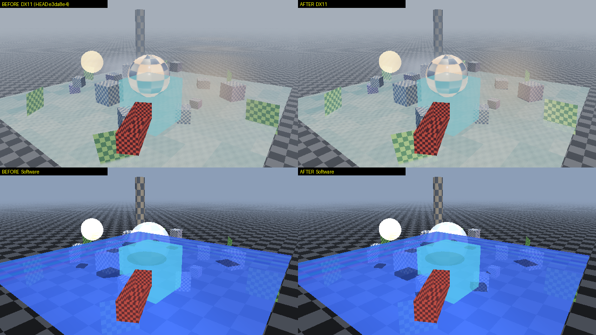
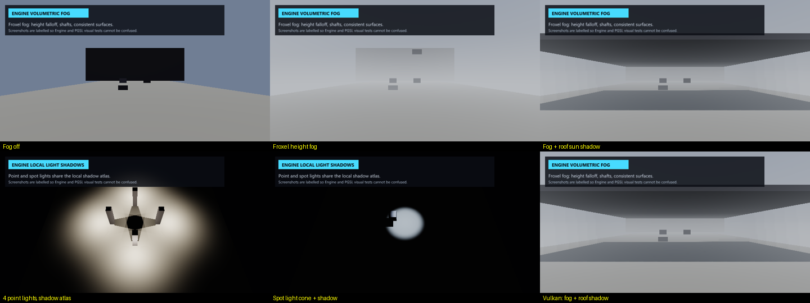

# Engine audit — rendering remediation, Phases 1–4 — 30 September 2026

## Golden scene, before and after

"Before" is `HEAD` (e3da8e4), built separately and captured with the same `render` target; it
matched its 29 September baselines. "After" is the working tree. The goldens were re-recorded once,
deliberately, with `--test render --update-baselines`:

| Backend | Drift from the old baseline | Where |
| --- | --- | --- |
| DX11, DX12, OpenGL | 24.15/255 | tile 110: the foliage card is now sun-lit (R8) |
| Vulkan | 24.14/255 | tile 110: same |
| Software | 20.44/255 | tile 105: a cube's sun shadow that was missing now falls on the ground (cascade casters chosen by light-space footprint, R7) |

The rest of the image moves by small amounts: fog is now the froxel volume, GTAO no longer darkens
direct light, and point lights have specular.

## New features

Top: the fog suite's scene with fog off, with froxel height fog, and with the roof's sun shadow
carved out of the fog. Bottom: four point lights shadowing through one atlas, a spot light's cone and
shadow, and the same fog scene on Vulkan.

## Two intermittent failures found and fixed

**Golden captures differed by one step in ~100 pixels (DX11, about 60% of runs).** The froxel
inject and integrate passes produced two slightly different results for identical inputs. Hashing
every intermediate target from asynchronous readbacks showed that the shadow maps were identical
every frame. The inject volume, though, alternated between two states that differed by one fp16
ULP in scattered froxels, and so did the integrated volume, which is a pure function of the inject
volume. This is the display driver running differently optimised builds of the same shader (the
NVIDIA DX11 driver swaps them in the background), not a logic error. Marking the two passes'
results `precise` forbids the reassociation. Afterwards every frame of every run hashed identically,
and the fog suite passed 8/8.

**DX12 sometimes lost the first frame of a cached sun cascade.** `Dx12FrameRing.FlushAndReopen`,
used by mid-frame readbacks, ended the frame, which advanced the ring. The descriptor ring and
upload pages stayed on the old slot, so the rest of the frame wrote that slot's descriptors while
being fenced as the next slot. The slot could then be recycled while the GPU still read them.
Shadow caching made this visible: the one frame that drew the cascade was the frame after a
capture's readback, and a corrupted cascade stayed cached. The flush now reopens the same slot after
waiting for the GPU. The shadow suite went from 1 failure in 4 runs to 8/8.

**Vulkan bound zero descriptor sets.** The new local shadow tile clear declares no resources. The
Vulkan backend still called `vkCmdBindDescriptorSets` with a count of 0, which the validation layer
rejects; the renderer smoke caught it. A program with no resources now binds nothing.

## Validation

Full Builds `20260930-150648-b7323566` (1,073 passed, 2 failed) and `20260930-154852-6f2e1130`
(1,074 passed, 1 failed). Every golden, shadow and froxel check passed in both. The
failures differed between the runs and none reproduced in isolation:

- `Editor.Shader.Workspace.OpenGL`: 4 of 5 isolated runs passed. The one failure restored source
  starting with the typed fragment `ame`, which points to keystrokes reaching the visible test window.
- `Runtime.PGSL.Persistence.ExportedObjectEventSurvivesProcessRestart`: 5 of 5 isolated runs passed.
- `Runtime.PGSL.TwoD`: the Player wrote no log within 30 s. It passed in the other Full Build and
  when rerun focused.

Other agent sessions and a remote desktop were active on the machine during both runs.

Regression failed both times, so neither Full Build ran the renderer smokes. The separate smoke run
found 21 Vulkan validation errors: `WriteDescriptors` bound zero descriptor sets for the resource-free
shadow tile clear program, and it now returns without binding. Quick Build `20260930-161503-9ffd71c9`
then passed DX11, DX12, Vulkan, OpenGL and Software smokes and promoted.

After the last change these focused runs passed: `--test shadows` 7/7, `--test fog` 4/4 and
`--test render` 72/72. Repeated runs: fog 8/8 and shadows 8/8.
