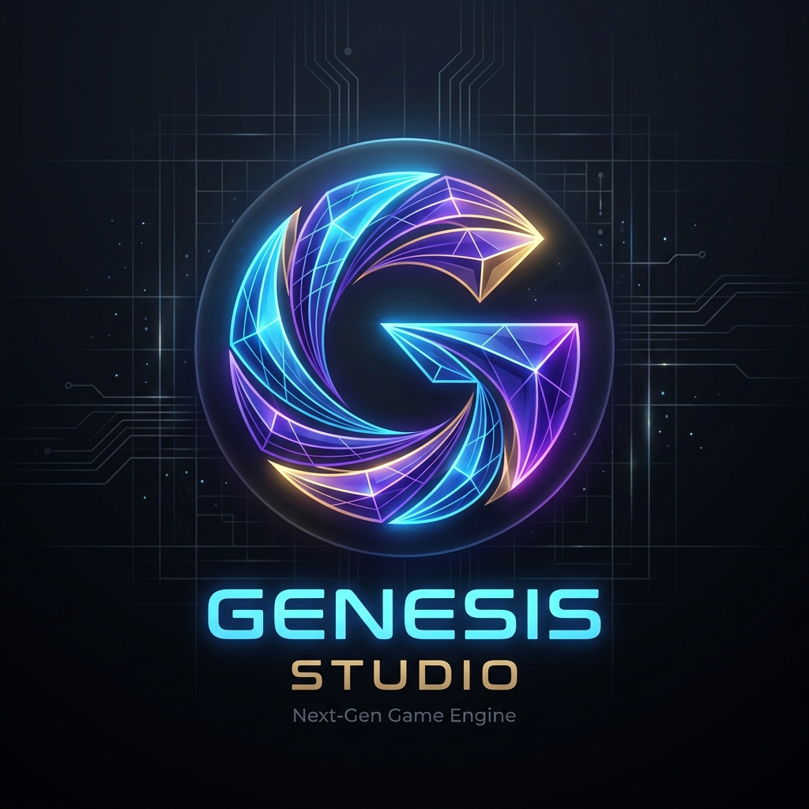

# Genesis Studio

<p align="center">
  
</p>

An all-in-one game-development application for Windows, written in **C# / .NET 10**. Genesis combines GameMaker-style project, resource, object, and event workflows with a component-driven 2D/3D engine, a dockable Studio workspace, and a standalone Game Runner.

The Studio shell, project system, preferences, resource database, and headless test harness are built natively in C# using WinForms and DockPanelSuite. The **Ember** game runtime and rendering foundation is integrated in-tree under `Source/Runtime/`, and its standalone player (`GenesisEngine.exe`, launched via F5/F6) builds from `Source/Genesis.Player/`.

---

## Uploading to GitHub & Repository Hygiene

To keep the repository fast, clean, and well under GitHub's push and 100 MB single-file limits, the repository's `.gitignore` excludes:

1. **Build Artifacts & Generated Packages:**
   - `Genesis Application/` (published binaries and runner output)
   - `.build/` (build staging and previous deployment cache)
   - `Dist/` (installer executables and setup outputs)
   - `TestResults/` (automated test logs, coverage, and visual screenshots)
   - `**/bin/` and `**/obj/` (.NET compilation outputs)
   - Compiled binaries (`*.exe`, `*.dll`, `*.pdb`, `*.zip`, etc.)

2. **Large Project Templates & Starter Assets:**
   - `**/Projects/Templates/Assets/` (contains multi-megabyte music/audio files such as `snd_PathToMansion.wav` [38 MB], `snd_GoodTheme.wav` [16 MB], and extensive sprite sets like `spr_Luigi_*`)
   - Any standalone audio/music tracks (`*.wav`, `*.mp3`, `*.ogg`, `*.flac`) and user project files (`*.genesisproj`)
   - This prevents large binary blobs and copyrighted demo media from causing GitHub push rejections.

3. **Temporary & Environment Data:**
   - IDE and user settings (`.vs/`, `.vscode/`, `.idea/`, `*.user`, `*.suo`)
   - Assistant scratch directories (`.gemini/`, `.claude/`, etc.)
   - OS-generated files (`Thumbs.db`, `Desktop.ini`, `.DS_Store`)

### Pushing to GitHub for the First Time

If you are initializing and pushing this repository to GitHub, run the following in PowerShell from the repository root:

```powershell
# 1. Initialize Git (if not already initialized)
git init

# 2. Stage all source files (verifying .gitignore excludes built & template assets)
git add .

# 3. Check status to confirm only source code and project metadata are staged
git status

# 4. Commit the source tree
git commit -m "Initial commit of Genesis Studio"

# 5. Set main branch and remote repository
git branch -M main
git remote add origin https://github.com/<your-username>/<your-repository>.git

# 6. Push to GitHub
git push -u origin main
```

---

## Quick Start & Prerequisites

On a 64-bit Windows development machine (Windows 10/11 x64):

- **.NET 10 SDK** (x64)
- **Visual C++ Redistributable (x64)**
- **Vulkan Runtime & SDK** (required for Vulkan backend validation)
- **Inno Setup 6** (required only if compiling the standalone setup installer via `Build.bat --installer`)

To automatically check your machine's environment and dependencies without modifying system state:

```powershell
.\DeveloperRequirementsInstaller.ps1 -CheckOnly
```

To install or repair missing prerequisites and run the standard validation gate:

```powershell
.\DeveloperRequirementsInstaller.ps1 -RunBuildCheck
```

---

## Building and Running

Genesis Studio uses `Build.bat` at the repository root to drive builds, tests, and publishing.

### Common Build Commands

```powershell
# Quick Build (default): incremental publication of Studio + Player
.\Build.bat --quick

# Build and immediately launch Genesis Studio
.\Build.bat --quick --run

# Full Build: clean Release rebuild, runs complete headless regression and 5-backend smokes
.\Build.bat --full

# Build the distributable setup installer (outputs to Dist\GenesisStudio-Setup.exe)
.\Build.bat --installer
```

### Targeted Test Suites

```powershell
.\Build.bat --test Image             # Run Image Editor multi-stage workflow
.\Build.bat --test 2D                # Run 2D PGSL runtime workflow
.\Build.bat --test 3D                # Run 3D PGSL runtime workflow
.\Build.bat --test render            # Run renderer subsystem tests
.\Build.bat --test engine-systems    # Run engine core system checks
.\Build.bat --test particle-workbench # Run particle editor tests
.\Build.bat --backend Vulkan         # Run checks against Vulkan backend
```

> **Note on Builds:** Genesis Studio treats warnings as errors. Always close any running instances of `GenesisStudio.exe` or `GenesisEngine.exe` before publishing. Published outputs are staged in `.build/staging/` before replacing `Genesis Application/`. See [Documentation/BuildProfiles.md](Documentation/BuildProfiles.md) for detailed flags and troubleshooting.

---

## Repository Structure

```text
├── Assets/                                 # Shared project design & 3D rigging test assets
├── BuildTools/                             # PowerShell build automation, DXC and Vulkan staging
├── Documentation/                          # Architectural documentation, specifications, and hotfix ledgers
├── Installer/                              # Inno Setup scripts and installer tooling
├── Source/
│   ├── Genesis.Application.Core/           # Projects, resources, GUID metadata, serialization, templates
│   ├── Genesis.Application.Studio/         # WinForms shell, DockPanelSuite workspace, main window
│   ├── Genesis.Application.Editors.Image/  # Pixel art, layers, animation timeline, 2D rigging
│   ├── Genesis.Application.Editors.Suite/  # Room, Terrain, Object, Shader, Model, Particle, Pathing editors
│   ├── Genesis.Player/                     # Standalone Game Runner (GenesisEngine.exe)
│   └── Runtime/                            # Integrated Ember engine foundation (Rendering, ECS, Physics)
├── Tests/
│   └── Genesis.Application.Headless/       # Headless test runner, regression suites, and UI captures
├── Themes/                                 # Studio themes (Synthwave, Cyberpunk, Ocean, etc.)
├── Backup.ps1                              # Source backup utility (excludes builds and temporary files)
├── Build.bat                               # Main build and test dispatch script
├── DeveloperRequirementsInstaller.ps1      # Prerequisite installer and environment checker
├── Genesis.Application.slnx                # Visual Studio solution file
└── README.md                               # Project documentation and guide
```

---

## Game Runner & Renderers

Pressing **F5** (Run Game) or **F6** (Debug Game) compiles project scripts and launches the Ember game player:

```text
Genesis Application\Player\GenesisEngine.exe
```

The Game Runner executes the project's start room using saved Room, Object, Terrain, Model, Shader, Particle, and PGSL resources.

### Retained Rendering Backends

The Ember engine foundation supports five primary renderers:
1. **DirectX 11 (DX11)** — Primary default hardware backend for Windows.
2. **DirectX 12 (DX12)** — Modern low-overhead hardware backend.
3. **Vulkan** — Cross-platform explicit GPU graphics API.
4. **OpenGL** — Standard legacy graphics backend.
5. **Software** — CPU rasterizer fallback for headless testing and non-accelerated environments.

---

## Key Studio Features

- **Dockable Modern Workspace:** DockPanelSuite layout featuring Project Hub, Asset Tree, Contextual Inspector, Console, and Document Tabs.
- **13 Routed Resource Editors:**
  - **Image Editor & Viewer:** Aseprite-inspired dark workflow, 20 drawing tools, 8 layer blend modes, PBR material channels, timeline animation, onion skinning, 9-slice guide editor, automated blank-space trimming, palette management, and 2D skeletal pixel rigging (`PixelRigStudioDialog`).
  - **Room Editor:** Unobstructed center viewport, 2D/3D mode toggling, 8 viewport cameras, background and tileset placers, hierarchical object instances, snap-to-floor, and live runtime preview.
  - **Object Editor:** PGSL Blueprint graph, inline typed fields, execution/data connections, and identity/events rail.
  - **Terrain Editor:** Raise/lower/smooth/flatten sculpting, 4-channel splat painting, procedural foliage, and dynamic water simulation.
  - **Model Editor & Viewer:** 3D model hierarchy viewer, Rig & Pose workflow, joint drawing across planes, and animation clip authoring.
  - **Pathing & Navigation:** Room/NavMesh binding, waypoint patrol, NavMesh search, wander/follow routines, draggable pins, and live agent simulation.
  - **Shader Editor:** Visual preview-first shader editor with live compilation across DX11, DX12, Vulkan, and OpenGL.
  - **Particle Editor:** Runtime particle workbench with presets, emission/motion inspectors, 2D/3D preview, and timeline scrubbing.
  - **Physics Editor:** Live Bepu Physics sandbox with 2D/3D collision bodies and raycast debugging.
  - **Audio, PGSL Script, UI, and Note Editors.**
- **Headless Test Harness:** Executable regression suite (`Tests/Genesis.Application.Headless/`) with automated UI assertions, headless PNG captures, and machine-readable test summaries.

---

## Further Documentation

- **Build Configuration & Recovery:** [Documentation/BuildProfiles.md](Documentation/BuildProfiles.md)
- **Detailed Specifications & Ledgers:** [Documentation/README.md](Documentation/README.md)
- **Repository Guidelines:** [AGENTS.md](AGENTS.md)
